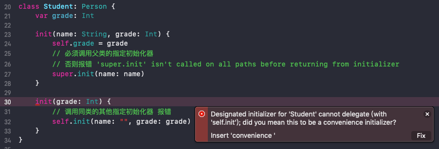
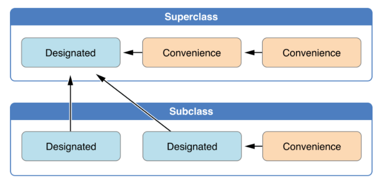
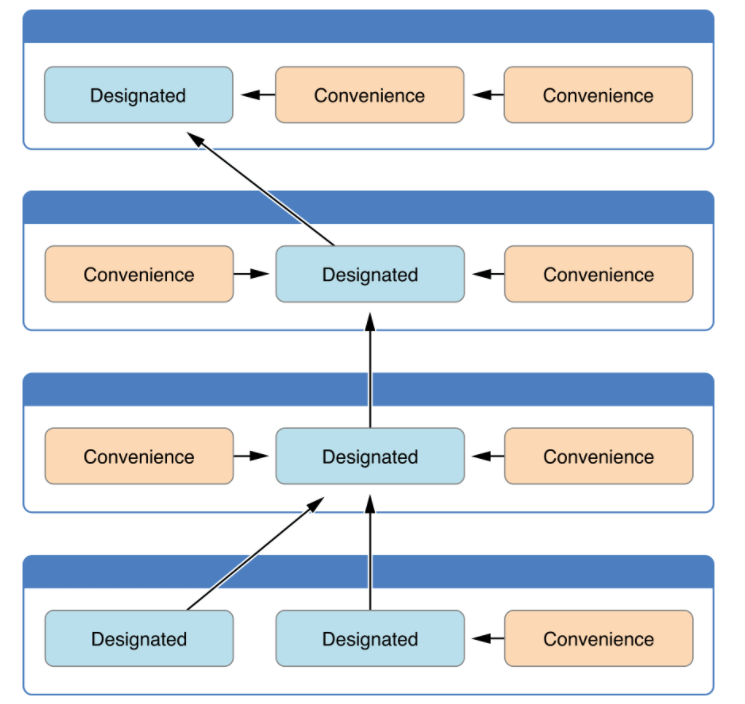
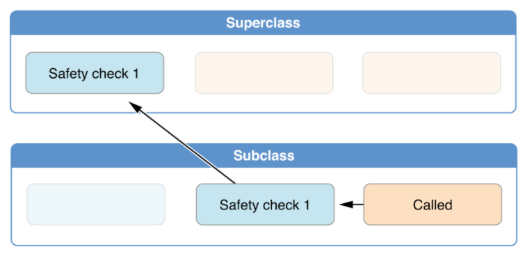
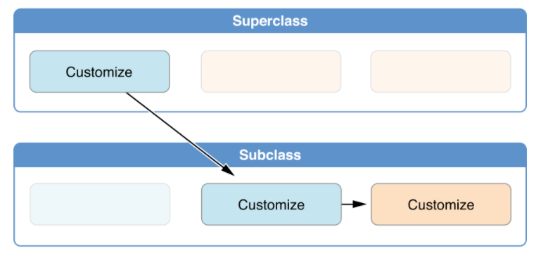
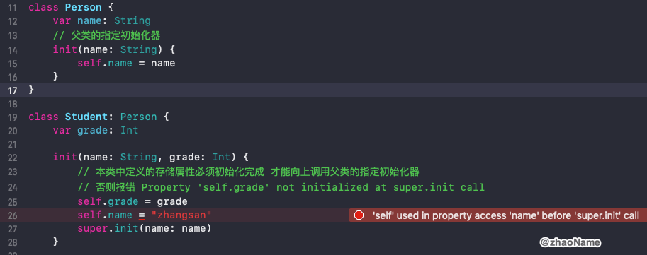
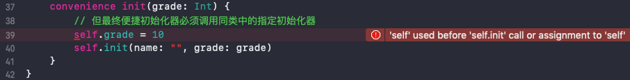
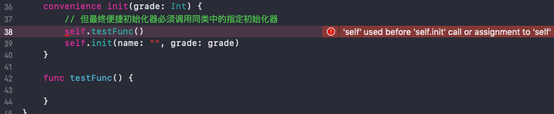

# Initialization


初始化 (`Initialization`) 是准备一个类、结构或枚举的实例以供使用的过程。此过程会为该实例上的每个存储属性设置初始值，并在新实例准备好使用之前执行所需的任何其他设置或初始化。


<br>

## 一、初始化

### 0x01 指定初始化和便捷初始化

指定初始化器 (Designated Initializer)是类中最主要的初始化器 。一个指定初始化器将初始化类中提供的所有属性，并调用合适的父类初始化器让初始化过程沿着父类链继续往上进行。

类倾向于拥有极少的指定初始化器，普遍的是一个类只拥有一个指定初始化器(最少有一个)。

```
init(parameters) {
    statements
}
```

便捷初始化器 (Convenience Initializer) 是类中比较次要的、辅助型的初始化器。你可以定义便利初始化器来调用同一个类中的指定初始化器，并为部分形参提供默认值。

```
convenience init(parameters) {
    statements
}
```


### 0x02 初始化器相互调用的规则

- 指定初始化器必须调用其直接父类的的指定初始化器

```
class Person {
    let name: String
    // 父类的指定初始化器
    init(name: String) {
        self.name = name
    }
}


class Student: Person {
    var grade: Int
    
    init(name: String, grade: Int) {
        self.grade = grade
        // 必须调用父类的指定初始化器
        // 否则报错 'super.init' isn't called on all paths before returning from initializer
        super.init(name: name)
    }
}
```

- 便捷初始化器必须调用同类中定义的其它初始化器

- 便捷初始化器最终必须调用一个指定初始化器

```
class Person {
    let name: String
    // 父类的指定初始化器
    init(name: String) {
        self.name = name
    }
}

class Student: Person {
    var grade: Int
    
    init(name: String, grade: Int) {
        self.grade = grade
        // 必须调用父类的指定初始化器
        // 否则报错 'super.init' isn't called on all paths before returning from initializer
        super.init(name: name)
    }
    
    convenience init() {
        // 便捷初始化器必须调用同类中定义的其它初始化器
        // 否则报错: 'self.init' isn't called on all paths before returning from initializer
        // 「其它初始化器」可以使指定初始化器，也可以是便捷初始化器
        self.init(grade: 3)
    }
    
    convenience init(grade: Int) {
        // 但最终便捷初始化器必须调用同类中的指定初始化器
        self.init(name: "", grade: grade)
    }
}
```

- 指定初始化器不能调用同类中的其他指定初始化器



上述规则可以用图例来说明



下面展示了涉及四个类的更复杂的类层级结构。



可以总结为：

- 指定初始化器必须总是向上代理

- 便捷初始化器必须总是横向代理

<br>

## 二、两段式初始化

Swift 中类的初始化过程包含两个阶段。第一个阶段给类中的每个存储型属性赋一个初始值。当每个存储型属性的初始值被赋值后，第二阶段开始，它给每个类一次机会，在新实例准备使用之前进一步自定义它们的存储型属性。

两段式初始化过程可以防止属性值在初始化之前被访问，也可以防止属性被另外一个初始化器意外地赋予不同的值。


### 0x01 第一阶段

- 类的某个指定初始化器或便利初始化器被调用。

- 完成类的新实例内存的分配，但此时内存还没有被初始化。
- 指定初始化器确保其所在类引入的所有存储型属性都已赋初值。存储型属性所属的内存完成初始化。
- 指定初始化器切换到父类的初始化器，对其存储属性完成相同的任务。
- 这个过程沿着类的继承链一直往上执行，直到到达继承链的最顶部。
- 当到达了继承链最顶部，而且继承链的最后一个类已确保所有的存储型属性都已经赋值，这个实例的内存被认为已经完全初始化。此时阶段 1 完成。



### 0x02 第二阶段

- 从继承链顶部往下，继承链中每个类的指定初始化器都有机会进一步自定义实例。初始化器此时可以访问 `self`、修改它的属性并调用实例方法等等。

- 最终继承链中任意的便利初始化器有机会自定义实例和使用 `self`。




<br>

## 三、安全检查

Swift 编译器将执行 4 种有效的安全检查，以确保两段式初始化过程不出错地完成

- 指定初始化器必须保证它所在类的所有属性都必须先初始化完成，之后才能将其它初始化任务向上代理给父类中的初始化器

```
class Person {
    var name: String
    // 父类的指定初始化器
    init(name: String) {
        self.name = name
    }
}

class Student: Person {
    var grade: Int
    
    init(name: String, grade: Int) {
        // 本类中定义的存储属性必须初始化完成 才能向上调用父类的指定初始化器
        // 否则报错 Property 'self.grade' not initialized at super.init call
        super.init(name: name)
    }
}
```

- 指定初始化器必须在为继承的属性设置新值之前向上代理调用父类初始化器。如果没这么做，指定初始化器赋予的新值将被父类中的初始化器所覆盖。



- 便利初始化器必须为任意属性（包括所有同类中定义的）赋新值之前代理调用其它初始化器。如果没这么做，便利初始化器赋予的新值将被该类的指定初始化器所覆盖。




-  初始化器在第一阶段初始化完成之前，不能调用任何实例方法，不能读取任何实例属性的值，不能引用 self 作为一个值。




<br>

参考：

- [Initialization](https://docs.swift.org/swift-book/LanguageGuide/Initialization.html)

- [初始化过程](https://swiftgg.gitbook.io/swift/swift-jiao-cheng/14_initialization)

<br>
