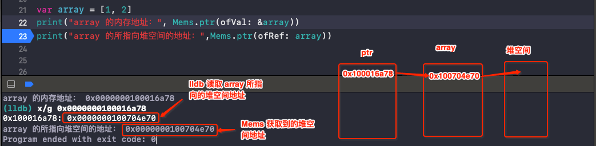

# Mems

[Mems](https://github.com/CoderMJLee/Mems) 是用来窥探 Swift 内存的小工具，由 MJ 开发。

<br>

### 0x01 获取某个变量的内存地址

获取某个变量的内存地址，如下：

```swift
/// 获得变量的内存地址
public static func ptr(ofVal v: inout T) -> UnsafeRawPointer {
    return MemoryLayout.size(ofValue: v) == 0 ? _EMPTY_PTR : withUnsafePointer(to: &v) {
        UnsafeRawPointer($0)
    }
}
```

- 若变量占用的内存大小是 0，则直接返回 `0x01`

- 若变量占用的内存大小不为 0，用 `withUnsafePointer` 和 `UnsafeRawPointer` 获取变量的内存地址。

```swift
var int8: Int8 = 10
var str = "123"

print("int8 的内存地址:", Mems.ptr(ofVal: &int8))
print("str 的内存地址:", Mems.ptr(ofVal: &str))
```


<br>

### 0x02 获得引用所指向内存的地址

获得引用所指向内存的地址，可以理解为获取某个变量所指向的堆空间的地址值。

```swift
/// 获得引用所指向内存的地址
public static func ptr(ofRef v: T) -> UnsafeRawPointer {
    if v is Array<Any>
        || Swift.type(of: v) is AnyClass
        || v is AnyClass {
        return UnsafeRawPointer(bitPattern: unsafeBitCast(v, to: UInt.self))!
    } else if v is String {
        var mstr = v as! String
        if mstr.mems.type() != .heap {
            return _EMPTY_PTR
        }
        return UnsafeRawPointer(bitPattern: unsafeBitCast(v, to: (UInt, UInt).self).1)!
    } else {
        return _EMPTY_PTR
    }
}
```


```swift
var array = [1, 2]

print("array 的内存地址：", Mems.ptr(ofVal: &array))
print("array 的所指向堆空间的地址：",Mems.ptr(ofRef: array))
```




```swift

```

```swift

```

```swift

```

```swift

```

<br>


```swift

```

```swift

```


```swift

```

<br>


<br>

