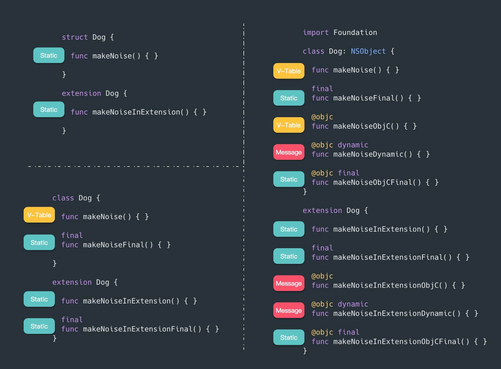
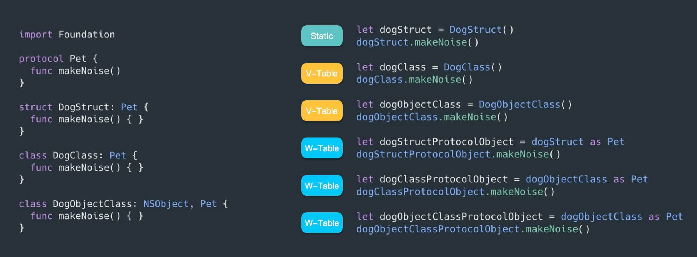

# Method Dispatch in Swift


<br>

## 一、方法派发

编译的编程语言有三种主要的调度方法可供使用：直接调度、表调度和消息调度。大多数语言都支持其中的一种或两种。Java 默认使用表分派，但您可以使用 final 关键字选择直接分派。 C++ 默认使用直接分派，但您可以通过添加 virtual 关键字来选择表分派。Objective-C 总是使用消息派发，但允许开发人员回退到 C 以获得直接派发的性能增益。Swift 承担了支持所有三种调度类型的崇高目标。 这非常有效，但对许多开发人员来说是一个困惑的根源，并且是大多数 Swift 开发人员遇到的许多陷阱的背后。


### 0x01 Direct Dispatch

Direct dispatch (直接派发) 也称 static dispatch (静态派发)。直接派发是最快和最有效的方法分派类型。 直接分派的方法可以在运行时立即执行，因为编译器在编译时就知道确切的内存地址。 这也意味着编译器可以执行各种优化，例如内联，从而在运行时实现更快的执行时间。

直接派发的缺点是不允许子类化，动态性不好。Swift 中的值类型中声明的函数默认使用直接派发调动函数。


```Swift
struct Student {
    func directMethod() {
        print(#function)
    }
}

let stu = Student()
stu.directMethod()
```

将上述代码使用 `swiftc -emit-silgen main.swift -Onone > main.sil` 命令转换成 sil 文件

```Swift
// main
sil [ossa] @main : $@convention(c) (Int32, UnsafeMutablePointer<Optional<UnsafeMutablePointer<Int8>>>) -> Int32 {
bb0(%0 : $Int32, %1 : $UnsafeMutablePointer<Optional<UnsafeMutablePointer<Int8>>>):
  alloc_global @$s4main3stuAA7StudentVvp          // id: %2
  %3 = global_addr @$s4main3stuAA7StudentVvp : $*Student // users: %8, %7
  %4 = metatype $@thin Student.Type               // user: %6
  // function_ref Student.init()
  %5 = function_ref @$s4main7StudentVACycfC : $@convention(method) (@thin Student.Type) -> Student // user: %6
  %6 = apply %5(%4) : $@convention(method) (@thin Student.Type) -> Student // user: %7
  store %6 to [trivial] %3 : $*Student            // id: %7
  %8 = load [trivial] %3 : $*Student              // user: %10
  // function_ref Student.directMethod()
  %9 = function_ref @$s4main7StudentV12directMethodyyF : $@convention(method) (Student) -> () // user: %10
  %10 = apply %9(%8) : $@convention(method) (Student) -> ()
  %11 = integer_literal $Builtin.Int32, 0         // user: %12
  %12 = struct $Int32 (%11 : $Builtin.Int32)      // user: %13
  return %12 : $Int32                             // id: %13
} // end sil function 'main'
```

- `@main` 是 `main.swift` 的入口函数，SIL 中标识符名称以 @ 作为前缀，入口函数有两个参数，一个 32 位 Int，一个指针，一个返回值。

- `%0`、`%1`......在 SIL 中叫做寄存器，可以视为长量，赋值后不可更改。在 SIL 中以累加数字的模式继续使用。这里所说的寄存器是虚拟的，最终运行到我们的机器上会使用真的寄存器。
- `alloc_global` 创建一个全局变量
- `global_addr` 拿到全局变量的地址，赋值给 `%3`
- `metatype` 拿到 `Student` 的 `Metadata` 赋值给 `%4`
- `function_ref` 将 `Student.init()` 的函数地址赋值给 `%5`
- `apply` 调用 `Student.init()` 方法，将 `%4` 传进去，返回值赋值给 `%6`
- 将 `%6` 存储到全局变量 `%3` 中，也就是 `stu`
- 读取 `%3` 的值并赋值给 `%8`
- `function_ref ` 获取 `Student.directMethod()` 的地址，赋值给 `%9`
- `apply` 调用`Student.directMethod()`，传参 `%8` 也就是 `stu`

SIL 文档对 [function_ref](https://github.com/apple/swift/blob/main/docs/SIL.rst#function-ref) 解释如下：

> Creates a reference to a SIL function.

从上述 `SIL` 文件可以看到是用 `function_ref` 直接获取 `Student.directMethod()` 函数地址，然后调用。


### 0x02 V-Table Dispatch

Swift 中的引用类型中声明的函数调用默认使用 V-Table Dispatch。

V-Table Dispatch 在编译时创建一个查找表，该表指定需要在运行时调用的方法的实际实现。在运行时，此查找表作为地址数组保存到实现所在的内存中的实际位。

如下定义两个类，其中 `Student` 继承自 `Person`

```Swift
class Person {
    func overrideTableMethod() { }
    
    func nonOverrideTableMethod() { }
}

class Student: Person {
    override func overrideTableMethod() { }
    
    func tableMethod() { }
}

let per = Person()
per.overrideTableMethod()
per.nonOverrideTableMethod()

let stu = Student()
stu.tableMethod()
stu.overrideTableMethod()
```

转换成 SIL 文件，如下：

```Swift
// main
sil @main : $@convention(c) (Int32, UnsafeMutablePointer<Optional<UnsafeMutablePointer<Int8>>>) -> Int32 {
bb0(%0 : $Int32, %1 : $UnsafeMutablePointer<Optional<UnsafeMutablePointer<Int8>>>):
  alloc_global @main.per : main.Person           // id: %2
  %3 = global_addr @main.per : main.Person : $*Person // users: %11, %8, %7
  %4 = metatype $@thick Person.Type               // user: %6
  // function_ref Person.__allocating_init()
  %5 = function_ref @main.Person.__allocating_init() -> main.Person : $@convention(method) (@thick Person.Type) -> @owned Person // user: %6
  %6 = apply %5(%4) : $@convention(method) (@thick Person.Type) -> @owned Person // user: %7
  store %6 to %3 : $*Person                       // id: %7
  %8 = load %3 : $*Person                         // users: %9, %10
  %9 = class_method %8 : $Person, #Person.overrideTableMethod : (Person) -> () -> (), $@convention(method) (@guaranteed Person) -> () // user: %10
  %10 = apply %9(%8) : $@convention(method) (@guaranteed Person) -> ()
  %11 = load %3 : $*Person                        // users: %12, %13
  %12 = class_method %11 : $Person, #Person.nonOverrideTableMethod : (Person) -> () -> (), $@convention(method) (@guaranteed Person) -> () // user: %13
  %13 = apply %12(%11) : $@convention(method) (@guaranteed Person) -> ()
  alloc_global @main.stu : main.Student          // id: %14
  %15 = global_addr @main.stu : main.Student : $*Student // users: %23, %20, %19
  %16 = metatype $@thick Student.Type             // user: %18
  // function_ref Student.__allocating_init()
  %17 = function_ref @main.Student.__allocating_init() -> main.Student : $@convention(method) (@thick Student.Type) -> @owned Student // user: %18
  %18 = apply %17(%16) : $@convention(method) (@thick Student.Type) -> @owned Student // user: %19
  store %18 to %15 : $*Student                    // id: %19
  %20 = load %15 : $*Student                      // users: %21, %22
  %21 = class_method %20 : $Student, #Student.tableMethod : (Student) -> () -> (), $@convention(method) (@guaranteed Student) -> () // user: %22
  %22 = apply %21(%20) : $@convention(method) (@guaranteed Student) -> ()
  %23 = load %15 : $*Student                      // users: %24, %25
  %24 = class_method %23 : $Student, #Student.overrideTableMethod : (Student) -> () -> (), $@convention(method) (@guaranteed Student) -> () // user: %25
  %25 = apply %24(%23) : $@convention(method) (@guaranteed Student) -> ()
  %26 = integer_literal $Builtin.Int32, 0         // user: %27
  %27 = struct $Int32 (%26 : $Builtin.Int32)      // user: %28
  return %27 : $Int32                             // id: %28
} // end sil function 'main'
```

这里使用 `class_method` 来获取函数地址，引用 SIL 文档来解释 [class_method](https://github.com/apple/swift/blob/main/docs/SIL.rst#class-method) 的作用。

> The `class_method` and `super_method` instructions must reference Swift native methods and always use vtable dispatch.

`class_method` 用于获取 Swift 原生方法且必须使用 vtable 的函数地址。

`Student` 和 `Person` 的 `sil_vtable ` 表如下：

```Swift
sil_vtable Person {
  #Person.overrideTableMethod: (Person) -> () -> () : @main.Person.overrideTableMethod() -> ()	// Person.overrideTableMethod()
  #Person.nonOverrideTableMethod: (Person) -> () -> () : @main.Person.nonOverrideTableMethod() -> ()	// Person.nonOverrideTableMethod()
  #Person.init!allocator: (Person.Type) -> () -> Person : @main.Person.__allocating_init() -> main.Person	// Person.__allocating_init()
  #Person.deinit!deallocator: @main.Person.__deallocating_deinit	// Person.__deallocating_deinit
}

sil_vtable Student {
  #Person.overrideTableMethod: (Person) -> () -> () : @main.Student.overrideTableMethod() -> () [override]	// Student.overrideTableMethod()
  #Person.nonOverrideTableMethod: (Person) -> () -> () : @main.Person.nonOverrideTableMethod() -> () [inherited]	// Person.nonOverrideTableMethod()
  #Person.init!allocator: (Person.Type) -> () -> Person : @main.Student.__allocating_init() -> main.Student [override]	// Student.__allocating_init()
  #Student.tableMethod: (Student) -> () -> () : @main.Student.tableMethod() -> ()	// Student.tableMethod()
  #Student.deinit!deallocator: @main.Student.__deallocating_deinit	// Student.__deallocating_deinit
}
```

### 0x03 Message Dispatch

Message Dispatch 是 OC 使用的一套消息发送机制，纯 Swift 类通常不使用。定义如下代码

```Swift
class Person {
    @objc func messageMethod() { }
    
    @objc dynamic func dynamicMethod() { }
}
```

转成 SIL 文件如下:

```Swift
// main
sil [ossa] @main : $@convention(c) (Int32, UnsafeMutablePointer<Optional<UnsafeMutablePointer<Int8>>>) -> Int32 {
bb0(%0 : $Int32, %1 : $UnsafeMutablePointer<Optional<UnsafeMutablePointer<Int8>>>):
  alloc_global @$s4main3perAA6PersonCvp           // id: %2
  %3 = global_addr @$s4main3perAA6PersonCvp : $*Person // users: %12, %8, %7
  %4 = metatype $@thick Person.Type               // user: %6
  // function_ref Person.__allocating_init()
  %5 = function_ref @$s4main6PersonCACycfC : $@convention(method) (@thick Person.Type) -> @owned Person // user: %6
  %6 = apply %5(%4) : $@convention(method) (@thick Person.Type) -> @owned Person // user: %7
  store %6 to [init] %3 : $*Person                // id: %7
  %8 = load_borrow %3 : $*Person                  // users: %11, %10, %9
  
  %9 = class_method %8 : $Person, #Person.messageMethod : (Person) -> () -> (), $@convention(method) (@guaranteed Person) -> () // user: %10
  %10 = apply %9(%8) : $@convention(method) (@guaranteed Person) -> ()
  end_borrow %8 : $Person                         // id: %11
  %12 = load_borrow %3 : $*Person                 // users: %15, %14, %13
  
  %13 = objc_method %12 : $Person, #Person.dynamicMethod!foreign : (Person) -> () -> (), $@convention(objc_method) (Person) -> () // user: %14
  %14 = apply %13(%12) : $@convention(objc_method) (Person) -> ()
  end_borrow %12 : $Person                        // id: %15
  %16 = integer_literal $Builtin.Int32, 0         // user: %17
  %17 = struct $Int32 (%16 : $Builtin.Int32)      // user: %18
  return %17 : $Int32                             // id: %18
} // end sil function 'main'
```

使用 `objc_method` 获取 `Person.dynamicMethod` 的函数地址。SIL 文档中 [objc_method](https://github.com/apple/swift/blob/main/docs/SIL.rst#objc-method) 解释如下：

> The `objc_method` and `objc_super_method` instructions must reference Objective-C methods (indicated by the `foreign` marker on a method reference, as in `#NSObject.description!foreign`).

注意这里虽然使用 `sil_vtable`，但是 `!foreign` 关键字标记不会走 V-Table Dispatch，而是由其他系统处理(运行时)。

```Swift
sil_vtable Person {
  #Person.messageMethod: (Person) -> () -> () : @$s4main6PersonC13messageMethodyyF	// Person.messageMethod()
  #Person.init!allocator: (Person.Type) -> () -> Person : @$s4main6PersonCACycfC	// Person.__allocating_init()
  #Person.deinit!deallocator: @$s4main6PersonCfD	// Person.__deallocating_deinit
}
```

<br>


## 二、Swift 中声明的方法对应的调用方式

### 0x01 非 Protocol 对象调用的情况



### 0x02 Protocol 对象调用的情况



<br>

**Reference**

- [A Deep Dive Into Method Dispatches in Swift](https://betterprogramming.pub/a-deep-dive-into-method-dispatches-in-swift-65a8e408a7d0)

- [Method Dispatch in Swift](https://www.rightpoint.com/rplabs/switch-method-dispatch-table)

- [Swift 中的方法调用（Method Dispatch）（一） - 概述](https://zhuanlan.zhihu.com/p/35696161)

- [Swift Intermediate Language (SIL)](https://github.com/apple/swift/blob/main/docs/SIL.rst)

<br>

