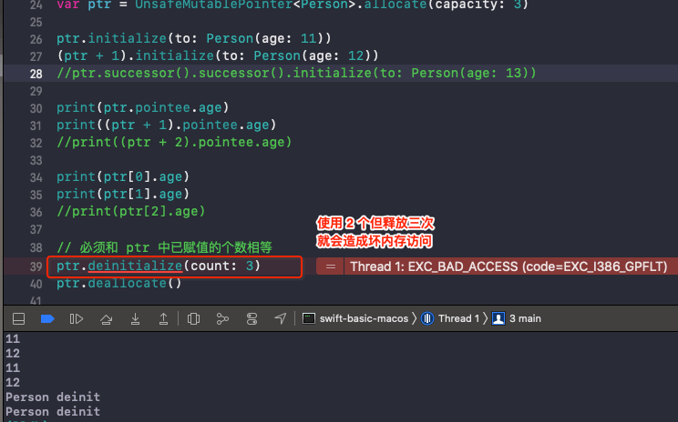

# Pointer

<br>

### 0x01 常见指针类型及用法

Swift 中有专门的指针类型，这些都被定义为 "Unsafe"，常见的有以下 4 中：

```swift
// 类似 const Pointee *
UnsafePointer<Pointee> 

// 类似 Pointee *
UnsafeMutablePointer<Pointee> 

// 类似 const void *
UnsafeRawPointer 

// 类似 void *
UnsafeMutableRawPointer 
```

`UnsafePointer<Pointee>` 和 `UnsafeMutablePointer<Pointee>` 是个泛型类型，它们都有个成员 `pointee`。可以通过修改 `pointee`，操作指针所指向内存的值。

```swift
var age = 10

func testPointee1(_ ptr: UnsafeMutablePointer<Int>) {
    ptr.pointee += 10
}

func testPointee2(_ ptr: UnsafePointer<Int>) {
    print(ptr.pointee)
}

testPointee1(&age)
testPointee2(&age) // 20
print(age) // 20
```

`UnsafeRawPointer` 和 `UnsafeMutableRawPointer` 没有指明指针指向的具体类型，修改指针和读取指针的内存需要特定的方法。

```swift
func testRawPointer3(_ ptr: UnsafeMutableRawPointer) {
    // 修改 ptr 存储的值
    ptr.storeBytes(of: 30, as: Int.self)
}

func testRawPointer4(_ ptr: UnsafeRawPointer) {
    // 取出 ptr 存储的值
    print(ptr.load(as: Int.self))
}

testRawPointer3(&age)
testRawPointer4(&age) // 30
print(age) // 30
```

<br>

### 0x02 获取某个变量的指针

Swift 中的 `print` 基本不会打印出变量的内存地址，我们可以使用以下方法来窥探变量的内存地址

```swift
var age = 10

// 相当于 int *ptr1 = &age
var ptr1 = withUnsafePointer(to: &age) { $0 }
var ptr2 = withUnsafeMutablePointer(to: &age) { $0 }
print("全局变量age的内存地址：", ptr1, ptr2)  

// 打印结果
全局变量age的内存地址： 0x0000000100012178 0x0000000100012178
```

`ptr1` 的类型是 `UnsafePointer<Int>`，若要 `UnsafeRawPointer ` 类型可做如下修改


```swift
var ptr3 = withUnsafePointer(to: &age) { UnsafeRawPointer($0) }
var ptr4 = withUnsafeMutablePointer(to: &age) { UnsafeMutableRawPointer($0) }

ptr4.storeBytes(of: 20, as: Int.self)
print(ptr4.load(as: Int.self)) // 20
```

获取引用类型的指针

```swift
class Person {
    var age: Int
    
    init(age: Int) {
        self.age = age
    }
}

var person = Person(age: 10)
var ptr1 = withUnsafeMutablePointer(to: &person) { $0 }
print("全局变量 person 的内存地址：", ptr1)

ptr1.pointee.age = 20
print(person.age) 

// 打印结果
全局变量 person 的内存地址： 0x00000001000121a0
20
```

注意这里的 `ptr1` 中存储的不是`Person` 对象堆空间的地址值，而是全局变量 `person` 的地址值。可以使用 `ptr1.pointee` 来获取 `Person` 对象。


<br>

### 0x03 取出指向堆空间实例的指针

```swift
var person = Person(age: 10)
var ptr1 = withUnsafeMutablePointer(to: &person) { UnsafeRawPointer($0) }

// 取出全局变量 person 所存储的地址值(堆空间的地址值)
let personObjAddress = ptr1.load(as: Int.self)
// 转化成指针格式
var heapPtr = UnsafeRawPointer(bitPattern: personObjAddress)
print("person 所指向堆空间的内存地址：", heapPtr)

// 打印结果
person 所指向堆空间的内存地址： Optional(0x0000000100446370)
```


<br>


### 0x04 创建指针

`malloc` 函数创建指针

```swift
// 创建大小为 16 个字节的指针
var ptr = malloc(16)

// 前 8 个字节存 11
ptr?.storeBytes(of: 11, as: Int.self)
// 后 8 个字节存 12
ptr?.storeBytes(of: 12, toByteOffset: 8, as: Int.self)

print(ptr?.load(as: Int.self))  // Optional(11)
print(ptr?.load(fromByteOffset: 8, as: Int.self)) Optional(12)

free(ptr)
```


`allocate(byteCount:, alignment:)` 函数创建指针

```swift
// 创建大小为 16 个字节的指针
var ptr = UnsafeMutableRawPointer.allocate(byteCount: 16, alignment: 1)

// 前 8 个字节存 11
ptr.storeBytes(of: 11, as: Int.self)
// 后 8 个字节存 12
// ptr.storeBytes(of: 12, toByteOffset: 8, as: Int.self)
ptr.advanced(by: 8).storeBytes(of: 12, as: Int.self)

print(ptr.load(as: Int.self))
print(ptr.advanced(by: 8).load(as: Int.self))

ptr.deallocate()
```

`allocate(capacity:)` 创建指针

```swift
// 创建指针
var ptr = UnsafeMutablePointer<Person>.allocate(capacity: 3)

ptr.initialize(to: Person(age: 11))
(ptr + 1).initialize(to: Person(age: 12))
ptr.successor().successor().initialize(to: Person(age: 13))

print(ptr.pointee.age)
print((ptr + 1).pointee.age)
print((ptr + 2).pointee.age)

print(ptr[0].age)
print(ptr[1].age)
print(ptr[2].age)

// 必须和 ptr 中已赋值的个数相等
ptr.deinitialize(count: 3)
ptr.deallocate()
```

若使用的次数和释放的次数不相等会造成内存泄漏，或坏内存访问。




<br>

### 0x05 指针间类型转换

`UnsafeMutablePointer<Pointee>` 转换成 `UnsafeMutableRawPointer` 可以通过 `UnsafeMutableRawPointer` 的初始化器

```swift
var genericsPointer = UnsafeMutablePointer<Int>.allocate(capacity: 2)
genericsPointer.pointee = 10
genericsPointer[1] = 20

var rawPointer = UnsafeMutableRawPointer(genericsPointer)
print(rawPointer.load(as: Int.self)) // 10
print(rawPointer.load(fromByteOffset: 8, as: Int.self)) // 20
```

`UnsafeMutableRawPointer` 转换成 `UnsafeMutablePointer<Pointee>`

- `assumingMemoryBound(to:)`

```swift
var rawPointer = UnsafeMutableRawPointer.allocate(byteCount: 16, alignment: 1)

var genericsPointer: UnsafeMutablePointer<Int> = rawPointer.assumingMemoryBound(to: Int.self)
genericsPointer.pointee = 10
genericsPointer.successor().pointee = 20

print(genericsPointer.pointee) // 10
print(genericsPointer.successor().pointee) // 20
```

- `unsafeBitCast(, to: )`

```swift
let genericsPointer1: UnsafePointer<Int> = unsafeBitCast(rawPointer, to: UnsafePointer<Int>.self)
let genericsPointer2: UnsafeMutablePointer<Int> = unsafeBitCast(rawPointer + 8, to: UnsafeMutablePointer<Int>.self)

print(genericsPointer1.pointee) // 10
print(genericsPointer2.pointee) // 20
```

<br>