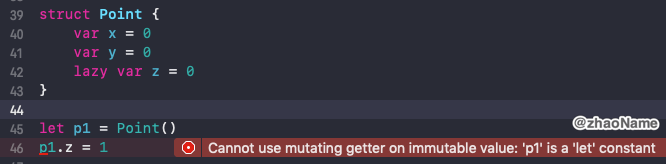
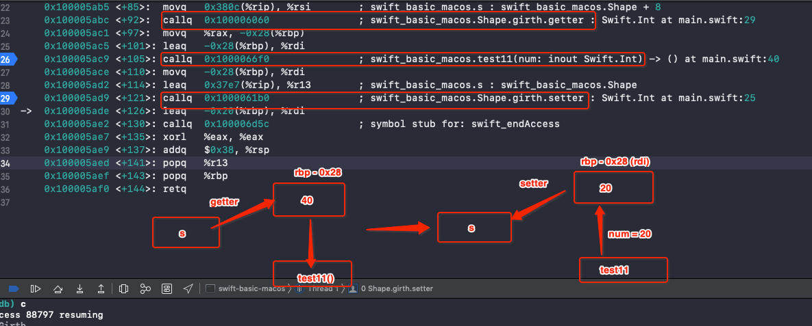
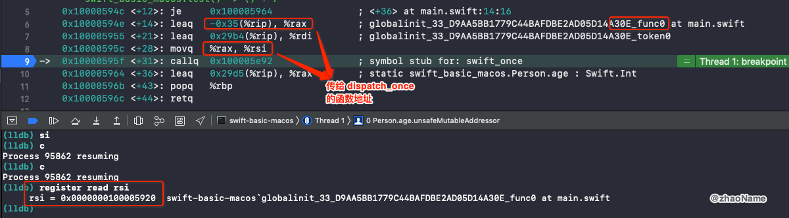
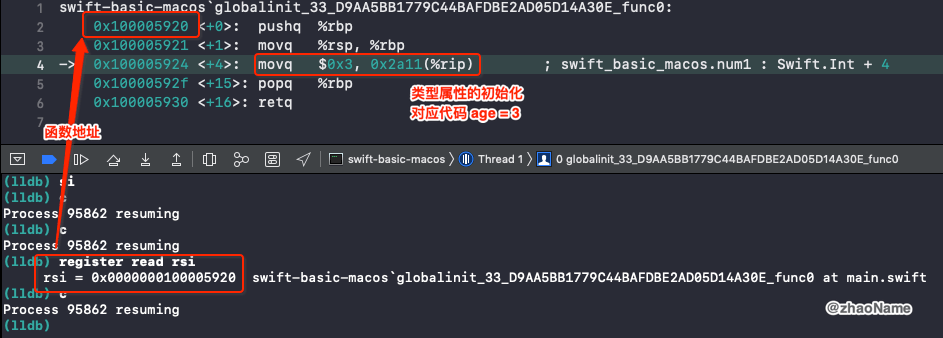

# Property

属性将值与特定的类、结构体或枚举关联。存储属性 (Stored Property) 会将常量和变量存储为实例的一部分，而计算属性则是直接计算（而不是存储）值。计算属性 (Computed property) 可以用于类、结构体和枚举，而存储属性只能用于类和结构体。

存储属性和计算属性通常与特定类型的实例关联。但是，属性也可以直接与类型本身关联，这种属性称为类型属性。

<br>

## 一、实例属性分类

### 0x01 存储属性

存储属性存在实例的内存中。且 Swift 中明确规定在创建类或结构体时，必须为所有的存储属性设置一个初始值。

- 可以在初始化器中为存储属性设置初始值

- 也可以在声明存储属性的时候为其分配一个默认值

```swift
struct FixedLengthRange {
    var firstValue: Int
    let length: Int
}
```

### 0x02 延时加载存储属性 (Lazy Stored Property)

延时加载存储属性是指当第一次被调用的时候才会计算其初始值的属性。在属性声明前使用 `lazy` 来标示一个延时加载存储属性.

必须将延时加载属性声明成变量（使用 `var` 关键字），因为属性的初始值可能在实例构造完成之后才会得到。而常量属性在构造过程完成之前必须要有初始值，因此无法声明成延时加载。

```
class Car {
    init() {
        print("car init")
    }
    
    func run() {
        print("car is running")
    }
}

class Person {
    lazy var car = Car()
    
    init() {
        print("person init")
    }
    
    func goOut() {
        car.run()
    }
}

let p = Person()
print("-----")
p.goOut()

// 打印结果
person init
-----
car init
car is running
```

当结构体包含一个延迟属性时，若要访问结构体中的延迟属性，则结构体实例必须用 `var` 修饰。

```
struct Point {
    var x = 0
    var y = 0
    lazy var z = 0
}

// 结构体实例 p1 必须用 var 修饰，否则报
var p1 = Point()
p1.z = 1
```




### 0x03 计算属性

计算属性不直接存储值，而是提供一个 getter 和一个可选的 setter，来间接获取和设置其他属性或变量的值。

定义计算属性必须用 `var` 声明，因为 `let` 表示常量，值时一成不变的。而计算属性的值是可能发生变化的。

```
struct Point {
    var x = 0.0, y = 0.0
}
struct Size {
    var width = 0.0, height = 0.0
}
struct Rect {
    var origin = Point()
    var size = Size()
    var center: Point {
        get {
            let centerX = origin.x + (size.width / 2)
            let centerY = origin.y + (size.height / 2)
            return Point(x: centerX, y: centerY)
        }
        set(newCenter) {
            origin.x = newCenter.x - (size.width / 2)
            origin.y = newCenter.y - (size.height / 2)
        }
    }
}
```

如果计算属性的 `setter` 没有定义表示新值的参数名，则可以使用默认名称 `newValue`。

```
struct AlternativeRect {
    var origin = Point()
    var size = Size()
    var center: Point {
        get {
            let centerX = origin.x + (size.width / 2)
            let centerY = origin.y + (size.height / 2)
            return Point(x: centerX, y: centerY)
        }
        set {
            origin.x = newValue.x - (size.width / 2)
            origin.y = newValue.y - (size.height / 2)
        }
    }
}
```

**只读计算属性**只有 `getter` 没有 `setter` 的计算属性叫只读计算属性。只读计算属性的声明可以去掉 `get` 关键字和花括号

```
struct Cuboid {
    var width = 0.0, height = 0.0, depth = 0.0
    var volume: Double {
        return width * height * depth
    }
}
```


<br>

## 二、属性观察器

### 0x01 存储属性观察器

Swift 中可以为非 `lazy` 的 `var` 存储属性设置属性观察器。

```
class StepCounter {
    var totalSteps: Int = 0 {
        willSet(newTotalSteps) {
            print("将 totalSteps 的值设置为 \(newTotalSteps)")
        }
        didSet {
            if totalSteps > oldValue  {
                print("增加了 \(totalSteps - oldValue) 步")
            }
        }
    }
}

let stepCounter = StepCounter()
stepCounter.totalSteps = 200

// 打印结果
将 totalSteps 的值设置为 200
增加了 200 步
```

- `willSet` 会传递新值，默认叫`newValue`

- `didSet` 会传递旧值，默认叫`oldValue`
- 在初始化器中设置属性值不会触发 `willSet` 和 `didSet` 
- 在存储属性定义时设置初始值也不会触发 `willSet` 和 `didSet` 


### 0x02 全局变量、局部变量

属性观察器对全局变量、局部变量同样有效

```
// 全局变量
var year: Int = 2020{
    willSet {
        print("newValue: \(newValue)")
    }
    didSet {
        print("oldValue: \(oldValue)")
    }
}

year = 2021

// 打印结果
newValue: 2021
oldValue: 2020
```


```
func test11() {
    var age: Int = 10 {
        willSet {
            print("newValue: \(newValue)")
        }
        didSet {
            print("oldValue: \(oldValue)")
        }
    }
    age = 100
}

// 打印结果
newValue: 100
oldValue: 10
```

<br>

## 三、 `inout`

```
struct Shape {
    var width: Int
    
    var side: Int {
        willSet {
            print("willSetSide:\(newValue)")
        }
        didSet {
            print("didSetSide:\(oldValue) \(side)")
        }
    }
    
    var girth: Int {
        set {
            width = newValue / side
            print("setGirth:", newValue)
        }
        get {
            print("getGirth")
            return width * side
        }
    }
    
    func show() {
        print("width=\(width), side=\(side), girth=\(girth)")
    }
}


func test11(num: inout Int) {
    print("call test11")
    num = 20
}
```

### 0x01 传进去的参数是存储属性且没有设置属性观察器

```
var s = Shape(width: 10, side: 4)
test11(num: &s.width)
s.show()

// 打印结果
call test11
getGirth
width=20, side=4, girth=80
```

部分汇编代码

```
swift-basic-macos`main:
    ...
    ; 将 width 的地址值给 rdi
    0x1000059ef <+79>:  leaq   0x38ca(%rip), %rdi        ; swift_basic_macos.s : swift_basic_macos.Shape
    ; 调用 test11() 方法，传参 rdi 也就是  width 的地址值
    0x1000059f6 <+86>:  callq  0x1000066f0               ; swift_basic_macos.test11(num: inout Swift.Int) -> () at main.swift:40
    0x1000059fb <+91>:  leaq   -0x18(%rbp), %rdi
```

从汇编代码可以看出，当调用方法中有 `inout` 修饰的参数时，若传进去的实参是存储属性且没有设置属性观察器，会将存储属性的地址值传递进去。

### 0x02 传进去的参数是计算属性

```
var s = Shape(width: 10, side: 4)
test11(num: &s.girth)

// 打印结果
getGirth
call test11
setGirth: 20
```

转成相应的汇编代码

```
swift-basic-macos`main:
    ...
    ; 先调用 girth 的 getter 方法，返回值放到 rax
    0x100005abc <+92>:  callq  0x100006060               ; swift_basic_macos.Shape.girth.getter : Swift.Int at main.swift:29
    ; 将 rax 中存储的地址值放到 rbp-0x28
    0x100005ac1 <+97>:  movq   %rax, -0x28(%rbp)
    ; 将 rbp-0x28 的地址值存放到 rdi (相当于将 girth 复制一份放到 rdi)
    0x100005ac5 <+101>: leaq   -0x28(%rbp), %rdi
    ; 调用 test11 方法，传参 rdi，将 rdi 的值修改为 20， 也就是将 rbp - 0x28 值 修改为 20
    0x100005ac9 <+105>: callq  0x1000066f0               ; swift_basic_macos.test11(num: inout Swift.Int) -> () at main.swift:40
    ; 为调用 setter 方法做准备参数 
    0x100005ace <+110>: movq   -0x28(%rbp), %rdi
    0x100005ad2 <+114>: leaq   0x37e7(%rip), %r13        ; swift_basic_macos.s : swift_basic_macos.Shape
    ; 调用 girth 的 setter 方法
    0x100005ad9 <+121>: callq  0x1000061b0               ; swift_basic_macos.Shape.girth.setter : Swift.Int at main.swift:25
	...   
```

从汇编就可以验证打印结果的方法调用顺序。当调用方法中有 `inout` 修饰的参数时，若传进去的实参是计算属性

- 先调用计算属性的 `getter` 方法，并复制一份

- 将复制的临时变量的内存地址传入到函数，然后在函数内部修改临时变量的值
- 函数返回后，将修改后的临时变量的值覆盖到实参中(触发 `setter` 方法)



### 0x03 传进去的参数是存储属且设置属性观察器

```
var s = Shape(width: 10, side: 4)
test11(num: &s.side)

// 打印结果
call test11
willSetSide:20
didSetSide:4 20
```

转成相应的汇编代码

```
swift-basic-macos`main:
    ...
    0x100005a19 <+73>:  callq  0x100006d3e               ; symbol stub for: swift_beginAccess
    ; 去除 side (s + 8) 的地址值给 rax
    0x100005a1e <+78>:  movq   0x38a3(%rip), %rax        ; swift_basic_macos.s : swift_basic_macos.Shape + 8
    ; 将 rax 中存放的内容复制一份存放到 rbp-0x28
    0x100005a25 <+85>:  movq   %rax, -0x28(%rbp)
    ; 将 rbp-0x28 的地址值给 rdi
    0x100005a29 <+89>:  leaq   -0x28(%rbp), %rdi
    ; 调用 test11 函数 传参 rdi，将 rdi 值修改为20，rbp-0x28 中存储的值相应修改为 2-
    0x100005a2d <+93>:  callq  0x1000066f0               ; swift_basic_macos.test11(num: inout Swift.Int) -> () at main.swift:40
    ; 为调用 side 的 setter 方法做准备（参数）
    0x100005a32 <+98>:  movq   -0x28(%rbp), %rdi
    0x100005a36 <+102>: leaq   0x3883(%rip), %r13        ; swift_basic_macos.s : swift_basic_macos.Shape
    ; 调用 setter 方法
    0x100005a3d <+109>: callq  0x100005b80               ; swift_basic_macos.Shape.side.setter : Swift.Int at <compiler-generated>
    ...


; side 的 setter 方法内部会调用 willSet 和 didSet
swift-basic-macos`Shape.side.setter:
->  ...
    0x100005bb5 <+53>: callq  0x100005be0               ; swift_basic_macos.Shape.side.willset : Swift.Int at main.swift:16
    ...
    0x100005bcd <+77>: callq  0x100005dc0               ; swift_basic_macos.Shape.side.didset : Swift.Int at main.swift:19
    ...
```

从汇编就可以验证打印结果的方法调用顺序。当调用方法中有 `inout` 修饰的参数时，若传进去的参数是存储属且设置属性观察器

- 先将实参复制一份，再将复制得到的临时变量的地址值传到 `test11` 函数中

- 函数内部修改临时变量的值
- 函数返回后，将修改后的临时变量的值覆盖到实参中(触发 `setter` 方法)


### 0x04 总结

从上面可以看出若传进去的实参是计算属性或是设置的属性观察器的存储属性，都会先将实参拷贝一份，再将拷贝后得到的副本的地址值传到函数中。这是为什么呢？

因为若是将是计算属性的实参(带属性观察器的存储属性同理)的内存地址直接传到  `test11` 函数中，将只会修改是实参的值，而不会触发 `getter` 和 `setter ` 方法。


- 若实参有物理内存地址，且没有设置属性观察器，直接将实参的内存地址传到函数中

- 若实参是计算属性或是设置的属性观察器的存储属性，会采取 Copy In Copy Out 的做法

	- 调用函数时，先复制实参，得到副本 (`getter`)
	
	- 将副本的内存地址传入函数，在函数内部修改副本的值
	- 函数返回后，再将副本的值覆盖实参的值 (`setter`)

<br>

## 四、类型属性

我们可以用 `static` 关键字定义类型属性，如果是类的计算属性的话，也可以使用 `class` 关键字。

```
class SomeClass {
    static var storedTypeProperty = "Some value."
    static var computedTypeProperty: Int {
        return 27
    }
    class var overrideableComputedTypeProperty: Int {
        return 107
    }
}
```

### 0x01 类型属性存放在哪

声明两个全局变量 `num1`、`num2`，并定义一个类型属性 `age`。

```
let num1: Int = 10

class Person {
    static var age: Int = 0
}
Person.age = 15

let num2: Int = 10
```

在 `Person.age = 15` 出下断点，查看汇编代码

```
swift-basic-macos`main:
    ...
    ; num1 的内存地址 rip(0x100005873) + 0x2ac5 
    0x100005868 <+8>:  movq   $0xa, 0x2ac5(%rip)        ; swift::getRootSuperclass()::$_0::operator()() const::TheLazy + 12
    0x100005873 <+19>: movl   %edi, -0x1c(%rbp)
    0x100005876 <+22>: movq   %rsi, -0x28(%rbp)
->  0x10000587a <+26>: callq  0x100005940               ; swift_basic_macos.Person.age.unsafeMutableAddressor : Swift.Int at main.swift
    ...
    0x10000589b <+59>: movq   -0x30(%rbp), %rax
    ; rax的地址值就是 age 的内存地址，而 rax 的地址是上面函数的返回值，所以可以在此下断点，用 register read rax 读出 rax 的地址值
    0x10000589f <+63>: movq   $0xf, (%rax)
    ; num1 的内存地址 rip(0x1000058bc) + 0x2a8c
    0x1000058b1 <+81>: movq   $0xb, 0x2a8c(%rip)        ; static swift_basic_macos.Person.age : Swift.Int + 4
    0x1000058bc <+92>: addq   $0x30, %rsp
    ...
```

经过计算得出

```
num1的内存地址：0x100008338
age 的内存地址：0x100008340
num2的内存地址：0x100008348
```

这样就证明出**类型属性没有存储在类中，而是存储在全局区。**


### 0x02 类型属性的初始化

上面的汇编代码中有个函数调用的过程，Xcode 注释为 `swift_basic_macos.Person.age.unsafeMutableAddressor : Swift.Int at main.swift`。这里就是类型属性的初始化过程。我们在这里打断点，执行 `lldb` 指令`si` 进入函数 `unsafeMutableAddressor`

```
swift-basic-macos`Person.age.unsafeMutableAddressor:
    ...
    0x10000594e <+14>: leaq   -0x35(%rip), %rax         ; globalinit_33_D9AA5BB1779C44BAFDBE2AD05D14A30E_func0 at main.swift
    0x100005955 <+21>: leaq   0x29b4(%rip), %rdi        ; globalinit_33_D9AA5BB1779C44BAFDBE2AD05D14A30E_token0
    0x10000595c <+28>: movq   %rax, %rsi
    0x10000595f <+31>: callq  0x100005e92               ; symbol stub for: swift_once
->  0x100005964 <+36>: leaq   0x29d5(%rip), %rax        ; static swift_basic_macos.Person.age : Swift.Int
    ...
```

可以看到里面会调用 `swift_once ` 函数，`si `一路跟进去，最终跟到 `libswiftCore.dylib swift_once:`。

```
libswiftCore.dylib`swift_once:
->  0x7fff5ad017d0 <+0>:  cmpq   $-0x1, (%rdi)
    ...
    0x7fff5ad017e4 <+20>: callq  0x7fff5ad40204            ; symbol stub for: dispatch_once_f
    ...
```

在`libswiftCore.dylib swift_once:` 中调用了 `GCD` 的 `dispatch_once_f` 函数。也就是说类型属性内部是调用 `dispatch_once_f `函数来保证其只初始化一次，且类型属性的初始化是线程安全的。

`diapatch_once_f` 要接收一个闭包当参数，我们可以认为类型属性的初始化过程就在这个闭包中。从上面的汇编上的注释可以看出 `rax` 是 `func0`。也就是说 `rax` 可能是要传到 `diapatch_once_f ` 中的函数地址。用`register read rsi` 读取函数地址为 `0x100005920`



再到 `func0` 函数查看，有类型初始化的代码。



**总结：类型属性会在第一次使用的时候初始化，且能保证线程安全 (因为底层是调用`diapatch_once_f ` 实现的)**

<br>

参考：

- [Properties](https://docs.swift.org/swift-book/LanguageGuide/Properties.html)

- [属性](https://swiftgg.gitbook.io/swift/swift-jiao-cheng/10_properties)

<br>