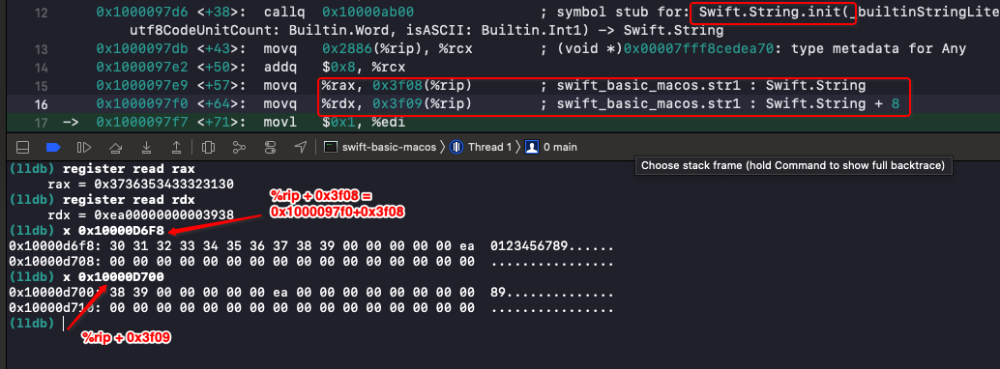
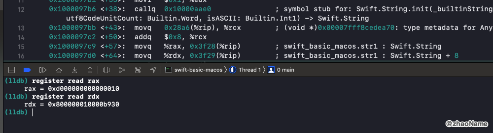
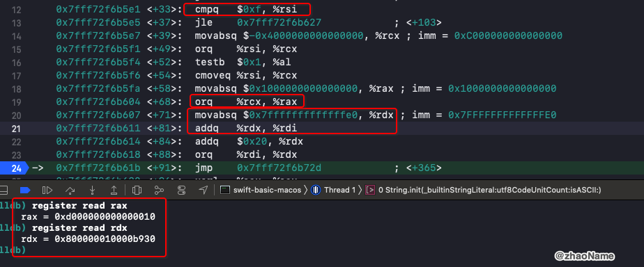
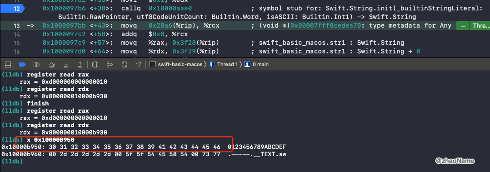
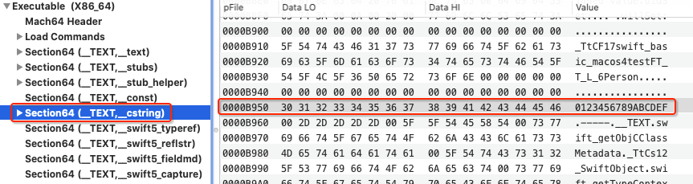
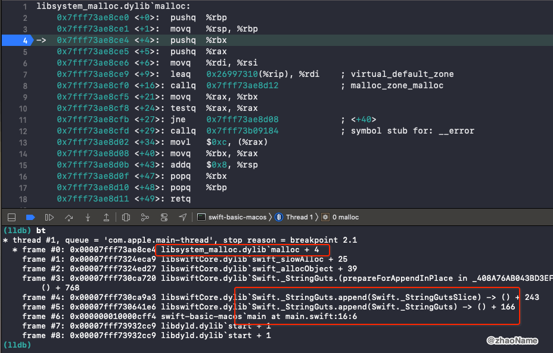
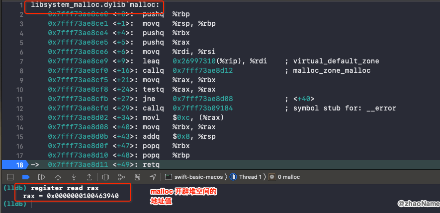
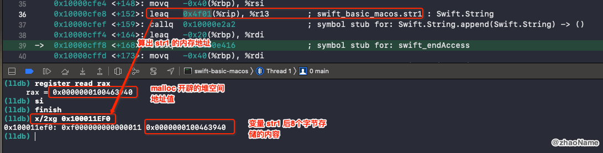
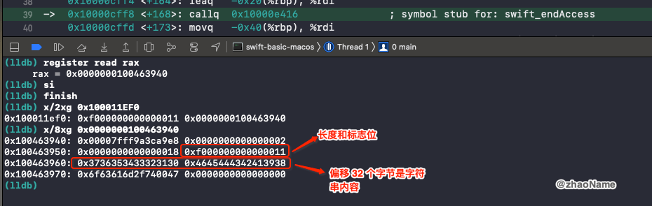

# String

<br>

## 一、String 底层存储结构

### 0x01 `String` 变量占用多少内存

```swift
var str1 = "0"

var str2 = "0123456789ABCDEFGHIJK"


print(MemoryLayout.size(ofValue: str1)) // 16
print(MemoryLayout.stride(ofValue: str1)) // 16

print(MemoryLayout.size(ofValue: str2)) // 16
print(MemoryLayout.stride(ofValue: str2)) // 16
```

所以一个 `String`变量占用 16 个字节。

### 0x02 16 个字节存储的内容

一个 `String` 类型的变量占用 16 个字节，那这 16 个字节中存储的是什么呢？

```swift
var str1 = "0123456789"
```

用上面代码为例，转成汇编如下图：



可以看到会调用 `String.init()` 函数，并将返回值分别放在 `%rax` 和 `%rdx` 中。最终`%rax` 赋值给了变量 `str1` 的前 8 个字节，`%rdx` 赋值给了 `str1` 的后 8 个字节。

所以 `str1` 的 16 个字节存储的内容为 `0x3736353433323130` 和 `0xea00000000003938` 。也就是字符串 `"0123456789"` 对应的 ASCII 值。

那 `ea` 代表什么意思呢？再来看下面代码

```swift
var str1 = "01234"
```

得到的存储内容 `0x0000003433323130` 和 `0xe500000000000000`。也就是地址最高的 1 个字节一半是用当作标志，一半是用来表示字符串长度。

**总结：若字符串的小于等于 15，字符串内容直接存储在变量的内存中，最高位存储的是字符串长度和标志位。**


### 0x03 超过 15 个字节，字符串如何存储

通过上面可知一个 `String` 变量占用 16 个字节，且最高位的一个字节不用来存储字符串内容。也就是说一个字符串最多可以展示 15 个字节的内容，那如果给了一个超过 15 个字节的字符串，这 16 个字节存储的内容将会有什么改变呢？

```swift
var str1 = "0123456789ABCDEF"
```



转成汇编可以看到 16 个字节存储的内容为 `0xd000000000000010` 和 `0x800000010000b930` 。不再是以 ASCII 值和长度的格式存储。想要搞清楚这两个地址代表什么意思，我们需要知道 `String.init()` 方法做了什么事？ 

```
swift-basic-macos`main:
...
; 将字符串 0123456789ABCDEF 的真实地址放到 rax 寄存器中
0x100009798 <+8>:   leaq   0x21b1(%rip), %rax        ; "0123456789ABCDEF"
; 暂存 edi
0x10000979f <+15>:  movl   %edi, -0x4(%rbp)
; 将 rax 中的值给 rdi
0x1000097a2 <+18>:  movq   %rax, %rdi
; 字符串长度 0x10 也就是 16 赋值给 eax (rax 的前 8 个字节)
0x1000097a5 <+21>:  movl   $0x10, %eax
; 暂存 rsi
0x1000097aa <+26>:  movq   %rsi, -0x10(%rbp)
; 字符串长度赋值给 rsi
0x1000097ae <+30>:  movq   %rax, %rsi
; 调用 String.init() 方法 参数为 rdi (字符串 0123456789ABCDEF)、rsi (字符串长度)
->  0x1000097b6 <+38>:  callq  0x10000aae0          ; symbol stub for: Swift.String.init
...
```

调用 `String.init()` 方法会传两个参数：字符串 `0123456789ABCDEF` 的真实地址和字符串的长度，分别存储在寄存器 `rdi` 和寄存器 `rsi` 中。

跳进 `String.init()` 方法内部，部分汇编代码如下：

```
libswiftCore.dylib`Swift.String.init(_builtinStringLiteral: Builtin.RawPointer, utf8CodeUnitCount: Builtin.Word, isASCII: Builtin.Int1) -> Swift.String:
...
; 用字符串的长度和 15 比较
0x7fff72f6b5e1 <+33>:  cmpq   $0xf, %rsi
; 小于等于 15 跳转到 0x7fff72f6b627 继续执行
0x7fff72f6b5e5 <+37>:  jle    0x7fff72f6b627            ; <+103>
; 大于 15 往下执行
; 通过一系列操作将字符串长度和标志位 存放到 rax
0x7fff72f6b5e7 <+39>:  movabsq $-0x4000000000000000, %rcx ; imm = 0xC000000000000000 
0x7fff72f6b5f1 <+49>:  orq    %rsi, %rcx
0x7fff72f6b5f4 <+52>:  testb  $0x1, %al
; 字符串长度赋值给 rax
0x7fff72f6b5f6 <+54>:  cmoveq %rsi, %rcx
0x7fff72f6b5fa <+58>:  movabsq $0x1000000000000000, %rax ; imm = 0x1000000000000000 
; 字符串前 8 字节存储的值放到 rax
0x7fff72f6b604 <+68>:  orq    %rcx, %rax
; 将 0x7fffffffffffffe0 赋值给 rdx
0x7fff72f6b607 <+71>:  movabsq $0x7fffffffffffffe0, %rdx ; imm = 0x7FFFFFFFFFFFFFE0 
; rdi = rdx + rdi (字符串真实地址)
0x7fff72f6b611 <+81>:  addq   %rdx, %rdi
; 通过相加、异步等操作将 rdi 中的值给了 rdx
0x7fff72f6b611 <+81>:  addq   %rdx, %rdi
0x7fff72f6b614 <+84>:  addq   $0x20, %rdx
0x7fff72f6b618 <+88>:  orq    %rdi, %rdx
...
```

`String.init()` 方法内部会对字符串长度进行判断，若长度小于等于 15，则存储的是 ASCII 值和字符串的长度；若长度大于 15，则会将字符串长度等信息存放到前 8 个字节中(`rax`)，字符串的真实地址 + `0x7fffffffffffffe0` 存放到后 8 个字节(`rdx`)。



跳出 `String.init()` 回到 `main` 函数中，算出字符串的真实地址为 `rdx - 0x7fffffffffffffe0 = 0x10000B950`




查看地址 `0x10000B950` 中存储的是我们写入的字符串内容。通过 MachOView 还可以看到 `0x10000B950` 是放在常量区。



**总结：若字符串长度大于 15，则其前 8 个字节存储的是标志位和长度信息，后 8 个字节存储的是字符串的地址信息(需经过计算才能得到真实的存储在常量区的字符串地址)。**


### 0x04 快速获取字符串真实地址的小技巧

字符串的真实地址 = `rdx - 0x7fffffffffffffe0 = 0x800000010000b930 - 0x7fffffffffffffe0  = 0x10000B950 `

有个快速获取字符串真实地址的小技巧就是将 `0x800000010000b930 ` 的最高位置 0，然后加上 `0x20`。

```
	0x800000010000b930 
==> 0x000000010000b930 + 0x20 = 0x10000B950
```

刚好对应这段汇编代码

```
0x7fff72f6b611 <+81>:  addq   %rdx, %rdi
0x7fff72f6b614 <+84>:  addq   $0x20, %rdx
0x7fff72f6b618 <+88>:  orq    %rdi, %rdx
```


<br>

## 二、`append()` 会后字符串如何存储


### 0x01 `append()` 之后字符串长度小于等于 15 

```swift
var str1 = "0123456789"
print("Append 之前存储信息:", Mems.memStr(ofVal: &str1))

str1.append("A")
print("Append 之后存储信息:", Mems.memStr(ofVal: &str1))

// 打印信息
Append 之前存储信息: 0x3736353433323130 0xea00000000003938
Append 之后存储信息: 0x3736353433323130 0xeb00000000413938
```


```swift
var str1 = "0123456789ABCD"
print("Append 之前存储信息:", Mems.memStr(ofVal: &str1))

str1.append("E")
print("Append 之后存储信息:", Mems.memStr(ofVal: &str1))

// 打印信息
Append 之前存储信息: 0x3736353433323130 0xee00444342413938
Append 之后存储信息: 0x3736353433323130 0xef45444342413938
```

`append()` 之后字符串长度仍小于等于 15，字符串内容依然存储在变量的内存中。

### 0x02 `append()` 之后字符串长度大 15 


```swift
var str1 = "0123456789ABCDE"
print("Append 之前存储信息:", Mems.memStr(ofVal: &str1))

str1.append("F")
print("Append 之后存储信息:", Mems.memStr(ofVal: &str1))

// 打印信息
Append 之前存储信息: 0x3736353433323130 0xef45444342413938
Append 之后存储信息: 0xf000000000000010 0x000000010062e2a0
```

```swift
var str1 = "0123456789ABCDEF"
print("Append 之前存储信息:", Mems.memStr(ofVal: &str1))

str1.append("G")
print("Append 之后存储信息:", Mems.memStr(ofVal: &str1))

// 打印信息
Append 之前存储信息: 0xd000000000000010 0x800000010000f5f0
Append 之后存储信息: 0xf000000000000011 0x0000000100594ba0
```

`append()` 之后字符串长度大 15，变量后 8 个字节存储的内容和之前有很大的变化。那这个地址代表什么意思呢？又指向哪块内存空间呢？

我们在 `malloc` 函数中下断点，然后执行汇编命令`bt` 查看函数调用栈，可以看到 `append()` 函数的内部会调用 `malloc` 函数。



函数的返回值会存储在寄存器`rax` 中，所以在 `malloc` 函数中的最后一行汇编代码下断点，查看寄存器 `rax` 保存的值，也就是 `malloc` 函数申请的堆空间地址值。



然后跳出 `malloc` 函数，回到 `main` 函数中，然后算出变量 `str1` 的内存地址 `0x10000cfef + 0x4f01 = 0x100011EF0`，并查看其中存储的内容。其后 8 个字节刚好是 `append()` 函数内部调用 `malloc` 函数申请的堆空间地址值。



读取堆空间地址值中存储的内容，可以看到堆空间地址往后偏移 32 个字节就是我们输入的字符串。




<br>

## 三、总结

- 字符串长度小于等于 15，字符串的内容直接存放到变量的内存中

```swift
var str1 = "0123456789"
print("字符串存储信息:", Mems.memStr(ofVal: &str1))

// 打印信息
字符串存储信息: 0x3736353433323130 0xea00000000003938
```

- 字符串长度大于 15，字符串内容存放在 `__TEXT.cstring` 常量区中，且字符串的地址存储在变量的后 8 个字节(需要经过计算才能得到字符串的真实地址)

```swift
var str1 = "0123456789ABCDEF"
print("字符串存储信息:", Mems.memStr(ofVal: &str1))

// 打印信息
字符串存储信息: 0xd000000000000010 0x800000010000f5f0
```

- `append()` 之后字符串长度小于等于 15，字符串内容仍然存放到变量的内存中

```swift
var str1 = "0123456789"
print("Append 之前存储信息:", Mems.memStr(ofVal: &str1))

str1.append("A")
print("Append 之后存储信息:", Mems.memStr(ofVal: &str1))

// 打印信息
Append 之前存储信息: 0x3736353433323130 0xea00000000003938
Append 之后存储信息: 0x3736353433323130 0xeb00000000413938
```

- `append()` 之后字符串长度大于 15，会开辟堆空间，字符串内容存储在堆空间地址偏移 32 个字节的地方

```swift
var str1 = "0123456789ABCDEF"
print("Append 之前存储信息:", Mems.memStr(ofVal: &str1))

str1.append("G")
print("Append 之后存储信息:", Mems.memStr(ofVal: &str1))

// 打印信息
Append 之前存储信息: 0xd000000000000010 0x800000010000f5f0
Append 之后存储信息: 0xf000000000000011 0x0000000100594ba0
```

<br>


<br>