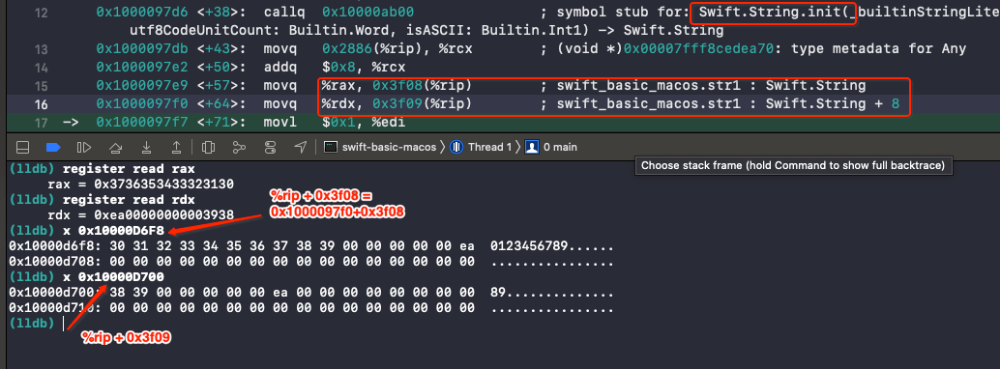

# String

<br>

## 一、String 底层存储结构

### 0x01 `String` 变量占用多少内存

```swift
var str1 = "0"

var str2 = "0123456789ABCDEFGHIJK"


print(MemoryLayout.size(ofValue: str1)) // 16
print(MemoryLayout.stride(ofValue: str1)) // 16

print(MemoryLayout.size(ofValue: str2)) // 16
print(MemoryLayout.stride(ofValue: str2)) // 16
```

所以一个 `String`变量占用 16 个字节。

### 0x02 16 个字节存储的内容

一个 `String` 类型的变量占用 16 个字节，那这 16 个字节中存储的是什么呢？

```swift
var str1 = "0123456789"
```

用上面代码为例，转成汇编如下图：



可以看到会调用 `String.init()` 函数，并将返回值分别放在 `%rax` 和 `%rdx` 中。最终`%rax` 赋值给了变量 `str1` 的前 8 个字节，`%rdx` 赋值给了 `str1` 的后 8 个字节。

所以 `str1` 的两个字节存储的内容为 `0x3736353433323130` 和 `0xea00000000003938` 。也就是字符串 `"0123456789"` 对应的 ASCII 值。

那 `ea` 代表什么意思呢？再来看下面代码

```swift
var str1 = "01234"
```

得到的存储内容 `0x0000003433323130` 和 `0xe500000000000000`。也就是地址最高的 1 个字节一半是用当作标志，一半是用来表示字符串长度。


<br>

### 0x03 超过 15 个字节，字符串如何存储

通过上面可知一个 `String` 变量占用 16 个字节，且最高位的一个字节不用来存储字符串内容。也就是说一个字符串最多可以展示 15 个字节的内容，那如果给了一个超过 15 个字节的字符串，这 16 个字节存储的内容将会有什么改变呢？

```swift
var str1 = "0123456789ABCDEF"
```

<br>


<br>


<br>


<br>