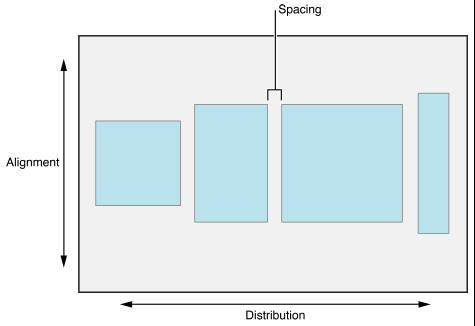

# UIStackView


<br>

## 一、概述

iOS9 新加入了一个非常易用的布局控件 `UIStackView`，它可以将一组 `UIView` 视图进行垂直或水平方向的排列，用来替换手动使用 `Auto Layout` 对视图进行布局。

每个 `UIStackView` 控件都可以在垂直和水平方向上排列展示一组 `subviews`，并可以根据当前屏幕大小和方向的变化动态调整它的内容，感觉起来就像是一个隐形的容器。实际上 `subviews` 的位置是根据设置的 `axis`、`Alignment `、`Spacing` 和 `Distribution` 等属性来决定的。

内部的原理是 `UIStackView` 类帮你管理了 `Auto Layout` 约束。想象一下 `UIStackView` 其实就是一个基于 `Auto Layout` 的抽象层从而使布局属性的创建简单化。你可以在一个主 `UIStackView` 中嵌套 `UIStackView` 从而让视图精确放置到相应的位置。

上一张官方文档上的图解释 `Alignment `、`Spacing` 和 `Distribution` ，如下：




<br>

## 二、`Distribution`


### 0x01 `fill (default)` 


```Swift

```


```Swift

```


```Swift

```


```Swift

```


<br>

## 三、`Alignment`

```Swift

```


```Swift

```


```Swift

```


```Objective-C

```

<br>


<br>

**Reference**

- [UIStack​View - nshipster](https://nshipster.com/uistackview/)

- [UIStackView - apple](https://developer.apple.com/documentation/uikit/uistackview)

<br>