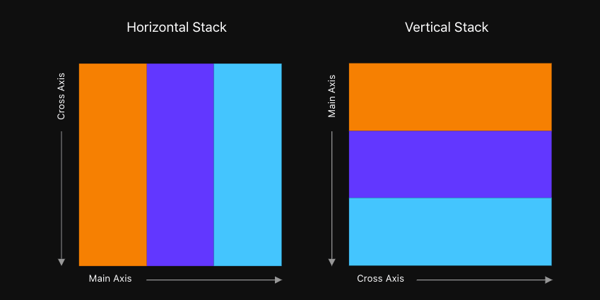
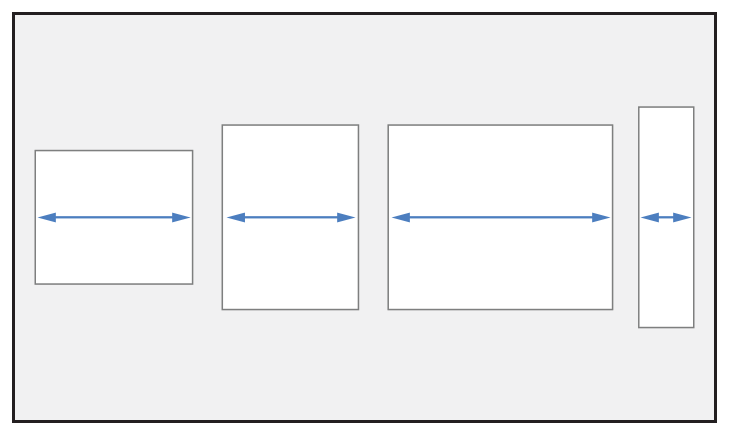
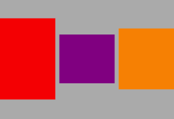
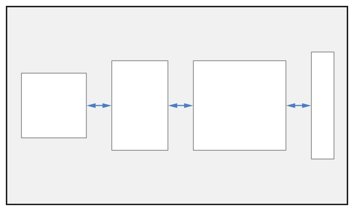
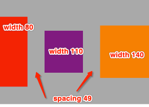
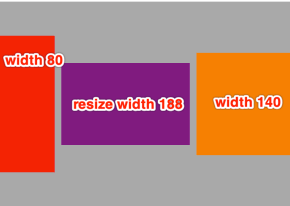
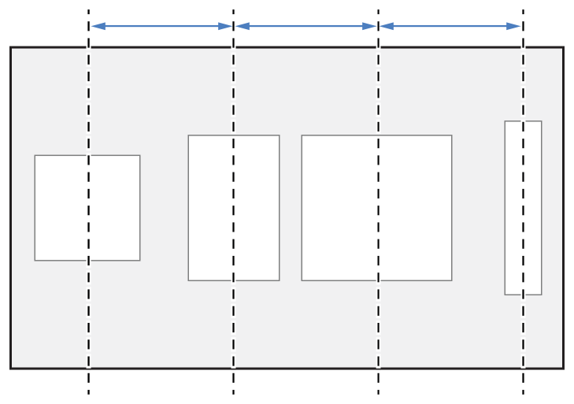
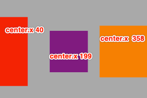

# UIStackView


<br>

## 一、概述

iOS9 新加入了一个非常易用的布局控件 `UIStackView`，它可以将一组 `UIView` 视图进行垂直或水平方向的排列，用来替换手动使用 `Auto Layout` 对视图进行布局。

每个 `UIStackView` 控件都可以在垂直和水平方向上排列展示一组 `subviews`，并可以根据当前屏幕大小和方向的变化动态调整它的内容，感觉起来就像是一个隐形的容器。实际上 `subviews` 的位置是根据设置的 `axis`、`Alignment `、`Spacing` 和 `Distribution` 等属性来决定的。

上一张官方文档上的图解释 `axis`、`Alignment `、`Spacing` 和 `Distribution` ，如下：


#### `axis`

> This property determines the orientation of the arranged views. Assigning the `NSLayoutConstraint.Axis.vertical` value creates a column of views. Assigning the `NSLayoutConstraint.Axis.horizontal` value creates a row. The default value is `NSLayoutConstraint.Axis.horizontal`.

`axis` 是设置 `UIStackView` 中 `subviews` 的排列方向，默认是 `.horizontal` 水平排列。

说明下面会用到的两个概念：

- 主轴：沿排列的子视图的方向，即设置 `axis` 的方向。

- 垂直轴：垂直于排列的子视图的方向。




#### `spacing`

> This property defines a strict spacing between arranged views for the `UIStackView.Distribution.fillProportionally` distributions. It represents the minimum spacing for the `UIStackView.Distribution.equalSpacing` and `UIStackView.Distribution.equalCentering` distributions. Use negative values to allow overlap. The default value is 0.0.

- 若 `UIStackView` 的 `distribution` 属性设置的是 `.equalSpacing`、 `.equalCentering`，`spacing` 属性指的就是 `subviews` 之间的最小间距，默认是 0.0。

- 若设置的是 `.fillProportionally` 属性，那么 `spacing` 的值就是设置的严格的间距值。


#### `.distribution`

> The distribution of the arranged views along the stack view’s axis.

`.distribution` 是设置子视图沿 `axis` 的方向，也就是主轴方向的分布。


#### `.alignment`

> The alignment of the arranged subviews perpendicular to the stack view’s axis.

`.alignment`是设置子视图沿垂直`axis` 的方向，也就是沿垂直轴方向的对齐方式。

<br>

如下自定义 `UIStackView `，并添加三个子视图 `irstView`、`secondView`、`thildView`

```Swift
private lazy var stackView: UIStackView = {
    let sv = UIStackView(arrangedSubviews: [firstView, secondView, thildView]);
    sv.spacing = 10
    sv.axis = .horizontal
    sv.distribution = .fill
    sv.alignment = .center
    sv.backgroundColor = .lightGray
    sv.translatesAutoresizingMaskIntoConstraints = false
    return sv
}()


self.view.addSubview(stackView)
NSLayoutConstraint.activate([
    stackView.leadingAnchor.constraint(equalTo: self.view.leadingAnchor),
    stackView.trailingAnchor.constraint(equalTo: self.view.trailingAnchor),
    stackView.centerYAnchor.constraint(equalTo: self.view.centerYAnchor),
    stackView.heightAnchor.constraint(equalToConstant: 300)
])

NSLayoutConstraint.activate([
    firstView.widthAnchor.constraint(equalToConstant: 80),
    firstView.heightAnchor.constraint(equalToConstant: 200),
    
    secondView.widthAnchor.constraint(equalToConstant: 110),
    secondView.heightAnchor.constraint(equalToConstant: 120),
    
    thildView.widthAnchor.constraint(equalToConstant: 140),
    thildView.heightAnchor.constraint(equalToConstant: 150)
])
```

用上述代码来解释 `.distribution` 和 `.alignment` 对 `UIStackView` 中 arranged views 的影响。

<br>

## 二、`UIStackView.Distribution`

沿主轴排列的子视图的位置和大小部分受 `.distribution` 属性值的影响，部分受子视图本身的大小属性影响。


### 0x01 `.fill` (default)

官方文档解释如下：

> A layout where the stack view resizes its arranged views so that they fill the available space along the stack view’s axis. When the arranged views do not fit within the stack view, it shrinks the views according to their compression resistance priority. If the arranged views do not fill the stack view, it stretches the views according to their hugging priority. If there is any ambiguity, the stack view resizes the arranged views based on their index in the `arrangedSubviews` array.



通过调整某个子视图的 `size` 来使所有视图沿主轴方法填充 `UIStackView`。

- 若所有子视图沿主轴方向超出父视图 `UIStackView` 的范围，则会根据子视图的 `compression resistance priority` 缩小视图

- 若所有子视图沿主轴方向没有填充父视图 `UIStackView`，则会根据子视图的 `hugging priority` 缩小视图

- 若无法分辨优先级，则根据 `subviews` 在 `arrangedSubviews` 数组中的索引来调整排列视图的大小。


### 0x02 `.fillEqually` 

官方文档解释如下：

> A layout where the stack view resizes its arranged views so that they fill the available space along the stack view’s axis. The views are resized so that they are all the same size along the stack view’s axis.


和 `.fill` 不同的是 `. fillEqually` 是通过调整所有子视图的 `size` 达到沿主轴方向填充 `UIStackView` 的目的。




### 0x03 `.fillProportionally`

官方文档解释如下：

> A layout where the stack view resizes its arranged views so that they fill the available space along the stack view’s axis. Views are resized proportionally based on their intrinsic content size along the stack view’s axis.


`.fillProportionally`是以子视图的 `intrinsic content size` 为比例，沿主轴方向调整子视图的 `size` 。

```Swift

```

### 0x04 `.equalSpacing`

官方文档解释如下：

> A layout where the stack view positions its arranged views so that they fill the available space along the stack view’s axis. When the arranged views do not fill the stack view, it pads the spacing between the views evenly. If the arranged views do not fit within the stack view, it shrinks the views according to their compression resistance priority. If there is any ambiguity, the stack view shrinks the views based on their index in the `arrangedSubviews` array.



若子视图沿主轴方向没有填满 `UIStackView`，则修改 `spacing` 的值让其填满。



若子视图沿主轴方向超出 `UIStackView` 的范围，则根据 `compression resistance priority` 来调整某个子视图的大小。若无法分辨优先级，则根据 `subviews` 在 `arrangedSubviews` 数组中的索引来调整排列视图的大小。

将 `secondView` 的宽度扩大到 310，在观察每个子视图沿主轴方向的 `size` 。如下：

```Swift
secondView.widthAnchor.constraint(equalToConstant: 310),
```



### 0x05 `.equalCentering`

官方文档解释如下：

> A layout that attempts to position the arranged views so that they have an equal center-to-center spacing along the stack view’s axis, while maintaining the `spacing` property’s distance between views. If the arranged views do not fit within the stack view, it shrinks the spacing until it reaches the minimum spacing defined by its `spacing` property. If the views still do not fit, the stack view shrinks the arranged views according to their compression resistance priority. If there is any ambiguity, the stack view shrinks the views based on their index in the `arrangedSubviews` array.



`.equalCentering` 通过调整子视图到子视图的中心距离，同时保证视图之间的 `spacing`，来达到沿主轴方向适配 `UIStackView` 的目的。

- 若沿主轴方向没有超出 `UIStackView` 的范围，则调整 `spacing` 来使子视图适配 `UIStackView`。



- 若沿主轴方向没有超出 `UIStackView` 的范围，先调整`spacing` 到设置的最小值。若果还不行，则根据子视图的 `compression resistance priority` 压缩某个子视图的 `size`。若无法分辨优先级，则根据 `subviews` 在 `arrangedSubviews` 数组中的索引来调整排列视图的大小。这时子视图到子视图的中心距离是不等的。类似 `.equalSpacing` 的效果。


<br>

## 三、`UIStackView.Alignment`

```Swift

```


```Swift

```


```Swift

```


```Objective-C

```

<br>


<br>

**Reference**

- [UIStack​View - nshipster](https://nshipster.com/uistackview/)

- [UIStackView - apple](https://developer.apple.com/documentation/uikit/uistackview)

<br>