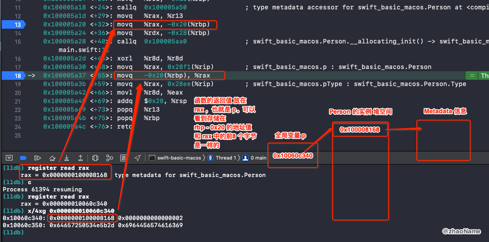

# `X.self`、`X.Type`、`AnyClass`

<br>


## 一、 `X.self`、`X.Type`、`AnyClass`

### 0x01 `X.self`、`X.Type`

`X.self` 是一个元类型 (`metadata`) 的指针，`metadata ` 中存放着类型相关信息。`X.self` 获取到的结果是 `X.Type` 类型。

```swift
class Person {
}

let p = Person()
let pType: Person.Type = Person.self
```

```
swift-basic-macos`main:
    ...
    ; 获取 Person 的 metadata 信息，返回值默认存放在 rax
    0x100005a18 <+24>: callq  0x100005a50               ; type metadata accessor for swift_basic_macos.Person at <compiler-generated>
    0x100005a1d <+29>: movq   %rax, %r13
    ; 将 Person 的 metadata 信息 暂存在 rbp - 0x20 
->  0x100005a20 <+32>: movq   %rax, -0x20(%rbp)
    0x100005a24 <+36>: movq   %rdx, -0x28(%rbp)
    ; 初始化 Person 实例对象，返回值默认存放在 rax，也就是全局变量 p
    0x100005a28 <+40>: callq  0x100005aa0               ; swift_basic_macos.Person.__allocating_init() -> swift_basic_macos.Person at main.swift:11
    0x100005a2d <+45>: xorl   %r8d, %r8d
    0x100005a30 <+48>: movq   %rax, 0x28f1(%rip)        ; swift_basic_macos.p : swift_basic_macos.Person
    ; 将 rbp - 0x20 中存储的地址值放到 rax 中
    0x100005a37 <+55>: movq   -0x20(%rbp), %rax
    ; 将 rax 中的地址值赋值给 pType
    0x100005a3b <+59>: movq   %rax, 0x28ee(%rip)        ; swift_basic_macos.pType : swift_basic_macos.Person.Type
    ...
```



上面证明了实例变量的前 8 个字节就是 `metadata` 类型信息。


### 0x02 `AnyClass`

swift 标准库中关于 `AnyClass ` 是这样定义的。


```swift
public typealias AnyClass = AnyObject.Type
```

也即是说 `AnyClass` 是任意类型的元类型别名。

```swift
let anyType: AnyClass = Person.self
```

### 0x03 `type(of:)`

`type(of:)` 也可用于获取 `metadata` 元类型。

```swift
print(type(of: p) == Person.self)   // true
```

<br>


## 二、`Self`

`Self` 一般作为返回值类型，限定返回值跟方法调用者必须是同一类型

```
protocol Copyable {
    func copy() -> Self
}

class MMyClass: Copyable {
    var num = 1
    func copy() -> Self {
        let result = type(of: self).init()
        result.num  = num
        return result
    }

    // 必须实现
    required init() {
    }
}
```


> "Self" is a placeholder used in two different cases:

> 1.In a protocol, it refers to the type that conforms to the protocol in any particular use. In Equatable, for example, it's used to require that the two values being compared are of the same type. It's something like a generic type parameter that you don't have to put between the <…> because it's deduced from the context of its use.

> 2.In a class/static method, it can be used as the return type, to indicate that the return type is the type of the class to which the method was sent, rather than the class in which the method is declared. It's similar to 'instancetype' in Obj-C.

<br>


参考：

- [Self and self in Swift](https://learnappmaking.com/self-swift-how-to/)

<br>