# enum 

枚举为一组相关的值定义了一个共同的类型，使你可以在你的代码中以类型安全的方式来使用这些值。

在 C 语言中枚举只能用整形变量来声明其成员，但在 Swift 中不必给每一个枚举成员提供一个值。如果给枚举成员提供一个值（称为原始值），则该值的类型可以是字符串、字符，或是一个整型值或浮点数。另外 swift 中的枚举成员可以指定任意类型的关联值存储到枚举成员中。

<br>

## 一、常规用法

### 0x01 语法

Swift 中枚举定义使用的是 `enum` 关键字

```
enum CompassPoint {
    case north
    case south
    case east
    case west
}


// 多个成员值可以出现在同一行上，用逗号隔开
enum CompassPoint {
    case north, case south, case east, case west
}
```

> NOTE
> 
> 与 C 和 Objective-C 不同，Swift 的枚举成员在被创建时不会被赋予一个默认的整型值。在上面的 CompassPoint 例
> 子中，north，south，east 和 west 不会被隐式地赋值为 0，1，2 和 3。相反，这些枚举成员本身就是完备的值，这值的类型是已经明确定义好的 CompassPoint 类型。


### 0x02 枚举成员的遍历

让枚举遵循 `CaseIterable` 协议。Swift 会生成一个 `allCases` 属性，用于表示一个包含枚举所有成员的集合。

```
enum CompassPoint: CaseIterable {
    case north, case south, case east, case west
}

let allCases = CompassPoint.allCases
print(allCases)

// 打印结果
[swift_basic.CompassPoint.north, swift_basic.CompassPoint.south, swift_basic.CompassPoint.east, swift_basic.CompassPoint.west]
```

`allCases` 的使用方法和其它一般集合一样——集合中的元素是枚举类型的实例。我们可以用 `for-in`来遍历枚举成员

```
for ca in allCases {
    print(ca)
}

//  打印结果
north
south
east
west
```


### 0x02 关联值 (Associated Values)

有时候把其他类型的值和成员值一起存储起来会很有用。这种额外的信息称为关联值，并且你每次在代码中使用该枚举成员时，还可以修改这个关联值。 Swift 中的枚举可以存储任意类型的关联值，且每个枚举成员的关联值类型可以各不相同。

如日期可以用数字年月日来表示，也可用字符串来表示

```
enum Date {
    case digit(year: Int, month: Int, day: Int)
    case dateString(str: String)
}
```

定义两个 `Date` 类型的变量

```
let dateDigit = Date.digit(year: 2021, month: 6, day: 28)
let dateString = Date.dateString(str: "2021-06-18")
```

使用 Switch 语句来匹配枚举值时，关联值可以被提取出来作为 switch 语句的一部分

```
switch dateDigit {
case .digit(let year, let month, var day):
    day = 29
    print("digit====year:\(year) month:\(month) day:\(day)")
case .dateString(let str):
    print("dateString====\(str)")
}

// digit====year:2021 month:6 day:29
```

如果一个枚举成员的所有关联值都被提取为常量，或者都被提取为变量，你可以只在成员名称前标注一个 let 或者 var

```
switch dateDigit {
case let .digit(year, month, day):
    print("digit====year:\(year) month:\(month) day:\(day)")
case .dateString(let str):
    print("dateString====\(str)")
}

// digit====year:2021 month:6 day:28
```


### 0x03 原始值 (Raw Values)

枚举成员可以使用相同类型的默认值预填充，这个默认值叫原始值 (Raw Values)。原始值可以是字符串、字符，或者任意整型值或浮点型值。每个原始值在枚举声明中必须是唯一的。

> NOTE
> 
> 原始值和关联值是不同的。原始值是在定义枚举时被预先填充的值，且始终不变。关联值是创建一个基于枚举成员的常量或变量时才设置的值，枚举成员的关联值可以变化。


```
enum CompassPoint: String {
    case north = "north"
    case south = "south"
    case east = "east"
    case west = "west"
}

// 返回值是可选类型  因为所传的参数并不一定能找到对应 CompassPoint 的值
let south = CompassPoint(rawValue: "south")
print(south)

// Optional(swift_basic.CompassPoint.south)
```


### 0x04 隐式原始值 (Implicitly Assigned Raw Values)

若枚举的原始值类型为 `Int` 或 `String` 时，不需要显式地为每一个枚举成员设置原始值，Swift 将会自动为你赋值。

```
enum CompassPoint: String {
    case north = "north"
    case south = "south"
    case east = "east"
    case west = "west"
}

enum ImplicitlyCompassPoint: String {
    case north
    case south
    case east
    case west
}

let south = CompassPoint(rawValue: "south")
let implictSouth = ImplicitlyCompassPoint(rawValue: "south")
    
print("south---", south?.rawValue)
print("implictSouth---", implictSouth?.rawValue)

// south--- Optional("south")
// implictSouth--- Optional("south")
```

当使用 `Int` 作为原始值时，隐式赋值的值依次递增 1。如果第一个枚举成员没有设置原始值，其原始值将为 0。


<br>

## 二、内存布局


### 0x01 没有原始值和关联值的枚举内存布局

定义一个枚举 TestEnum，然后用 `MemoryLayout` 来查看其占用内存大小

```
enum TestEnum {
    case test1, case test2, case test3
}

// TestEnum 实际占用的内存大小
print(MemoryLayout<TestEnum>.size) // 1
// 系统为 TestEnum 分配的内存大小
print(MemoryLayout<TestEnum>.stride) // 1
// 对齐
print(MemoryLayout<TestEnum>.alignment) // 1
```

可以看到没有原始值和关联值的枚举只占 1 个字节的内存，下面我们来看下这 1 个字节中存储的内容

```
var t = TestEnum.test1

// 获取枚举变量的内存地址
let pointer = withUnsafePointer(to: &t) {
    UnsafePointer($0)
}
print(pointer)
    
t = TestEnum.test2
t = TestEnum.test3

print("-----------")
```

在 Xcode 的 `Debug -> Debug Workflow -> View Memory` 中输入枚举变量的内存地址，查看其存储的内容

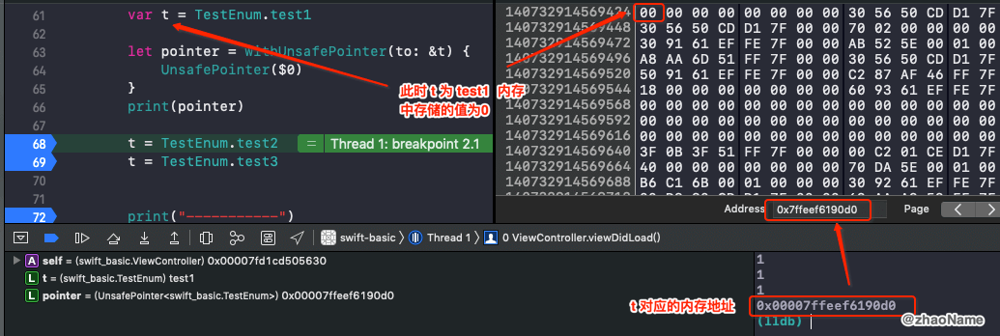

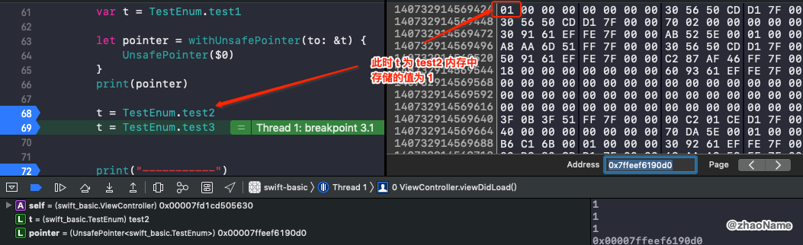

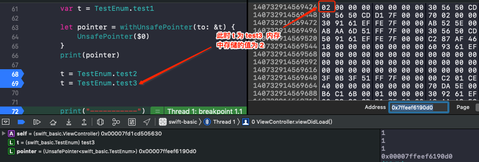

可以看到没有原始值和关联值的枚举只用 1 个字节的内存空间来区分其对应的 `case`


### 0x02 只有原始值的枚举内存布局


若此枚举有原始值，再用 `MemoryLayout` 来查看其占用内存大小

```
enum TestEnum: Int {
    case test1 = 10
    case test2
    case test3
}

// TestEnum 实际占用的内存大小
print(MemoryLayout<TestEnum>.size) // 1
// 系统为 TestEnum 分配的内存大小
print(MemoryLayout<TestEnum>.stride) // 1
// 对齐
print(MemoryLayout<TestEnum>.alignment) // 1
```

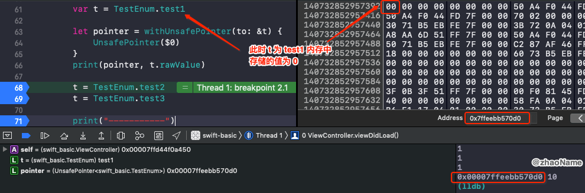

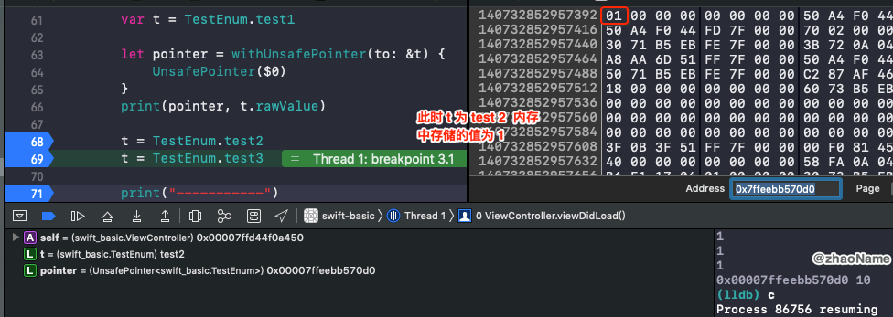

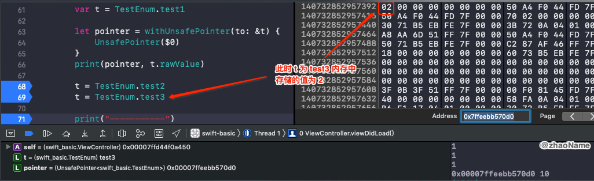

可以看到若枚举变量只有原始值，其内存布局和没有原始值是一样的，都只占 1 个字节的内存空间，并用 `0 1 2 ...` 来区分不同的 `case`。

这时可能有人会问：那枚举变量的原始值存在哪里了呢？通过前面的学习我们知道原始值是唯一且不变的，也就是说所有的枚举变量共用一份原始值。那这个原始值就没有必要存储在枚举的内存中，我们甚至可以猜测枚举源码中使用函数来实现对原始值的获取，伪代码如下

```
// 枚举中 rawValue 的伪代码
func rawValue() -> Int {
    if self == test1 {
        return 10
    }
    ...
}
```

### 0x03 有关联值的枚举内存布局

```
enum TestEnum {
    case test1(Int, Int, Int)
    case test2(Int, Int)
    case test3(Int)
    case test4(Bool)
    case test5
}

// TestEnum 实际占用的内存大小
print(MemoryLayout<TestEnum>.size)  // 25
// 系统为 TestEnum 分配的内存大小
print(MemoryLayout<TestEnum>.stride) //32
// 对齐 
print(MemoryLayout<TestEnum>.alignment) //8
```

当枚举用关联值时，其

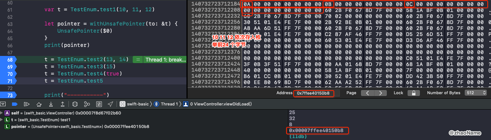

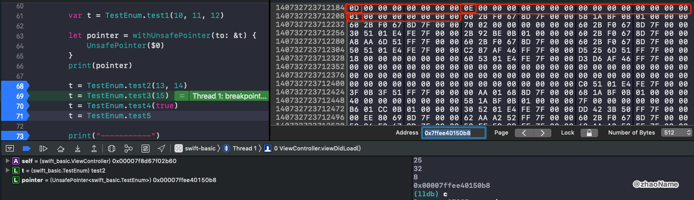

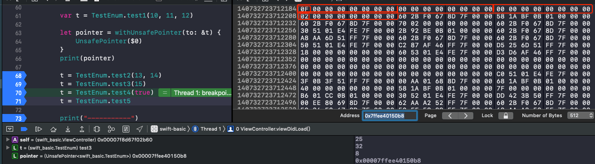

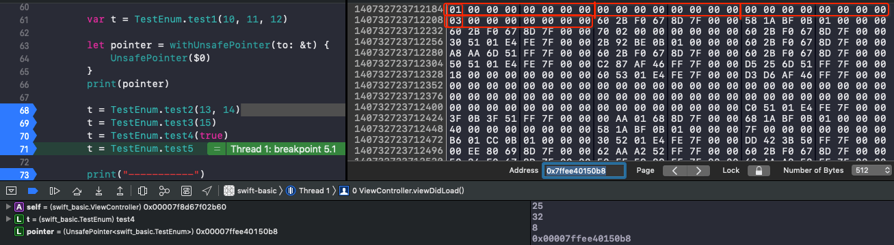

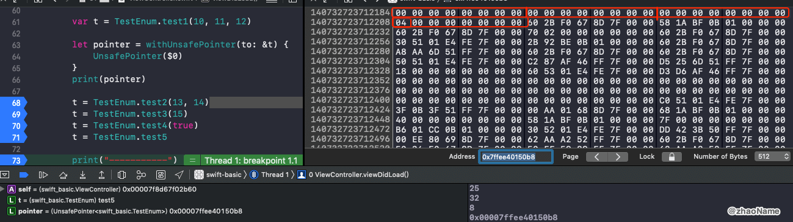


<br>


<br>


<br>

参考：

- [枚举](https://swiftgg.gitbook.io/swift/swift-jiao-cheng/08_enumerations)

- [Enumerations](https://docs.swift.org/swift-book/LanguageGuide/Enumerations.html)

<br>