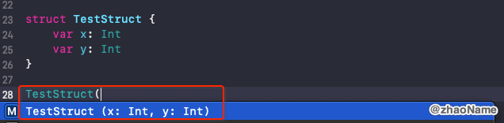
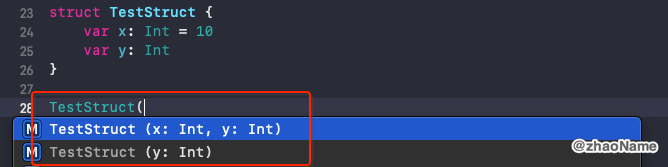
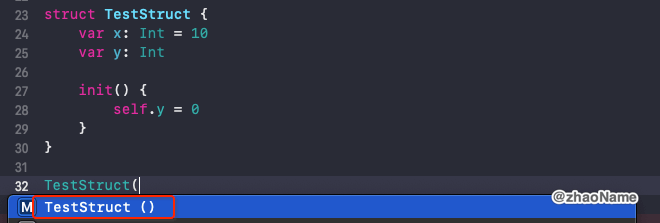
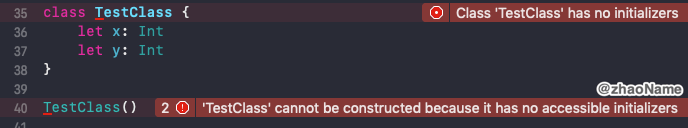
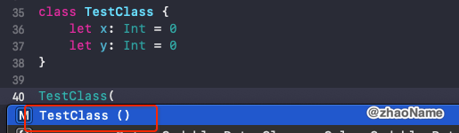
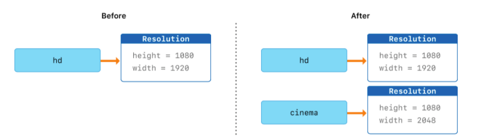
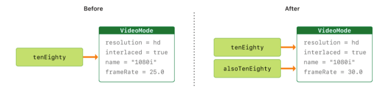

# Struct & Class


<br>

## 一、结构体和类对比

### 0x01 Swift 中结构体和类有很多共同点

- 定义属性用于存储值

- 定义方法用于提供功能
- 定义下标操作用于通过下标语法访问它们的值
- 定义构造器用于设置初始值
- 通过扩展以增加默认实现之外的功能
- 遵循协议以提供某种标准功能

### 0x02 与结构体相比，类特有功能：

- 继承允许一个类继承另一个类的特征

- 类型转换允许在运行时检查和解释一个类实例的类型
- 析构器允许一个类实例释放任何其所被分配的资源
- 引用计数允许对一个类的多次引用

### 0x03 如何在结构体和类之间进行选择

- 默认使用结构体

- 当你需要和 Objective-C 相互操作时，使用类
- 当你需要控制数据的标志时，使用类
- 当你需要使用继承时，使用类


<br>

## 二、结构体和类的初始化器

### 0x01 结构体的初始化器

所有的结构体都会有一个编译器自动生成的初始化器(初始化方法、构造方法)



编译器有时会默认帮我们生成多个初始化器，宗旨是保证所有的成员都有初始值




一旦在结构体中自定义初始化器，编译器就不会自动帮我们生成其他初始化器，如下图只有自定义的`init()` 方法




效率上讲自定义的初始化器和编译器帮我们生成的初始化器是一样的

```Swift
// 编译器自动生成的初始化器
struct TestStruct {
    var x: Int = 10
    var y: Int = 20
}

// 转成汇编代码
swift-basic-macos`init() in TestStruct #1 in test():
->  0x100001830 <+0>:  pushq  %rbp
    0x100001831 <+1>:  movq   %rsp, %rbp
    0x100001834 <+4>:  xorps  %xmm0, %xmm0
    0x100001837 <+7>:  movaps %xmm0, -0x10(%rbp)
    0x10000183b <+11>: movq   $0xa, -0x10(%rbp)
    0x100001843 <+19>: movq   $0x14, -0x8(%rbp)
    0x10000184b <+27>: movl   $0xa, %eax
    0x100001850 <+32>: movl   $0x14, %edx
    0x100001855 <+37>: popq   %rbp
    0x100001856 <+38>: retq  
```

```Swift
// 自定义的初始化器
struct TestStruct {
    var x: Int
    var y: Int
    
    init() {
        x = 10
        y = 20
    }
}

// 转成汇编代码
swift-basic-macos`init() in TestStruct #1 in test():
->  0x100001830 <+0>:  pushq  %rbp
    0x100001831 <+1>:  movq   %rsp, %rbp
    0x100001834 <+4>:  xorps  %xmm0, %xmm0
    0x100001837 <+7>:  movaps %xmm0, -0x10(%rbp)
    0x10000183b <+11>: movq   $0xa, -0x10(%rbp)
    0x100001843 <+19>: movq   $0x14, -0x8(%rbp)
    0x10000184b <+27>: movl   $0xa, %eax
    0x100001850 <+32>: movl   $0x14, %edx
    0x100001855 <+37>: popq   %rbp
    0x100001856 <+38>: retq  
```

### 0x02 类的初始化器

编译器不会自动为类生成可以传入成员值的初始化器



若类的所有属性在定义的时候都指定了初始值，那编译器会自动帮我们生成无惨的初始化器。且成员的初始化都是在这个初始化器中完成的。



关于类的更多初始化方法可参考这里


<br>

## 三、结构体和枚举是值类型

值类型是指当它被赋值给一个变量、常量或者被传递给一个函数的时候，其值会被拷贝。Swift 中所有的结构体和枚举类型都是值类型。这意味着它们的实例，以及实例中所包含的任何值类型的属性，在代码中传递的时候都会被复制。

标准库定义的集合，例如数组，字典和字符串，都对复制进行了优化以降低性能成本。新集合不会立即复制，而是跟原集合共享同一份内存，共享同样的元素。在集合的某个副本要被修改前，才会复制它的元素。这就是传说中的 `Copy  On Write ` 技术，只有执行"写"操作时才会真正进行值拷贝操作。

### 0x01 结构体是值类型

如下定义一个 `Resolution ` 结构体，声明一个结构体实例 `hd` 并赋值给 `cinema` 。

```Swift
struct Resolution {
    var width = 0
    var height = 0
}

let hd = Resolution(width: 1920, height: 1080)
var cinema = hd
```

当改变 `cinema` 的`width` 成员值时，并不会影响 `hd` 的`width` 成员值

```
cinema.width = 2048

print("cinema is now  \(cinema.width) pixels wide")
print("hd is still \(hd.width) pixels wide")

// 打印结果
"cinema is now 2048 pixels wide"
"hd is still 1920 pixels wide"
```

将 `hd` 赋值给 `cinema` 时，`hd` 中所存储的值会拷贝到新的 `cinema` 实例中。如下图所示




### 0x02 汇编查看值类型拷贝的过程

```
swift-basic-macos`test():
    ...
    ; 将 1080 赋值给  edi
    0x1000016d3 <+19>:  movl   $0x438, %edi
    ; 将 1920 赋值给 esi
    0x1000016d8 <+24>:  movl   $0x780, %esi
    ; 调用 init 方法初始化 hd 变量
    0x1000016dd <+29>:  callq  0x1000017b0 ; init(width: Swift.Int, height: Swift.Int) -> Resolution


swift-basic-macos`init(width:height:) in Resolution #1 in test():
->  0x1000017b0 <+0>:  pushq  %rbp
    0x1000017b1 <+1>:  movq   %rsp, %rbp
    ; rdi = rax = 1080
    0x1000017b4 <+4>:  movq   %rdi, %rax
    ; rsi = rdx = 1920
    0x1000017b7 <+7>:  movq   %rsi, %rdx
    0x1000017ba <+10>: popq   %rbp
    0x1000017bb <+11>: retq  
    

swift-basic-macos`test():
    ...
->  0x1000016ed <+29>:  callq  0x1000017b0  ; init(width: Swift.Int, height: Swift.Int) -> Resolution
	; 将 rax = 1080 存到 rbp - 0x10
    0x1000016f2 <+34>:  movq   %rax, -0x10(%rbp)
    ; 将 rax = 1920 存到 rbp - 0x8
    0x1000016f6 <+38>:  movq   %rdx, -0x8(%rbp)
    
    ; 相当于 var cinema = hd，也就是值拷贝
    ; 将 rax = 1080 存到 rbp - 0x20 
    0x1000016fa <+42>:  movq   %rax, -0x20(%rbp)
    ; 将 rax = 1080 存到 rbp - 0x18
    0x1000016fe <+46>:  movq   %rdx, -0x18(%rbp)
    
    ; 将 rax = 2048 存到 rbp - 0x20, 相当于 cinema.width = 2048
    0x100001702 <+50>:  movq   $0x800, -0x20(%rbp)       ; imm = 0x800 
```


### 0x03 枚举值类型

```Swift
enum CompassPoint {
    case north, south, east, west
    mutating func turnNorth() {
        self = .north
    }
}
var currentDirection = CompassPoint.west
let rememberedDirection = currentDirection
currentDirection.turnNorth()

print("The current direction is \(currentDirection)")
print("The remembered direction is \(rememberedDirection)")

// 打印结果
"The current direction is north"
"The remembered direction is west"
```

当 `rememberedDirection` 被赋予了 `currentDirection` 的值，实际上它被赋予的是值的一个拷贝。赋值过程结束后再修改 `currentDirection` 的值并不影响 `rememberedDirection` 所储存的原始值的拷贝。


<br>


## 四、类是引用类型

引用类型是指在被赋予到一个变量、常量或者被传递到一个函数时，其值不会被拷贝。

```Swift
class VideoMode {
    var interlaced = false
    var frameRate = 0.0
    var name: String?
}

let tenEighty = VideoMode()
tenEighty.interlaced = true
tenEighty.name = "1080i"
tenEighty.frameRate = 25.0

// 将 tenEighty 赋值给 alsoTenEighty
let alsoTenEighty = tenEighty
alsoTenEighty.frameRate = 30.0

print("The frameRate property of tenEighty is now \(tenEighty.frameRate)")

// 打印结果
"The frameRate property of theEighty is now 30.0"
```




<br>


参考：

- [类和结构体](https://swiftgg.gitbook.io/swift/swift-jiao-cheng/09_structures_and_classes)

- [Structures and Classes](https://docs.swift.org/swift-book/LanguageGuide/ClassesAndStructures.html)

- [Choosing Between Structures and Classes](https://developer.apple.com/documentation/swift/choosing_between_structures_and_classes)
