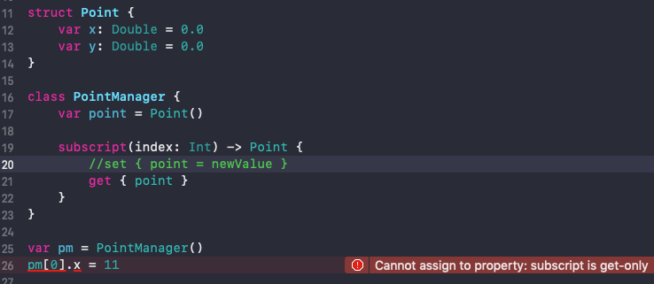

# Subscript

下标 (`Subscript `) 可以定义在类、结构体和枚举中，是访问集合、列表或序列中元素的快捷方式。可以使用下标的索引，设置和获取值，而不需要再调用对应的存取方法。

<br>

### 0x01 语法

`Subscript `语法类似于实例方法语法和计算型属性语法，本质上来说它就是方法。

```swift
subscript(index: Int) -> Double {
    get {
      // 返回一个适当的 Double 类型的值
    }
    set(newValue) {
      // 执行适当的赋值操作
    }
}
```

`subscript `中定义的返回值决定了:

- `setter` 方法中的 `newValue` 的类型


- `getter` 方法中的返回值类型


<br>

### 0x02 只读下标

`subscript `类似计算属性，可以没有`setter` 方法，但必须有 `getter` 方法。只读下标的声明，可以通过省略 get 关键字和对应的大括号组来进行简写。

```swift
struct TimesTable {
    let multiplier: Int
    subscript(index: Int) -> Int {
        return multiplier * index
    }
}
```

<br>

### 0x03 结构体、类作为返回值

- 类作为返回值时，通过 `getter` 方法(`pm[0]`)拿到类的实例对象 `point` 。由于类是引用类型，所以对 `point` 的属性进行修改是没问题的。

```swift
class Point {
    var x: Double = 0.0
    var y: Double = 0.0
}

class PointManager {
    var point = Point()
    
    subscript(index: Int) -> Point {
        get { point }
    }
}

var pm = PointManager()
pm[0].x = 11
```

- 由于结构体是值类型，当结构体作为返回值时，修改结构体中的属性值是会报错的



需要实现 `subscript` 的 `setter` 方法，就能修改成功。

```swift
class PointManager {
    var point = Point()
    
    subscript(index: Int) -> Point {
        // newValue 是一个新的 Point 对象
        set { point = newValue }
        get { point }
    }
}

var pm = PointManager()
// 相当于 point = Point(x: 11, y: pm[0].y)
pm[0].x = 11
```

<br>

### 0x04 接收多个参数的下标

```swift
struct Matrix {
    let rows: Int, columns: Int
    var grid: [Double]
    init(rows: Int, columns: Int) {
        self.rows = rows
        self.columns = columns
        grid = Array(repeating: 0.0, count: rows * columns)
    }
    func indexIsValid(row: Int, column: Int) -> Bool {
        return row >= 0 && row < rows && column >= 0 && column < columns
    }
    subscript(row: Int, column: Int) -> Double {
        get {
            assert(indexIsValid(row: row, column: column), "Index out of range")
            return grid[(row * columns) + column]
        }
        set {
            assert(indexIsValid(row: row, column: column), "Index out of range")
            grid[(row * columns) + column] = newValue
        }
    }
}
```

<br>

参考：

- [Subscripts](https://docs.swift.org/swift-book/LanguageGuide/Subscripts.html)

- [下标](https://swiftgg.gitbook.io/swift/swift-jiao-cheng/12_subscripts)

<br>