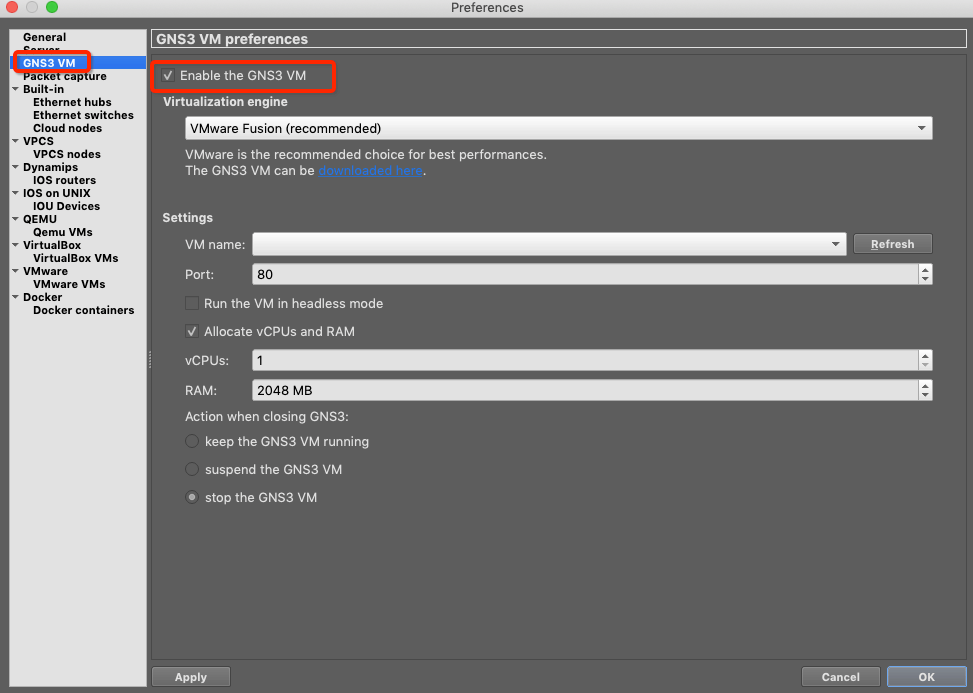
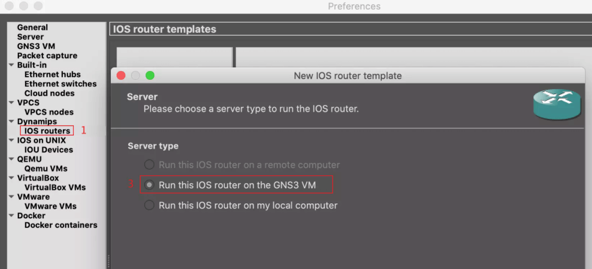
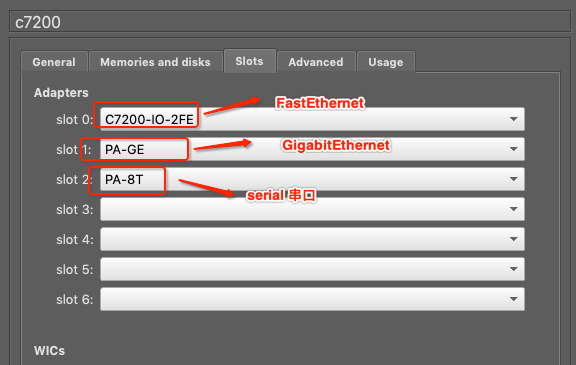
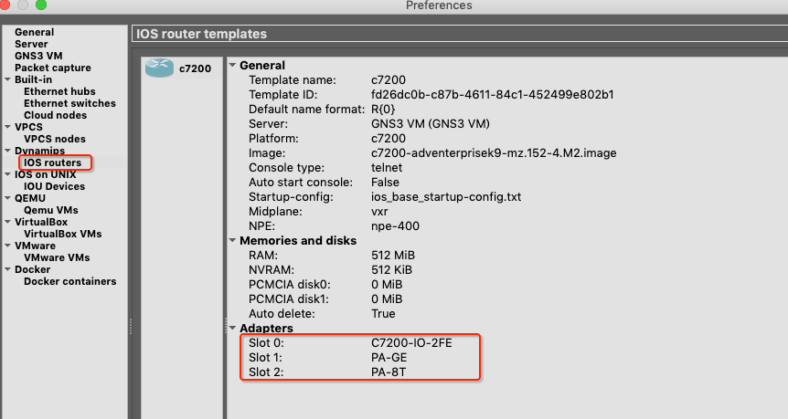

# Mac 下安装 GNS3

<br>

## 一、安装

### 0x01 准备工作

-  [下载 VMware Fusion](https://www.vmware.com/products/fusion/fusion-evaluation.html)

- [下载 GNS3 VM](https://gns3.com/software/download-vm)


- [下载 Mac 版 GNS3](https://gns3.com/software/download)

- [下载 Cisco 路由器 IOS 镜像](https://ccie.lol/blog/2016/07/03/cisco-ios-image-download/)

### 0x02 安装 VMware FusionGNS3 VM 

首先安装 VMware Fusion, 安装过程中若出现如下错误，需到 Mac 上的 `系统偏好设置 -> 安全性与隐私 -> 通用` 输入管理员密码统一安装。


然后重启 VMware Fusion 即可。

### 0x03 安装 GNS3 VM 

解压下载后的`GNS3.VM.VMware.Workstation.2.2.17.zip` 文件，当出现解压`GNS3 VM.ova`时，一定要取消解压


然后将 `GNS3 VM.ova` 拖拽到 VMware Fusion 中，一直下一步安装


安装完成后的界面


### 0x04 安装 GNS3

打开 GNS3，第一次的话会有下面弹窗，选中第一个。后续设置在`Help -> Setup Wizard`中打开


设置 -> GNS3 VM，勾选 OK



导入c7200镜像



点击下一步然后选择下载好的 Cisco 路由器 IOS 镜像。然后一路向下，到选择solts时选C7200-IO-2FE即2个千兆口，以防测试时口不够用，出现这个错误（Can't create the link the destination port is not free），也可后续修改模板。



最后 Cisco 路由器安装成功的界面



至此安装完成。

<br>

## 二、运行

如图配置如下路由器


电脑 PC1

```
## 添加 IP 子网掩码 网关
PC1> ip 192.168.1.10 255.255.255.0 192.168.1.11
Checking for duplicate address...
PC1 : 192.168.1.10 255.255.255.0 gateway 192.168.1.11

PC1> show ip
NAME        : PC1[1]
IP/MASK     : 192.168.1.10/24
GATEWAY     : 192.168.1.11
DNS         : 
MAC         : 00:50:79:66:68:00
LPORT       : 20004
RHOST:PORT  : 127.0.0.1:20005
MTU         : 1500
```

路由器 R1

```
R1# configure terminal 
Enter configuration commands, one per line.  End with CNTL/Z.
R1(config)#
R1(config)# interface fastEthernet 0/0
R1(config-if)#ip address 192.168.1.11 255.255.255.0
R1(config-if)# 
R1(config-if)# no shutdown 
*Jan 24 16:27:00.419: %LINK-3-UPDOWN: Interface FastEthernet0/0, changed state to up
*Jan 24 16:27:01.419: %LINEPROTO-5-UPDOWN: Line protocol on Interface FastEthernet0/0, changed state to up


R1# configure terminal 
Enter configuration commands, one per line.  End with CNTL/Z.
R1(config)#
R1(config)# interface fastEthernet 0/1
R1(config-if)#
R1(config-if)# ip address 192.168.2.11 255.255.255.0
R1(config-if)#
R1(config-if)# no shutdown 
*Jan 24 16:30:59.763: %LINK-3-UPDOWN: Interface FastEthernet0/1, changed state to up
*Jan 24 16:31:00.763: %LINEPROTO-5-UPDOWN: Line protocol on Interface FastEthernet0/1, changed state to up
```

电脑 PC2

```
## 添加 IP 子网掩码 网关
PC2> ip 192.168.2.10 255.255.255.0 192.168.2.11
Checking for duplicate address...
PC2 : 192.168.2.10 255.255.255.0 gateway 192.168.2.11

PC2> show ip

NAME        : PC2[1]
IP/MASK     : 192.168.2.10/24
GATEWAY     : 192.168.2.11
DNS         : 
MAC         : 00:50:79:66:68:01
LPORT       : 20006
RHOST:PORT  : 127.0.0.1:20007
MTU         : 1500
```

在 PC2 上 `ping 192.168.1.10`，可以看到能跨网段通信

```
PC2> ping 192.168.1.10

84 bytes from 192.168.1.10 icmp_seq=1 ttl=63 time=28.427 ms
84 bytes from 192.168.1.10 icmp_seq=2 ttl=63 time=17.932 ms
84 bytes from 192.168.1.10 icmp_seq=3 ttl=63 time=17.747 ms
84 bytes from 192.168.1.10 icmp_seq=4 ttl=63 time=18.188 ms
84 bytes from 192.168.1.10 icmp_seq=5 ttl=63 time=37.496 ms
```

<br>

<br>

参考：

- [官方文档](https://docs.gns3.com/docs/getting-started/your-first-cisco-topology)

- [Mac安装GNS3](https://www.e-learn.cn/topic/3739668)


<br>
