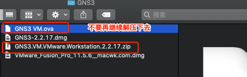
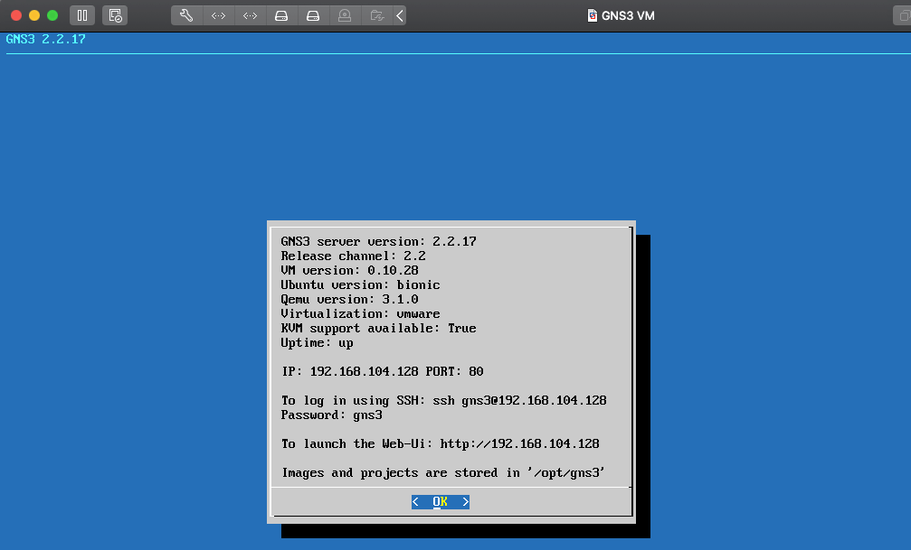

# Mac 下安装 GNS3

 

## 一、安装

### 0x01 准备工作

-  [下载 VMware Fusion](https://www.vmware.com/products/fusion/fusion-evaluation.html)

- [下载 GNS3 VM](https://gns3.com/software/download-vm)

- [下载 Mac 版 GNS3](https://gns3.com/software/download)

- [下载 Cisco 路由器 IOS 镜像](https://ccie.lol/blog/2016/07/03/cisco-ios-image-download/)

### 0x02 安装 VMware FusionGNS3 VM 

首先安装 VMware Fusion, 安装过程中若出现如下错误，需到 Mac 上的 `系统偏好设置 -> 安全性与隐私 -> 通用` 输入管理员密码统一安装。

然后重启 VMware Fusion 即可。

### 0x03 安装 GNS3 VM 

解压下载后的`GNS3.VM.VMware.Workstation.2.2.17.zip` 文件，当出现解压`GNS3 VM.ova`时，一定要取消解压

然后将 `GNS3 VM.ova` 拖拽到 VMware Fusion 中，一直下一步安装

安装完成后的界面

### 0x04 安装 GNS3

打开 GNS3，第一次的话会有下面弹窗，选中第一个。后续设置在`Help -> Setup Wizard`中打开

 

## 二、运行

 

 

 
