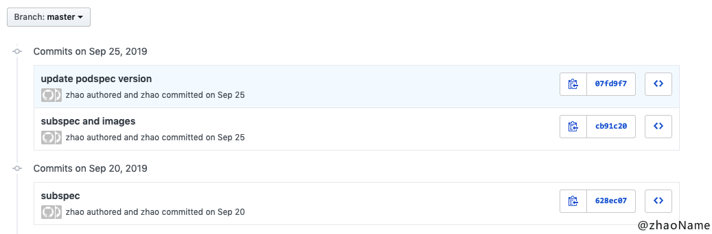
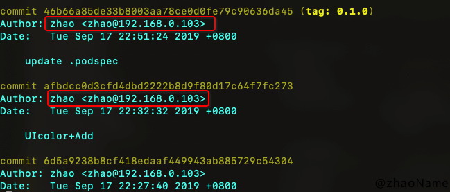
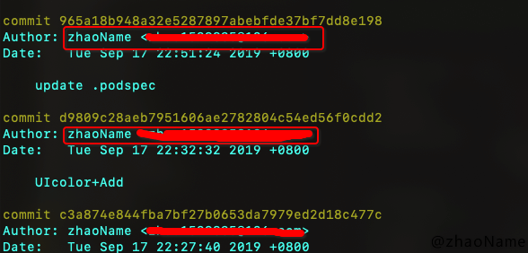
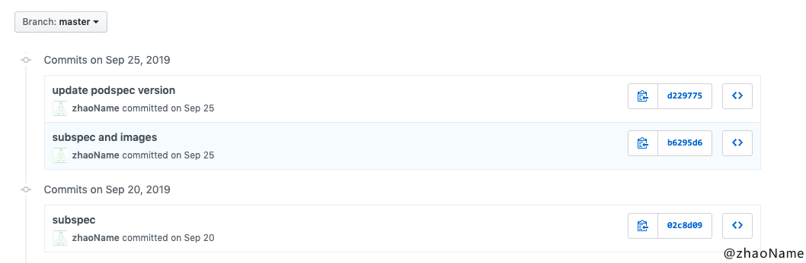
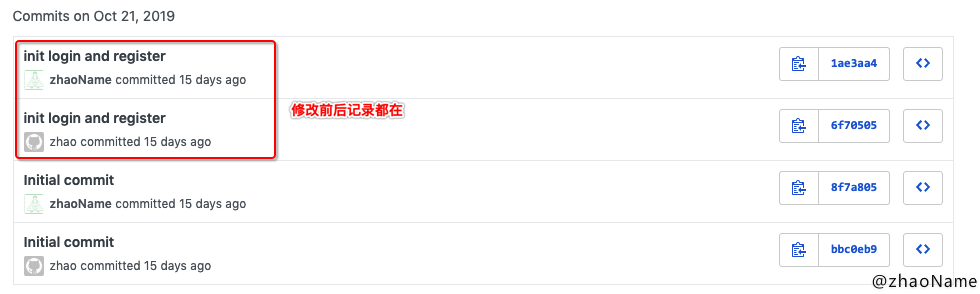

# 提交到 GitHub 不显示小绿点问题

<br>

有时会出现这样的问题：提交到 GitHub 的记录并没有小绿点显示，且 contributor 没有你。这是为啥呢？

原因是我有两个 git 账号，一个公司的 一个自己的。然后我把 git 的全局设置 user.name 和 user.email 置为空。新建项目时没有配置对应的 git 用户名和邮箱。

还有种原因是你当前电脑的 git 全局配置信息或当前项目 git 配置信息，和你的 GitHub 账号用户名、邮箱对不上。

查看当前项目 git 对用的用户名和邮箱

```
$ cd ~/Desktop/ZZBase/

# 查看当前项目的 git 配置
$ git config user.name
$ git config user.email 
```

你会看到终端上没有任何输出，这就说明你没配置。然后你提交到 GitHub 上的记录都是这样灰色的，没有显示你的 GitHub 账号对应的用户名和邮箱。



再用 git log 查看下 commit 记录,你会发现 commit 记录的用户名和邮箱是电脑默认的




<br>


上面已经讲出不显示的原因，解决办法就是我们把当前项目的 git 配置一下就可以了

```
# 配置 
$ git config user.email Your_GitHub_Email
$ git config user.name Your_GitHub_UserName 

# 查看 有输出说明配置成功
$ git config user.name         
YourGitHubUserName

$ git config user.email                      
YourGitHubEmail
```

这样你以后的 commit 贡献都会被统计为小绿点。


<br>


配置 git 能解决以后提交的问题，那我以前的 commit 咋办？以前的 commit 不修改过来对于有强迫症的人来说是种折磨...

解决办法是对以前所有的 commit 和 push 历史进行修改

```
git filter-branch -f --env-filter '
if [ "$GIT_AUTHOR_NAME" = "oldName" ]
then
export GIT_AUTHOR_NAME="newName"
export GIT_AUTHOR_EMAIL="newEmail"
fi
' HEAD
 

git filter-branch -f --env-filter '
if [ "$GIT_COMMITTER_NAME" = "oldName" ]
then
export GIT_COMMITTER_NAME="newName"
export GIT_COMMITTER_EMAIL="newEmail"
fi
' HEAD
```

将上面代码保存成一个 shell 脚本，然后在当前项目的目录下执行

```
$ ~/Desktop/change.sh

Rewrite 07fd9f7b85bb3fe8bd8e9d81d4885b45676b348e (8/8) (0 seconds passed, remaining 0 predicted)    
Ref 'refs/heads/master' was rewritten
Rewrite 1ca5e33f803af5581c78846c5305b1345c18c8db (8/8) (0 seconds passed, remaining 0 predicted)    
Ref 'refs/heads/master' was rewritten
```

然后你在去 git log 打印 commit 记录会发现用户名和邮箱已经修改过来




这样你只是把本地的 commit 记录的用户和邮箱修改过来了，但远程 GitHub 并没有修改。而且此时你有新 push 会报错

```
$ git push 

To https://github.com/zhaoName/xxx.git
 ! [rejected]        master -> master (non-fast-forward)
error: failed to push some refs to 'https://github.com/zhaoName/xxx.git'
hint: Updates were rejected because the tip of your current branch is behind
hint: its remote counterpart. Integrate the remote changes (e.g.
hint: 'git pull ...') before pushing again.
hint: See the 'Note about fast-forwards' in 'git push --help' for details.
```


**有两种解决办法**

- 强制 push

```
$ git push -u origin master -f 
```
这样会使远程修改丢失，一般是不可取的，尤其是多人协作开发的时候。适合单人开发。

修改后的效果：




- push 前先 pull

```
$ git pull origin master --allow-unrelated-historied
$ git push -u origin master
```

这样会可能导致以前的 commit 和修改之后的 commit 并存。

修改后的效果：




<br>

查看 git 全局配置信息

```
$ git config --global --list
```

取消 git 全局配置信息

```
$ git config --global --unset user.name    
$ git config --global --unset user.email 
```


<br>

[原文链接](https://www.cnblogs.com/zzhangyuhang/p/9896151.html)

<br>

写于 2019-11-05

<br>