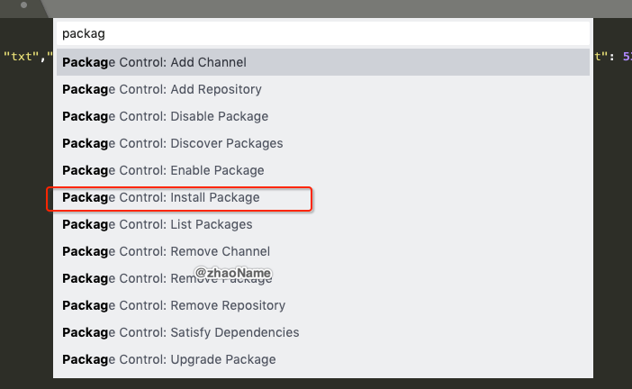
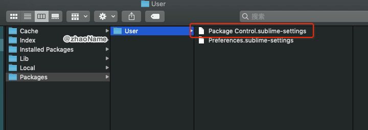
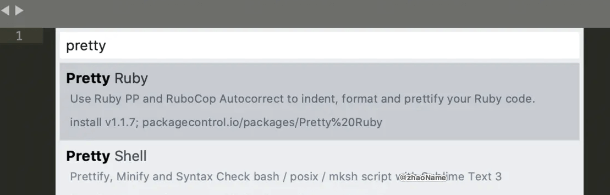

# Sublime - 支持 Json 格式化

<br>

## 一、 安装插件管理器 - Package control


### 0x01 快捷方式

可以按照[官网](https://packagecontrol.io/installation#Manual)上介绍，按住 `comand + shift + p` 打开命令搜索框输入 `package` ，选中图中条目然后按回车




安装完成后，重启 Sublime Text 3。在 `Perferences -> package settings` 中看到` package control` 这一项，则安装成功。


或者点击 `Perferences -> Browse Packages...` 打开插件目录




### 0x02 命令行安装

打开 Sublime，按 Ctrl + `  调出 console，然后在底部输入

> import urllib.request,os; pf = 'Package Control.sublime-package'; ipp = sublime.installed_packages_path(); urllib.request.install_opener( urllib.request.build_opener( urllib.request.ProxyHandler()) ); 
open(os.path.join(ipp, pf), 'wb').write(urllib.request.urlopen( 'http://sublime.wbond.net/'+ pf.replace(' ','%20')).read())

稍等一下，重启 Sublime Text 3 即可。


<br>

## 二、安装 Json 格式化插件 - Pretty Json


打开 Sublime， 按住 `comand + shift + p` 打开命令搜索框输入 `Pretty Json`。注意有的 Sublime 搜索不到


可以参考[这里](https://github.com/dzhibas/SublimePrettyJson) 手动安装：**针对 Sublime Text 3**

- `cd <Packages directory> (MacOS: ~/Library/Application\ Support/Sublime\ Text\ 3/Packages) `

- `git clone https://github.com/dzhibas/SublimePrettyJson.git "Pretty JSON" `

- `cd Pretty JSON`

- `git checkout st3`

到这你可以在 console 中看到安装过程

```
reloading settings Packages/User/Package Control.sublime-settings
reloading settings Packages/Pretty JSON/Pretty JSON.sublime-settings
unloading plugin Pretty JSON.PrettyJson
unloading plugin Pretty JSON.PrettyJsonListeners
reloading settings Packages/Pretty JSON/Pretty JSON.sublime-settings
reloading plugin Pretty JSON.PrettyJson
reloading plugin Pretty JSON.PrettyJsonListeners
```

在`Perferences->package settings` 中也能看到` Pretty Jsonl` 


<br>

### 三、 使用

- Mac： `command + ctrl + j`

- Windosw: `ctrl + alt + j`

<br>

<br>