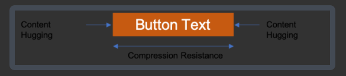
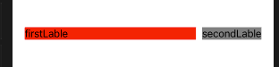
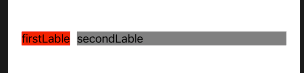
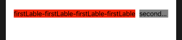
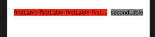
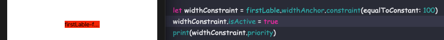
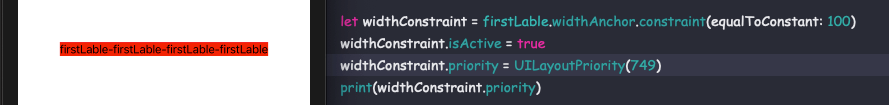

# AutoLayout - Content-Hugging & Compression-Resistance Priorities

<br>

Content-Hugging & Compression-Resistance Priorities (CHCR 优先级)定义了在使用 Auto Layout 约束控件 size 时, 相对于本身尺寸 (Intrinsic Content Size) 被拉伸或被压缩的优先级。
 
Content Hugging Priority: 直译就是内容拥抱优先级，可以理解为抗拉伸优先级，值越大，其控件越不容易被拉伸。

Compression Resistance Piority: 抗压缩优先级，值越大，其控件越不容易被压缩。




图片上只展示水平方向的优先级，Content-Hugging & Compression-Resistance Priorities 同样可以设置在垂直方向。也就是说每个控件有 4 个优先级。

每个控件的优先级 `UILayoutPriority` 都有默认值，且用 Interface Builder 和代码创建的默认值略有差别，如下：

**Interface Builder Default Priority Values:**

```
+-------------------------+---------------+------------------------------+
|         Object          | Hugging (H,V) | Compression Resistance (H,V) |
+-------------------------+---------------+------------------------------+
| UIActivityIndicatorView | 750,750       | 750,750                      |
| UIButton                | 250,250       | 750,750                      |
| UIDatePicker            | 250,250       | 750,750                      |
| UIImageView             | 251,251       | 750,750                      |
| UILabel                 | 251,251       | 750,750                      |
| UIPageControl           | 250,250       | 750,750                      |
| UIPickerView            | 250,250       | 750,750                      |
| UIProgressView          | 250,750       | 750,750                      |
| UIScrollView            | 250,250       | 750,750                      |
| UISearchBar             | 250,250       | 750,750                      |
| UISegmentedControl      | 250,250       | 750,750                      |
| UISlider                | 250,250       | 750,750                      |
| UIStepper               | 750,750       | 750,750                      |
| UISwitch                | 750,750       | 750,750                      |
| UITabBar                | 250,250       | 750,750                      |
| UITextField             | 250,250       | 750,750                      |
| UITextView              | 250,250       | 750,750                      |
| UIToolbar               | 250,250       | 750,750                      |
| UIView                  | 250,250       | 750,750                      |
+-------------------------+---------------+------------------------------+
```

**Programmatic Default Priority Values:**

```
+-------------------------+---------------+------------------------------+
|         Object          | Hugging (H,V) | Compression Resistance (H,V) |
+-------------------------+---------------+------------------------------+
| UIActivityIndicatorView | 750,750       | 750,750                      |
| UIButton                | 250,250       | 750,750                      |
| UIDatePicker            | 750,750       | 750,750                      |
| UIImageView             | 250,250       | 750,750                      |
| UILabel                 | 250,250       | 750,750                      |
| UIPageControl           | 750,750       | 750,750                      |
| UIPickerView            | 750,750       | 750,750                      |
| UIProgressView          | 250,750       | 750,750                      |
| UIScrollView            | 250,250       | 750,750                      |
| UISearchBar             | 250,750       | 750,750                      |
| UISegmentedControl      | 250,750       | 750,750                      |
| UISlider                | 250,750       | 750,750                      |
| UIStepper               | 750,750       | 750,750                      |
| UISwitch                | 750,750       | 750,750                      |
| UITabBar                | 250,750       | 750,750                      |
| UITextField             | 250,250       | 750,750                      |
| UITextView              | 250,250       | 750,750                      |
| UIToolbar               | 250,750       | 750,750                      |
| UIView                  | 250,250       | 750,750                      |
+-------------------------+---------------+------------------------------+
```

**Programmatic Constants:**

```
+----------------------------------+-------+
|             Constant             | Value |
+----------------------------------+-------+
| UILayoutPriorityRequired         |  1000 |
| UILayoutPriorityDefaultHigh      |   750 |
| UILayoutPriorityDefaultLow       |   250 |
| UILayoutPriorityFittingSizeLevel |    50 |
+----------------------------------+-------+
```
 
 
 

<br>

### 0x01 Intrinsic Content Size

继承自 `UIView` 的某些系统控件拥有 Intrinsic Content Size (控件本身的大小)。如 `UILabel` 的 Intrinsic Content Size 由其 `text` 决定，`UIButton` 的 Intrinsic Content Size 由其图片和文字决定，`UIImageView` 的 Intrinsic Content Size 由其图片的大小来决定。

以 `UILable` 为例，使用 Auto Layout 对其位置进行约束，但不设置它的 size。如下：


```Swift
private lazy var firstLable: UILabel  = {
    let view = UILabel(frame: .zero)
    view.backgroundColor = .red
    view.text = "firstLable"
    view.translatesAutoresizingMaskIntoConstraints = false
    return view
}()

private lazy var secondLable: UILabel  = {
    let view = UILabel(frame: .zero)
    view.backgroundColor = .gray
    view.text = "secondLable"
    view.translatesAutoresizingMaskIntoConstraints = false
    return view
}()


override func viewDidLoad() {
    super.viewDidLoad()
    
    self.view.addSubview(firstLable)
    NSLayoutConstraint.activate([
        firstLable.leadingAnchor.constraint(equalTo: self.view.leadingAnchor, constant: 20),
        firstLable.topAnchor.constraint(equalTo: self.view.topAnchor, constant: 200)
    ])
    
    self.view.addSubview(secondLable)
    NSLayoutConstraint.activate([
        secondLable.leadingAnchor.constraint(equalTo: self.firstLable.trailingAnchor, constant: 10),
        secondLable.centerYAnchor.constraint(equalTo: self.firstLable.centerYAnchor),
        secondLable.trailingAnchor.constraint(equalTo: self.view.trailingAnchor, constant: -20)
    ])
}
```



然后在 `touchesBegan` 中做如下打印：

```Swift
override func touchesBegan(_ touches: Set<UITouch>, with event: UIEvent?) {
    print("firstLable.intrinsicContentSize: ", firstLable.intrinsicContentSize)
    print("firstLable.frame.size: ", firstLable.frame.size)
    
    print("secondLable.intrinsicContentSize: ", secondLable.intrinsicContentSize)
    print("secondLable.frame.size: ", secondLable.frame.size)
}

// firstLable.intrinsicContentSize:  (71.0, 20.333333333333332)
// firstLable.frame.size:  (280.6666666666667, 20.333333333333332)

// secondLable.intrinsicContentSize:  (97.33333333333333, 20.333333333333332)
// secondLable.frame.size:  (97.33333333333333, 20.333333333333332)
```


<br>

### 0x02 Content Hugging Priority 

上图可知若我们设置 `firstLable` 和 `secondLable` 的约束占满屏幕宽，但两个 `UILabel` 的 Intrinsic Content Size 加在一起小于屏幕宽，则 `firstLable` 会被拉伸。那为什么 `firstLable` 会被拉伸？

我们打印下 `firstLable` 和 `secondLable` 的 Content Hugging Priority 

```Swift
print(firstLable.contentHuggingPriority(for: .horizontal)) // 250
print(secondLable.contentHuggingPriority(for: .horizontal)) // 250
```

然后我们修改 `firstLable` 的 Content Hugging Priority 为 251

```Swift
firstLable.setContentHuggingPriority(UILayoutPriority.init(251), for: .horizontal)
```

此时 `firstLable` 的 Content Hugging Priority 比 `secondLable` 的 Content Hugging Priority 大，也就是抗拉伸性要好，所以 `secondLable` 被拉伸。 



同样若我们修改 `firstLable` 的 Content Hugging Priority 为 249，那 `firstLable` 将会被拉伸。

```Swift
firstLable.setContentHuggingPriority(UILayoutPriority.init(249), for: .horizontal)
```


<br>

### 0x03 Compression Resistance Priority

还是上面的代码，将 `firstLabel` 的内容修改下

```Swift
firstLabel.text = "firstLable-firstLable-firstLable-firstLable"
```

由于两个 `label` 的 Intrinsic Content Size 加在一起大于屏幕宽，所以必定有一个 `label` 被压缩，如下：



打印两个 `label` 的 Compression Resistance Priority

```Swift
print(firstLable.contentCompressionResistancePriority(for: .horizontal)) // 750
print(secondLable.contentCompressionResistancePriority(for: .horizontal)) // 750
```

修改 `firstLable` 的 Compression Resistance Priority

```Swift
firstLable.setContentCompressionResistancePriority(UILayoutPriority.init(749), for: .horizontal)
```

这样 `firstLable` 的 Compression Resistance Priority 的值较小，所以被压缩。



<br>

### 0x04 constraint priority

约束也是有优先级的，默认是 1000

将上述的 `firstLabel` 的约束修改为如下，删除 `secondLabel`

```Swift
override func viewDidLoad() {
    super.viewDidLoad()
    
    self.view.addSubview(firstLable)
    NSLayoutConstraint.activate([
        firstLable.centerYAnchor.constraint(equalTo: self.view.centerYAnchor),
        firstLable.centerXAnchor.constraint(equalTo: self.view.centerXAnchor)
    ])
    
    let widthConstraint = firstLable.widthAnchor.constraint(equalToConstant: 100)
    widthConstraint.isActive = true
    print(widthConstraint.priority) // 1000
}
```



如上图，文字被压缩。这时因为 Compression Resistance Priority 的值(750) 小于 width constraint priority (1000)。若我们将 width constraint priority 的值修改为 749，文字将会正常显示。如下：




<br>

**Reference**

- [Auto Layout Guide](https://developer.apple.com/library/archive/documentation/UserExperience/Conceptual/AutolayoutPG/index.html#//apple_ref/doc/uid/TP40010853-CH7-SW1)

- [What are the default Auto Layout Content Hugging and Content Compression Resistance priority values?](https://stackoverflow.com/questions/36924093/what-are-the-default-auto-layout-content-hugging-and-content-compression-resista)

- [AUTO LAYOUT MAGIC: CONTENT SIZING PRIORITIES](https://krakendev.io/blog/autolayout-magic-like-harry-potter-but-real)

<br>