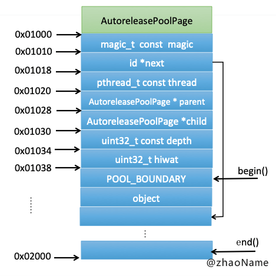
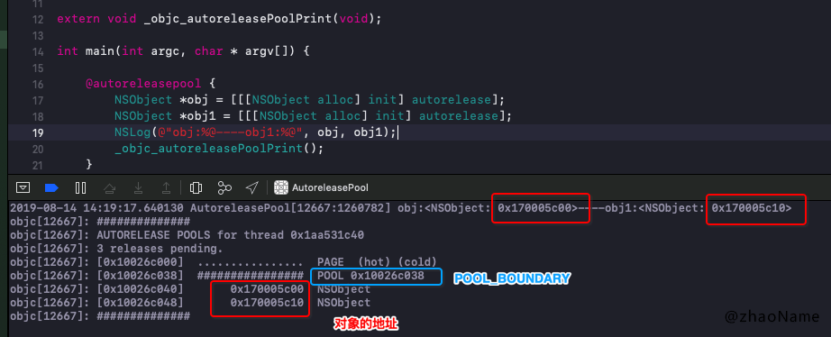
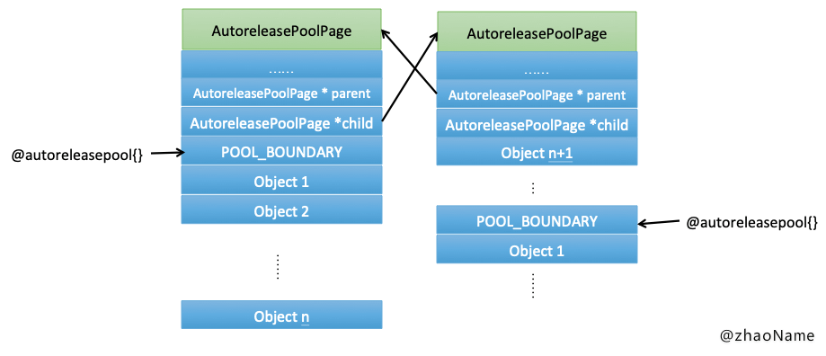
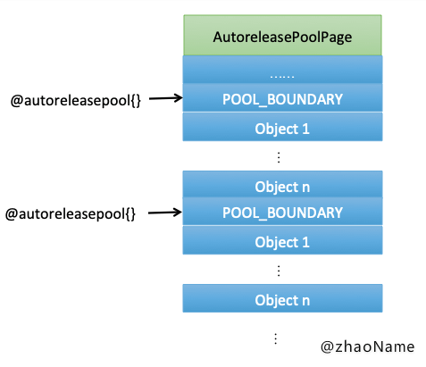
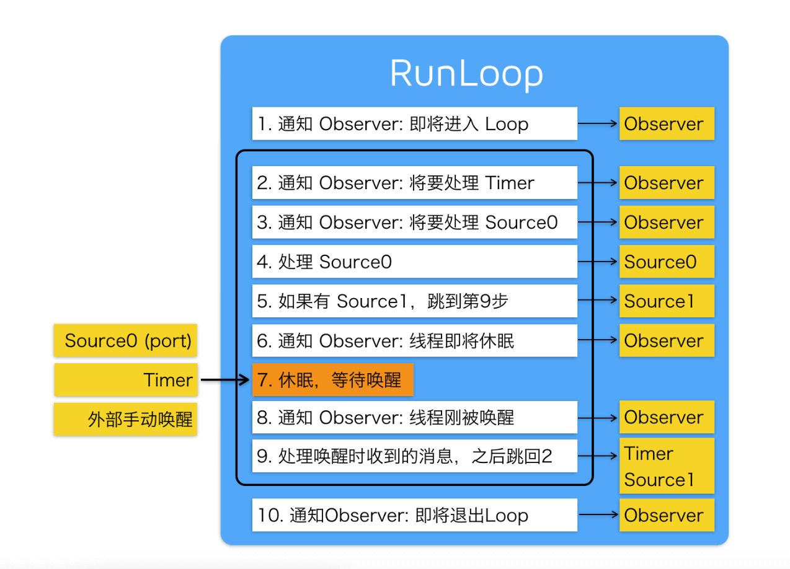

# 内存管理 - AutoreleasePool

<br>


`AutoreleasePool`(自动释放池)是 OC 中的一种内存自动回收机制，它可以延迟加入`AutoreleasePool`中的变量`release`的时机。在正常情况下，创建的变量会在超出其作用域的时候`release`，但是如果将变量加入`AutoreleasePool`，那么`release`将延迟执行。

本篇文章介绍`AutoreleasePool`的实现原理和`autorelease`的释放时机。


## 一、`__AtAutoreleasePool`

用`xcrun -sdk iphoneos clang -arch arm64 -rewrite-objc  ViewController.m`将如下代码转成 C++ 的实现。

```Objective-C
- (void)viewDidLoad {
    [super viewDidLoad];
    
    @autoreleasepool {
        NSObject *obj = [[NSObject alloc] init];
    }
}
```

C++ 代码：

```C++
static void _I_ViewController_viewDidLoad(ViewController * self, SEL _cmd)
{
    objc_msgSendSuper(self, class_getSuperclass(objc_getClass("ViewController"))}, sel_registerName("viewDidLoad"));

    {
        __AtAutoreleasePool __autoreleasepool;
        NSObject *obj = objc_msgSend(objc_msgSend(objc_getClass("NSObject"), sel_registerName("alloc")), sel_registerName("init"));
    }
}
```

对比代码，我们可以看到`@autoreleasepool{}`最终转成了`__AtAutoreleasePool `类型的结构体。

```Objective-C
struct __AtAutoreleasePool {
    // 构造函数，创建此结构体变量时调用
    __AtAutoreleasePool() {
        atautoreleasepoolobj = objc_autoreleasePoolPush();
    }
    // 析构函数，销毁结构体时调用
    ~__AtAutoreleasePool() {
        objc_autoreleasePoolPop(atautoreleasepoolobj);
    }
    void * atautoreleasepoolobj;
};
```

也就是说`@autoreleasepool { NSObject *obj = [[NSObject alloc] init]; }`最终会转成如下代码：

```Objective-C
void *atautoreleasepoolobj = objc_autoreleasePoolPush();

NSObject *obj = [[NSObject alloc] init];
    
objc_autoreleasePoolPop(atautoreleasepoolobj);
```

那我们要想搞清楚`AutoreleasePool`的底层实现，就要从`objc_autoreleasePoolPush()`和`objc_autoreleasePoolPop()`入手。这两个函数的实现在 runtime 源码中都能找到。


## 二、`AutoreleasePoolPage`


在 runtime4-750 的 NSObject.mm 中找到其实现。可以看到这两个函数其内部会调用 C++ 实现的类`AutoreleasePoolPage `中的方法。也就是说加入到 `@autoreleasepool`中的对象，都是借助`AutoreleasePoolPage `管理的。

```Objective-C
void *objc_autoreleasePoolPush(void)
{
    return AutoreleasePoolPage::push();
}

void objc_autoreleasePoolPop(void *ctxt)
{
    AutoreleasePoolPage::pop(ctxt);
}
```


### 0x01 `AutoreleasePoolPage `结构

```Objective-C
// objc4-750 NSObject.mm

#define POOL_BOUNDARY  nil

#define I386_PGBYTES   4096 
#define PAGE_SIZE      I386_PGBYTES
#define PAGE_MAX_SIZE  PAGE_SIZE

class AutoreleasePoolPage 
{
	// 对当前 AutoreleasePoolPage 完整性的校验
    magic_t const magic;
    // 指向下一个 autorelease 对象将要存放的地址
    id *next;
    // 当前 AutoreleasePoolPage 所在的线程
    pthread_t const thread;
    // 双向链表 父节点 指向前一个 Page 对象
    AutoreleasePoolPage * const parent;
    // 双向链表 子节点 指向下一个 Page 对象
    AutoreleasePoolPage *child;
    // 链表深度 节点个数
    uint32_t const depth;
    // high water mark 数据容纳的一个上限
    uint32_t hiwat;
}
```

`AutoreleasePool`没有单独的结构，是通过一个或多个`AutoreleasePoolPage `类以双向链表的形式组合而成的栈结构。


每个`AutoreleasePoolPage`对象占用 4096 字节内存，除了用来存放它内部的成员变量，剩下的空间以压栈的方式存放`autorelease`对象的地址。指针`parent` 和指针`child` 使用于双向链表的指针。



指针`next`指向下一个`autorelease`对象将要存放的地址。如果`next `指向的地址加入一个 `object`，它就会移动到下一个为空的内存地址中。

`begin()` 和 `end()`这两个函数会帮助我们快速获取`0x01038 ~ 0x02000`这一范围的边界地址。

### 0x02 `POOL_BOUNDARY`


`POOL_BOUNDARY `其实是`nil`的宏定义，用于标记每个`@autoreleasepool{}`的边界。

由上面知道每次初始化自动释放池`@autoreleasepool{}`，会调用构造方法`objc_autoreleasePoolPush()`，在这时会先把`POOL_BOUNDARY `压入栈，然后再将对象依次压入栈。



而当自动释放池销毁时会调用析构函数`objc_autoreleasePoolPop()`，这时会向自动释放池中的对象发送`release`消息，直到遇到`POOL_BOUNDARY `，这时说明此自动释放池中的对象已释放完毕。

4096 个字节除了用来存放它内部的成员变量，若剩下的内存空间不够存储一个自动释放池`@autoreleasepool{}`中的`autorelease`对象，则会新创建一个`AutoreleasePoolPage `对象，构成双向链表，在新的`AutoreleasePoolPage `对象中继续存储。

```Objective-C
extern void _objc_autoreleasePoolPrint(void);

int main(int argc, const char * argv[]) {
    @autoreleasepool {
        for (int i=0; i<600; i++) {
            NSObject *obj3 = [[[NSObject alloc] init] autorelease];
        }
        @autoreleasepool {
            NSObject *obj1 = [[[NSObject alloc] init] autorelease];
            NSObject *obj2 = [[[NSObject alloc] init] autorelease];
            _objc_autoreleasePoolPrint();
        }
    }
    return 0;
}

// 打印结果
objc[28420]: ##############
objc[28420]: AUTORELEASE POOLS for thread 0x1000a95c0
objc[28420]: 604 releases pending.
objc[28420]: [0x102006000]  ................  PAGE (full)  (cold)
objc[28420]: [0x102006038]  ################  POOL 0x102006038
objc[28420]: [0x102006040]       0x100603840  NSObject
objc[28420]: [0x102006048]       0x10060c240  NSObject
...
objc[28037]: [0x103002000]  ................  PAGE  (hot) 
objc[28037]: [0x103002038]       0x1005548b0  NSObject
...
objc[28420]: [0x101007338]  ################  POOL 0x101007338
objc[28420]: [0x101007340]       0x10062b3b0  NSObject
objc[28420]: [0x101007348]       0x10062b3c0  NSObject
```



若剩下的内存空间足够存储一个自动释放池`@autoreleasepool{}`中的`autorelease`对象，则存储下一个自动释放池`@autoreleasepool{}`中的`autorelease`对象不会创建新的`AutoreleasePoolPage `对象。

```Objective-C
int main(int argc, const char * argv[]) {
    @autoreleasepool {
        NSObject *obj3 = [[[NSObject alloc] init] autorelease];
        @autoreleasepool {
            NSObject *obj1 = [[[NSObject alloc] init] autorelease];
            NSObject *obj2 = [[[NSObject alloc] init] autorelease];
            
            @autoreleasepool {
                NSObject *obj4 = [[[NSObject alloc] init] autorelease];
                _objc_autoreleasePoolPrint();
            }
        }
    }
    return 0;
}

// 打印结果
objc[28465]: ##############
objc[28465]: AUTORELEASE POOLS for thread 0x1000a95c0
objc[28465]: 7 releases pending.
objc[28465]: [0x100801000]  ................  PAGE  (hot) (cold)
objc[28465]: [0x100801038]  ################  POOL 0x100801038
objc[28465]: [0x100801040]       0x100544240  NSObject
objc[28465]: [0x100801048]  ################  POOL 0x100801048
objc[28465]: [0x100801050]       0x10053a280  NSObject
objc[28465]: [0x100801058]       0x100544660  NSObject
objc[28465]: [0x100801060]  ################  POOL 0x100801060
objc[28465]: [0x100801068]       0x100544050  NSObject
objc[28465]: ##############
```




## 三、`AutoreleasePoolPage::push()`


### 0x01 push()

```Objective-C
static inline void *push()
{
    id *dest;
    if (DebugPoolAllocation) {
        // Each autorelease pool starts on a new pool page.
        dest = autoreleaseNewPage(POOL_BOUNDARY);
    } else {
        // 调用 objc_autoreleasePoolPush() 传入 POOL_BOUNDARY 当边界
        dest = autoreleaseFast(POOL_BOUNDARY);
    }
    assert(dest == EMPTY_POOL_PLACEHOLDER || *dest == POOL_BOUNDARY);
    return dest;
}

static inline id *autoreleaseFast(id obj)
{
    // hotPage 可以理解为当前正在使用的 AutoreleasePoolPage
    AutoreleasePoolPage *page = hotPage();
    if (page && !page->full()) {
        // 若 hotPage 存在且 hotPage 不满，则将 obj 压入 AutoreleasePoolPage 的栈中
        return page->add(obj);
    } else if (page) {
        // 若 hotPage 存在且 hotPage 已满，则新创建一个 AutoreleasePoolPage
        // 再调用 page->add(obj) 将 obj 压入 AutoreleasePoolPage 的栈中
        return autoreleaseFullPage(obj, page);
    } else {
        // 若 hotPage 不存在，则新创建一个 AutoreleasePoolPage
        // 再调用 page->add(obj) 将 obj 压入 AutoreleasePoolPage 的栈中
        return autoreleaseNoPage(obj);
    }
}
```

### 0x02 `autoreleaseFullPage()`

```Objective-C
static __attribute__((noinline)) id *autoreleaseFullPage(id obj, AutoreleasePoolPage *page)
{
    // The hot page is full. 
    // Step to the next non-full page, adding a new page if necessary.
    // Then add the object to that page.
    assert(page == hotPage());
    assert(page->full()  ||  DebugPoolAllocation);
    
    // 从传入的 page 开始遍历双向链表，查找未满的 AutoreleasePoolPage
    do {
        // 若有子节点 将取子节点 AutoreleasePoolPage
        if (page->child) page = page->child;
        // 否则创建新的 AutoreleasePoolPage
        else page = new AutoreleasePoolPage(page);
    } while (page->full());
    
    // 将新建或已有未满的 AutoreleasePoolPage 设置为 hotPage
    setHotPage(page);
    // 将 obj 压入 AutoreleasePoolPage 的栈中
    return page->add(obj);
}
```

### 0x03 `autoreleaseNoPage()`

```Objective-C
static __attribute__((noinline)) id *autoreleaseNoPage(id obj)
{
    // "No page" could mean no pool has been pushed
    // or an empty placeholder pool has been pushed and has no contents yet
    assert(!hotPage());

    bool pushExtraBoundary = false;
    if (haveEmptyPoolPlaceholder()) {
        // We are pushing a second pool over the empty placeholder pool
        // or pushing the first object into the empty placeholder pool.
        // Before doing that, push a pool boundary on behalf of the pool 
        // that is currently represented by the empty placeholder.
        pushExtraBoundary = true;
    }
    else if (obj != POOL_BOUNDARY  &&  DebugMissingPools) {
        // We are pushing an object with no pool in place, 
        // and no-pool debugging was requested by environment.
        _objc_inform("MISSING POOLS: (%p) Object %p of class %s "
                     "autoreleased with no pool in place - "
                     "just leaking - break on "
                     "objc_autoreleaseNoPool() to debug", 
                     pthread_self(), (void*)obj, object_getClassName(obj));
        objc_autoreleaseNoPool(obj);
        return nil;
    }
    else if (obj == POOL_BOUNDARY  &&  !DebugPoolAllocation) {
        // We are pushing a pool with no pool in place,
        // and alloc-per-pool debugging was not requested.
        // Install and return the empty pool placeholder.
        return setEmptyPoolPlaceholder();
    }

    // We are pushing an object or a non-placeholder'd pool.

    // Install the first page.
    //
    AutoreleasePoolPage *page = new AutoreleasePoolPage(nil);
    // 将 page 设置为 hotPage
    setHotPage(page);
    
    // Push a boundary on behalf of the previously-placeholder'd pool.
    if (pushExtraBoundary) {
        page->add(POOL_BOUNDARY);
    }
    
    // Push the requested object or pool.
    return page->add(obj);
}
```


## 四、`AutoreleasePoolPage::pop()`

### 0x01 `pop()`

```Objective-C
static inline void pop(void *token) 
{
    AutoreleasePoolPage *page;
    id *stop;

    if (token == (void*)EMPTY_POOL_PLACEHOLDER) {
        // Popping the top-level placeholder pool.
        if (hotPage()) {
            // Pool was used. Pop its contents normally.
            // Pool pages remain allocated for re-use as usual.
            pop(coldPage()->begin());
        } else {
            // Pool was never used. Clear the placeholder.
            setHotPage(nil);
        }
        return;
    }
    // 由 token 获取page
    page = pageForPointer(token);
    stop = (id *)token;
    if (*stop != POOL_BOUNDARY) {
        if (stop == page->begin()  &&  !page->parent) {
            // Start of coldest page may correctly not be POOL_BOUNDARY:
            // 1. top-level pool is popped, leaving the cold page in place
            // 2. an object is autoreleased with no pool
        } else {
            // Error. For bincompat purposes this is not 
            // fatal in executables built with old SDKs.
            return badPop(token);
        }
    }

    if (PrintPoolHiwat) printHiwat();
    // 释放 page 中的对象
    page->releaseUntil(stop);

    // memory: delete empty children
    if (DebugPoolAllocation  &&  page->empty()) {
        // special case: delete everything during page-per-pool debugging
        // 若 page 为空，则删除此 page 及其子节点的全部数据,并把父节点设为 hotPage
        AutoreleasePoolPage *parent = page->parent;
        page->kill();
        setHotPage(parent);
    } else if (DebugMissingPools  &&  page->empty()  &&  !page->parent) {
        // special case: delete everything for pop(top) 
        // when debugging missing autorelease pools
        // 若 page 为空且无父节点，则删除此 page 及其子节点的全部数据
        page->kill();
        setHotPage(nil);
    } 
    else if (page->child) {
        // hysteresis: keep one empty child if page is more than half full
        if (page->lessThanHalfFull()) {
            page->child->kill();
        }
        else if (page->child->child) {
            page->child->child->kill();
        }
    }
}
```

该方法主要干了三件事：

- 调用`pageForPointer()`函数，获取当前`token`所在的`AutoreleasePoolPage `

- 调用`releaseUntil()`函数，释放当前`AutoreleasePoolPage `栈中的对象，直到`stop`

- 调用`kill()`函数销毁当前`AutoreleasePoolPage `或销毁`child`。


### 0x02 `pageForPointer()`

```Objective-C
 static AutoreleasePoolPage *pageForPointer(const void *p) 
{
    return pageForPointer((uintptr_t)p);
}

static AutoreleasePoolPage *pageForPointer(uintptr_t p) 
{
    AutoreleasePoolPage *result;
    // 对4096取模 获取偏移量
    uintptr_t offset = p % SIZE;

    assert(offset >= sizeof(AutoreleasePoolPage));
    result = (AutoreleasePoolPage *)(p - offset);
    // 检查当前的 result 是不是一个 AutoreleasePoolPage
    result->fastcheck();

    return result;
}
```

将指针与页面的大小，也就是 4096 取模，得到当前指针的偏移量，因为所有的 AutoreleasePoolPage 在内存中都是对齐的：

```
p = 0x100816048
p % SIZE = 0x48
result = 0x100816000
```


### 0x03 `releaseUntil()`


```Objective-C
void releaseUntil(id *stop) 
{
    while (this->next != stop) {
        // Restart from hotPage() every time, in case -release 
        // autoreleased more objects
        AutoreleasePoolPage *page = hotPage();
        
        // 若当前 page 已释放完毕,但还没到 stop，则将其父节点设置为当前 page,继续释放
        while (page->empty()) {
            page = page->parent;
            setHotPage(page);
        }

        page->unprotect();
        // 取出对象
        id obj = *--page->next;
        // 将 page->next 所在内存设置为 0xA3
        memset((void*)page->next, SCRIBBLE, sizeof(*page->next));
        page->protect();

        if (obj != POOL_BOUNDARY) {
            // 释放对象
            objc_release(obj);
        }
    }
    setHotPage(this);
}
```


### 0x04 `kill()`

```Objective-C
void kill() 
{
    AutoreleasePoolPage *page = this;
    // 遍历查找最深层次 child
    while (page->child) page = page->child;

    AutoreleasePoolPage *deathptr;
    do {
        deathptr = page;
        page = page->parent;
        if (page) {
            // 将子节点置为 nil,
            page->unprotect();
            page->child = nil;
            page->protect();
        }
        // 销毁子节点
        delete deathptr;
    } while (deathptr != this);
}
```

`kill()`会将当前页面以及子页面全部删除。


## 五、`autorelease`


OC 对象调用`autorelease` 方法就会将对象加入到自动释放池中。我们来看看`autorelease` 的内部实现。

```Objective-C
// objc4-750 

NSObject.mm
- (id)autorelease {
    return ((id)self)->rootAutorelease();
}

// objc-object.h
inline id objc_object::rootAutorelease()
{
    if (isTaggedPointer()) return (id)this;
    if (prepareOptimizedReturn(ReturnAtPlus1)) return (id)this;

    return rootAutorelease2();
}

// NSObject.mm
__attribute__((noinline,used)) id objc_object::rootAutorelease2()
{
    assert(!isTaggedPointer());
    // this 指调用 autorelease 的对象
    return AutoreleasePoolPage::autorelease((id)this);
}

// NSObject.mm
static inline id autorelease(id obj)
{
    assert(obj);
    assert(!obj->isTaggedPointer());
    id *dest __unused = autoreleaseFast(obj);
    assert(!dest  ||  dest == EMPTY_POOL_PLACEHOLDER  ||  *dest == obj);
    return obj;
}

// NSObject.mm
static inline id *autoreleaseFast(id obj)
{
    // hotPage 可以理解为当前正在使用的 AutoreleasePoolPage
    AutoreleasePoolPage *page = hotPage();
    if (page && !page->full()) {
        // 若 hotPage 存在且 hotPage 不满，则将 obj 压入 AutoreleasePoolPage 的栈中
        return page->add(obj);
    } else if (page) {
        // 若 hotPage 存在且 hotPage 已满，则新创建一个 AutoreleasePoolPage
        // 再调用 page->add(obj) 将 obj 压入 AutoreleasePoolPage 的栈中
        return autoreleaseFullPage(obj, page);
    } else {
        // 若 hotPage 不存在，则新创建一个 AutoreleasePoolPage
        // 再调用 page->add(obj) 将 obj 压入 AutoreleasePoolPage 的栈中
        return autoreleaseNoPage(obj);
    }
}
```

OC 对象调用`autorelease`方法，最终会调用`autoreleaseFast()`函数，将对象加入到自动释放池中。


## 六、 `autorelease`对象在什么时机会被调用`release`


### 0x01 `@autoreleasepool`

```Objective-C
- (void)viewDidLoad {
    [super viewDidLoad];
    
    NSLog(@"1111");
    @autoreleasepool {
        ZNPerson *per = [[[ZNPerson alloc] init] autorelease];
    }
    NSLog(@"22222");
}

// 打印结果
2019-08-15 15:34:12.410255+0800 AutoreleasePool[39362:716481] 1111
2019-08-15 15:34:12.410489+0800 AutoreleasePool[39362:716481] -[ZNPerson dealloc]
2019-08-15 15:34:12.410611+0800 AutoreleasePool[39362:716481] 22222
```

可以看到加入到`@autoreleasepool`中的`autorelease`对象，会在调用`objc_autoreleasePoolPop `时调用`release`方法，释放对象。


### 0x02 对象直接调用`autorelease `

```Objective-C
- (void)viewDidLoad {
    [super viewDidLoad];
    
    NSLog(@"1111");
    ZNPerson *per = [[[ZNPerson alloc] init] autorelease];
    NSLog(@"22222");
}

- (void)viewWillAppear:(BOOL)animated
{
    [super viewWillAppear:animated];
    
    NSLog(@"%s", __func__);
}

- (void)viewDidAppear:(BOOL)animated
{
    [super viewDidAppear:animated];
    
    NSLog(@"%s", __func__);
}

// 打印结果
2019-08-15 17:29:28.898374+0800 AutoreleasePool[50485:807839] 1111
2019-08-15 17:29:28.898658+0800 AutoreleasePool[50485:807839] 22222
2019-08-15 17:29:28.899450+0800 AutoreleasePool[50485:807839] -[ViewController viewWillAppear:]
2019-08-15 17:29:28.905052+0800 AutoreleasePool[50485:807839] -[ZNPerson dealloc]
2019-08-15 17:29:28.925806+0800 AutoreleasePool[50485:807839] -[ViewController viewDidAppear:]
```

可以看到对象直接调用`autorelease `方法，对象的释放是在`viewWillAppear:`后，而不是在`viewDidLoad `执行结束。这是为什么呢 ？

这就和`RunLoop`有关了，iOS 在主线程的`Runloop`中注册了 2 个`Observer`。用于监听和自动释放池相关的事件。

```Objective-C
"<CFRunLoopObserver 0x6000001c45a0 [0x1058e0ae8]>{activities = 0x1, callout = _wrapRunLoopWithAutoreleasePoolHandler (0x1083db87d) ...}}"

"<CFRunLoopObserver 0x6000001c4640 [0x1058e0ae8]>{activities = 0xa0,callout = _wrapRunLoopWithAutoreleasePoolHandler (0x1083db87d) ...)}}"
```

再结合`CFRunLoopActivity `的值

```Objective-C
typedef CF_OPTIONS(CFOptionFlags, CFRunLoopActivity) {
    kCFRunLoopEntry = (1UL << 0),  // 1
    kCFRunLoopBeforeTimers = (1UL << 1), // 2
    kCFRunLoopBeforeSources = (1UL << 2), // 4
    kCFRunLoopBeforeWaiting = (1UL << 5), // 32
    kCFRunLoopAfterWaiting = (1UL << 6),  // 64
    kCFRunLoopExit = (1UL << 7), // 128
    kCFRunLoopAllActivities = 0x0FFFFFFFU
};
```

可知第一个 Observer 监听的是`kCFRunLoopEntry `事件，会调用`objc_autoreleasePoolPush()`

第二个 Observer 监听两个事件

- `kCFRunLoopBeforeWaiting`事件，会调用`objc_autoreleasePoolPop()`、`objc_autoreleasePoolPush()`

- `kCFRunLoopBeforeExit`事件，会调用`objc_autoreleasePoolPop()`





当启动 RunLoop 时，也就是`kCFRunLoopEntry`即将进入 RunLoop，会调用`objc_autoreleasePoolPush()`方法，初始化`AutoreleasePoolPage `对象。

当 RunLoop 即将进入休眠时(`kCFRunLoopBeforeWaiting`)，先调用`objc_autoreleasePoolPop()`，将步骤 2 3 4 5 中的 `autorelease`对象释放掉，再调用`objc_autoreleasePoolPush()`，初始化新的`AutoreleasePoolPage `对象。

若 RunLoop 没有被退出，会由步骤 9 跳转到步骤 2，然后再走到步骤6，即将进入休眠状态(`kCFRunLoopBeforeWaiting`)。此时依然先调用`objc_autoreleasePoolPop()`，将`autorelease`对象释放掉。再调用`objc_autoreleasePoolPush()`，初始化新的`AutoreleasePoolPage `对象。依次循环下去。

若 RunLoop 即将退出(`kCFRunLoopBeforeExit`)，会调用`objc_autoreleasePoolPop()`，释放调 8 9 中的`autorelease`对象。


这样`push`和`pop`一直都是成对出现，不会出现自动释放池中对象没有被释放的情况。

<br>

**参考：**

- [自动释放池的前世今生 ---- 深入解析 autoreleasepool](https://draveness.me/autoreleasepool)

- [深入理解 RunLoop](https://blog.ibireme.com/2015/05/18/runloop/)

<br>

写于2019-08-13   完成于2019-08-15

<br>