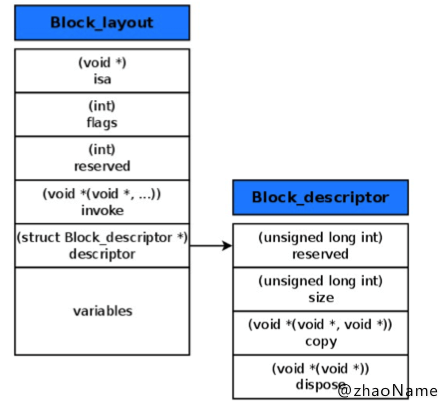
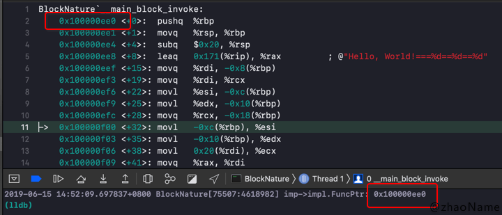
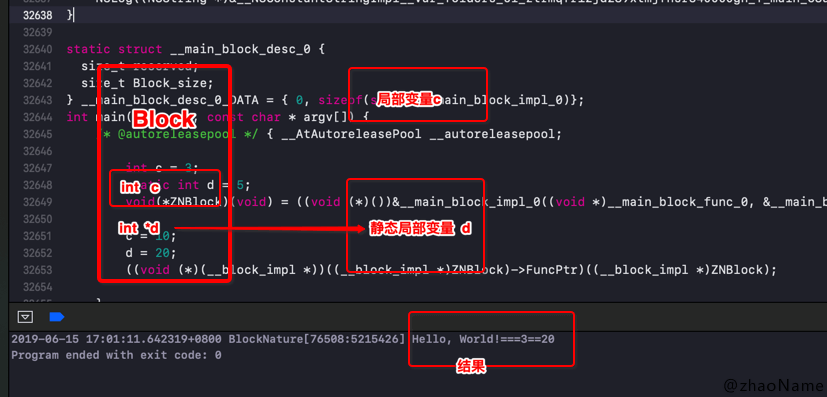
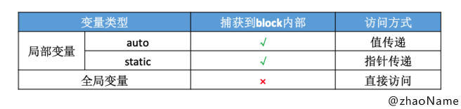
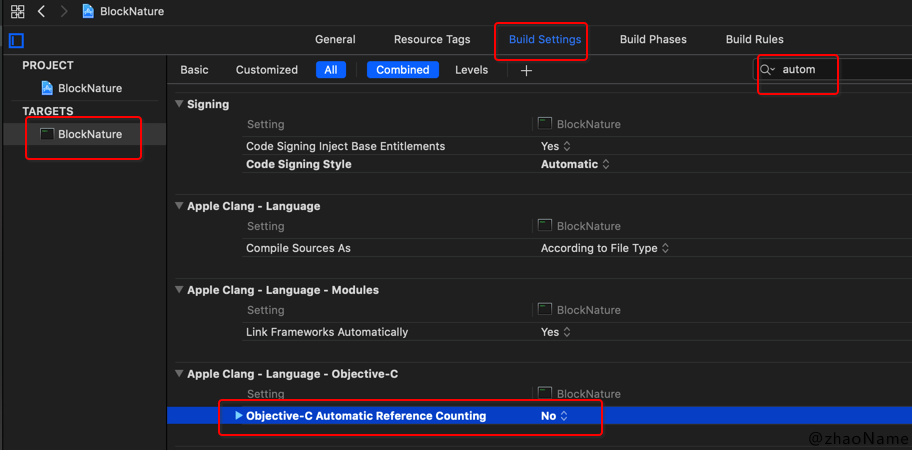
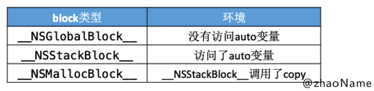
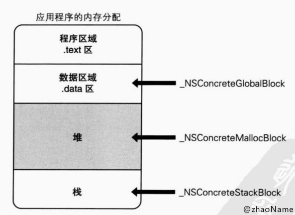
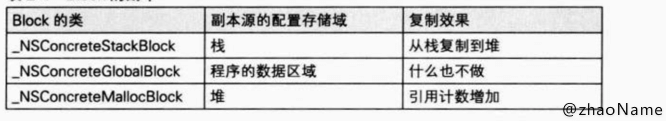

# Block 本质（一）

<br>

`OC`中常用到`Block`地方有反向传值、`GCD`、链式编程等。但这仅仅是使用，本篇文章主要介绍`Block`的底层结构。


## 一、本质

### 0x01 什么是`Block`

`Block`是 C 语言的扩充功能，简单来说是**带自动变量的匿名函数**。

- 匿名函数

顾名思义就是不带有名称的函数，C 语言的标准不允许存在这样的函数。如下 C 语言中函数调用

```Objective-C
// 声明一个名称为func的函数
int func(int a);

// 想要调用该函数 必须使用函数的名称
int result = func(10);
```

若使用函数指针来调用函数，似乎不知道函数名也能调用

```Objective-C
int result = (*funcPtr)(10);
```

但事实上使用函数指针时也要知道函数名是什么，否则`*funcPtr`从哪来呢！

```Objective-C
int (*funcPtr)(int) = &func;

int result = (*funcPtr)(10)
```

- 自动变量

静态变量或全局变量都存在数据段，只有一份，也就是说他的值不变（可赋值）。

以 多按钮点击事件 为例

```Objective-C
// 按钮的id
int buttonId = 0;

void buttonCallBack(int event)
{
    printf("buttonId = %d, event = %d\n", buttonId, event);
}

void setButtonCallBack(int a, void (*funcPtr)(int))
{
    funcPtr(a);
}

void setButtonCallBacks()
{
    for (int i=0; i<10; i++) {
        buttonId = i;
        setButtonCallBack(10+i, &buttonCallBack);
    }
}
```

最后所有按钮的`buttonId`的值都是`for`循环之后的值。

`C++`和`OC`使用类可保持变量值且能够多次持有该变量自身。它会声明一个持有成员变量的类，有类的实例对象持有该成员变量的值。

```Objective-C
@interface ButtonCallBack : NSObject
{
    int _buttonId;
}
@end

@implementation ButtonCallBack

- (instancetype)initWithButtonId:(int)buttonId
{
    if ([super init]) {
        _buttonId = buttonId;
    }
    return self
}

- (void)callBack:(int)event
{
    printf("buttonId = %d, event = %d\n", _buttonId, event);
}
@end

// 多按钮事件
void setButtonCallBacks()
{
    for (int i=0; i<10; i++) {
        ButtonCallBack *call = [[ButtonCallBack alloc] initWithButtonId:i];
        setButtonCallBackUsingObject(10+i, call);
    }
}
```

但声明并实现`C++`和`OC`的类增加了代码长度，可以使用`Block`,其代码量和 C 语言差不多。

```Objective-C
void setButtonCallBacks()
{
    for (int i=0; i<10; i++) {
        setButtonCallBackUsingObject(10+i, ^(int event) {
            printf("buttonId = %d, event = %d\n", _buttonId, event);
        });
    }
}
```

**自动变量可以理解为`Block`有类的功能，他可以有成员变量并能持有成员变量的值。**


### 0x02 底层结构


创建一个命令行工程，自己定义一个`ZNBlock`

```Objective-C
// main.m

int c = 3;
void(^ZNBlock)(int a, int b) = ^(int a, int b){
    NSLog(@"Hello, World!===%d==%d==%d", a, b, c);
};
ZNBlock(1, 2);
```

将其用命令转换成`C++`代码 -- `main.cpp`

```Objective-C
$ xcrun -sdk iphoneos clang -arch arm64 -rewrite-objc -fobjc-arc -fobjc-runtime=ios-8.0.0 main.m
```

转换后的格式大致如下

```Objective-C
struct __block_impl {
    void *isa;
    int Flags;
    int Reserved;
    // block封装函数的地址
    void *FuncPtr;
};

// block底层结构
struct __main_block_impl_0 {
    struct __block_impl impl;
    struct __main_block_desc_0* Desc;
    int c;
    // C++ 中的构造函数(类似 OC 中的 init 方法) 返回结构体对象
    __main_block_impl_0(void *fp, struct __main_block_desc_0 *desc, int _c, int flags=0) : c(_c) {
        impl.isa = &_NSConcreteStackBlock;
        impl.Flags = flags;
        impl.FuncPtr = fp;
        Desc = desc;
    }
};

// 封装了 block 执行逻辑的函数
static void __main_block_func_0(struct __main_block_impl_0 *__cself, int a, int b)
{
    int c = __cself->c; // bound by copy
    NSLog((NSString *)&__NSConstantStringImpl__var_folders_cl_ztrmqfr12jd289xtmjfhsr340000gn_T_main_2bed1b_mi_0, a, b, c);
}

static struct __main_block_desc_0 {
  size_t reserved;
  // 结构体的所占用内存大小
  size_t Block_size;
} __main_block_desc_0_DATA = { 0, sizeof(struct __main_block_impl_0)};

int main(int argc, const char * argv[]) {
    /* @autoreleasepool */ 
    { __AtAutoreleasePool __autoreleasepool;
        int c = 3;
        // 定义 block
        void(*ZNBlock)(int a, int b) = ((void (*)(int, int))&__main_block_impl_0((void *)__main_block_func_0, &__main_block_desc_0_DATA, c));
        // 调用 block 即执行 block 内部代码
        ((void (*)(__block_impl *, int, int))((__block_impl *)ZNBlock)->FuncPtr)((__block_impl *)ZNBlock, 1, 2);
    }
    return 0;
}
```



可以看到`Block`的底层结构是个`struct __main_block_impl_0`结构体类型。转换后的源代码一并写入了构造函数，所以看起来有点复杂。简化后如下

```Objective-C
struct __main_block_impl_0 {
    struct __block_impl impl;
    struct __main_block_desc_0* Desc;
    // 捕获的外部变量
    int c;
}
```

- 调用构造函数

构造函数的调用也就是`Block`的定义

```Objective-C
void(*ZNBlock)(int a, int b) = ((void (*)(int, int))&__main_block_impl_0((void *)__main_block_func_0, &__main_block_desc_0_DATA, c));
```

里面有很多内容的强制装换，所以看起来很复杂。我们可以将强制转换去掉

```Objective-C
// 构造函数返回的结构体对象
struct __main_block_impl_0 tmp = __main_block_impl_0(__main_block_func_0, &__main_block_desc_0_DATA, c);

// 有点像前面说的匿名函数了
struct __main_block_impl_0 *ZNBlock = &tmp;
```

源代码中将`struct __main_block_impl_0 `强制转换成`void(*ZNBlock)(int a, int b)`类型，即指向构造函数地址的指针`ZNBlock `，也就相当于匿名函数。

第一个参数`__main_block_func_0 `就是封装了`block `执行逻辑的函数，将会赋值给`__block_impl `结构体中的`void * FuncPtr `。这点可以证明：将`ZNBlock`转换成`struct __main_block_impl_0 *`类型，并打印`FuncPtr`的地址

```
struct __main_block_impl_0 *imp = (__bridge struct __main_block_impl_0 *)ZNBlock;

NSLog(@"imp->impl.FuncPtr: %p", imp->impl.FuncPtr);
```

然后将断点下在`ZNBlock`函数内，然后将`Xcode `调成断点汇编模式`Debug -> Debug Workflow -> Always Show Disassembly` 可以看到函数起始地址和`FuncPtr`地址一致。




第二个参数是`Block`的描述信息，会将其指针赋值给`struct __main_block_desc_0* Desc`。那构造函数调用结果如下

```C
isa = &_NSConcreteStackBlock;
Flags = flags;
Reserved = 0;
FuncPtr = __main_block_func_0;
Desc = &__main_block_desc_0_DATA;
```

- `Block`调用，即执行`Block`内部代码

```
((void (*)(__block_impl *, int, int))((__block_impl *)ZNBlock)->FuncPtr)((__block_impl *)ZNBlock, 1, 2);
```

去掉强制转换，简化如下

```Objective-C
// 由Block 的定义(调用构造函数)可知，封装 Block 内部的函数的结构体会复制给 FuncPtr
// 那去掉强制转换后 代码如下
ZNBlock->impl.FuncPtr(ZNBlock, 1, 2);
```

- 实质

`struct __main_block_impl_0 `结构体相当于基于`objc_object`结构体的`OC`类对象的结构体。在`__block_impl`结构体中也有`isa`指针，其初始化如下

```Objective-C
isa = &_NSConcreteStackBlock
```

将`Block`作为`OC`对象处理时，该类的信息存储在`_NSConcreteStackBlock `中。

**所以`Block`的实质是一个`OC`对象。**

<br>

## 二、捕获基本数据类型变量

### 0x01 局部变量

有一道很经典的面试题，问打印出来的局部变量`c`的值是多少？答案大家应该都知道是3，现在来解释下为啥是3。

```Objective-C
int c = 3;
void(^ZNBlock)(void) = ^(void){
    NSLog(@"Hello, World!===%d", c);
};
    
c = 10;
ZNBlock();
```

在用命令把上面代码转成`C++`代码, 下面展示部分代码

```Objective-C
struct __main_block_impl_0 {
    struct __block_impl impl;
    struct __main_block_desc_0* Desc;
    int c;
    // C++ 语法： c(_c)的意思是会自动将 _c 赋值给 c
    __main_block_impl_0(void *fp, struct __main_block_desc_0 *desc, int _c, int flags=0) : c(_c) {
        impl.isa = &_NSConcreteStackBlock;
        impl.Flags = flags;
        impl.FuncPtr = fp;
        Desc = desc;
    }
};

static void __main_block_func_0(struct __main_block_impl_0 *__cself)
{
    // 实际 block 中打印的变量 c 是 block 内部的变量 c 不是局部变量 c
    int c = __cself->c; // bound by copy
    NSLog((NSString *)&__NSConstantStringImpl__var_folders_cl_ztrmqfr12jd289xtmjfhsr340000gn_T_main_104428_mi_0, c);
}

int main(int argc, const char * argv[]) {
    /* @autoreleasepool */ { __AtAutoreleasePool __autoreleasepool; 

        int c = 3;
        // 将局部变量 c 的值通过构造函数传进 block 内部
        void(*ZNBlock)(void) = ((void (*)())&__main_block_impl_0((void *)__main_block_func_0, &__main_block_desc_0_DATA, c));

        c = 10;
        // 在执行 block 内部函数时，虽然局部变量 c 的值已经变成10，但 block 内部变量 c 的值还是3
        ((void (*)(__block_impl *))((__block_impl *)ZNBlock)->FuncPtr)((__block_impl *)ZNBlock);

    }
    return 0
}
```

从源代码中可以看出当`Block `内访问外部的局部变量时， 会在`Block`底层结构`struct __main_block_impl_0 `结构体中声明一个一样的变量`c`，调用构造函数时（定义`Block `），会将外部局部变量`c`的值赋值给`Block `内部的变量`c`。

所以在执行`Block `内部函数时，虽然局部变量`c`的值已经变成10，但`Block `内部变量`c`的值还是3，打印出来的值当然也是3。


### 0x02 静态局部变量

如果你上面问题回答对了，面试官还可能会继续追问，在`Block`内部访问静态局部变量呢？

```Objective-C
int c = 3;
static int d = 5;
void(^ZNBlock)(void) = ^(void){
    NSLog(@"Hello, World!===%d==%d", c, d);
};
    
c = 10;
d = 20;
ZNBlock();
```

想看清楚原理还是要转成`C++`代码（只展示部分代码）

```Objective-C
struct __main_block_impl_0 {
    struct __block_impl impl;
    struct __main_block_desc_0* Desc;
    int c;
    // 指针类型
    int *d;
    // c(_c), d(_d): C++语法自动将c = _c, d = _d
    __main_block_impl_0(void *fp, struct __main_block_desc_0 *desc, int _c, int *_d, int flags=0) : c(_c), d(_d) {
        impl.isa = &_NSConcreteStackBlock;
        impl.Flags = flags;
        impl.FuncPtr = fp;
        Desc = desc;
    }
};

static void __main_block_func_0(struct __main_block_impl_0 *__cself) 
{
    int c = __cself->c; // bound by copy
    int *d = __cself->d; // bound by copy
	
    NSLog((NSString *)&__NSConstantStringImpl__var_folders_cl_ztrmqfr12jd289xtmjfhsr340000gn_T_main_68a222_mi_0, c, (*d));
}

int main(int argc, const char * argv[]) {
    /* @autoreleasepool */ { __AtAutoreleasePool __autoreleasepool; 

        int c = 3;
        static int d = 5;
        // 局部变量是直接将值传进 block 的构造函数
        // 而静态局部变量是将其地址传进 block 的构造函数
        void(*ZNBlock)(void) = ((void (*)())&__main_block_impl_0((void *)__main_block_func_0, &__main_block_desc_0_DATA, c, &d));

        c = 10;
        d = 20;
        ((void (*)(__block_impl *))((__block_impl *)ZNBlock)->FuncPtr)((__block_impl *)ZNBlock);
    }
    return 0;
}
```

从源代码中可以看到局部变量是值传递，静态局部变量是指针传递。




### 0x03 全局变量


我们再来看看如果`Block`内部访问全局变量，会是什么样的呢

```Objective-C
int zn_age = 10;

int main(int argc, const char * argv[]) {
    @autoreleasepool {
        void(^ZNBlock)(void) = ^(void){
            NSLog(@"Hello, World!===%d", zn_age);
        };
        zn_age = 20;
        ZNBlock();
    }
    return 0;
}
```

将其转成`C++`代码

```Objective-C
int zn_age = 10;

// 可以看到 block 内部并没有捕获全局变量
struct __main_block_impl_0 {
    struct __block_impl impl;
    struct __main_block_desc_0* Desc;
    __main_block_impl_0(void *fp, struct __main_block_desc_0 *desc, int flags=0) {
        impl.isa = &_NSConcreteStackBlock;
        impl.Flags = flags;
        impl.FuncPtr = fp;
        Desc = desc;
    }
};

static void __main_block_func_0(struct __main_block_impl_0 *__cself)
{
    // 打印全局变量也是直接访问全局变量的值
    NSLog((NSString *)&__NSConstantStringImpl__var_folders_cl_ztrmqfr12jd289xtmjfhsr340000gn_T_main_6ecf16_mi_0, zn_age);
}

int main(int argc, const char * argv[]) {
    /* @autoreleasepool */ { __AtAutoreleasePool __autoreleasepool; 

	// 调用构造函数 并没有将全局变量传进去
        void(*ZNBlock)(void) = ((void (*)())&__main_block_impl_0((void *)__main_block_func_0, &__main_block_desc_0_DATA));
        zn_age = 20;
        ((void (*)(__block_impl *))((__block_impl *)ZNBlock)->FuncPtr)((__block_impl *)ZNBlock);
    }
    return 0;
}
```

由上面的源码可以看到`Block`没有捕获全局变量，而是直接访问全局变量。这是因为全局变量在数据段，不用担心其生命周期，且谁都能访问到。


### 0x04 对象类型`self`

下面代码中`Block`会捕获`self`吗？

```Objective-C
// ZNPerson.m

- (void)test
{
    void(^block_instance)(void) = ^{
        NSLog(@"instance===%@", self);
    };
    block_instance();
}
```

答案是会，想看清楚为啥，还是要看底层实现

```Objective-C
// block_instance 的底层实现
struct __ZNPerson__test_block_impl_0 {
    struct __block_impl impl;
    struct __ZNPerson__test_block_desc_0* Desc;
    // 捕获到 self
    ZNPerson *const __strong self;
    __ZNPerson__test_block_impl_0(void *fp, struct __ZNPerson__test_block_desc_0 *desc, ZNPerson *const __strong _self, int flags=0) : self(_self) {
        impl.isa = &_NSConcreteStackBlock;
        impl.Flags = flags;
        impl.FuncPtr = fp;
        Desc = desc;
    }
};

// ZNPerson 的对象方法 test
static void _I_ZNPerson_test(ZNPerson * self, SEL _cmd)
{
    void(*block_instance)(void) = ((void (*)())&__ZNPerson__test_block_impl_0((void *)__ZNPerson__test_block_func_0, &__ZNPerson__test_block_desc_0_DATA, self, 570425344));
    ((void (*)(__block_impl *))((__block_impl *)block_instance)->FuncPtr)((__block_impl *)block_instance);
}
```

`OC`中方法调用默认有两个默认参数：`self` 、`_cmd`，那`self`也就是局部变量。由上可知`Block`会捕获局部变量。


**总结：为了保证block内部能够正常访问外部的变量，block有个变量捕获机制**




<br>

## 三、`Block`的类型


前面说到`Block`的实质是一个`OC`对象，那`Blcok`就可以通过调用`class`方法或`isa`指针查看其类型。下面介绍下`Block`的三种类型。

为了更好地理解底层需要将工程调成`MRC`模式。



### 0x01 `__NSGlobalBlock__`

没有访问`auto`变量的`Block`是`__NSGlobalBlock__`类型

```Objective-C
void(^ZNBlock)(void) = ^(void){
    NSLog(@"Hello, World!===");
};

NSLog(@"类型：%@ === %@ === %@", [ZNBlock class], [[ZNBlock class] superclass], [[[ZNBlock class] superclass] superclass]);

// 打印结果
2019-06-15 18:35:48.276722+0800 BlockNature[77303:5794119] 类型：__NSGlobalBlock__ === __NSGlobalBlock === NSBlock
```

### 0x02 `__NSStackBlock__`

访问`auto`变量的`Block`是`__NSStackBlock__ `类型

```Objective-C
int age = 10;
void(^ZNBlock)(void) = ^(void){
	NSLog(@"Hello, World!===%d", age);
};
NSLog(@"类型：%@ === %@ === %@", [ZNBlock class], [[ZNBlock class] superclass], [[[ZNBlock class] superclass] superclass]);

// 打印结果
2019-06-15 18:41:23.173656+0800 BlockNature[77338:5828014] 类型：__NSStackBlock__ === __NSStackBlock === NSBlock
```

### 0x03 `__NSMallocBlock__`

`__NSStackBlock__ `类型的`Block`调用`copy`就是`__NSMallocBlock__ `类型

```Objective-C
int age = 10;
void(^ZNBlock)(void) = [^(void){
    NSLog(@"Hello, World!===%d", age);
} copy];
NSLog(@"类型：%@ === %@ === %@", [ZNBlock class], [[ZNBlock class] superclass], [[[ZNBlock class] superclass] superclass]);

// 打印结果
2019-06-15 18:44:01.102523+0800 BlockNature[77379:5844391] 类型：__NSMallocBlock__ === __NSMallocBlock === NSBlock
```

**总结：**




### 0x04 三种类型的`Block`存储域

从三种类型的`Block`的类名中也可以推断出其存储域。`__NSGlobalBlock__`和全局变量一样放在数据段，`__NSStackBlock__`放在栈段，`__NSMallocBlock__`放在堆段。





### 0x05 每种`Block`类型`copy`后结果

上面已知`__NSStackBlock__`类型的`Block` `copy`后会变成`__NSMallocBlock__ `类型的`Block`, 那其他两种情况呢？

- `__NSGlobalBlock__`

```Objective-C
void (^ZNBlock)(void) = ^{
    NSLog(@"Hello, World!===");
};
NSLog(@"类型：%@ === %@", [ZNBlock class], [ZNBlock copy]);

// 打印结果 
2019-06-15 23:57:56.001434+0800 BlockNature[79338:6993891] 类型：__NSGlobalBlock__ === <__NSGlobalBlock__: 0x1000010a8>
```

可以看出`__NSGlobalBlock__`类型的`Block` copy 后还是`__NSGlobalBlock__`类型

- `__NSMallocBlock__ `

```Objective-C
int age = 10;
void (^ZNBlock)(void) = [^{
    NSLog(@"Hello, World!===%d", age);
} copy];
NSLog(@"类型：%@ === %@", [ZNBlock class], [ZNBlock copy]);

// 打印结果
2019-06-16 00:00:59.100039+0800 BlockNature[79384:7013195] 类型：__NSMallocBlock__ === <__NSMallocBlock__: 0x100564000>
```

`__NSMallocBlock__ `类型`Block` copy后还是`__NSMallocBlock__ `类型，但其引用计数会加1.

**总结：**




## 四、`ARC `环境下`Block `的`copy `操作


上面查看`Block`的类型都是在`MRC`环境下查看的。这是因为在`ARC`环境下编译器会帮我们自动管理内存，就会有很多看不见的操作发生，不利于我们理解本质问题。

但实际编程中都是在`ARC`环境下进行的，且多种情况下编译器会根据情况**自动将栈上的`block`复制到堆上**。

### 0x01`block `作为函数返回值时

```Objective-C
typedef void(^ZNBlock)(void);

ZNBlock returnBlock ()
{
    int age = 10;
    ZNBlock block = ^{
        NSLog(@"Hello, World!===%d", age);
    };
    NSLog(@"类型：%@", block);
    return block;
}
```

- MRC 打印结果

```Objective-C
2019-06-16 00:07:54.450740+0800 BlockNature[79451:7055940] 类型：<__NSStackBlock__: 0x7ffeefbff528>
```

- ARC 打印结果

```Objective-C
2019-06-16 00:09:58.738542+0800 BlockNature[79470:7068636] 类型：<__NSMallocBlock__: 0x10182e910>
```

### 0x02 将`Block`赋值给`__strong`指针时

```Objective-C
typedef void(^ZNBlock)(void);

int age = 10;
ZNBlock block = ^{
    NSLog(@"Hello, World!===%d", age);
};
    
NSLog(@"类型：%@", block)
```

- MRC 打印结果

```Objective-C
2019-06-16 00:17:55.299014+0800 BlockNature[79562:7117302] 类型：<__NSStackBlock__: 0x7ffeefbff548>
```

- ARC 打印结果

```Objective-C
2019-06-16 00:17:37.311790+0800 BlockNature[79552:7115435] 类型：<__NSMallocBlock__: 0x100538ad0>
```

### 0x03 `Block `作为Cocoa API中方法名含有`usingBlock `的方法参数时

```Objective-C
// 数组遍历
[@[] enumerateObjectsUsingBlock:^(id  _Nonnull obj, NSUInteger idx, BOOL * _Nonnull stop) {
            
}];
```

### 0x04 `Block `作为`GCD API`的方法参数时

```Objective-C
// GCD 异步延时
dispatch_after(dispatch_time(DISPATCH_TIME_NOW, (int64_t)(1.0 * NSEC_PER_SEC)), dispatch_get_main_queue(), ^{
	
});
```

**这四种情况在`ARC`环境下都会将`Block`从栈上自动复制到堆上**

<br>

**参考文献：**

- 《Objective-C高级编程iOS与OS+X多线程和内存管理》

<br>

写于2019-06-14  完成于2019-06-16

<br>
