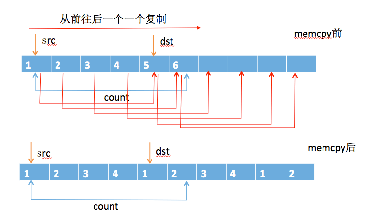
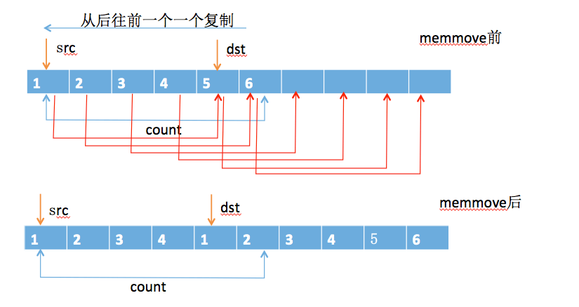
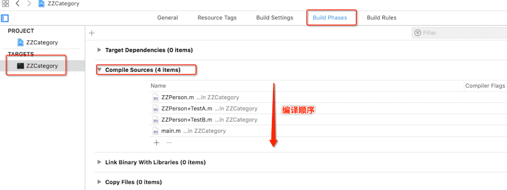

# Categary - 底层实现

<br>

分类大家都用过，它可以给系统类或自定义类新增加方法，或间接添加成员变量。本篇文章主要介绍`runtime`中关于分类的底层实现。

## 一、 准备工作

### 0x01 memmove 和 memcpy

`memcpy()`和`memmove()`都是C语言中的库函数，在头文件`string.h`中，其原型分别如下：

```
void *memcpy(void *dst, const void *src, size_t count);

void *memmove(void *dst, const void *src, size_t count);
```

`memcpy()`和`memmove()`都是从`src`指向的内存中复制`count`个字节到`dst`的内存中，并返回`dst`的指针。

区别在于`memcpy()`中的`src`和`dst`内存区域不能重叠，否则会出现未知结果。而`memmove()`中`src`和`dst`的内存区域可以出现重叠的情况，它能够保证`src`在被覆盖前将重叠区域的字节拷贝到`dst`中。  

VS.NET2003中所附源码如下（有删）

```
void *memcpy(void *dest, const void *source, size_t count)  
{  
	assert((NULL != dest) && (NULL != source));  
	char *tmp_dest = (char *)dest;  
	char *tmp_source = (char *)source;  
	while(count --)//不对是否存在重叠区域进行判断  
	  *tmp_dest ++ = *tmp_source ++;  
	return dest;  
} 


void *memmove(void *dest, const void *source, size_t count)  
{  
	assert((NULL != dest) && (NULL != source));  
	char *tmp_source, *tmp_dest;  
	tmp_source = (char *)source;  
	tmp_dest = (char *)dest;  
	if((dest + count<source) || (source + count) <dest))  
	{
		// 如果没有重叠区域  
	   	while(count--)  
	     *tmp_dest++ = *tmp_source++;  
	}  
	else  
	{ 
		//如果有重叠, 从后往前取值 
		 tmp_source += count - 1;  
		 tmp_dest += count - 1;  
		 while(count--)  
		   *--tmp_dest = *--tmp;  
	}  
	return dest;  
} 
```

**下面只讨论"右复制",（"左复制"肯定不会出现数据覆盖的情况）**



- `memcpy()`是从前往后一个一个复制内存数据，所以当出现区域重叠时，会导致本身数据更改，没有达到想要的效果



- `memmove()`是从后往前一个一个复制内存数据，当出现区域重叠时，优先复制重叠区域的数据，不会出现数据覆盖的情况。

### 0x02 抛出问题

不写`.h`中方法声明

```
// ZZPerson.m
- (void)instanceMethodTest
{
    NSLog(@"-[ZZPerson instanceMethodTest]");
}
+ (void)classMethodTest
{
    NSLog(@"+[ZZPerson classMethodTest]");
}

// ZZPerson+TestA.h
@interface ZZPerson (TestA)<NSCopying>
@property (nonatomic, strong) NSString *name;
@end

// ZZPerson+TestA.m
- (void)instanceMethodTest
{
    NSLog(@"-[ZZPerson(TestA) instanceMethodTest]");
}
+ (void)classMethodTest
{
    NSLog(@"+[ZZPerson(TestA) classMethodTest]");
}

// ZZPerson+TestB.m
- (void)instanceMethodTest
{
    NSLog(@"-[ZZPerson(TestB) instanceMethodTest]");
}
+ (void)classMethodTest
{
    NSLog(@"+[ZZPerson(TestB) classMethodTest]");
}

// main.m
ZZPerson *per = [[ZZPerson alloc] init];
[per instanceMethodTest];
[ZZPerson classMethodTest];

2019-04-27 16:25:12.028290+0800 ZZCategory[45318:4200399] -[ZZPerson(TestB) instanceMethodTest]
2019-04-27 16:25:12.028551+0800 ZZCategory[45318:4200399] +[ZZPerson(TestB) classMethodTest]
```

通过以前的学习我们知道实例对象调用实例方法会通过实例对象的`isa`指针找到对应的`class`对象，然后找到存储在`class`对象中的实例方法进行调用。

类对象调用类方法会通过类对象的`isa`找到对应的`meta-class`对象，然后找到存储在`meta-class`中的类方法进行调用。

而内存中只会存在一个`class`对象和`meta-class`对象，所以分类中的实例方法和类方法肯定会在某个时候合并到对应的`class`和`meta-class`中。

那问题来了

- 分类中的实例方法和类方法是在什么时候、如何合并到对应的`class`和`meta-class`中？

- 执行`[per instanceMethodTest]`为什么只调用了分类`TestB`中的实例方法？


## 二、编译时刻的Categoty


用`clang`指令将`ZZPerson+TestA.m`转化成`C++`代码

```
$ cd ZZCategoty

$ xcrun -sdk iphoneos clang -arch arm64 -rewrite-objc ZZPerson+TestA.m -o ZZPerson+TestA.cpp
```

可以看到编译之后`OC`中的分类在`C++`中是一个`struct _category_t `结构体类型

```
struct _category_t {
	const char *name;
	struct _class_t *cls;
	const struct _method_list_t *instance_methods;
	const struct _method_list_t *class_methods;
	const struct _protocol_list_t *protocols;
	const struct _prop_list_t *properties;
};
```

`ZZPerson+TestA`的实现

```
static struct _category_t _OBJC_$_CATEGORY_ZZPerson_$_TestA __attribute__ ((used, section ("__DATA,__objc_const"))) = 
{
	// 标记那个类的分类
	"ZZPerson",
	0, // &OBJC_CLASS_$_ZZPerson,
	// 实例方法列表
	(const struct _method_list_t *)&_OBJC_$_CATEGORY_INSTANCE_METHODS_ZZPerson_$_TestA,
	// 类方法列表
	(const struct _method_list_t *)&_OBJC_$_CATEGORY_CLASS_METHODS_ZZPerson_$_TestA,
	// 协议列表
	(const struct _protocol_list_t *)&_OBJC_CATEGORY_PROTOCOLS_$_ZZPerson_$_TestA,
	// 属性列表
	(const struct _prop_list_t *)&_OBJC_$_PROP_LIST_ZZPerson_$_TestA,
};
```

由分类的实现可以看到分类中的实例方法都存在结构体`_OBJC_$_CATEGORY_INSTANCE_METHODS_ZZPerson_$_TestA`中，找到他的实现。里面确实有我们给`ZZPerson`新增的`instanceMethodTest`实例方法。

```
static struct /*_method_list_t*/ {
	unsigned int entsize;  // sizeof(struct _objc_method)
	unsigned int method_count;
	struct _objc_method method_list[1];
} _OBJC_$_CATEGORY_INSTANCE_METHODS_ZZPerson_$_TestA __attribute__ ((used, section ("__DATA,__objc_const"))) = {
	sizeof(_objc_method),
	1,// 几个实例方法
	// 实例方法IMP
	{{(struct objc_selector *)"instanceMethodTest", "v16@0:8", (void *)_I_ZZPerson_TestA_instanceMethodTest}}
};
```

类方法结构体`_OBJC_$_CATEGORY_CLASS_METHODS_ZZPerson_$_TestA`实现

```
static struct /*_method_list_t*/ {
	unsigned int entsize;  // sizeof(struct _objc_method)
	unsigned int method_count;
	struct _objc_method method_list[1];
} _OBJC_$_CATEGORY_CLASS_METHODS_ZZPerson_$_TestA __attribute__ ((used, section ("__DATA,__objc_const"))) = {
	sizeof(_objc_method),
	1,
	{{(struct objc_selector *)"classMethodTest", "v16@0:8", (void *)_C_ZZPerson_TestA_classMethodTest}}
};
```

协议信息结构体`_OBJC_CATEGORY_PROTOCOLS_$_ZZPerson_$_TestA`实现

```
static struct /*_method_list_t*/ {
	unsigned int entsize;  // sizeof(struct _objc_method)
	unsigned int method_count;
	struct _objc_method method_list[1];
} _OBJC_PROTOCOL_INSTANCE_METHODS_NSCopying __attribute__ ((used, section ("__DATA,__objc_const"))) = {
	sizeof(_objc_method),
	1,
	{{(struct objc_selector *)"copyWithZone:", "@24@0:8^{_NSZone=}16", 0}}
};
```

属性结构体`_OBJC_$_PROP_LIST_ZZPerson_$_TestA`实现

```
static struct /*_prop_list_t*/ {
	unsigned int entsize;  // sizeof(struct _prop_t)
	unsigned int count_of_properties;
	struct _prop_t prop_list[1];
} _OBJC_$_PROP_LIST_ZZPerson_$_TestA __attribute__ ((used, section ("__DATA,__objc_const"))) = {
	sizeof(_prop_t),
	1,
	{{"name","T@\"NSString\",&,N"}}
};
```

由上可知分类在编译的时候会转成`struct _category_t`类型的结构体，里面包含着新增的实例方法信息、类方法信息、协议方法信息、属性信息。**这时候并没有将分类中的信息合并到对应的类中**。

## 三、runtime中的Categoty

`runtime`中关于分类的定义

```
// objc-runtime-new.h

struct category_t {
    const char *name;
    classref_t cls;
    struct method_list_t *instanceMethods;
    struct method_list_t *classMethods;
    struct protocol_list_t *protocols;
    struct property_list_t *instanceProperties;
    // Fields below this point are not always present on disk.
    struct property_list_t *_classProperties;

    method_list_t *methodsForMeta(bool isMeta) {
        if (isMeta) return classMethods;
        else return instanceMethods;
    }

    property_list_t *propertiesForMeta(bool isMeta, struct header_info *hi);
};
```

查看分类在`runtime`中合并过程

- 在`objc-os.mm`中 `_objc_init()` -> `_dyld_objc_notify_register()` -> `map_images()` -> `map_images_nolock()` -> `_read_images()`

- 在`objc-runtime-new.mm`中`_read_images()` -> `remethodizeClass()` -> `attachCategories()` -> `attachLists()`

- 最终合并的方法都在`attachLists()`函数中实现

下面粗略解释`objc-runtime-new.mm`中各个函数内部实现过程

### 0x01 `_read_images()`

```
void _read_images(header_info **hList, uint32_t hCount, int totalClasses, int unoptimizedTotalClasses)
{
	......
	
	// Discover categories. 
	for (EACH_HEADER) {
		// 获取某个类的所有分类
	    category_t **catlist =  _getObjc2CategoryList(hi, &count);
	    bool hasClassProperties = hi->info()->hasCategoryClassProperties();
	
		// 遍历所有分类
	    for (i = 0; i < count; i++) {
	        category_t *cat = catlist[i];
	        Class cls = remapClass(cat->cls);
			...
	        // 如果分类中存在实例方法 或协议 或属性
	        if (cat->instanceMethods || cat->protocols || cat->instanceProperties)
	        {
	            addUnattachedCategoryForClass(cat, cls, hi);
	            if (cls->isRealized()) {
	            	// 重新组织class,也就是将分类中的实例方法 或协议 或属性合并到class中
	                remethodizeClass(cls);
	                classExists = YES;
	            }
	            ...
	        }
	
			// 如果分类中存在类方法 或协议 或_classProperties
	        if (cat->classMethods || cat->protocols || (hasClassProperties && cat->_classProperties))
	        {
	            addUnattachedCategoryForClass(cat, cls->ISA(), hi);
	            if (cls->ISA()->isRealized()) {
	            	// 重新组织meta-class,也就是将类方法合并到meta-class中
	                remethodizeClass(cls->ISA());
	            }
	            ...
	        }
	    }
	}
	......
}
```

### 0x02 `remethodizeClass()`

```
static void remethodizeClass(Class cls)
{
    category_list *cats;
    bool isMeta;
    runtimeLock.assertLocked();
    isMeta = cls->isMetaClass();

    // Re-methodizing: check for more categories
    if ((cats = unattachedCategoriesForClass(cls, false/*not realizing*/))) {
        ...
        // 将cats添加到cls中
        attachCategories(cls, cats, true /*flush caches*/);        
        free(cats);
    }
}
```

### 0x03 `attachCategories()`


```
// 这个方法的作用是将所有分类的 实例方法列表(类方法列表,取决于cls是class还是meta-class)、协议列表、属性列表
// 放在对应的大二维数组中(mlists、proplists、protolists)
// 然后调用attachLists()函数，将分类的信息合并到calss(meta-class)中
static void attachCategories(Class cls, category_list *cats, bool flush_caches)
{
    if (!cats) return;
    if (PrintReplacedMethods) printReplacements(cls, cats);
	// class 还是 meta-class
    bool isMeta = cls->isMetaClass();

    // 创建二维方法数组 [[method_t, method_t, ...], [method_t, method_t, ...], ...]
    method_list_t **mlists = (method_list_t **)malloc(cats->count * sizeof(*mlists));
    
    // 创建二维属性数组 [[property_t, property_t, ...], [property_t, property_t, ...], ...]
    property_list_t **proplists = (property_list_t **)malloc(cats->count * sizeof(*proplists));
    
    // 创建二维协议数组 [[protocol_t, protocol_t, ...], [protocol_t, protocol_t, ...], ...]
    protocol_list_t **protolists = (protocol_list_t **)malloc(cats->count * sizeof(*protolists));

    // Count backwards through cats to get newest categories first
    int mcount = 0;
    int propcount = 0;
    int protocount = 0;
    int i = cats->count;
    bool fromBundle = NO;
    // 倒序遍历所有分类
    // 也就是说后编译的分类中的数据会放在mlist前面，将来调用方法时优先调用
    while (i--) {
    	// 取出某个分类
        auto& entry = cats->list[i];
        // 取出某个分类的方法列表
        method_list_t *mlist = entry.cat->methodsForMeta(isMeta);
        if (mlist) {
        	// 将方法列表放在mlists中
            mlists[mcount++] = mlist;
            fromBundle |= entry.hi->isBundle();
        }
        
        // 取出某个分类的属性列表
        property_list_t *proplist = entry.cat->propertiesForMeta(isMeta, entry.hi);
        if (proplist) {
            proplists[propcount++] = proplist;
        }
        
        // 取出某个分类的协议列表
        protocol_list_t *protolist = entry.cat->protocols;
        if (protolist) {
            protolists[protocount++] = protolist;
        }
    }

	// rw 就是结构体 struct objc_class 中的 class_rw_t
	// class_rw_t 存放着类的方法信息、属性信息、协议信息
    auto rw = cls->data();

    prepareMethodLists(cls, mlists, mcount, NO, fromBundle);
    // 将分类中的方法列表合并到对应的类中
    rw->methods.attachLists(mlists, mcount);
    free(mlists);
    if (flush_caches  &&  mcount > 0) flushCaches(cls);
    
    // 将分类中的属性列表合并到对应的类中
    rw->properties.attachLists(proplists, propcount);
    free(proplists);
    
    // 将分类中的协议列表合并到对应的类中
    rw->protocols.attachLists(protolists, protocount);
    free(protolists);
}
```

### 0x04 attachLists()

```
// 以实例方法为例 解释流程
// 
void attachLists(List* const * addedLists, uint32_t addedCount) 
{
    if (addedCount == 0) return;

    if (hasArray()) {
        // many lists -> many lists
        // 原有类中的实例方法的个数
        uint32_t oldCount = array()->count;
        // 合并分类之后实例方法的个数
        uint32_t newCount = oldCount + addedCount;
        
        setArray((array_t *)realloc(array(), array_t::byteSize(newCount)));
        array()->count = newCount;
        
        // 将原有类中的实例方法 往后挪动oldCount个位置(不是字节)
        // [..., class_method_t, ...]
        memmove(array()->lists + addedCount, array()->lists, oldCount * sizeof(array()->lists[0]));
        
        // 将分类中的所有实例方法合并到类的方法列表前面
        // [category_method_t, ..., class_method_t, ...]
        memcpy(array()->lists, addedLists, addedCount * sizeof(array()->lists[0]));
    }
    else if (!list  &&  addedCount == 1) {
        // 0 lists -> 1 list
        // 原有类中没有实例方法，则直接赋值
        list = addedLists[0];
    } 
    else {
        // 1 list -> many lists
        // 原有类中只有一个实例方法
        List* oldList = list;
        uint32_t oldCount = oldList ? 1 : 0;
        uint32_t newCount = oldCount + addedCount;
        setArray((array_t *)malloc(array_t::byteSize(newCount)));
        array()->count = newCount;
        
        if (oldList) array()->lists[addedCount] = oldList;
        // 将分类中的所有实例方法合并到类的方法列表前面
        // [category_method_t, ..., class_method_t]
        // 原有类中只有一个实例方法，就算有内存区域重叠，也不会出现覆盖问题
        memcpy(array()->lists, addedLists, addedCount * sizeof(array()->lists[0]));
    }
}
```

## 总结


- 每个分类在编译之后其底层结构都是`struct category_t`,里面存储着新增的对象方法信息、类方法信息、属性信息、协议信息。

- 在程序运行的时候，通过`runtime`将分类的数据合并到类信息中(类对象/元类对象)

- 当分类中存在同样的方法，最终会调用哪个分类的方法，由分类的编译顺序决定。**后编译的优先调用**。


文件编译顺序在下图位置中调整




**相关内容**

- [Categoty - load,initialize](https://gitee.com/zhaoName0x01/Notes/edit/master/iOS/Categoty-load-initialize.md)

- [Category - 关联对象](https://gitee.com/zhaoName0x01/Notes/blob/master/iOS/Category-AssociationObject.md)


<br>

写于2019-04-27

<br>