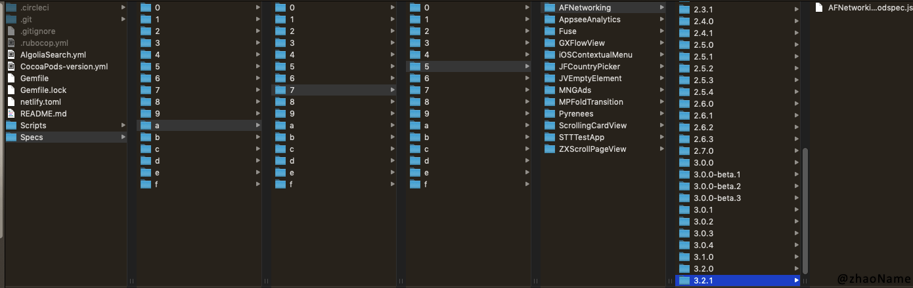
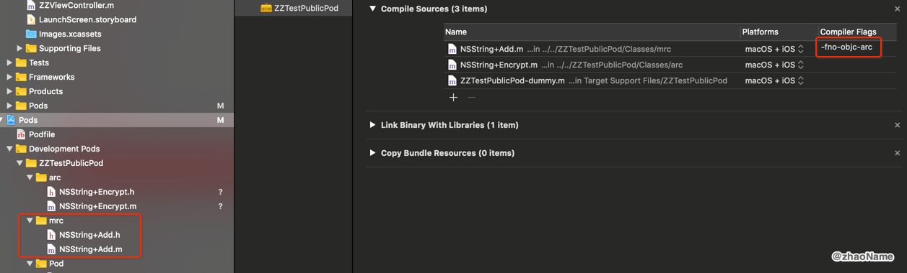

# CocoaPods(三) - spec


<br>

## 一、Specs Repo


官网上对`Specs Repo`的定义如下

> The Specs Repo is the repository on GitHub that contains the list of all available pods. Every library has an individual folder, which contains sub folders of the available versions of that pod.

意思就是`Specs Repo`是所有的`Pods`的一个索引，相当于是个容器，所有我们可使用的公开的`Pods`都存放在这里。每个`pod`都有一个单独的文件夹，里面存放是的`spec`文件。公开的`spec`文件是`Json`格式，私有`spec`文件是`ruby`格式。


所有公开的`spec`都在`https://github.com/CocoaPods/Specs`中，当我们使用`CocoaPods`时他会被`clone`到`~/.cocoapods/repos/`目录下。





## 二、spec

`spec`描述`pod`的一个版本信息。它包括应从何处获取源，要使用的文件，要应用的构建设置以及其他常规数据（如名称，版本和说明）的详细信息。我们可以用`pod spec create`创建

```
$ pod spec create ZZ

Specification created at ZZ.podspec
```

创建`ZZ.podspec`内容如下

```
#
#  Be sure to run `pod spec lint zz.podspec' to ensure this is a
#  valid spec and to remove all comments including this before submitting the spec.
#
#  To learn more about Podspec attributes see https://guides.cocoapods.org/syntax/podspec.html
#  To see working Podspecs in the CocoaPods repo see https://github.com/CocoaPods/Specs/
#

Pod::Spec.new do |spec|

  # ―――  Spec Metadata  ―――――――――――――――――――――――――――――――――――――――――――――――――――――――――― #
  #
  #  These will help people to find your library, and whilst it
  #  can feel like a chore to fill in it's definitely to your advantage. The
  #  summary should be tweet-length, and the description more in depth.
  #

  spec.name         = "zz"
  spec.version      = "0.0.1"
  spec.summary      = "A short description of zz."

  # This description is used to generate tags and improve search results.
  #   * Think: What does it do? Why did you write it? What is the focus?
  #   * Try to keep it short, snappy and to the point.
  #   * Write the description between the DESC delimiters below.
  #   * Finally, don't worry about the indent, CocoaPods strips it!
  spec.description  = <<-DESC
                   DESC

  spec.homepage     = "http://EXAMPLE/zz"
  # spec.screenshots  = "www.example.com/screenshots_1.gif", "www.example.com/screenshots_2.gif"


  # ―――  Spec License  ――――――――――――――――――――――――――――――――――――――――――――――――――――――――――― #
  #
  #  Licensing your code is important. See https://choosealicense.com for more info.
  #  CocoaPods will detect a license file if there is a named LICENSE*
  #  Popular ones are 'MIT', 'BSD' and 'Apache License, Version 2.0'.
  #

  spec.license      = "MIT (example)"
  # spec.license      = { :type => "MIT", :file => "FILE_LICENSE" }


  # ――― Author Metadata  ――――――――――――――――――――――――――――――――――――――――――――――――――――――――― #
  #
  #  Specify the authors of the library, with email addresses. Email addresses
  #  of the authors are extracted from the SCM log. E.g. $ git log. CocoaPods also
  #  accepts just a name if you'd rather not provide an email address.
  #
  #  Specify a social_media_url where others can refer to, for example a twitter
  #  profile URL.
  #

  spec.author             = { "" => "" }
  # Or just: spec.author    = ""
  # spec.authors            = { "" => "" }
  # spec.social_media_url   = "https://twitter.com/"

  # ――― Platform Specifics ――――――――――――――――――――――――――――――――――――――――――――――――――――――― #
  #
  #  If this Pod runs only on iOS or OS X, then specify the platform and
  #  the deployment target. You can optionally include the target after the platform.
  #

  # spec.platform     = :ios
  # spec.platform     = :ios, "5.0"

  #  When using multiple platforms
  # spec.ios.deployment_target = "5.0"
  # spec.osx.deployment_target = "10.7"
  # spec.watchos.deployment_target = "2.0"
  # spec.tvos.deployment_target = "9.0"


  # ――― Source Location ―――――――――――――――――――――――――――――――――――――――――――――――――――――――――― #
  #
  #  Specify the location from where the source should be retrieved.
  #  Supports git, hg, bzr, svn and HTTP.
  #

  spec.source       = { :git => "http://EXAMPLE/zz.git", :tag => "#{spec.version}" }


  # ――― Source Code ―――――――――――――――――――――――――――――――――――――――――――――――――――――――――――――― #
  #
  #  CocoaPods is smart about how it includes source code. For source files
  #  giving a folder will include any swift, h, m, mm, c & cpp files.
  #  For header files it will include any header in the folder.
  #  Not including the public_header_files will make all headers public.
  #

  spec.source_files  = "Classes", "Classes/**/*.{h,m}"
  spec.exclude_files = "Classes/Exclude"

  # spec.public_header_files = "Classes/**/*.h"


  # ――― Resources ―――――――――――――――――――――――――――――――――――――――――――――――――――――――――――――――― #
  #
  #  A list of resources included with the Pod. These are copied into the
  #  target bundle with a build phase script. Anything else will be cleaned.
  #  You can preserve files from being cleaned, please don't preserve
  #  non-essential files like tests, examples and documentation.
  #

  # spec.resource  = "icon.png"
  # spec.resources = "Resources/*.png"

  # spec.preserve_paths = "FilesToSave", "MoreFilesToSave"


  # ――― Project Linking ―――――――――――――――――――――――――――――――――――――――――――――――――――――――――― #
  #
  #  Link your library with frameworks, or libraries. Libraries do not include
  #  the lib prefix of their name.
  #

  # spec.framework  = "SomeFramework"
  # spec.frameworks = "SomeFramework", "AnotherFramework"

  # spec.library   = "iconv"
  # spec.libraries = "iconv", "xml2"


  # ――― Project Settings ――――――――――――――――――――――――――――――――――――――――――――――――――――――――― #
  #
  #  If your library depends on compiler flags you can set them in the xcconfig hash
  #  where they will only apply to your library. If you depend on other Podspecs
  #  you can include multiple dependencies to ensure it works.

  # spec.requires_arc = true

  # spec.xcconfig = { "HEADER_SEARCH_PATHS" => "$(SDKROOT)/usr/include/libxml2" }
  # spec.dependency "JSONKit", "~> 1.4"

end
```

### 0x01 介绍下`spec`常用的设置信息

- `name`： `Pod`的名字，必填项。

```
spec.name = 'AFNetworking'
```

- `version`： `Pod`的版本号，必填项。

```
spec.version = '0.0.1'
```

- `authors`：`Pod`的作者，必填项。

```
## 一个人
spec.author = 'Darth Vader'

## 多个人
spec.authors = 'Darth Vader', 'Wookiee'
## 或
spec.authors = { 'Darth Vader' => 'darthvader@darkside.com',
                 'Wookiee'     => 'wookiee@aggrrttaaggrrt.com' }
```

- `license`：`Pod`的许可证，必填项。

```
## 
spec.license = 'MIT'

## 指定具体文件
spec.license = { :type => 'MIT', :file => 'MIT-LICENSE.txt' }

## 指定许可证内容
spec.license = { :type => 'MIT', :text => <<-LICENSE
                   Copyright 2012
                   Permission is granted to...
                 LICENSE
               }
```

- `homepage`：`Pod`的主页，必填项

```
spec.homepage = 'http://www.example.com'
```

- `summary`：对`Pod`的简短描述，必填项且最长不能超过140个字符。

```
spec.summary = 'Computes the meaning of life.'
```


- `source`：指定`Pod`被检索的位置

```
## 项目 git 地址, tag 值与 spec.verison 版本一致
spec.source = { :git => 'https://github.com/AFNetworking/AFNetworking.git',
                :tag => spec.version.to_s }

## tag 以 v 开头，并支持子模块
spec.source = { :git => 'https://github.com/typhoon-framework/Typhoon.git',
                :tag => "v#{spec.version}", :submodules => true }
                
## SVN 使用 tag 当版本号
spec.source = { :svn => 'http://svn.code.sf.net/p/polyclipping/code', :tag => '4.8.8' }

## 使用 http 下载压缩包，支持 zip, tgz, bz2, txz and tar.
spec.source = { :http => 'http://dev.wechatapp.com/download/sdk/WeChat_SDK_iOS_en.zip' }

## 使用 http 下载加密文件，支持 sha1 and sha256.
spec.source = { :http => 'http://dev.wechatapp.com/download/sdk/WeChat_SDK_iOS_en.zip',
                :sha1 => '7e21857fe11a511f472cfd7cfa2d979bd7ab7d96' }
```


<br>


- `cocoapods_version`： `spec`所支持的`CocoaPods`版本

```
spec.cocoapods_version = '>=0.36'
```

- `description `：对`Pod`的描述

```
 spec.description = <<-DESC
                        here is descroption.
                       DESC
```

- `screenshots `：`Pod`的截图说明链接。`CocoaPods`讲义使用`gif`格式

```
## 一张
spec.screenshot  = 'http://dl.dropbox.com/u/378729/MBProgressHUD/1.png'

## 多张
spec.screenshots = [ 'http://dl.dropbox.com/u/378729/MBProgressHUD/1.png',
                     'http://dl.dropbox.com/u/378729/MBProgressHUD/2.png' ]
```


- `static_framework `：表示`Pod`是否可使用静态库

```
spec. static_framework = true
```

<br>

- `dependency`：`Pod`的依赖库。要使用`~>`来标记依赖库的版本，这样能更好的控制版本不会太严格。

```
spec.dependency 'AFNetworking', '~> 1.0'
```

- `prefix_header_file` : 是否在 pod 中使用 pch 文件，默认使用

```
spec.prefix_header_file = false
```


- `prefix_header_contents` : 向 pch 文件中添加内容，如

```
spec.prefix_header_contents = '#import <UIKit/UIKit.h>'
```


### 0x02 `requires_arc`

> `requires_arc` allows you to specify which `source_files` use ARC. This can either be the files which support ARC, or true to indicate all of the `source_files` use ARC.

> Files which do not use ARC will have the -fno-objc-arc compiler flag.

> The default value of this attribute is true

默认情况下`source_files` 都是支持 ARC 的。若我们需要个别文件需要 MRC 环境可采取如下办法。

先将 `requires_arc `置位 false , 然后在指定需要 ARC 环境的文件，这样文指定的文件都会带有`-fno-objc-arc`编译标志。

```
s.requires_arc = false
s.requires_arc = 'ZZTestPublicPod/Classes/arc/*'
```




<br>

**参考：**

- [Specs and the Specs Repo](https://guides.cocoapods.org/making/specs-and-specs-repo.html)


- [Podspec Syntax Reference](https://guides.cocoapods.org/syntax/podspec.html)

<br>

写于2019-09-18

<br>