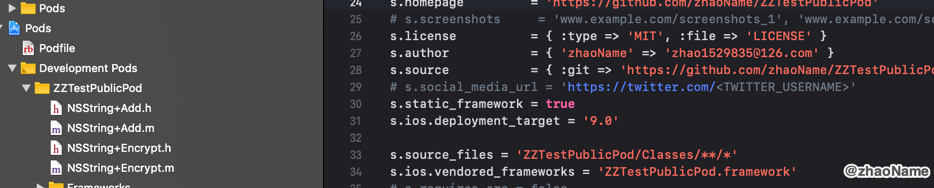
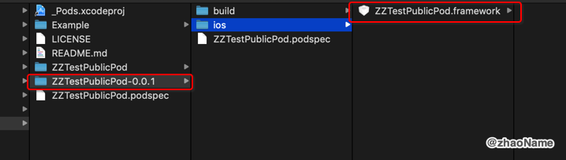
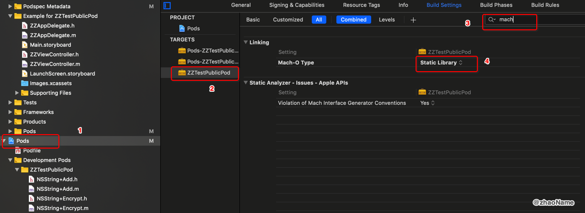
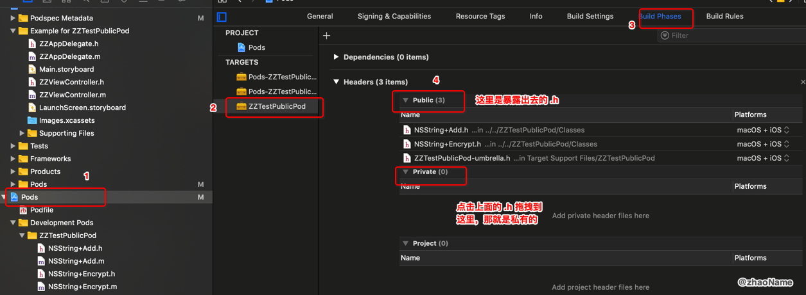
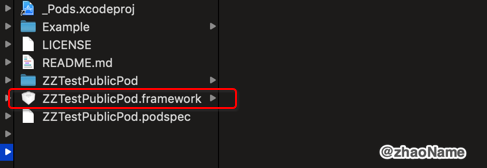
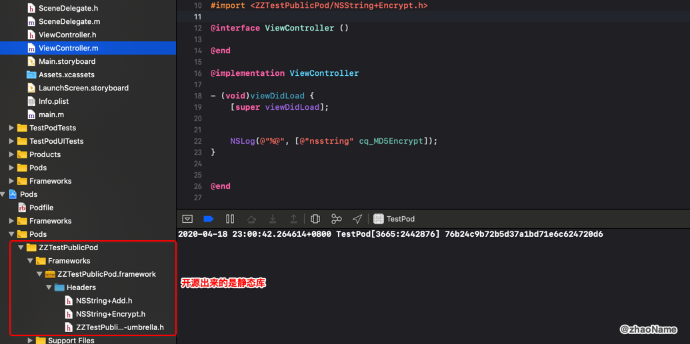

# CocoaPods(五) - PublicPods

<br>

相信大家都在工程中用 CocoaPods 导入如  AFNetworking、SDWebImage 之类的三方开源库。本篇文章介绍自己如何用 CocoaPods 制作开源库，分享自己的代码。

## 一、 pod lib create xxx

### 0x01 创建

在 GitHub 上以 ZZTestPublicPod 为例创建仓库


使用 `pod lib create` 创建模板

```
$ pod lib create ZZTestPublicPod

Cloning `https://github.com/CocoaPods/pod-template.git` into `ZZTestPublicPod`.
Configuring ZZTestPublicPod template.
What platform do you want to use?? [ iOS / macOS ]
 > iOS

What language do you want to use?? [ Swift / ObjC ]
 > ObjC

Would you like to include a demo application with your library? [ Yes / No ]
 > Yes

Which testing frameworks will you use? [ Specta / Kiwi / None ]
 > None

Would you like to do view based testing? [ Yes / No ]
 > No

What is your class prefix?
 > ZZ

Running pod install on your new library.

Analyzing dependencies
Adding spec repo `trunk` with CDN `https://cdn.cocoapods.org/`
Downloading dependencies
Installing ZZTestPublicPod (0.1.0)
Generating Pods project
Integrating client project

[!] Please close any current Xcode sessions and use `ZZTestPublicPod.xcworkspace` for this project from now on.
Pod installation complete! There is 1 dependency from the Podfile and 1 total pod installed.

 Ace! you're ready to go!
 We will start you off by opening your project in Xcode
  open 'ZZTestPublicPod/Example/ZZTestPublicPod.xcworkspace'

To learn more about the template see `https://github.com/CocoaPods/pod-template.git`.
To learn more about creating a new pod, see `https://guides.cocoapods.org/making/making-a-cocoapod`.
```

### 0x02 修改.podspec文件

```
Pod::Spec.new do |s|
  s.name             = 'ZZTestPublicPod'
  s.version          = '0.0.1'
  s.summary          = 'ZZTestPublicPod.'
  s.description      = <<-DESC
  test pubilc pods
                       DESC

  s.homepage         = 'https://github.com/zhaoName/ZZTestPublicPod'
  # s.screenshots     = 'www.example.com/screenshots_1', 'www.example.com/screenshots_2'
  s.license          = { :type => 'MIT', :file => 'LICENSE' }
  s.author           = { 'zhaoName' => 'zhao1529835@126.com' }
  s.source           = { :git => 'https://github.com/zhaoName/ZZTestPublicPod.git', :tag => s.version.to_s }
  # s.social_media_url = 'https://twitter.com/<TWITTER_USERNAME>'
  s.ios.deployment_target = '9.0'

  s.source_files = 'ZZTestPublicPod/Classes/**/*'
  
  # s.resource_bundles = {
  #   'ZZTestPublicPod' => ['ZZTestPublicPod/Assets/*.png']
  # }

  # s.frameworks = 'UIKit', 'MapKit'
  # s.dependency 'AFNetworking', '~> 2.3'
end
```

### 0x03 加入你想开源的代码

将你想要开源的代码放到 `./ZZTestPublicPod/Classes/` 目录下，然后执行 `$ pod install`



这里只是测试，就随意放了两个文件。

### 0x04 验证 spec

```
$ pod lib lint --allow-warnings

 -> ZZTestPublicPod (0.0.1)
    - NOTE  | xcodebuild:  note: Using new build system
    - NOTE  | [iOS] xcodebuild:  note: Planning build
    - NOTE  | [iOS] xcodebuild:  note: Constructing build description

ZZTestPublicPod passed validation.
```

### 0x05 提交到远程仓库

```
$ git add .

$ git commit -m '0.0.1'

$ git remote add origin https://github.com/zhaoName/ZZTestPublicPod.git

## 第一次提交
$ git push -f origin master                                            
Enumerating objects: 87, done.
Counting objects: 100% (87/87), done.
Delta compression using up to 4 threads
Compressing objects: 100% (78/78), done.
Writing objects: 100% (87/87), 35.92 KiB | 1.89 MiB/s, done.
Total 87 (delta 20), reused 0 (delta 0)
remote: Resolving deltas: 100% (20/20), done.
To https://github.com/zhaoName/ZZTestPublicPod.git
 + b6ea0fa...7e0e782 master -> master (forced update)
```

### 0x06 tag

```
## 务必保证 tag 和 podspec 文件中的 version 是一样的值
$ git tag 0.0.1  

$ git push origin 0.0.1    
Total 0 (delta 0), reused 0 (delta 0)
To https://github.com/zhaoName/ZZTestPublicPod.git
 * [new tag]         0.0.1 -> 0.0.1
```

<br>

## 二、发布

### 0x01 创建账号

若你还没有账号需要创建一个

```
## 以 GitHub 为例
$ pod trunk register zhao1529835@126.com 'zhaoName' --verbose

opening connection to trunk.cocoapods.org:443...
opened
starting SSL for trunk.cocoapods.org:443...
SSL established
<- "POST /api/v1/sessions HTTP/1.1\r\nContent-Type: application/json; charset=utf-8\r\nAccept: application/json; charset=utf-8\r\nUser-Agent: CocoaPods/1.9.1\r\nAccept-Encoding: gzip;q=1.0,deflate;q=0.6,identity;q=0.3\r\nHost: trunk.cocoapods.org\r\nContent-Length: 68\r\n\r\n"
<- "{\"email\":\"zhao1529835@126.com\",\"name\":\"zhaoName\",\"description\":null}"
-> "HTTP/1.1 201 Created\r\n"
-> "Date: Thu, 16 Apr 2020 15:30:51 GMT\r\n"
-> "Connection: keep-alive\r\n"
-> "Strict-Transport-Security: max-age=31536000\r\n"
-> "Content-Type: application/json\r\n"
-> "Content-Length: 194\r\n"
-> "X-Content-Type-Options: nosniff\r\n"
-> "Server: thin 1.6.2 codename Doc Brown\r\n"
-> "Via: 1.1 vegur\r\n"
-> "\r\n"
reading 194 bytes...
-> "{\"created_at\":\"2020-04-16 15:30:52 UTC\",\"valid_until\":\"2020-08-22 15:30:52 UTC\",\"verified\":false,\"created_from_ip\":\"101.86.168.168\",\"description\":null,\"token\":\"e9888c5486accc843de192c0c5ea4989\"}"
read 194 bytes
Conn keep-alive
[!] Please verify the session by clicking the link in the verification email that has been sent to zhao1529835@126.com
```

注意最后一段话，需要你去注册的邮箱验证。完成之后可以用如下命令查看

```
$ pod trunk me                                               

  - Name:     zhaoName
  - Email:    zhao1529835@126.com
  - Since:    April 16th, 09:30
  - Pods:     None
  - Sessions:
    - April 16th, 09:30 - August 22nd, 09:32. IP: 101.86.168.168
```

### 0x02 发布

```
$ pod trunk push ZZTestPublicPod.podspec --allow-warnings

[!] Found podspec `ZZTestPublicPod.podspec`
Updating spec repo `trunk`
Validating podspec
 -> ZZTestPublicPod (0.0.1)
    - WARN  | [iOS] file patterns: The `public_header_files` pattern did not match any file.
    - WARN  | [iOS] file patterns: The `private_header_files` pattern did not match any file.
    - NOTE  | xcodebuild:  note: Using new build system
    - NOTE  | [iOS] xcodebuild:  note: Planning build
    - NOTE  | [iOS] xcodebuild:  note: Constructing build description
    - NOTE  | [iOS] xcodebuild:  warning: Skipping code signing because the target does not have an Info.plist file and one is not being generated automatically. (in target 'App' from project 'App')

Updating spec repo `trunk`

--------------------------------------------------------------------------------
 🎉  Congrats

 🚀  ZZTestPublicPod (0.0.1) successfully published
 📅  April 16th, 10:03
 🌎  https://cocoapods.org/pods/ZZTestPublicPod
 👍  Tell your friends!
--------------------------------------------------------------------------------
```

发布完成之后稍等片刻就能找到你所开源的库

```
$ pod search ZZTestPublicPod

-> ZZTestPublicPod (0.0.1)
   ZZTestPublicPod.
   pod 'ZZTestPublicPod', '~> 0.0.1'
   - Homepage: https://github.com/zhaoName/ZZTestPublicPod
   - Source:   https://github.com/zhaoName/ZZTestPublicPod.git
   - Versions: 0.0.3, 0.0.2, 0.0.1 [cocoapods repo]
```

若你一直没找到，可用如下办法

```
$ rm ~/Library/Caches/CocoaPods/search_index.json
$ pod search ZZTestPublicPod
```

最简单的办法是，发布完成之后直接`pod update xxx`

```
$ pod update ZZTestPublicPod

Updating local specs repositories
  $ /usr/bin/git -C /Users/zhaosongbo/.cocoapods/repos/cocoapods fetch origin --progress
  remote: Enumerating objects: 91, done.        
  remote: Counting objects: 100% (91/91), done.        
  remote: Compressing objects: 100% (61/61), done.        
  remote: Total 63 (delta 40), reused 0 (delta 0), pack-reused 0        
  From https://github.com/CocoaPods/Specs
     7bb4d7d9230..c618300a13b  master     -> origin/master
  $ /usr/bin/git -C /Users/zhaosongbo/.cocoapods/repos/cocoapods rev-parse --abbrev-ref HEAD
  master
  $ /usr/bin/git -C /Users/zhaosongbo/.cocoapods/repos/cocoapods reset --hard origin/master
  HEAD is now at c618300a13b [Add] ZZTestPublicPod 0.0.4
...
```

<br>

## 三、打包成静态库

需要使用一个 cocoapods 的插件 cocoapods-packager 来完成静态库的打包

```
$ sudo gem install cocoapods-packager     
      
Password:
Fetching: cocoapods-packager-1.5.0.gem (100%)
Successfully installed cocoapods-packager-1.5.0
Parsing documentation for cocoapods-packager-1.5.0
Installing ri documentation for cocoapods-packager-1.5.0
Done installing documentation for cocoapods-packager after 0 seconds
1 gem installed
```

打包

```
$ pod package ZZTestPublicPod.podspec --force

Analyzing dependencies
Fetching podspec for `ZZTestPublicPod` from `ZZTestPublicPod.podspec`
Downloading dependencies
Installing ZZTestPublicPod (0.0.1)
Generating Pods project
Skipping User Project Integration
Pod installation complete! There is 1 dependency from the Podfile and 1 total pod installed.
Building framework ZZTestPublicPod (0.0.1) with configuration Release
Mangling symbols
Building mangled framework
```



如果你想要 .a 的静态库

```
pod package ZZTestPublicPod.podspec --library --force
```

<br>

## 四、开源静态库

我们在项目中也会引入过一些看不到代码实现的三方库，如高德地图、融云。那这些是怎么做的呢？

上述插件`cocoapods-packager `虽然能打包成静态库，但不好配置静态库，如某些`.h`文件也想设置为私有。这都需要我们手动设置，具体可参考我以前写的[iOS静态库简介](https://blog.csdn.net/qq244596/article/details/60580223)。

设置为静态库



修改需要暴露的头文件



Command + B 编译代码 然后将 ZZTestPublicPod.framework 放到`./ZZTestPublicPod/` 下



修改`.podspec` 文件

```
Pod::Spec.new do |s|
  s.name             = 'ZZTestPublicPod'
  s.version          = '0.0.4'
  
  s.static_framework = true
  ## 共享的静态库就需要把源文件给删了 否则静态库会和源码共存
  ## 这样还有种好处就是 若你需要继续维护代码 只需要反注释 然后 pod install 就能正常撸代码
  ## s.source_files = 'ZZTestPublicPod/Classes/**/*'
  ## 路径要对
  s.ios.vendored_frameworks = 'ZZTestPublicPod.framework'
  ...
end
```

发布之后试用



<br>

**参考**

- [开发并上传静态库到CocoaPods](https://www.jianshu.com/p/c5dd146bc95b)

- [cocoaPods 开发打包静态库](https://www.cnblogs.com/xiaocai-ios/p/7779740.html)

- [Podspec Syntax Reference](https://guides.cocoapods.org/syntax/podspec.html)

- [Building Objective-C static libraries with categories](https://developer.apple.com/library/archive/qa/qa1490/_index.html)

<br>

写于 2020-04-18

<br>