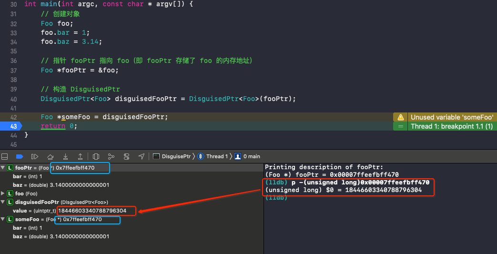

# DisguisedPtr


<br>

Apple 官方对于 `DisguisedPtr<T>` 的注释：行为类似于指针类型 `T*`

> DisguisedPtr<T> acts like pointer type T* except the stored value is disguised to hide it from tools like `leaks`.

即其本身的作用等同于指针引用对象，而不同之处则在于其将引用对象的内存地址隐藏了。`DisguisedPtr<T>` 避免了被 leaks 工具的检测，我们猜想这也意味着在使用 leaks 确认问题时，避免了被运行时底层的信息干扰。我们可以在 Apple 开源的 objc4-818.2 中找到其具体实现（如下）：


`DisguisedPtr<T>` 的本质是 C++ 的模版类，其中只含有一个 `uintptr_t` 类型的成员变量 `value`，`uintptr_t` 是无符号整型，64 位下的大小为 8 字节，等同于指针的大小，可以用来存储指针。因此 `DisguisedPtr` 类型的对象大小其实也是 8 字节。

当我们将指针构造为该类型的对象时，将通过 `disguise` 静态函数首先将指针存储的内存地址本身强制转换为 `uintptr_t` 无符号整型的十进制数据，并取负达到隐藏的目的。当然，其也提供了 `undisguise` 静态函数将隐藏的数据转换回内存地址，以及一些操作符便于外界直接使用。

```C++
// objc-private.h

// DisguisedPtr<T> acts like pointer type T*, except the 
// stored value is disguised to hide it from tools like `leaks`.
// nil is disguised as itself so zero-filled memory works as expected, 
// which means 0x80..00 is also disguised as itself but we don't care.
// Note that weak_entry_t knows about this encoding.
template <typename T>
class DisguisedPtr {
    // typedef unsigned long uintptr_t; 无符号长整形
    uintptr_t value;
    
    // 指针地址转无符号长整形，并取负数
    static uintptr_t disguise(T* ptr) {
        return -(uintptr_t)ptr;
    }
    
    // 无符号长整形转指针地址
    static T* undisguise(uintptr_t val) {
        return (T*)-val;
    }

 public:
    // 无参构造方法
    DisguisedPtr() { }
    // 指针构造（value = disguise(ptr)）
    DisguisedPtr(T* ptr) : value(disguise(ptr)) { }
    // 使用 DisguisedPtr 类型构造（value = ptr.value）
    DisguisedPtr(const DisguisedPtr<T>& ptr) : value(ptr.value) { }
    
    // 实现 = 运算符，右操作数类型为 T*
    DisguisedPtr<T>& operator = (T* rhs) {
        value = disguise(rhs);
        return *this;
    }
    
    // 实现 = 运算符，右操作数类型为 DisguisedPtr<T>
    DisguisedPtr<T>& operator = (const DisguisedPtr<T>& rhs) {
        value = rhs.value;
        return *this;
    }
    
    // Foo *someFoo = disguisedFooPtr;
    operator T* () const {
        return undisguise(value);
    }
    // disguisedFooPtr->bar
    T* operator -> () const { 
        return undisguise(value);
    }
    // *disguisedFooPtr
    T& operator * () const { 
        return *undisguise(value);
    }
    // &disguisedFooPtr[0]
    T& operator [] (size_t i) const {
        return undisguise(value)[i];
    }

    // pointer arithmetic operators omitted 
    // because we don't currently use them anywhere
};

// fixme type id is weird and not identical to objc_object*
static inline bool operator == (DisguisedPtr<objc_object> lhs, id rhs) {
    return lhs == (objc_object *)rhs;
}
static inline bool operator != (DisguisedPtr<objc_object> lhs, id rhs) {
    return lhs != (objc_object *)rhs;
}
```


若我们在 OC 环境使用 `DisguisedPtr<T>` 很容易报错，如下：

```Objective-C
NSObject *obj = [[NSObject alloc] init];
DisguisedPtr<NSObject> ptr = DisguisedPtr<NSObject>(obj);
```

代码能编译、运行成功。但如使用 `ptr`，就会在 `static T* undisguise(uintptr_t val)` 方法中报错： `Cast of 'uintptr_t' (aka 'unsigned long') to 'NSObject *' is disallowed with ARC`。

所以我们用 C++ 环境来测试，如下定义 `class Foo`

```C++
class Foo {
public:
    int bar;
    double baz;
};
```

首先来解释下，如何隐藏对象的地址 (Disgused)

```Objective-C
// 创建对象
Foo foo;
foo.bar = 1;
foo.baz = 3.14;

// 指针 fooPtr 指向 foo（即 fooPtr 存储了 foo 的内存地址）
Foo *fooPtr = &foo;

// 构造 DisguisedPtr
DisguisedPtr<Foo> disguisedFooPtr = DisguisedPtr<Foo>(fooPtr);

// operator T* ()
Foo *someFoo = disguisedFooPtr;
```

`DisguisedPtr` 通过私有函数 `disguise()` 将指针地址转换成无符号长整形，并取负数。

也能通过 `undisguise()` 函数将无符号长整形数转换成 `T*`



再看下 `DisguisedPtr` 中的一些操作符运算


```Objective-C
// T* operator -> ()
disguisedFooPtr->bar = 10;
NSLog(@"disguisedFooPtr->bar: %d", someFoo->bar); // disguisedFooPtr->bar: 10

// T& operator * ()
NSLog(@"disguisedFooPtr->bar: %d", (*disguisedFooPtr).bar); // disguisedFooPtr->bar: 10

// T& operator []
// ss1 就是之前的 foo
Foo ss1 = disguisedFooPtr[0];
// ss2 是 foo 之后的16个字节
Foo ss2 = disguisedFooPtr[1];
ss2.bar = 20;
ss2.baz = 1.234456;
NSLog(@"%p-----%p", &ss1, &ss2); // 0x7ffeefbff448-----0x7ffeefbff438
```


<br>

**Reference**

- [Obj-C 中的 DisguisedPtr](https://kingcos.me/posts/2021/disguised_ptr_in_objc/)

- [Finding Memory Leaks](https://developer.apple.com/library/archive/documentation/Performance/Conceptual/ManagingMemory/Articles/FindingLeaks.html)

<br>