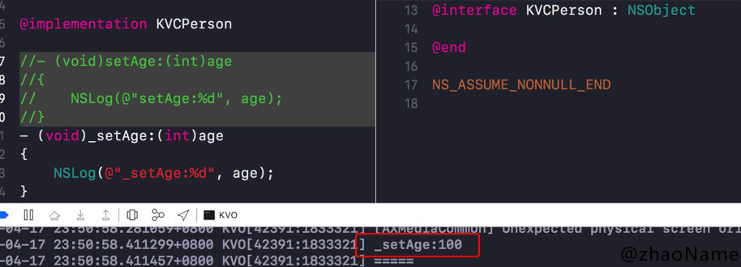

# KVC

<br>

`KVC`全称`Key-Value Coding`,也称键值编码。可以通过一个`key`来设置或访问某个属性值


## 一、基本使用

### 0x01 常用API

```
- (id)valueForKey:(NSString *)key;
- (void)setValue:(id)value forKey:(NSString *)key;

- (id)valueForKeyPath:(NSString *)keyPath;
- (void)setValue:(id)value forKeyPath:(NSString *)keyPath;
```

### 0x02 key和keyPath区别

```
// Person.h

@interface Student : NSObject
@property (nonatomic, assign) NSInteger num;/**< */
@end

// Person有个Student属性
@interface Person : NSObject
@property (nonatomic, assign) NSInteger age;
@property (nonatomic, strong) Student *stu;/**< */
@end


// kvc设置age
[self.person1 setValue:@100 forKey:@"age"];
// kvc设置
[self.person1 setValue:@123456 forKeyPath:@"stu.num"];

NSLog(@"KVC改变属性值:%@ %@", [self.person1 valueForKey:@"age"], [self.person1 valueForKeyPath:@"stu.num"]);

// 打印信息
2019-04-17 23:08:00.993126+0800 KVC[41445:1582018] KVC改变属性值:100 123456
```

<br>

## 二、KCV设值原理

官方文档中 [Search Pattern for the Basic Setter](https://developer.apple.com/library/archive/documentation/Cocoa/Conceptual/KeyValueCoding/SearchImplementation.html) 中给出`setValue:forKey:`的方法查找顺序

> Search Pattern for the Basic Setter

>The default implementation of `setValue:forKey:`, given key and value parameters as input, attempts to set a property named key to value (or, for non-object properties, the unwrapped version of value, as described in Representing Non-Object Values) inside the object receiving the call, using the following procedure:

> - Look for the first accessor named `set<Key>:` or `_set<Key>`, in that order. If found, invoke it with the input value (or unwrapped value, as needed) and finish.

> - If no simple accessor is found, and if the class method `accessInstanceVariablesDirectly` returns YES, look for an instance variable with a name like `_<key>`, `_is<Key>`, `<key>`, or `is<Key>`, in that order. If found, set the variable directly with the input value (or unwrapped value) and finish.

> - Upon finding no accessor or instance variable, invoke `setValue:forUndefinedKey:`. This raises an exception by default, but a subclass of NSObject may provide key-specific behavior.


`setValue:forKey:`原理


- 先通过`key`顺序查找`setKey:`和`_setKey:`方法

优先查找`setKey:`方法


`setKey:`方法找不到会`_setKey:`方法




- 若`setKey:`和`_setKey:`都没找到,且`accessInstanceVariablesDirectly`返回为`NO`，则程序报`setValue:forUndefinedKey:`错误崩溃


- 若`accessInstanceVariablesDirectly`返回为`YES`,则顺序查找`_key` `_isKey` `key` `isKey`四个成员变量


`_age`成员


`_isAge`成员


`age`成员


`isAge`成员


- 若四个成员变量都没找到，则程序报`setValue:forUndefinedKey:`错误崩溃


<br>

## 三、KVC取值原理

官方文档中 [Search Pattern for the Basic Getter](https://developer.apple.com/library/archive/documentation/Cocoa/Conceptual/KeyValueCoding/SearchImplementation.html) 中给出`valueForKey:`的方法查找顺序

> Search Pattern for the Basic Getter
The default implementation of valueForKey:, given a key parameter as input, carries out the following procedure, operating from within the class instance receiving the valueForKey: call.

> - Search the instance for the first accessor method found with a name like get<Key>, <key>, is<Key>, or _<key>, in that order. If found, invoke it and proceed to step 5 with the result. Otherwise proceed to the next step.

> - If no simple accessor method is found, search the instance for methods whose names match the patterns countOf<Key> and objectIn<Key>AtIndex: (corresponding to the primitive methods defined by the NSArray class) and <key>AtIndexes: (corresponding to the NSArray method objectsAtIndexes:).

>  If the first of these and at least one of the other two is found, create a collection proxy object that responds to all NSArray methods and return that. Otherwise, proceed to step 3.

>  The proxy object subsequently converts any NSArray messages it receives to some combination of countOf<Key>, objectIn<Key>AtIndex:, and <key>AtIndexes: messages to the key-value coding compliant object that created it. If the original object also implements an optional method with a name like get<Key>:range:, the proxy object uses that as well, when appropriate. In effect, the proxy object working together with the key-value coding compliant object allows the underlying property to behave as if it were an NSArray, even if it is not.

> - If no simple accessor method or group of array access methods is found, look for a triple of methods named countOf<Key>, enumeratorOf<Key>, and memberOf<Key>: (corresponding to the primitive methods defined by the NSSet class).

>   If all three methods are found, create a collection proxy object that responds to all NSSet methods and return that. Otherwise, proceed to step 4.

>   This proxy object subsequently converts any NSSet message it receives into some combination of countOf<Key>, enumeratorOf<Key>, and memberOf<Key>: messages to the object that created it. In effect, the proxy object working together with the key-value coding compliant object allows the underlying property to behave as if it were an NSSet, even if it is not.

> - If no simple accessor method or group of collection access methods is found, and if the receiver's class method accessInstanceVariablesDirectly returns YES, search for an instance variable named _<key>, _is<Key>, <key>, or is<Key>, in that order. If found, directly obtain the value of the instance variable and proceed to step 5. Otherwise, proceed to step 6.

> - If the retrieved property value is an object pointer, simply return the result.

>  If the value is a scalar type supported by NSNumber, store it in an NSNumber instance and return that.

>  If the result is a scalar type not supported by NSNumber, convert to an NSValue object and return that.

> - If all else fails, invoke valueForUndefinedKey:. This raises an exception by default, but a subclass of NSObject may provide key-specific behavior.


`valueForKey:`原理


- 优先按照`getKey` `key` `isKey` `_key`顺序查找方法，设置新值

- 若都没找到会查看`accessInstanceVariablesDirectly`的返回值，为`NO`则直接调用`valueForUndefinedKey:`方法抛出异常

- 若`accessInstanceVariablesDirectly`的返回值为`YES`,则按顺序查找`_key` `_isKey` `key` `isKey`成员变量，找到直接取值

- 若四个成员变量都没找到则调用`valueForUndefinedKey:`方法抛出异常

<br>

## 四、面试题

### 0x01 通过KVC设置的属性值能触发KVO吗？

从`KVC`设值原理可以看到就算没有属性的`setKey:`方法，`KVC`也可能设值成功。那还能触发`KVO`吗？ 这里给予肯定答案：只要`KVC`的流程能走通(无论是调方法成功还是查找到四个成员变量中任意一个)且添加`KVO`监听，就能触发。

`KVC`触发`KVO`流程

- 调用`willChangeValueForKey:`

- 调`setKey: / _setKey`方法或查找到四个成员变量中任意一个，设置新的属性值

- 调用`didChangeValueForKey:`方法

- 在`didChangeValueForKey:`方法中触发监听器的`observeValueForKeyPath:ofObject:change:context:`方法


<br>

**Reference:**

- [About Key-Value Coding](https://developer.apple.com/library/archive/documentation/Cocoa/Conceptual/KeyValueCoding/index.html)

写于2019-04-17

<br>

