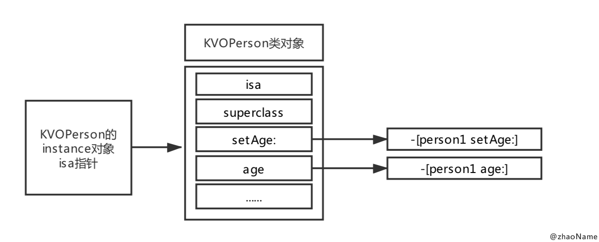
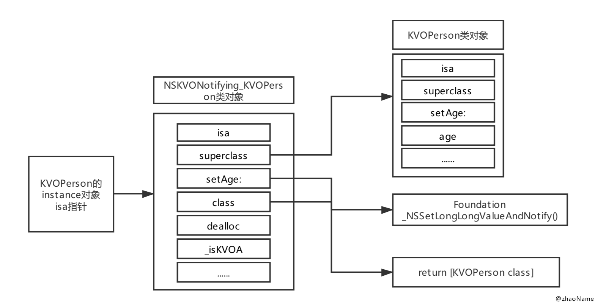

# KVO本质


<br>

`KVO`全称:`Key-Value Observing`,也称键值监听,用来监听对象的某个属性值的改变。

- 通过属性的`setter`方法设置新值

- 通过`setValue:forKey:`或`setValue:forKeyPath:`设置新值

上面两种方法都可触发`KVO`，实现属性值的监听。本文测试工程中只用第一种方法触发`KVO`。关于`KVC`触发`KVO`可参考[这里](https://gitee.com/zhaoName0x01/Notes/blob/master/iOS/KVC.md)


## 一、准备工作

- 创建名为`KVO`的工程，新建`KVOPerson`类


```
// KVOPerson.h
@property (nonatomic, assign) NSInteger age;

// KVOPerson.m
- (void)setAge:(NSInteger)age
{
    _age = age;
    NSLog(@"当前Person:%@, age:%zd", self, age);
}
```

- `ViewController`


```
// ViewController.m
- (void)viewDidLoad {
    [super viewDidLoad];
    
    self.person1 = [[KVOPerson alloc] init];
    self.person1.age = 10;
    
    self.person2 = [[KVOPerson alloc] init];
    self.person2.age = 20;
    
    [self.person1 addObserver:self forKeyPath:@"age" options:NSKeyValueObservingOptionOld | NSKeyValueObservingOptionNew context:nil];
}

- (void)touchesBegan:(NSSet<UITouch *> *)touches withEvent:(UIEvent *)event
{
    self.person1.age = 11;
    self.person2.age = 21;
}

- (void)observeValueForKeyPath:(NSString *)keyPath ofObject:(id)object change:(NSDictionary<NSKeyValueChangeKey,id> *)change context:(void *)context
{
    NSLog(@"%@的%@属性值发送变动:%@", object, keyPath, change);
}

- (void)dealloc
{
    [self.person1 removeObserver:self forKeyPath:@"age"];
}
```

## 二、猜测

- 执行上述工程，可得到如下打印

```
2019-04-15 22:58:43.904011+0800 KVO[61199:5633209] 当前Person:<KVOPerson: 0x60000283a290>, age:10
2019-04-15 22:58:43.904176+0800 KVO[61199:5633209] 当前Person:<KVOPerson: 0x60000283a2b0>, age:20
```

- 点击屏幕，触发`KVO` 打印如下

```
2019-04-15 22:58:43.904673+0800 KVO[61199:5633209] 当前Person:<KVOPerson: 0x60000283a290>, age:11
2019-04-15 22:58:43.904922+0800 KVO[61199:5633209] <KVOPerson: 0x60000283a290>的age属性值发送变动:{
    kind = 1;
    new = 11;
    old = 10;
}
2019-04-15 22:58:43.905051+0800 KVO[61199:5633209] 当前Person:<KVOPerson: 0x60000283a2b0>, age:21
```

从上述打印可以看到，点击屏幕前后都走了`setAge:`方法，不同的是点击屏幕后添加键值监听的`perosn1`在执行`setAge:`方法后，会触发`observeValueForKeyPath:ofObject:change:context:`方法，打印键值监听信息；而没添加键值监听的`person2`在执行`setAge:`方法后，就没反应了。

查看代码可知，类对象`KVOPerson`只有一个属性，实例对象`person1`和`person2`除了添加键值监听与否之外，并没有什么差别。而且都走的是同一个`setAge:`方法，那么`KVO`的底层实现就和属性的`setter`方法没关系。

**这里可以大胆猜测下，`KVO`的底层实现应该和类本身有关。**


## 三、本质分析、验证

### 0x01 添加 KVO 前后类对象变化

我们知道实例对象调用对象方法是通过实例对象的`isa`指针找到类对象，再从类对象的方法列表中找到要调用的对象方法。那意思就是说`KVO`的底层实现和`KVOPerson`这个类并无关系(也不会是父类`NSObject`)，否则`perosn2`也会通过`setAge:`方法触发`KVO`。

下面来打印下`person`对象在添加`KVO`前后类对象的变化

```
NSLog(@"添加KVO之前类对象:%@ %@", object_getClass(self.person1), object_getClass(self.person2));
NSLog(@"添加KVO之前person1的父类%@", [object_getClass(self.person1) superclass]);

NSLog(@"添加KVO之后类对象:%@ %@", object_getClass(self.person1), object_getClass(self.person2));
NSLog(@"添加KVO之后person1的父类%@", [object_getClass(self.person1) superclass]);

// 打印信息
2019-04-16 23:15:19.185912+0800 KVO[14861:520567] 添加KVO之前类对象:KVOPerson KVOPerson
2019-04-16 23:15:19.186037+0800 KVO[14861:520567] 添加KVO之前person1的父类：NSObject
2019-04-16 23:15:19.186498+0800 KVO[14861:520567] 添加KVO之后类对象:NSKVONotifying_KVOPerson KVOPerson
2019-04-16 23:15:19.186631+0800 KVO[14861:520567] 添加KVO之后person1的父类：KVOPerson
```

可以看到`person1`在添加`KVO`之后，类对象由`KVOPerson`变成`NSKVONotifying_KVOPerson`，且`NSKVONotifying_KVOPerson`继承自`KVOPerson`。

那`NSKVONotifying_KVOPerson`是哪来的呢？它是通过`OC`的运行时机制动态创建的，只要你给某个对象添加`KVO`之后，系统就会通过运行时机制动态创建一个继承自`XXX`的子类`NSKVONotifying_XXX`。


### 0x02 添加 KVO 前后对象方法调用流程

- 添加`KVO`之前



- 添加`KVO`之后



### 0x03 验证

我们来验证下`person1`在添加`KVO`之后，调用`setAge:`方法其实调用`_NSSetIntValueAndNotify()`函数.

```
// 获取添加KVO前后调用setAge:的方法实现
NSLog(@"添加KVO之前方法实现:%p %p",
          [self.person1 methodForSelector:@selector(setAge:)],
          [self.person2 methodForSelector:@selector(setAge:)]);
          
NSLog(@"添加KVO之后方法实现:%p %p",
                 [self.person1 methodForSelector:@selector(setAge:)],
                 [self.person2 methodForSelector:@selector(setAge:)]);
                 
// 打印信息
2019-04-16 23:46:15.746181+0800 KVO[15587:701098] 添加KVO之前方法实现:0x108d52460 0x108d52460
2019-04-16 23:46:15.746885+0800 KVO[15587:701098] 添加KVO之前方法实现:0x1090ac164 0x108d52460
```

可以看到`person2`在添加前后调用`setAge:`的方法实现没有改变，但`person1`变了。在`touchesBegan:withEvent:`中添加断点，点击屏幕触发断点

```
(lldb) po (IMP)0x108d52460
(KVO`-[KVOPerson setAge:] at KVOPerson.m:13)

(lldb) po (IMP)0x1090ac164
(Foundation`_NSSetLongLongValueAndNotify)
```

这就证明了`person1`添加`KVO`之后，调用`setAge:`实际上是调用`Foundation`的`_NSSetLongLongValueAndNotify()`函数。

细心的你可能会发现`_NSSetLongLongValueAndNotify()`函数中的`LongLong`对应着声明`age`属性时使用的`NSInteger`类型，意思就是若你声明个`NSString`类型的属性，那就会调用`_NSSetObjectValueAndNotify()`函数等。

```
$ cd ~/Library/Developer/Xcode/iOS DeviceSupport/12.2 (16E227)/Symbols/System/Library/Frameworks/Foundation.framework

$ nm Foundation | grep ValueAndNotify
000000018190c5f8 t __NSSetBoolValueAndNotify
000000018190c730 t __NSSetCharValueAndNotify
000000018190c9a0 t __NSSetDoubleValueAndNotify
000000018190cae0 t __NSSetFloatValueAndNotify
000000018190cc20 t __NSSetIntValueAndNotify
000000018190d0f8 t __NSSetLongLongValueAndNotify
000000018190ce90 t __NSSetLongValueAndNotify
000000018190c4c4 t __NSSetObjectValueAndNotify
000000018190d5d0 t __NSSetPointValueAndNotify
000000018190d718 t __NSSetRangeValueAndNotify
000000018190d860 t __NSSetRectValueAndNotify
000000018190d360 t __NSSetShortValueAndNotify
000000018190d9c4 t __NSSetSizeValueAndNotify
000000018190c868 t __NSSetUnsignedCharValueAndNotify
000000018190cd58 t __NSSetUnsignedIntValueAndNotify
000000018190d22c t __NSSetUnsignedLongLongValueAndNotify
000000018190cfc4 t __NSSetUnsignedLongValueAndNotify
000000018190d498 t __NSSetUnsignedShortValueAndNotify
```

### 0x04 NSKVONotifying_KVOPerson 的对象方法

从流程图中到`NSKVONotifying_KVOPerson`中有四个对象方法，下面来证明下

```
// 打印某个类对象中的全部对象方法
- (void)printfInstanceMethod:(Class)cls
{
    unsigned count = 0;
    NSMutableString *string = [NSMutableString string];
    
    Method *list = class_copyMethodList(cls, &count);
    for (int i=0; i<count; i++) {
        Method method = list[i];
        [string appendString:NSStringFromSelector(method_getName(method))];
        [string appendString:@", "];
    }
    free(list);
    NSLog(@"Class:%@ instanceMethod:%@", cls, string);
}

[self printfInstanceMethod:object_getClass(self.person1)];
[self printfInstanceMethod:object_getClass(self.person2)];

// 打印信息
2019-04-17 22:19:32.622743+0800 KVO[40409:1295635] Class:NSKVONotifying_KVOPerson instanceMethod:setAge:, class, dealloc, _isKVOA
2019-04-17 22:19:32.622877+0800 KVO[40409:1295635] Class:KVOPerson instanceMethod:setAge:, age
```

### 0x05 KVO 本质实现流程

由于`_NSSetIntValueAndNotify()`是`Foundation`框架下的函数，所以我们不能看到其内部实现。在这只是写`NSKVONotifying_KVOPerson`的伪代码

```
// NSKVONotifying_KVOPerson.m

- (Class)class
{
    // 调用[self.person1 class]返回的还是KVOPerson
    return self.superClass;
}

// 重写父类KVOPerson的方法
- (void)setAge:(NSInteger)age
{
    _NSSetLongLongValueAndNotify();
}

void _NSSetLongLongValueAndNotify()
{
    [self willChangeValueForKey:@"age"];
    // 调用父类方法 设置属性的新值
    [super setAge:age];
    [self didChangeValueForKey:@"age"];
}

- (void)didChangeValueForKey:(NSString *)key
{
    // 属性值已经改变 通知监听器
    [self observeValueForKeyPath:key ofObject:self change:nil context:nil];
}
```

## 四、面试题

### 0x01 KVO 本质

- 用`runtime`动态生成一个子类，并让实例对象的`isa`指正指向这个子类

- 在子类中重写`setxxx:`方法，并在其内部调用`Foundation`框架下的`_NSSetXXXValueAndNotify()`函数

- 在`_NSSetXXXValueAndNotify()`内部
	
	-  调用`willChangeValueForKey:`
	
	- 调用父类的`setxxx:`方法，设置新值

	- 调用`didChangeValueForKey:`方法

	- 在`didChangeValueForKey:`方法中触发监听器的`observeValueForKeyPath:ofObject:change:context:`方法


### 0x02 如何手动触发 KVO

- 手动调用`willChangeValueForKey:`和`didChangeValueForKey:`方法就可手动触发`KVO`

<br>
写于2019-04-15 完成于2019-04-17
<br>
