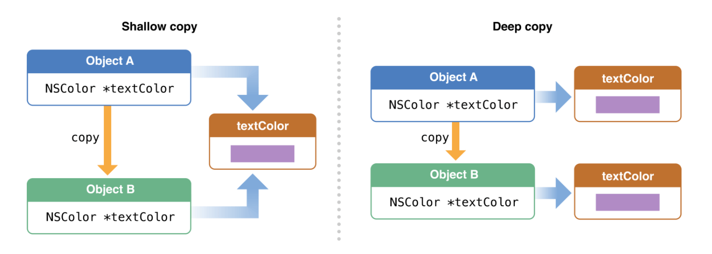
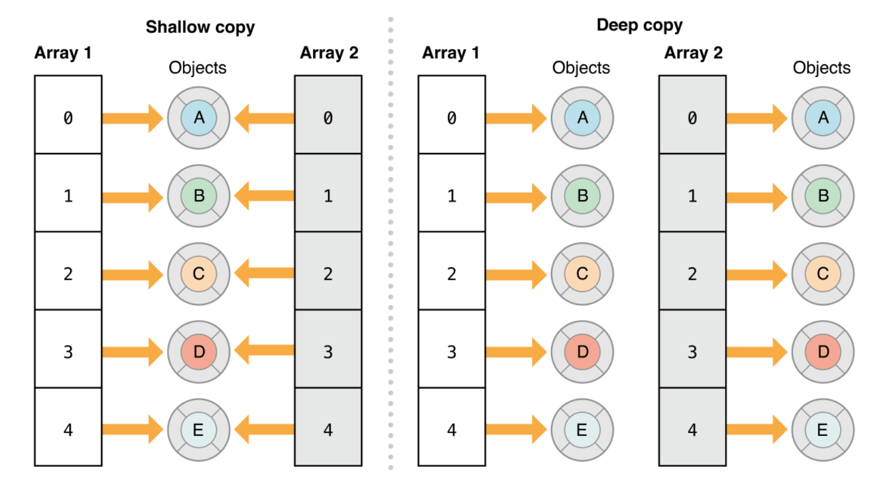
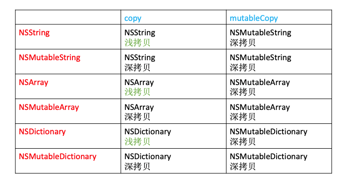
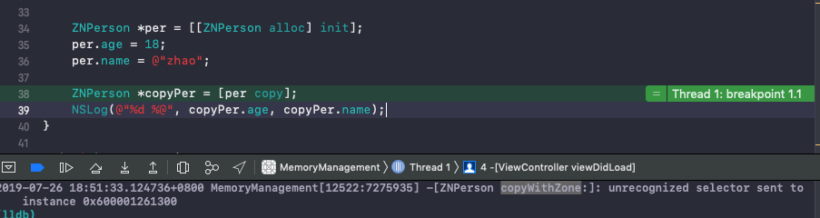
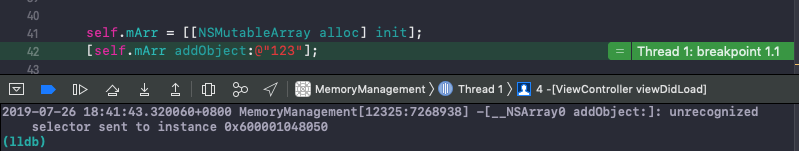

# 内存管理 - Copy

<br>


## 一、简介

### 0x01 浅拷贝、深拷贝

在 OC 中继承自`NSObject`的系统类都会有两个方法`copy`和`mutableCopy`，用于对象拷贝。而对象的拷贝有两种容易混淆的概念：浅拷贝、深拷贝。

- 浅拷贝：单纯的地址拷贝，指向同一个指针，不会产生新的对象，而是对原有对象的引用计数加1。

- 深拷贝：地址和指针都拷贝(内容拷贝)，生成一个新的对象。原对象的引用计数不变，新对象引用计数为1。

```Objective-C
// 这里要注意 字符串要足够长 否则创建出来的是Tagged Pointer, 引用计数为-1
NSString *str1 = [NSString stringWithFormat:@"abcdefggggggg"];
NSLog(@"str1.retainCount: %zd", str1.retainCount);
NSString *str2 = [str1 copy];
NSLog(@"str1.retainCount: %zd", str1.retainCount);
NSLog(@"str2.retainCount: %zd", str2.retainCount);
    
NSMutableString *str3 = [str1 mutableCopy];
NSLog(@"str1.retainCount: %zd", str1.retainCount);
NSLog(@"str3.retainCount: %zd", str3.retainCount);
    
NSLog(@"str1:%p---str2:%p---str3:%p", str1, str2, str3);

// 打印结果
2019-07-26 15:01:38.687989+0800 MemoryManagement[8087:7136917] str1.retainCount: 1
2019-07-26 15:01:38.688153+0800 MemoryManagement[8087:7136917] str1.retainCount: 2
2019-07-26 15:01:38.688231+0800 MemoryManagement[8087:7136917] str2.retainCount: 2
2019-07-26 15:01:38.688324+0800 MemoryManagement[8087:7136917] str1.retainCount: 2
2019-07-26 15:01:38.688397+0800 MemoryManagement[8087:7136917] str3.retainCount: 1
2019-07-26 15:01:38.688468+0800 MemoryManagement[8087:7136917] str1:0x6000021ec260---str2:0x6000021ec260---str3:0x600002feee20
```

### 0x02 集合类和非集合类的浅拷贝、深拷贝

用网络上流行的图解释。非集合类指`NSSting`、`NSNumber`之类的对象。



集合类指的是`NSArray`、`NSDictionary`、`NSSet`之类的类。




**无论原有类是可变还是不可变的，通过`copy`得到得到的一定是不可变对象，通过`mutableCopy`得到的一定是可变对象**。

下面通过`NSString`、`NSArray`、`NSDictionary`来解释下。

## 二、copy、mutableCopy

### 0x01 NSString、NSMutableString

```Objective-C
// 原对象是 NSString
NSString *str1 = [NSString stringWithFormat:@"abcdefggggggg"];
NSString *str2 = [str1 copy]; // 不可变 浅拷贝
NSMutableString *str3 = [str1 mutableCopy]; // 可变 深拷贝
NSLog(@"地址：str1:%p---str2:%p---str3:%p", str1, str2, str3);
    
// 原对象是 NSMutableString
NSMutableString *str4 = [NSMutableString stringWithFormat:@"abcdefggggggg"];
NSString *str5 = [str4 copy]; // 不可变(调用 appendString: 会导致程序崩溃) 深拷贝
NSMutableString *str6 = [str4 mutableCopy]; // 可变 深拷贝
NSLog(@"地址：str4:%p---str5:%p---str6:%p", str4, str5, str6);

// 打印结果
2019-07-26 16:24:16.095946+0800 MemoryManagement[9612:7182774] 地址：str1:0x600000de2400---str2:0x600000de2400---str3:0x600000386a60
2019-07-26 16:24:16.096079+0800 MemoryManagement[9612:7182774] 地址：str4:0x600000383b70---str5:0x600000dd7320---str6:0x600000383d50
```

### 0x02 NSArray、NSMutableArray

```Objective-C
// 原有对象是 NSArray
NSArray *arr1 = @[@"z", @"x", @"c"];
NSArray *arr2 = [arr1 copy]; // 不可变 浅拷贝
NSArray *arr3 = [arr1 mutableCopy]; // 可变 深拷贝
NSLog(@"地址：arr1:%p---arr2:%p---arr3:%p", arr1, arr2, arr3);
NSLog(@"类型：arr1:%@---arr2:%@---arr3:%@", arr1.class.superclass, arr2.class.superclass, arr3.class.superclass);
    
// 原有对象是 NSMutableArray
NSMutableArray *arr4 = [NSMutableArray arrayWithArray:@[@"z", @"x", @"c"]];
NSArray *arr5 = [arr4 copy]; // 不可变 深拷贝
NSArray *arr6 = [arr4 mutableCopy]; // 可变 深拷贝
NSLog(@"地址：arr4:%p---arr5:%p---arr6:%p", arr4, arr5, arr6);
NSLog(@"类型：arr4:%@---arr5:%@---arr6:%@", arr4.class.superclass, arr5.class.superclass, arr6.class.superclass);

// 打印结果
2019-07-26 16:31:37.853489+0800 MemoryManagement[9758:7187643] 地址：arr1:0x600001280750---arr2:0x600001280750---arr3:0x6000012807b0
2019-07-26 16:31:37.853691+0800 MemoryManagement[9758:7187643] 类型：arr1:NSArray---arr2:NSArray---arr3:NSMutableArray

2019-07-26 16:31:37.853814+0800 MemoryManagement[9758:7187643] 地址：arr4:0x600001280b40---arr5:0x600001280a80---arr6:0x6000012c5830
2019-07-26 16:31:37.853945+0800 MemoryManagement[9758:7187643] 类型：arr4:NSMutableArray---arr5:NSArray---arr6:NSMutableArray
```


### 0x03 NSDictionary、NSMutableDictionary

```Objective-C
// 原有对象是 NSDictionary
NSDictionary *dict1 = @{@"key":@"value"};
NSDictionary *dict2 = [dict1 copy]; // 不可变 浅拷贝
NSDictionary *dict3 = [dict1 mutableCopy]; // 可变 浅拷贝
NSLog(@"地址：dict1:%p---dict2:%p---dict3:%p", dict1, dict2, dict3);
NSLog(@"类型：dict1:%@---dict2:%@---dict3:%@", dict1.class.superclass, dict2.class.superclass, dict3.class.superclass);
    
// 原有对象是 NSMutableDictionary
NSMutableDictionary *dict4 = [NSMutableDictionary dictionaryWithDictionary:@{@"key":@"value"}];
NSDictionary *dict5 = [dict4 copy]; // 不可变 深拷贝
NSDictionary *dict6 = [dict4 mutableCopy]; // 可变 深拷贝
NSLog(@"地址：dict4:%p---dict5:%p---dict6:%p", dict4, dict5, dict6);
NSLog(@"类型：dict4:%@---dict5:%@---dict6:%@", dict4.class.superclass, dict5.class.superclass, dict6.class.superclass);

// 打印结果
2019-07-26 16:37:06.164906+0800 MemoryManagement[9890:7191990] 地址：dict1:0x6000010a81e0---dict2:0x6000010a81e0---dict3:0x6000010a8360
2019-07-26 16:37:06.165132+0800 MemoryManagement[9890:7191990] 类型：dict1:NSDictionary---dict2:NSDictionary---dict3:NSMutableDictionary

2019-07-26 16:37:06.165258+0800 MemoryManagement[9890:7191990] 地址：dict4:0x6000010a81c0---dict5:0x6000010a82c0---dict6:0x6000010a8400
2019-07-26 16:37:06.165382+0800 MemoryManagement[9890:7191990] 类型：dict4:NSMutableDictionary---dict5:NSDictionary---dict6:NSMutableDictionary
```

### 0x04 单层深拷贝

```Objective-C
NSMutableArray *arr4 = [NSMutableArray arrayWithArray:@[@"z", @"x", @"c"]];
NSArray *arr5 = [arr4 copy]; // 不可变 深拷贝
NSArray *arr6 = [arr4 mutableCopy]; // 可变 深拷贝
NSLog(@"地址：arr4:%p---arr5:%p---arr6:%p", arr4, arr5, arr6);
    
for (int i=0; i<arr4.count; i++) {
    NSLog(@"%p %p %p", arr4[i], arr5[i], arr6[i]);
}

// 打印结果
2019-07-26 17:05:14.476636+0800 MemoryManagement[10465:7209219] 地址：arr4:0x6000017cbc30---arr5:0x6000017cb990---arr6:0x6000017cbcf0
2019-07-26 17:05:14.476733+0800 MemoryManagement[10465:7209219] 0x103cc9230 0x103cc9230 0x103cc9230
2019-07-26 17:05:14.476850+0800 MemoryManagement[10465:7209219] 0x103cc9250 0x103cc9250 0x103cc9250
2019-07-26 17:05:14.476934+0800 MemoryManagement[10465:7209219] 0x103cc9270 0x103cc9270 0x103cc9270
```

可以看到`arr4`、`arr5`、`arr6`的地址确实不一样，但它们里面元素的地址完全一样。这样的是不完全拷贝，也叫单层深拷贝。

苹果文档指出可以用归档和解归档实现完全深拷贝。

```Objective-C
// 完全深拷贝
NSArray *arr7 = [NSKeyedUnarchiver unarchiveObjectWithData:[NSKeyedArchiver archivedDataWithRootObject:arr4]];
NSLog(@"地址：arr4:%p---arr7:%p", arr4, arr7);
for (int i=0; i<arr4.count; i++) {
    NSLog(@"元素值：%@--%@", arr4[i], arr7[i]);
    NSLog(@"元素地址：%p--%p", arr4[i], arr7[i]);
}

// 打印结果
2019-07-26 17:50:36.965121+0800 MemoryManagement[11341:7237911] 地址：arr4:0x600001ebfd50---arr7:0x600001ebfe70
2019-07-26 17:50:36.965254+0800 MemoryManagement[11341:7237911] 元素值：z--z
2019-07-26 17:50:36.965378+0800 MemoryManagement[11341:7237911] 元素地址：0x1092ad230--0xaf9d704454ba4e48
2019-07-26 17:50:36.965476+0800 MemoryManagement[11341:7237911] 元素值：x--x
2019-07-26 17:50:36.965632+0800 MemoryManagement[11341:7237911] 元素地址：0x1092ad250--0xaf9d704454ba4e68
2019-07-26 17:50:36.975864+0800 MemoryManagement[11341:7237911] 元素值：c--c
2019-07-26 17:50:36.976127+0800 MemoryManagement[11341:7237911] 元素地址：0x1092ad270--0xaf9d704454ba4fd8
```

**总结**




## 三、自定义类 copy、mutableCopy

我们自定义一个`ZNPerson`类。

```Objective-C
ZNPerson *per = [[ZNPerson alloc] init];
per.age = 18;
per.name = @"zhao";
    
ZNPerson *copyPer = [per copy];
NSLog(@"%d %@", copyPer.age, copyPer.name);
```
运行结果是程序崩溃，报错找不到`copyWithZone`方法。




对于自定义的类，我们要想调用`copy/mutableCopy`方法，需要实现手动实现`NSCopying/NSMutableCopying`协议。

```Objective-C
- (id)copyWithZone:(NSZone *)zone
{
    // [self class] 能防止子类未实现 NSCoping 协议调用copy 方法，出现崩溃(unrecognized selector sent to instance)
    // 但使用 [self class] 只能实现父类的属性拷贝，子类的属性值不能拷贝，需要子类重新实现 copyWithZone: 方法
    ZNPerson *p = [[[self class] allocWithZone:zone] init];
    p.age = self.age;
    p.name = self.name;
    return p;
}
```


## 四、面试

### 0x01 声明`NSString`类型的属性为什么要用`copy`关键字修饰 ？

首先我们来看下声明`NSString`类型的属性用`strong`关键字修饰，有什么后果。

```Objective-C
NSString *str = [NSMutableString stringWithString:@"123"];
self.name = str;
str = @"345";
NSLog(@"self.name：%@---str：%@", self.name, str);

// 打印结果
2019-07-26 18:07:37.040027+0800 MemoryManagement[11707:7248911] self.name：123---str：345
```

当我们声明一个不可变字符串局部变量赋值给`_name`，重新给字符串赋值，不会影响`_name`的值。

```Objective-C
NSMutableString *str = [NSMutableString stringWithString:@"123"];
self.name = str;
[str appendString:@"456"];
NSLog(@"self.name：%@---str：%@", self.name, str);

// 打印结果
2019-07-26 18:08:18.387797+0800 MemoryManagement[11739:7249941] self.name：123456---str：123456
```

但当我们声明一个可变字符串局部变量赋值给`_name`，然后修改可变字符串的值，就会影响`_name`的值。这是由于`_name`和`str`指向同一块内存导致的。

若我们用`copy`关键字修饰，在 MRC 环境下`_name`的`setter`方法如下

```Objective-C
- (void)setName:(NSString *)name
{
    if (_name != name) {
        [_name release];
        _name = [name copy];
    }
}
```

传进去的可变字符串通过`copy`，得到一个不可变的字符串赋值给`_name`，而且是深拷贝。所以我们再去修改`str`的值，`name`是不会随着改变的。

### 0x02 使用`copy`关键字修饰`NSMutableArray`会有什么后果 ？

```Objective-C
@property (nonatomic, copy) NSMutableArray *mArr;

self.mArr = [[NSMutableArray alloc] init];
[self.mArr addObject:@"123"];
```

运行结果是程序崩溃，报错方法找不到。




这是因为虽然初始化的时候是可变数组，但你声明用的`copy`，无论原对象是可变还是不可变的，通过`copy`得到的新对象都是不可变的。所以报方法找不到错误。

<br>

**参考：**

- [Collections Programming Topics](https://developer.apple.com/library/archive/documentation/Cocoa/Conceptual/Collections/Articles/Copying.html#//apple_ref/doc/uid/TP40010162-SW3)

<br>

写于2019-07-26

<br>
