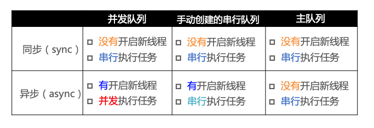
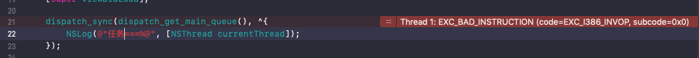

# 多线程基础

<br>


## 一、iOS 中常用的多线程

这里只做简单介绍，还有更多常用方法需要你自己查看。

### 0x01 `pthread`

`pthread` 是一套通用的多线程的`API`，可以在`Unix / Linux / Windows `等系统跨平台使用，使用 C 语言编写，需要程序员自己管理线程的生命周期，使用难度较大，我们在 iOS 开发中几乎不使用`pthread`。

```Objective-C
#import <pthread.h>

- (void)viewDidLoad {
    [super viewDidLoad];
    
    pthread_t thread;
    /*
     第一个参数：指向线程代号的指针
     第二个参数：线程属性 可用 pthread_attr_init 设置，也可给NULL
     第三个参数：指向函数的指针
     第四个参数：传递给函数的参数 可为NULL
     */
    pthread_create(&thread, NULL, testPThread, NULL);
}

void* testPThread(void * arg)
{
    NSLog(@"testPThread===%@", [NSThread currentThread]);
    return nil;
}

// 打印结果
2019-07-17 22:29:54.122059+0800 GCD[95940:1892474] testPThread===<NSThread: 0x600000c09180>{number = 3, name = (null)}
```

### 0x02 `NSThread`

`NSThread` 是苹果官方提供的，面向对象的多线程方案。使用起来比`pthread ` 更简单易用，可以直接操作线程对象。也需要程序员自己管理线程的生命周期。开发中偶尔使用 `NSThread`，我们最常用的是调用`[NSThread currentThread]`来显示当前的线程信息。

```Objective-C
NSThread *thread = [[NSThread alloc] initWithBlock:^{
    NSLog(@"NSThread===%@", [NSThread currentThread]);
}];
[thread start];

// 打印结果
2019-07-17 22:33:41.456844+0800 GCD[96037:1895165] NSThread===<NSThread: 0x600000436b00>{number = 3, name = (null)}
```


### 0x03 `GCD`

`GCD`是苹果在 iOS4 之后推出的旨在替代`NSThread`的多线程方案，最大的优势在于充分利用设备的多核。它是一套基于 C 语言的 API，但它使用起来很方便，不用程序员管理线程，只需告诉它要执行什么任务(也就是`Block`中的代码)就行了。

- `dispatch_get_main_queue()` 主队列，属于串行队列

- `dispatch_get_global_queue(DISPATCH_QUEUE_PRIORITY_DEFAULT, 0)` 全局并发队列

```Objective-C
dispatch_async(dispatch_get_global_queue(0, 0), ^{
    NSLog(@"GCD===%@", [NSThread currentThread]);
});

// 打印结果
2019-07-17 22:51:46.723893+0800 GCD[96360:1903717] GCD===<NSThread: 0x600003e06000>{number = 3, name = (null)}
```


### 0x04 `NSOperation `

`NSOperation`也是苹果在 iOS4 之后推出的，基于`GCD`的、面向对象的多线程方案。它可以设置队列的最大并发数，还可以设置线程之间的依赖关系，方便控制执行顺序。但我们不会直接使用`NSOperation `，而是使用它的子类`NSBlockOperation`和`NSInvocationOperation`。还需要借助`NSOperationQueue `来开启新线程。

```Objective-C
NSOperationQueue *opQueue = [[NSOperationQueue alloc] init];
[opQueue addOperationWithBlock:^{
    NSLog(@"addOperationWithBlock===%@", [NSThread currentThread]);
}];

// 打印结果
2019-07-18 09:58:34.257910+0800 GCD[98599:1963498] addOperationWithBlock===<NSThread: 0x6000026871c0>{number = 3, name = (null)}

--------

NSBlockOperation *op =  [NSBlockOperation blockOperationWithBlock:^{
    NSLog(@"addOperation===%@", [NSThread currentThread]);
}];
NSOperationQueue *opQueue = [[NSOperationQueue alloc] init];
[opQueue addOperation:op];

// 打印结果
2019-07-18 09:58:01.719724+0800 GCD[98567:1962591] addOperation===<NSThread: 0x600001d40d40>{number = 3, name = (null)}
```

<br>

## 二、同步、异步、串行、并发


同步、异步指的是线程。串行、并发指的是队列。

- 串行队列：按照将它们添加到队列的顺序一次执行一个任务。

- 并发队列：同时执行一个或多个任务，但任务仍按其添加到队列的顺序依次执行。

- 同步：在当前线程中执行任务，不具备开启新线程的能力

- 异步：在新的线程中执行任务，具备开启新线程的能力，不代表一定会开启新线程

### 0x01 同步 串行

```Objective-C
dispatch_queue_t serialQueue = dispatch_queue_create("SyncAndSerial", DISPATCH_QUEUE_SERIAL);
dispatch_sync(serialQueue, ^{
    NSLog(@"任务1===%@", [NSThread currentThread]);
});
dispatch_sync(serialQueue, ^{
    NSLog(@"任务2===%@", [NSThread currentThread]);
});
dispatch_sync(serialQueue, ^{
    NSLog(@"任务3===%@", [NSThread currentThread]);
});

// 打印结果
2019-07-18 11:12:29.518833+0800 GCD[317:2008710] 任务1===<NSThread: 0x600001632940>{number = 1, name = main}
2019-07-18 11:12:29.519064+0800 GCD[317:2008710] 任务2===<NSThread: 0x600001632940>{number = 1, name = main}
2019-07-18 11:12:29.519201+0800 GCD[317:2008710] 任务3===<NSThread: 0x600001632940>{number = 1, name = main}
```

没有开启新线程，且按添加顺序依次执行任务。


### 0x02 同步 并发

```Objective-C
dispatch_queue_t concurrentQueue = dispatch_queue_create("SyncAndConcurrent", DISPATCH_QUEUE_CONCURRENT);
dispatch_sync(concurrentQueue, ^{
    NSLog(@"任务4===%@", [NSThread currentThread]);

});
dispatch_sync(concurrentQueue, ^{
    NSLog(@"任务5===%@", [NSThread currentThread]);

});
dispatch_sync(concurrentQueue, ^{
    NSLog(@"任务6===%@", [NSThread currentThread]);
});

// 打印结果
2019-07-18 11:14:30.116517+0800 GCD[417:2010443] 任务4===<NSThread: 0x6000011b17c0>{number = 1, name = main}
2019-07-18 11:14:30.116644+0800 GCD[417:2010443] 任务5===<NSThread: 0x6000011b17c0>{number = 1, name = main}
2019-07-18 11:14:30.116738+0800 GCD[417:2010443] 任务6===<NSThread: 0x6000011b17c0>{number = 1, name = main}
```

没有开启新线程，且按添加顺序依次执行任务。

### 0x03 同步 主队列

```Objective-C
dispatch_queue_t concurrentQueue = dispatch_queue_create("SyncAndConcurrent", DISPATCH_QUEUE_CONCURRENT);
dispatch_async(concurrentQueue, ^{
    dispatch_sync(dispatch_get_main_queue(), ^{
        NSLog(@"任务1===%@", [NSThread currentThread]);
    });
    dispatch_sync(dispatch_get_main_queue(), ^{
        NSLog(@"任务2===%@", [NSThread currentThread]);
    });
    dispatch_sync(dispatch_get_main_queue(), ^{
        NSLog(@"任务3===%@", [NSThread currentThread]);
    });
});

// 打印结果
2019-07-18 11:21:26.704901+0800 GCD[690:2016383] 任务1===<NSThread: 0x6000005fd3c0>{number = 1, name = main}
2019-07-18 11:21:26.705886+0800 GCD[690:2016383] 任务2===<NSThread: 0x6000005fd3c0>{number = 1, name = main}
2019-07-18 11:21:26.706984+0800 GCD[690:2016383] 任务3===<NSThread: 0x6000005fd3c0>{number = 1, name = main}
```

没有开启新线程，且按添加顺序依次执行任务。注意不能再主线程中执行` dispatch_sync(dispatch_get_main_queue(), ^{}`，会死锁。


### 0x04 异步 串行

```Objective-C
dispatch_queue_t serialQueue = dispatch_queue_create("SyncAndSerial", DISPATCH_QUEUE_SERIAL);
dispatch_async(serialQueue, ^{
    NSLog(@"任务1===%@", [NSThread currentThread]);
});
dispatch_async(serialQueue, ^{
    NSLog(@"任务2===%@", [NSThread currentThread]);
});
dispatch_async(serialQueue, ^{
    NSLog(@"任务3===%@", [NSThread currentThread]);
});


2019-07-18 11:33:35.184502+0800 GCD[855:2022099] 任务1===<NSThread: 0x600003c9e680>{number = 3, name = (null)}
2019-07-18 11:33:35.189457+0800 GCD[855:2022099] 任务2===<NSThread: 0x600003c9e680>{number = 3, name = (null)}
2019-07-18 11:33:35.189918+0800 GCD[855:2022099] 任务3===<NSThread: 0x600003c9e680>{number = 3, name = (null)}
```

开启新线程，任务按顺序执行。

### 0x05 异步 并发

```Objective-C
dispatch_queue_t concurrentQueue = dispatch_queue_create("SyncAndConcurrent", DISPATCH_QUEUE_CONCURRENT);
for (int i=0; i<10; i++) {
    dispatch_async(concurrentQueue, ^{
        NSLog(@"任务%d===%@", i, [NSThread currentThread]);
    });
}
    
// 打印结果
2019-07-18 11:37:58.542600+0800 GCD[1037:2026785] 任务2===<NSThread: 0x60000395bf40>{number = 6, name = (null)}
2019-07-18 11:37:58.542608+0800 GCD[1037:2026784] 任务3===<NSThread: 0x60000392bf00>{number = 5, name = (null)}
2019-07-18 11:37:58.542608+0800 GCD[1037:2026787] 任务0===<NSThread: 0x60000395bf00>{number = 3, name = (null)}
2019-07-18 11:37:58.542637+0800 GCD[1037:2026786] 任务1===<NSThread: 0x600003961c40>{number = 4, name = (null)}
2019-07-18 11:37:58.542889+0800 GCD[1037:2026784] 任务4===<NSThread: 0x60000392bf00>{number = 5, name = (null)}
2019-07-18 11:37:58.542889+0800 GCD[1037:2026785] 任务6===<NSThread: 0x60000395bf40>{number = 6, name = (null)}
2019-07-18 11:37:58.542895+0800 GCD[1037:2026787] 任务7===<NSThread: 0x60000395bf00>{number = 3, name = (null)}
2019-07-18 11:37:58.542918+0800 GCD[1037:2026786] 任务5===<NSThread: 0x600003961c40>{number = 4, name = (null)}
2019-07-18 11:37:58.543004+0800 GCD[1037:2026784] 任务8===<NSThread: 0x60000392bf00>{number = 5, name = (null)}
2019-07-18 11:37:58.543305+0800 GCD[1037:2026787] 任务9===<NSThread: 0x60000395bf00>{number = 3, name = (null)}
```

开启新线程，执行顺序和线程调度相关。

### 0x06 异步 主队列

```Objective-C
dispatch_async(dispatch_get_main_queue(), ^{
    NSLog(@"任务1===%@", [NSThread currentThread]);
});
dispatch_async(dispatch_get_main_queue(), ^{
    NSLog(@"任务2===%@", [NSThread currentThread]);
});
dispatch_async(dispatch_get_main_queue(), ^{
    NSLog(@"任务3===%@", [NSThread currentThread]);
});

// 打印结果
2019-07-18 11:31:39.404158+0800 GCD[818:2020671] 任务1===<NSThread: 0x600001638f80>{number = 1, name = main}
2019-07-18 11:31:39.406474+0800 GCD[818:2020671] 任务2===<NSThread: 0x600001638f80>{number = 1, name = main}
2019-07-18 11:31:39.406645+0800 GCD[818:2020671] 任务3===<NSThread: 0x600001638f80>{number = 1, name = main}
```

异步 主队列不会开启新线程。



<br>

## 三、死锁

引用苹果官方文档上一句话，来解释死锁。

> Do not call the dispatch_sync function from a task that is executing on the same queue that you pass to your function call. Doing so will deadlock the queue. If you need to dispatch to the current queue, do so asynchronously using the dispatch_async function.

意思是：使用`dispatch_sync `函数往当前串行队列中添加任务，会卡住当前的串行队列也就是会产生死锁。



<br>

**参考：**

- [Concurrency Programming Guide](https://developer.apple.com/library/archive/documentation/General/Conceptual/ConcurrencyProgrammingGuide/OperationQueues/OperationQueues.html#//apple_ref/doc/uid/TP40008091-CH102-SW2)

<br>

写于2019-07-17

<br>

