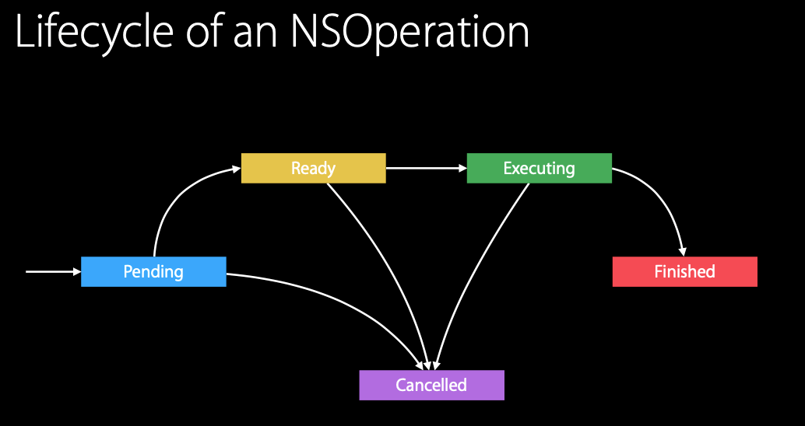

# Advanced NSOperation


<br>

本文主要参考 WWDC 2015 中的 [Advanced NSOperations](https://developer.apple.com/videos/play/wwdc2015/226/)。官方提供的 [sample code](https://developer.apple.com/sample-code/wwdc/2015/downloads/Advanced-NSOperations.zip) 是 swift3 的版本，现在已经不能用运行了。我们还可以参考 github 上开源的 swift 版 [PSOperations](https://github.com/pluralsight/PSOperations) 或 OC 版 [INSOperationsKit](https://github.com/m1entus/INSOperationsKit)。

Advanced NSOperation 主要介绍了自定义 `NSOPeration` 是怎么实现的。

首先引用官方文档上的一段话

> The NSOperation class provides the basic logic to track the execution state of your operation but otherwise must be subclassed to do any real work. How you create your subclass depends on whether your operation is designed to execute concurrently or non-concurrently.

大概意思是 `NSOperation` 提供一些跟踪执行状态基本的操作，但是如何创建子类，或者说创建子类要重写父类那些方法取决于你创建的 `operation` 是并发的还是非并发的。

<br>

## 一、非并发的 `NSOperation`

当你创建的是非并发的 `operation` 时，只需重写 `main` 方法。

> The default implementation of this method does nothing. You should override this method to perform the desired task. In your implementation, do not invoke super. This method will automatically execute within an autorelease pool provided by NSOperation, so you do not need to create your own autorelease pool block in your implementation.
>
> If you are implementing a concurrent operation, you are not required to override this method but may do so if you plan to call it from your custom start method.

大概意思是：`main`方法默认不做任何操作，你可以重写此方法做你想要做的事。再此方法中不要调`super`,不用自己创建`autorelease pool `。但是要注意当前的 `operation` 是否被取消或正在执行。

自定义继承自 `NSOperation` 的子类 `ZZNonConcurrentOperation`

```Objective-C
@interface ZZNonConcurrentOperation : NSOperation
@end

@implementation ZZNonConcurrentOperation

- (void)main
{
    sleep(2);
    NSLog(@"%s---%@", __func__, NSThread.currentThread);
}

@end
```

将自定义的 `operation` 添加到队列中，并用 KVO 观察 `finished` 属性。如下：

```Objective-C
- (void)nonconcurrentOperation
{
    ZZNonConcurrentOperation *ope = [[ZZNonConcurrentOperation alloc] init];
    
    NSOperationQueue *queue = [[NSOperationQueue alloc] init];
    [queue addOperation:ope];
    
    [ope addObserver:self forKeyPath:@"finished" options:NSKeyValueObservingOptionNew | NSKeyValueObservingOptionOld context:(__bridge void * _Nullable)(queue)];
    NSLog(@"%@", queue.operations);
}

- (void)observeValueForKeyPath:(NSString *)keyPath ofObject:(id)object change:(NSDictionary<NSKeyValueChangeKey,id> *)change context:(void *)context
{
    NSOperationQueue*queue = (__bridge NSOperationQueue *)(context);
    NSOperation *ope = (NSOperation *)object;
    NSLog(@"ope.isExecuting: %d", ope.isExecuting);
    NSLog(@"queue.operations: %@", queue.operations);
    NSLog(@"%@ -- %@", change[NSKeyValueChangeNewKey], change[NSKeyValueChangeOldKey]);
}
```

自定义的 `operation` 执行完成后，`queue` 会将其从队列中移除，状态标记为已完成。

```Objective-C
2022-05-04 16:57:39.039656+0800 ZZFoundation[24841:4314448] (
    "<ZZNonConcurrentOperation: 0x6000008c6b00>"
)
2022-05-04 16:57:41.041553+0800 ZZFoundation[24841:4314780] -[ZZNonConcurrentOperation main]---<NSThread: 0x6000021925c0>{number = 4, name = (null)}
2022-05-04 16:57:41.041846+0800 ZZFoundation[24841:4314780] ope.isExecuting: 0
2022-05-04 16:57:41.042060+0800 ZZFoundation[24841:4314780] queue.operations: (
)
2022-05-04 16:57:41.042229+0800 ZZFoundation[24841:4314780] 1 -- 0
```

<br>

## 二、并发 `operation`


如果你需要一个并发的 `operation`，则需要至少要重写`start`、`asynchronous`、`executing`、`finished` 四个方法。

`start`

- 此方法默认实现更新 `operation` 的执行状态和调用 `main` 方法，这个方法还会执行一些检查来确保 `operation`是否可以真正运行起来。

- 如当 `operation` 被取消或已经完成，此方法只是返回而不调用 `main`。若当前操作正在执行或尚未准备好执行，调用此方法会引发 `NSInvalidArgumentException` 异常。
- 如果正在实现一个并发队列，我们必须重写此方法且在此方法中来启动你的 `operation`。任何时候都不动能调`super`。还要为 `isExecuting` 和 `isFinished` 提供 KVO 通知。
-  `start()` 方法还应该在实际开始任务之前检查 `operation` 本身是否已取消。


`asynchronous`

- 只读属性，默认是 `NO`，即`operation`在当前线程中同步执行；当其为`YES`的时候表示`operation`当前线程中异步执行。

`executing`

- 只读属性，如果 `operation` 正在执行 main task，则返回 `YES`，否则为 `NO`

- 当实现一个并发的 `operation` 时，你必须重写此方法以便你清楚的知道 `operation` 的执行状态。在您的自定义实现中，只要 `operation` 对象的 `executing` 状态更改，就必须为 `isExecuting` 生成 KVO 通知。

`finished`

- 若 `operation` 已完成 main task，则返回 `YES`，若 `operation` 正在执行或还没开始则返回 `NO`

- 在实现并发操作对象时，您必须重写此属性的实现，以便可以自定义的 `operation` 返回 `finished ` 状态。在您的自定义实现中，每当您的 `operation` 对象的 `finished` 状态发生变化时，您都必须为 `isFinished` 生成 KVO 通知。

若还需要自定义操作的依赖性，则还需要重写 `ready` 属性，并为 `ready` 属性提供 KVO。


### 0x03 维护操作对象的状态

操作对象在内部维护状态信息，以确定何时可以安全执行，并通知外部客户端操作生命周期的进展情况。自定义子类需维护此状态信息以确保正确执行代码中的操作。




`isReady`

- `isReady` 表示此 `operation` 是否可以被执行。当操作准备好现在执行时，`ready` 属性值 `true`，若此 `operation` 所依赖的操作存在未完成的，此属性值为 `false`。

- 若 `operation` 在等待其所依赖的操作完成时被取消，则会忽略依赖关系，直接进去准备就绪状态，以便操作队列快速将其从队列中移除。

`isExecuting`

- `isExecuting` 表示 `operation` 是否正在执行。若重写了 `start` 方法，则必须重写此属性，并在 `operation` 的状态发生变化时生成 KVO 通知。

`isFinished`

- `isFinished` 表示 `operation` 已成功完成，或已被取消且正在退出。在 `isFinished` 的值更改为 `true` 之前，操作对象不会清除依赖关系，操作队列也不会使操作出队。

- 若重写了 `start` 方法，则必须重写 `isFinished` 属性，并在 `operation` 的状态发生变化时生成 KVO 通知。

`isCancelled`

- `isCancelled` 表示 `operation` 是否已被取消。不需要为其生成 KVO 通知。


### 0x04 响应取消

- 当 `operation` 还未执行时，比如说依赖其他 `operation` 正在等待的时候，此时调用 `cancel` 方法时，会将 `isCancelled` 设置为 `true`，`isReady` 设置为 `true`。因为 `isReady` 为 `true` 了，也就无需等待其依赖的 `operation` 执行完毕，会执行 `start` 方法。自定义 `operation` 中 `start` 的实现，需判断 `isCancelled` 是否为 `true`，为 `true` 就不执行 `mian` 方法了，也就将取消掉了当前 `operation`

- 对于已经执行的 `operation`，调用 `cancel` 方法并不会将当前 `operation` 取消，它只会将 `isCancelled` 标记为 `true`。那么对于 `main` 方法中的任务的取消需要我们手动根据 `isCancelled` 去取消。同时取消了任务后，还是需要将 `isFinished` 标记为 `true`。

- `operation`在被取消后，除了简单退出之外，还需要将 `finished` 的值修改为`YES`，`executing` 的值改为 `NO`。即使是在 `start` 方法中取消的 `operation` 。


```Objective-C

```
<br>


<br>

**Reference**：

- [Defining a Custom Operation Object](https://developer.apple.com/library/archive/documentation/General/Conceptual/ConcurrencyProgrammingGuide/OperationObjects/OperationObjects.html#//apple_ref/doc/uid/TP40008091-CH101-SW16)

- [NSOPeration](https://developer.apple.com/documentation/foundation/nsoperation)

<br>