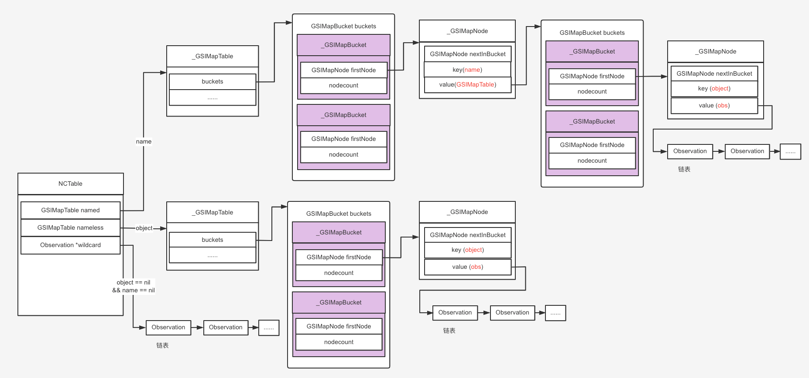

# NSNotificationCenter

本文主要介绍 `NSNotificationCenter ` 的底层实现。

<br>

## 一、NSNotification

`NSNotification` 包含名称、对象、可选字典。

- 名称：`NSNotification` 的名称

- 对象：通知的发布者想要发送给该通知的观察者的任何对象（通常是发布通知的对象）
- 可选字典：可能包含有关通知的附加信息

定义如下：

```Objective-C
@interface NSNotification : NSObject <NSCopying, NSCoding>

@property (readonly, copy) NSNotificationName name;
@property (nullable, readonly, retain) id object;
@property (nullable, readonly, copy) NSDictionary *userInfo;

- (instancetype)initWithName:(NSNotificationName)name object:(nullable id)object userInfo:(nullable NSDictionary *)userInfo API_AVAILABLE(macos(10.6), ios(4.0), watchos(2.0), tvos(9.0)) NS_DESIGNATED_INITIALIZER;
- (nullable instancetype)initWithCoder:(NSCoder *)coder NS_DESIGNATED_INITIALIZER;

@end


@interface NSNotification (NSNotificationCreation)

+ (instancetype)notificationWithName:(NSNotificationName)aName object:(nullable id)anObject;
+ (instancetype)notificationWithName:(NSNotificationName)aName object:(nullable id)anObject userInfo:(nullable NSDictionary *)aUserInfo;

- (instancetype)init /*API_UNAVAILABLE(macos, ios, watchos, tvos)*/;	/* do not invoke; not a valid initializer for this class */

@end
```

> You don’t usually create your own notifications directly, but instead call the `NSNotificationCenter` methods `postNotificationName:object:` and `postNotificationName:object:userInfo:`.

官方文档有句话表明，我们经常使用 `NSNotificationCenter` 的 `postNotificationName:object:` 和 `postNotificationName:object:userInfo:` 来间接创建 `NSNotification` 对象，而不是调用它的初始化方法。

<br>

## 二、GSIMapTable

### 0x01 `_GSIMapBucket`

`_GSIMapBucket` 的定义如下：

```Objective-C
struct _GSIMapNode {
    GSIMapNode nextInBucket;    /* Linked list of bucket.    */
    GSIMapKey key;
#if GSI_MAP_HAS_VALUE
    GSIMapVal    value;
#endif
};

struct _GSIMapBucket {
    uintptr_t nodeCount;    /* Number of nodes in bucket.    */
    GSIMapNode firstNode;    /* The linked list of nodes.    */
};
```

- `_GSIMapBucket` 是一个链表，`firstNode` 是其第一个节点。

- `_GSIMapNode` 是节点的类型。其成员变量 `key` 用于 hash，可算出当前 `_GSIMapBucket` 在数组中的下标。

还需关注两个宏定义，如下：

```Objective-C
#if	!defined(GSI_MAP_TABLE_T)
typedef struct _GSIMapBucket GSIMapBucket_t;
typedef struct _GSIMapNode GSIMapNode_t;

typedef GSIMapBucket_t *GSIMapBucket;
typedef GSIMapNode_t *GSIMapNode;
#endif
```

- `GSIMapBucket` 可看做数组，成员为 `_GSIMapBucket` 类型

- `GSIMapNode` 可看做数组，成员为 `_GSIMapNode ` 类型


### 0x02 `_GSIMapTable `

`_GSIMapTable` 定义如下：
 

```Objective-C
typedef struct _GSIMapTable GSIMapTable_t;
typedef GSIMapTable_t *GSIMapTable;

struct	_GSIMapTable {
    NSZone	*zone;
    uintptr_t nodeCount;	/* Number of used nodes in map.	*/
    uintptr_t bucketCount;	/* Number of buckets in map.	*/
    GSIMapBucket buckets;	/* Array of buckets.		*/
    GSIMapNode	freeNodes;	/* List of unused nodes.	*/
    uintptr_t chunkCount;	/* Number of chunks in array.	*/
    GSIMapNode *nodeChunks;	/* Chunks of allocated memory.	*/
    uintptr_t increment;
#ifdef	GSI_MAP_EXTRA
    GSI_MAP_EXTRA	extra;
#endif
};
```

- `buckets` 其实是个散列表，其成员是链表。使用 `node->key` 快速算出 `node` 对应的 `bucket` 在 `buckets` 中的位置

- `nodeChunks` 可看做二维数组 `[[_GSIMapNode, ...], [_GSIMapNode, ...], ...]`
- `freeNodes` 是个单向连表，存储要释放的元素

所以 `_GSIMapTable` 的结构如下：

```Objective-C
 *  A rough picture is include below:
 *   
 *  
 *   This is the map                C - array of the buckets
 *   +---------------+             +---------------+
 *   | _GSIMapTable  |      /----->| nodeCount     |  
 *   |---------------|     /       | firstNode ----+--\  
 *   | buckets    ---+----/        | ..........    |  |
 *   | bucketCount  =| size of --> | nodeCount     |  |
 *   | nodeChunks ---+--\          | firstNode     |  |
 *   | chunkCount  =-+\ |          |     .         |  | 
 *   |   ....        || |          |     .         |  |
 *   +---------------+| |          | nodeCount     |  |
 *                    | |          | fistNode      |  | 
 *                    / |          +---------------+  | 
 *         ----------   v                             v
 *       /       +----------+      +---------------------------+ 
 *       |       |  * ------+----->| Node1 | Node2 | Node3 ... | a chunk
 *   chunkCount  |  * ------+--\   +---------------------------+
 *  is size of = |  .       |   \  +-------------------------------+
 *               |  .       |    ->| Node n | Node n + 1 | ...     | another
 *               +----------+      +-------------------------------+
 *               array pointing
 *               to the chunks
```

### 0x03 `buckets`

hash 算出对应 `bucket` 在 `buckets` 的下标

```Objective-C
GS_STATIC_INLINE GSIMapBucket
GSIMapPickBucket(unsigned hash, GSIMapBucket buckets, uintptr_t bucketCount)
{
    return buckets + hash % bucketCount;
}

GS_STATIC_INLINE GSIMapBucket
GSIMapBucketForKey(GSIMapTable map, GSIMapKey key)
{
    return GSIMapPickBucket(GSI_MAP_HASH(map, key), map->buckets, map->bucketCount);
}

```

将 `node` 添加到 `map` 中

```Objective-C
/// insert `node` to bucket (头插法 )
GS_STATIC_INLINE void GSIMapLinkNodeIntoBucket(GSIMapBucket bucket, GSIMapNode node)
{
    node->nextInBucket = bucket->firstNode;
    bucket->firstNode = node;
}

/// insert `node` to bucket
GS_STATIC_INLINE void GSIMapAddNodeToBucket(GSIMapBucket bucket, GSIMapNode node)
{
    GSIMapLinkNodeIntoBucket(bucket, node);
    bucket->nodeCount += 1;
}

/// add `node` to map
GS_STATIC_INLINE void GSIMapAddNodeToMap(GSIMapTable map, GSIMapNode node)
{
    GSIMapBucket    bucket;
    // node->key 散列函数算出 node 所在的 bucket
    bucket = GSIMapBucketForKey(map, node->key);
    // 将 node 添加到对应的 bucket
    GSIMapAddNodeToBucket(bucket, node);
    map->nodeCount++;
}
```

从 `map` 中删除对应的 `node`


```Objective-C
/// delete `node` form bucket
GS_STATIC_INLINE void GSIMapUnlinkNodeFromBucket(GSIMapBucket bucket, GSIMapNode node)
{
    if (node == bucket->firstNode)
    {
        bucket->firstNode = node->nextInBucket;
    }
    else
    {
        GSIMapNode tmp = bucket->firstNode;
        
        while (tmp->nextInBucket != node)
        {
            tmp = tmp->nextInBucket;
        }
        tmp->nextInBucket = node->nextInBucket;
    }
    node->nextInBucket = 0;
}


/// delete `node` from bucket
GS_STATIC_INLINE void GSIMapRemoveNodeFromBucket(GSIMapBucket bucket, GSIMapNode node)
{
    bucket->nodeCount--;
    GSIMapUnlinkNodeFromBucket(bucket, node);
}

/// delete `node` from map
GS_STATIC_INLINE void
GSIMapRemoveNodeFromMap(GSIMapTable map, GSIMapBucket bkt, GSIMapNode node)
{
    map->nodeCount--;
    GSIMapRemoveNodeFromBucket(bkt, node);
}
```

删除并释放 `node`

```Objective-C
GS_STATIC_INLINE void GSIMapFreeNode(GSIMapTable map, GSIMapNode node)
{
    GSI_MAP_RELEASE_KEY(map, node->key);
    GSI_MAP_CLEAR_KEY(node);
#if	GSI_MAP_HAS_VALUE
    GSI_MAP_RELEASE_VAL(map, node->value);
    GSI_MAP_CLEAR_VAL(node);
#endif
    
    // 将待释放的 node 插入到 freeNodes 中 (头插法)
    node->nextInBucket = map->freeNodes;
    map->freeNodes = node;
}

GS_STATIC_INLINE GSIMapNode
GSIMapRemoveAndFreeNode(GSIMapTable map, uintptr_t bkt, GSIMapNode node)
{
    GSIMapNode next = node->nextInBucket;
    // delete node from map
    GSIMapRemoveNodeFromMap(map, &(map->buckets[bkt]), node);
    // free node that deleted from map
    GSIMapFreeNode(map, node);
    return next;
}
```

根据 `key` 在 `map` 中查找对应的 `node`

```Objective-C
/// lookup node from bucket
GS_STATIC_INLINE GSIMapNode
GSIMapNodeForKeyInBucket(GSIMapTable map, GSIMapBucket bucket, GSIMapKey key)
{
    GSIMapNode    node = bucket->firstNode;
    
    if (GSI_MAP_ZEROED(map))
    {
        while ((node != 0)
               && GSI_MAP_EQUAL(map, GSI_MAP_READ_KEY(map, &node->key), key) == NO)
        {
            GSIMapNode    tmp = node->nextInBucket;
            
            if (GSI_MAP_NODE_IS_EMPTY(map, node))
            {
                GSIMapRemoveNodeFromMap(map, bucket, node);
                GSIMapFreeNode(map, node);
            }
            node = tmp;
        }
        return node;
    }
    while ((node != 0)
           && GSI_MAP_EQUAL(map, GSI_MAP_READ_KEY(map, &node->key), key) == NO)
    {
        node = node->nextInBucket;
    }
    return node;
}

/// lookup node from map table
GS_STATIC_INLINE GSIMapNode GSIMapNodeForKey(GSIMapTable map, GSIMapKey key)
{
    GSIMapBucket    bucket;
    GSIMapNode    node;
    
    if (map->nodeCount == 0)
    {
        return 0;
    }
    bucket = GSIMapBucketForKey(map, key);
    node = GSIMapNodeForKeyInBucket(map, bucket, key);
    return node;
}
```

<br>

## 三、NSNotificationCenter

### 0x01 `Observation`

`Observation` 的定义如下：

```Objective-C
/*
 * Observation structure - One of these objects is created for
 * each -addObserver... request.  It holds the requested selector,
 * name and object.  Each struct is placed in one LinkedList,
 * as keyed by the NAME/OBJECT parameters.
 * If 'next' is 0 then the observation is unused (ie it has been
 * removed from, or not yet added to  any list).  The end of a
 * list is marked by 'next' being set to 'ENDOBS'.
 *
 * This is normally a structure which handles memory management using a fast
 * reference count mechanism, but when built with clang for GC, a structure
 * can't hold a zeroing weak pointer to an observer so it's implemented as a
 * trivial class instead ... and gets managed by the garbage collector.
 */

typedef	struct	Obs {
    id		observer;	/* Object to receive message.	*/
    SEL		selector;	/* Method selector.		*/
    struct Obs	*next;		/* Next item in linked list.	*/
    int		retained;	/* Retain count for structure.	*/
    struct NCTbl	*link;		/* Pointer back to chunk table	*/
} Observation;
```

- `observer`：观察者

- `selector`：接到通知时响应方法
- `next`：链表，下一个 `Observation` 


### 0x02 `NCTable`

`NCTable` 定义如下：


```Objective-C
#define	CHUNKSIZE	128
#define	CACHESIZE	16

typedef struct NCTbl {
    Observation		*wildcard;	/* Get ALL messages.		*/
    GSIMapTable		nameless;	/* Get messages for any name.	*/
    GSIMapTable		named;		/* Getting named messages only.	*/
    unsigned		lockCount;	/* Count recursive operations.	*/
    NSRecursiveLock	*_lock;		/* Lock out other threads.	*/
    Observation		*freeList;
    Observation		**chunks;
    unsigned		numChunks;
    GSIMapTable		cache[CACHESIZE];
    unsigned short	chunkIndex;
    unsigned short	cacheIndex;
} NCTable;
```

- `named`：散列表结构，存储带有 `name` 的通知，不管 `object` 是否有值

- `nameless`：散列表结构，存储 `name` 为空，但`object` 是有值的通知
- `wildcard`：链表结构，存储 `name` 和 `object` 都为空的通知


### 0x03 `addObserver:selector:name:object:`

`NSNotificationCenter` 的添加观察者方法 `addObserver:selector:name:object:` 实现如下：

```Objective-C
- (void)addObserver:(id)observer selector:(SEL)selector name:(NSString*)name object:(id)object
{
    Observation	*list;
    Observation	*obs;
    GSIMapTable	mapTable;
    GSIMapNode	node;
    
    if (observer == nil)
        [NSException raise: NSInvalidArgumentException format: @"Nil observer passed to addObserver ..."];
    
    if (selector == 0)
        [NSException raise: NSInvalidArgumentException format: @"Null selector passed to addObserver ..."];
    
    if ([observer respondsToSelector: selector] == NO)
    {
        [NSException raise: NSInvalidArgumentException format: @"[%@-%@] Observer '%@' does not respond to selector '%@'",
         NSStringFromClass([self class]), NSStringFromSelector(_cmd), observer, NSStringFromSelector(selector)];
    }
    
    lockNCTable(TABLE);
    
    //
    obs = obsNew(TABLE, selector, observer);
    
    /*
     * Record the Observation in one of the linked lists.
     *
     * NB. It is possible to register an observer for a notification more than
     * once - in which case, the observer will receive multiple messages when
     * the notification is posted... odd, but the MacOS-X docs specify this.
     */
     // name 有值
    if (name)
    {
        // Locate the map table for this name - create it if not present.
        node = GSIMapNodeForKey(NAMED, (GSIMapKey)(id)name);
        if (node == 0)
        {
            // create GSIMapTable or read cache from nc table
            mapTable = mapNew(TABLE);
            // As this is the first observation for the given name, we take a copy of the name so it cannot be mutated while in the map.
            name = [name copyWithZone: NSDefaultMallocZone()];
            // 通过 name 没找到对应的 node，则新建 mapTable 并存入 NAMED 中
            GSIMapAddPair(NAMED, (GSIMapKey)(id)name, (GSIMapVal)(void*)mapTable);
            GS_CONSUMED(name)
        }
        else
        {
            // 通过 name 找到对应的 node, 则取出 mapTable
            mapTable = (GSIMapTable)node->value.ptr;
        }
        
        // Add the observation to the list for the correct object.
        // 通过 object 在 mapTable 中找对应的 node
        node = GSIMapNodeForSimpleKey(mapTable, (GSIMapKey)object);
        if (node == 0)
        {
            obs->next = ENDOBS;
            // node 不存在，则存入
            GSIMapAddPair(mapTable, (GSIMapKey)object, (GSIMapVal)obs);
        }
        else
        {
            // node 存在，头插法插入到链表中
            list = (Observation*)node->value.ptr;
            obs->next = list->next;
            list->next = obs;
        }
    }
    else if (object) // object 有值
    {
        node = GSIMapNodeForSimpleKey(NAMELESS, (GSIMapKey)object);
        if (node == 0)
        {
            obs->next = ENDOBS;
            GSIMapAddPair(NAMELESS, (GSIMapKey)object, (GSIMapVal)obs);
        }
        else
        {
            list = (Observation*)node->value.ptr;
            obs->next = list->next;
            list->next = obs;
        }
    }
    else // name 和 object 都为空
    {
        obs->next = WILDCARD;
        WILDCARD = obs;
    }
    
    unlockNCTable(TABLE);
}
```

- 首先是异常处理

- 若 `name` 不为空
	- 通过 `name` 在 `named` 中查找对应的 `node`，若 `node` 不存在则创建 `mapTable`，并以 `node` 为 key，`mapTable` 为 value 存入到 `named` 中

	- 若找到对应的 `node`，则取出 `GSIMapTable `，也就是 `node->value.ptr`
	- 然后通过 `object` 在 `mapTable` 中查找 `node`
	- 若 `node` 不存在，则以 `object` 为 key，`obs` 为 value 存入到 `mapTable ` 中
	- 若 `node` 存在，则取出 `list = node->value.ptr`，然后用头插法将 `obs`插入到链表 `list` 中
- 若 `name` 为空，`object` 不为空
	- 以 `object` 为 key 在 `nameless` 中查找对应的 `node`
	
	- 若 `node` 不存在，则以 `object` 为 key，`obs` 为 value 存入到 `nameless ` 中
	- 若 `node` 存在，则取出 `list = node->value.ptr`，然后用头插法将 `obs`插入到链表 `list` 中
- 若 `name` 和 `object` 都为空
	- 使用头插法将 `obs` 存入到链表 `wildcard` 中




### 0x04 `postNotificationName:`


```Objective-C
/**
 * Posts notification to all the observers that match its NAME and OBJECT.<br />
 * The GNUstep implementation calls -postNotificationName:object:userInfo: to
 * perform the actual posting.
 */
- (void)postNotification:(NSNotification*)notification
{
    if (notification == nil)
    {
        [NSException raise: NSInvalidArgumentException format: @"Tried to post a nil notification."];
    }
    [self _postAndRelease: RETAIN(notification)];
}

/**
 * Creates and posts a notification using the
 * -postNotificationName:object:userInfo: passing a nil user info argument.
 */
- (void)postNotificationName:(NSString*)name object:(id)object
{
    [self postNotificationName: name object: object userInfo: nil];
}

/**
 * The preferred method for posting a notification.
 * <br />
 * For performance reasons, we don't wrap an exception handler round every
 * message sent to an observer.  This means that, if one observer raises
 * an exception, later observers in the lists will not get the notification.
 */
- (void)postNotificationName:(NSString*)name object:(id)object userInfo:(NSDictionary*)info
{
    GSNotification	*notification;
    
    notification = (id)NSAllocateObject(concrete, 0, NSDefaultMallocZone());
    notification->_name = [name copyWithZone: [self zone]];
    notification->_object = [object retain];
    notification->_info = [info retain];
    [self _postAndRelease: notification];
}
```

最终都会来到这里

```Objective-C
/**
 * Private method to perform the actual posting of a notification.
 * Release the notification before returning, or before we raise
 * any exception ... to avoid leaks.
 */
- (void)_postAndRelease:(NSNotification*)notification
{
    Observation	*o;
    unsigned	count;
    NSString	*name = [notification name];
    id		object;
    GSIMapNode	n;
    GSIMapTable	m;
    GSIArrayItem	i[64];
    GSIArray_t	b;
    GSIArray	a = &b;
    
    if (name == nil)
    {
        RELEASE(notification);
        [NSException raise: NSInvalidArgumentException format: @"Tried to post a notification with no name."];
    }
    object = [notification object];
    
    /*
     * Lock the table of observations while we traverse it.
     *
     * The table of observations contains weak pointers which are zeroed when
     * the observers get garbage collected.  So to avoid consistency problems
     * we disable gc while we copy all the observations we are interested in.
     * We use scanned memory in the array in the case where there are more
     * than the 64 observers we allowed room for on the stack.
     */
    GSIArrayInitWithZoneAndStaticCapacity(a, _zone, 64, i);
    lockNCTable(TABLE);
    
    // Find all the observers that specified neither NAME nor OBJECT.
    for (o = WILDCARD = purgeCollected(WILDCARD); o != ENDOBS; o = o->next)
    {
        GSIArrayAddItem(a, (GSIArrayItem)o);
    }
    
    // Find the observers that specified OBJECT, but didn't specify NAME.
    if (object)
    {
        n = GSIMapNodeForSimpleKey(NAMELESS, (GSIMapKey)object);
        if (n != 0)
        {
            o = purgeCollectedFromMapNode(NAMELESS, n);
            while (o != ENDOBS)
            {
                GSIArrayAddItem(a, (GSIArrayItem)o);
                o = o->next;
            }
        }
    }
    
    // Find the observers of NAME, except those observers with a non-nil OBJECT that doesn't match the notification's OBJECT).
    if (name)
    {
        n = GSIMapNodeForKey(NAMED, (GSIMapKey)((id)name));
        if (n) {
            m = (GSIMapTable)n->value.ptr;
        } else { m = 0; }
        
        if (m != 0)
        {
            // First, observers with a matching object.
            n = GSIMapNodeForSimpleKey(m, (GSIMapKey)object);
            if (n != 0)
            {
                o = purgeCollectedFromMapNode(m, n);
                while (o != ENDOBS)
                {
                    GSIArrayAddItem(a, (GSIArrayItem)o);
                    o = o->next;
                }
            }
            
            if (object != nil)
            {
                // Now observers with a nil object.
                n = GSIMapNodeForSimpleKey(m, (GSIMapKey)nil);
                if (n != 0)
                {
                    o = purgeCollectedFromMapNode(m, n);
                    while (o != ENDOBS)
                    {
                        GSIArrayAddItem(a, (GSIArrayItem)o);
                        o = o->next;
                    }
                }
            }
        }
    }
    
    // Finished with the table ... we can unlock it,
    unlockNCTable(TABLE);
    
    // Now send all the notifications.
    count = GSIArrayCount(a);
    while (count-- > 0)
    {
        o = GSIArrayItemAtIndex(a, count).ext;
        if (o->next != 0)
        {
            NS_DURING
            {
                [o->observer performSelector: o->selector withObject: notification];
            }
            NS_HANDLER
            {
                NSLog(@"Problem posting notification: %@", localException);
            }
            NS_ENDHANDLER
        }
    }
    lockNCTable(TABLE);
    GSIArrayEmpty(a);
    unlockNCTable(TABLE);
    
    RELEASE(notification);
}
```

- 用 `name`、`object`、`userInfo` 实例化 `Notification`

- 创建动态数组，用于保存 `obs`
- 先从 `wildcard` 中取出所有的 `obs` 并添加到数组中
- 再从 `nameless` 中通过 `object` 取出所有的 `obs` 并添加到数组中
- 最后从 `named` 中通过 `name` 取出所有的 `obs` 并添加到数组中
	- 由 `object` 找到对应的 `obs`，添加到数组中
	
	- 若 `object != nil`, 将 `nil` 作为 key 找到对应的 `obs` 并添加到数组中
- 遍历数组中的 `obs` 并执行方法 `[o->observer performSelector:o->selector withObject:notification]`
- 释放 `Notification`

<br>

### 0x05 总结

通知要先 `addObserver:` 再 `postNotificationName:`， 才能正常接收通知并响应方法。因为需要先在 `addObserver:` 方法中存储 `observer` 和 `selector`，再通过 `postNotificationName:`方法取出 `observer` 和 `selector` 并执行。

```Objective-C
[[NSNotificationCenter defaultCenter] postNotificationName:Test_Notification_Name object:self];
[[NSNotificationCenter defaultCenter] addObserver:self selector:@selector(actionTestNotifition:) name:Test_Notification_Name object:self];

// 将不会有任何打印，也就是没监听到通知。
```

以如下代码为例，解释 `addObserver:` 方法中 `name` 和 `object` 是否有值时，监听通知：

```Objective-C
- (void)viewDidLoad {
    [super viewDidLoad];
    [[NSNotificationCenter defaultCenter] addObserver:self selector:@selector(actionTestNotifition:) name:nil object:nil];
}

- (void)actionTestNotifition:(NSNotification *)noti
{
    NSLog(@"%s --- %@", __func__, noti.name);
    NSLog(@"%@--- %@", noti.object, noti.userInfo);
}

- (void)touchesBegan:(NSSet<UITouch *> *)touches withEvent:(UIEvent *)event
{
    [[NSNotificationCenter defaultCenter] postNotificationName:Test_Notification_Name object:self.obj];
    [[NSNotificationCenter defaultCenter] postNotificationName:Test_Notification_Name object:self];
    [[NSNotificationCenter defaultCenter] postNotificationName:Test_Notification_Name object:nil userInfo:@{@"key": @"value"}];
}
```

若 `addObserver:` 方法中 `name` 和 `object` 都为空，则会监听所有通知

```Objective-C
[[NSNotificationCenter defaultCenter] addObserver:self selector:@selector(actionTestNotifition:) name:nil object:nil];

// 打印结果
-[ViewController actionTestNotifition:] --- UIApplicationResumedEventsOnlyNotification
<UIApplication: 0x7f9673604ac0>--- (null)

-[ViewController actionTestNotifition:] --- UIDeviceOrientationDidChangeNotification
<UIDevice: 0x600002eb6020>--- {
    UIDeviceOrientationRotateAnimatedUserInfoKey = 1;
}

-[ViewController actionTestNotifition:] --- _UIApplicationDidRemoveDeactivationReasonNotification
<UIApplication: 0x7f9673604ac0>--- {
    "_UIApplicationDeactivationReasonUserInfoKey" = 12;
}

-[ViewController actionTestNotifition:] --- UIApplicationDidBecomeActiveNotification
<UIApplication: 0x7f9673604ac0>--- (null)
```

若 `addObserver:` 方法中 `name` 为空，`object` 不为空，则会监听所有 `object` 相同的通知

```Objective-C
[[NSNotificationCenter defaultCenter] addObserver:self selector:@selector(actionTestNotifition:) name:nil object:self.obj];

// 打印结果
-[ViewController actionTestNotifition:] --- ZZ_Test_Notification_Name
<NSObject: 0x6000038e0500>--- (null)
```

若 `addObserver:` 方法中 `name` 不为空，`object` 为空，则会监听所有 `name` 相同的通知，不管 `object` 是否有值

```Objective-C
[[NSNotificationCenter defaultCenter] addObserver:self selector:@selector(actionTestNotifition:) name:Test_Notification_Name object:nil];

// 打印结果
-[ViewController actionTestNotifition:] --- ZZ_Test_Notification_Name
<NSObject: 0x600001890580>--- (null)

-[ViewController actionTestNotifition:] --- ZZ_Test_Notification_Name
<ViewController: 0x7f8900c07d90>--- (null)

-[ViewController actionTestNotifition:] --- ZZ_Test_Notification_Name
(null)--- {
    key = value;
}
```

若 `addObserver:` 方法中 `name` 和 `object` 都不为空，则会监听所有 `name` 和 `object` 都相同的通知

```Objective-C
[[NSNotificationCenter defaultCenter] addObserver:self selector:@selector(actionTestNotifition:) name:Test_Notification_Name object:self];

// 打印结果
-[ViewController actionTestNotifition:] --- ZZ_Test_Notification_Name
<ViewController: 0x7fe77bc091f0>--- (null)
```


<br>

### 0x06 `removeObserver:`

```Objective-C
/**
 * Deregisters observer for notifications matching name and/or object.  If
 * either or both is nil, they act like wildcards.  The observer may still
 * remain registered for other notifications; use -removeObserver: to remove
 * it from all.  If observer is nil, the effect is to remove all registrees
 * for the specified notifications, unless both observer and name are nil, in
 * which case nothing is done.
 */
- (void)removeObserver:(id)observer name:(NSString*)name object:(id)object
{
    if (name == nil && object == nil && observer == nil) return;
    
    /*
     *	NB. The removal algorithm depends on an implementation characteristic
     *	of our map tables - while enumerating a table, it is safe to remove
     *	the entry returned by the enumerator.
     */
    lockNCTable(TABLE);
    
    if (name == nil && object == nil) {
        WILDCARD = listPurge(WILDCARD, observer);
    }
    
    if (name == nil)
    {
        GSIMapEnumerator_t	e0;
        GSIMapNode n0;
        
        // First try removing all named items set for this object.
        e0 = GSIMapEnumeratorForMap(NAMED);
        n0 = GSIMapEnumeratorNextNode(&e0);
        while (n0 != 0)
        {
            GSIMapTable m = (GSIMapTable)n0->value.ptr;
            NSString	*thisName = (NSString*)n0->key.obj;
            
            n0 = GSIMapEnumeratorNextNode(&e0);
            if (object == nil)
            {
                GSIMapEnumerator_t	e1 = GSIMapEnumeratorForMap(m);
                GSIMapNode n1 = GSIMapEnumeratorNextNode(&e1);
                
                /*
                 * Nil object and nil name, so we step through all the maps
                 * keyed under the current name and remove all the objects
                 * that match the observer.
                 */
                while (n1 != 0)
                {
                    GSIMapNode next = GSIMapEnumeratorNextNode(&e1);
                    purgeMapNode(m, n1, observer);
                    n1 = next;
                }
            }
            else
            {
                GSIMapNode n1;
                
                /*
                 * Nil name, but non-nil object - we locate the map for the
                 * specified object, and remove all the items that match
                 * the observer.
                 */
                n1 = GSIMapNodeForSimpleKey(m, (GSIMapKey)object);
                if (n1 != 0)
                {
                    purgeMapNode(m, n1, observer);
                }
            }
            // If we removed all the observations keyed under this name, we must remove the map table too.
            if (m->nodeCount == 0)
            {
                mapFree(TABLE, m);
                GSIMapRemoveKey(NAMED, (GSIMapKey)(id)thisName);
            }
        }
        
        // Now remove unnamed items
        if (object == nil)
        {
            e0 = GSIMapEnumeratorForMap(NAMELESS);
            n0 = GSIMapEnumeratorNextNode(&e0);
            while (n0 != 0)
            {
                GSIMapNode	next = GSIMapEnumeratorNextNode(&e0);
                purgeMapNode(NAMELESS, n0, observer);
                n0 = next;
            }
        }
        else
        {
            n0 = GSIMapNodeForSimpleKey(NAMELESS, (GSIMapKey)object);
            if (n0 != 0)
            {
                purgeMapNode(NAMELESS, n0, observer);
            }
        }
    }
    else
    {
        GSIMapTable m;
        GSIMapEnumerator_t	e0;
        GSIMapNode n0;
        
        /*
         * Locate the map table for this name.
         */
        n0 = GSIMapNodeForKey(NAMED, (GSIMapKey)((id)name));
        if (n0 == 0)
        {
            unlockNCTable(TABLE);
            return;		/* Nothing to do.	*/
        }
        m = (GSIMapTable)n0->value.ptr;
        
        if (object == nil)
        {
            e0 = GSIMapEnumeratorForMap(m);
            n0 = GSIMapEnumeratorNextNode(&e0);
            
            while (n0 != 0)
            {
                GSIMapNode	next = GSIMapEnumeratorNextNode(&e0);
                purgeMapNode(m, n0, observer);
                n0 = next;
            }
        }
        else
        {
            n0 = GSIMapNodeForSimpleKey(m, (GSIMapKey)object);
            if (n0 != 0)
            {
                purgeMapNode(m, n0, observer);
            }
        }
        if (m->nodeCount == 0)
        {
            mapFree(TABLE, m);
            GSIMapRemoveKey(NAMED, (GSIMapKey)((id)name));
        }
    }
    unlockNCTable(TABLE);
}

/**
 * Deregisters observer from all notifications.  This should be called before
 * the observer is deallocated.
 */
- (void)removeObserver:(id)observer
{
    if (observer == nil) return;
    [self removeObserver: observer name: nil object: nil];
}
```

**通知的移除是以 `observer` 为维度**，要遍历散列表中所有和 `observer` 相同的 `obs`，然后移除。

- 若 `name` 和 `object` 都为空，则删除链表 `wildcard` 中和 `observer` 相同的 `obs`

- 若 `name` 为空
	- 首先遍历 `named` 
		-  若 `object` 为空，遍历删除所有和 `observer` 相同的 `obs`
		
		-  若 `object` 不为空，先以 `object` 为 key 取出对应的链表，然后删除链表中和 `observer` 相同的 `obs`
	- 然后遍历 `nameless`
		-  若 `object` 为空，遍历删除所有和 `observer` 相同的 `obs`
		
		-  若 `object` 不为空，先以 `object` 为 key 取出对应的链表，然后删除链表中和 `observer` 相同的 `obs`
- 若 `name` 不为空，以 `name` 为 key 在 `named` 中找到 `bucket`
	-  若 `object` 为空，遍历删除所有和 `observer` 相同的 `obs`
		
	-  若 `object` 不为空，先以 `object` 为 key 取出对应的链表，然后删除链表中和 `observer` 相同的 `obs`

	
再引用一段官方文档中关于移除通知的描述：

> Removing the observer stops it from receiving notifications.
>
> If you used `addObserverForName:object:queue:usingBlock:` to create your observer, you should call this method or `removeObserver:` before the system deallocates any object that `addObserverForName:object:queue:usingBlock:` specifies.
>
> If your app targets iOS 9.0 and later or macOS 10.11 and later, and you used `addObserver:selector:name:object:` to create your observer, you do not need to unregister the observer. If you forget or are unable to remove the observer, the system cleans up the next time it would have posted to it.
>
> When unregistering an observer, use the most specific detail possible. For example, if you used a name and object to register the observer, use `removeObserver:name:object:` with the name and object.

大致意思是：

- 若是用 `addObserverForName:object:queue:usingBlock:` 方法监听通知，则需要自己手动调用 `removeObserver:` 来移除通知

- 若是用 `addObserver:selector:name:object:` 方法监听通知，iOS 9 之后系统会在 `observer` 释放时自动移除通知
- 若手动移除通知，则要尽可能的使用更具体的方法来移除 `removeObserver:name:object:` 。

<br>

### 0x07 `GSNotificationObserver`

`NSNotificationCenter` 还有个添加监听通知方法 `addObserverForName:object:queue:usingBlock:`。此方法可以实现**在收到通知后在指定线程中响应**。

`addObserverForName:object:queue:usingBlock:` 的具体实现如下：

```Objective-C
/**
 * <p>Returns a new observer added to the notification center, in order to
 * observe the given notification name posted by an object or any object (if
 * the object argument is nil).</p>
 *
 * <p>For the name and object arguments, the constraints and behavior described
 * in -addObserver:name:selector:object: remain valid.</p>
 *
 * <p>For each notification received by the center, the observer will execute
 * the notification block. If the queue is not nil, the notification block is
 * wrapped in a NSOperation and scheduled in the queue, otherwise the block is
 * executed immediately in the posting thread.</p>
 */
- (id)addObserverForName:(NSString *)name
                   object:(id)object
                    queue:(NSOperationQueue *)queue
               usingBlock:(GSNotificationBlock)block
{
    GSNotificationObserver *observer = [[GSNotificationObserver alloc] initWithQueue:queue block:block];
    
    [self addObserver:observer selector:@selector(didReceiveNotification:) name:name object:object];
    return observer;
}
```

将 `queue` 和 `block` 包装在观察者 `GSNotificationObserver ` 中。通过上面分析可知当收到通知时会调用 `[o->observer performSelector:o->selector withObject:notification];`，也就是调用 `GSNotificationObserver` 的 `didReceiveNotification:` 方法。

`GSNotificationObserver ` 的实现如下:

```Objective-C
@implementation GSNotificationObserver

- (id)initWithQueue:(NSOperationQueue *)queue block:(GSNotificationBlock)block
{
    self = [super init];
    if (self == nil) return nil;
    
    ASSIGN(_queue, queue);
    _block = Block_copy(block);
    return self;
}

- (void) dealloc
{
    DESTROY(_queue);
    Block_release(_block);
    [super dealloc];
}

- (void)didReceiveNotification:(NSNotification *)notif
{
    if (_queue != nil)
    {
        GSNotificationBlockOperation *op = [[GSNotificationBlockOperation alloc] initWithNotification:notif block:_block];
        // 添加到队列
        [_queue addOperation: op];
    }
    else
    {
        CALL_BLOCK(_block, notif);
    }
}

@end
```

在 `didReceiveNotification:` 方法中会将 `block` 传到在 `GSNotificationBlockOperation` 中，并添加到指定的队列中。`GSNotificationBlockOperation` 是继承自 `NSOperation` 的类。

```Objective-C
@implementation GSNotificationBlockOperation

- (id)initWithNotification:(NSNotification *)notif block:(GSNotificationBlock)block
{
    self = [super init];
    if (self == nil) return nil;
    
    ASSIGN(_notification, notif);
    _block = Block_copy(block);
    return self;   
}

- (void)dealloc
{
    DESTROY(_notification);
    Block_release(_block);
    [super dealloc];
}

// 自定义继承自 NSOperation 的类需重写 main 或 start 方法
- (void)main
{
    CALL_BLOCK(_block, _notification);
}

@end
```

从代码可以看出是在接收通知之后，将 `block` 转到指定线程中。所以通知还是在 `postNotificationName:` 方法所在的线程收到的，并没有跨线程。


<br>


**Reference**

- [NSNotification - Apple](https://developer.apple.com/documentation/foundation/nsnotification?language=objc)

- [NSNotificationCenter - GNUStep-1.26.0](https://github.com/gnustep/libs-base/blob/master/Source/NSNotificationCenter.m)

<br>