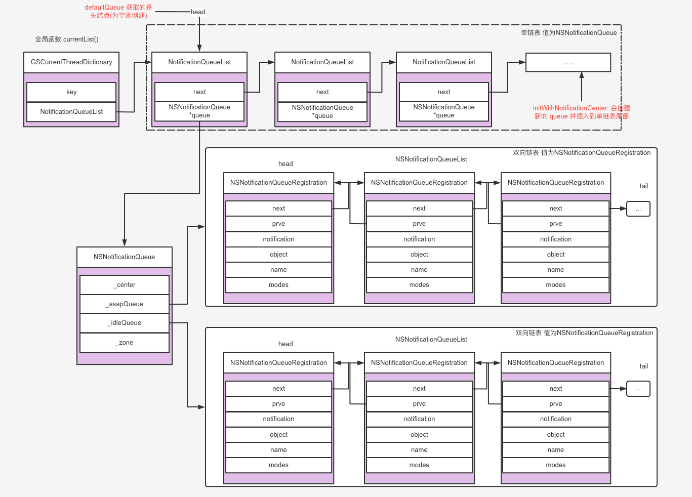

# NSNotificationQueue

本文主要介绍 `NSNotificationQueue` 的使用和底层实现。

<br>

## 一、`NSNotificationQueue ` 使用

对于 NSNotificationQueue 总结如下

依赖 runloop，所以如果在其他子线程使用 `NSNotificationQueue`，需要开启 runloop
最终还是通过 `NSNotificationCenter` 进行发送通知，所以这个角度讲它还是同步的
所谓异步，指的是非实时发送而是在合适的时机发送，并没有开启异步线程

### 0x01 `NSNotificationCoalescing`

`NSNotificationCoalescing` 的定义如下：

```Objective-C
typedef NS_OPTIONS(NSUInteger, NSNotificationCoalescing) {
    NSNotificationNoCoalescing = 0,
    NSNotificationCoalescingOnName = 1,
    NSNotificationCoalescingOnSender = 2
};
```

- `NSNotificationNoCoalescing`：不合并通知

- `NSNotificationCoalescingOnName`：合并相同 `name` 的通知
- `NSNotificationCoalescingOnSender`：合并相同 `object` 的通知


### 0x02 `NSPostingStyle`

`NSPostingStyle` 的定义如下：

```Objective-C
typedef NS_ENUM(NSUInteger, NSPostingStyle) {
    NSPostWhenIdle = 1,
    NSPostASAP = 2,
    NSPostNow = 3
};
```

- `NSPostWhenIdle`：空闲时发送通知。 当 runloop 处于等待或空闲状态时，发送通知。

- `NSPostASAP`：尽快发送通知。当当前 runloop 所执行代码完成时，将会发送通知。
> Any notification enqueued with the NSPostASAP posting style is posted to the notification center when the code executing in the current run loop callout completes. Callouts can be Application Kit event messages, file descriptor changes, timers, or another asynchronous notification.
- `NSPostNow`：立即发通知。它和 `NSNotificationCenter` 的效果一样，使用的它的原因是它可用于在发布通知之前合并先前排队的通知。

```Objective-C
- (void)viewDidLoad {
    [super viewDidLoad];
    
    self.view.backgroundColor = UIColor.redColor;
    
    [[NSNotificationCenter defaultCenter] addObserver:self selector:@selector(actionAsyncNotifition:) name:Test_Notification_Name_Queue object:nil];
    dispatch_async(dispatch_get_global_queue(0, 0), ^{
        [self notifiWithRunloop];
    });
}

- (void)notifiWithRunloop 
{
    CFRunLoopObserverRef observer = CFRunLoopObserverCreateWithHandler(CFAllocatorGetDefault(), kCFRunLoopAllActivities, YES, 0, ^(CFRunLoopObserverRef observer, CFRunLoopActivity activity) {
        if(activity == kCFRunLoopEntry){
            NSLog(@"进入Runloop");
        }else if(activity == kCFRunLoopBeforeWaiting){
            NSLog(@"即将进入等待状态");
        }else if(activity == kCFRunLoopAfterWaiting){
            NSLog(@"结束等待状态");
        }
    });
    CFRunLoopAddObserver(CFRunLoopGetCurrent(), observer, kCFRunLoopDefaultMode);
    CFRelease(observer);
    
    // NSPostWhenIdle
    NSNotification *notification1 = [NSNotification notificationWithName:Test_Notification_Name_Queue object:nil userInfo:@{@"key":@"value1"}];
    [[NSNotificationQueue defaultQueue] enqueueNotification:notification1 postingStyle:NSPostWhenIdle coalesceMask:NSNotificationNoCoalescing forModes:@[NSDefaultRunLoopMode]];
    
    // NSPostASAP
    NSNotification *notification2 = [NSNotification notificationWithName:Test_Notification_Name_Queue object:nil userInfo:@{@"key":@"value2"}];
    [[NSNotificationQueue defaultQueue] enqueueNotification:notification2 postingStyle:NSPostASAP coalesceMask:NSNotificationNoCoalescing forModes:@[NSDefaultRunLoopMode]];
    
    // NSPostNow
    NSNotification *notification3 = [NSNotification notificationWithName:Test_Notification_Name_Queue object:nil userInfo:@{@"key":@"value3"}];
    [[NSNotificationQueue defaultQueue] enqueueNotification:notification3 postingStyle:NSPostNow coalesceMask:NSNotificationNoCoalescing forModes:@[NSDefaultRunLoopMode]];
    
    [[NSRunLoop currentRunLoop] addPort:[NSPort new] forMode:NSDefaultRunLoopMode];
    [[NSRunLoop currentRunLoop] run];
}
```

```Objective-C
-[ViewController actionAsyncNotifition:] --- ZZ_Test_Notification_Name_Queue --- <NSThread: 0x600001a0a5c0>{number = 5, name = (null)}
(null)--- {
    key = value3;
}

进入Runloop
-[ViewController actionAsyncNotifition:] --- ZZ_Test_Notification_Name_Queue --- <NSThread: 0x600001a0a5c0>{number = 5, name = (null)}
(null)--- {
    key = value2;
}

即将进入等待状态
-[ViewController actionAsyncNotifition:] --- ZZ_Test_Notification_Name_Queue --- <NSThread: 0x600001a0a5c0>{number = 5, name = (null)}
(null)--- {
    key = value1;
}

结束等待状态
即将进入等待状态
```

<br>

### 0x03 在指定线程发送通知

通知在哪个线程发布的，就会在哪个线程响应方法。和 `addObserver:` 所在的线程没有关系。

```Objective-C
- (void)viewDidLoad {
    [super viewDidLoad];
    
    [[NSNotificationCenter defaultCenter] addObserver:self selector:@selector(actionTestNotifition:) name:Test_Notification_Name_Queue object:nil];
    
    dispatch_async(dispatch_get_global_queue(0, 0), ^{
        NSLog(@"%@", NSThread.currentThread);
        [[NSNotificationCenter defaultCenter] postNotificationName:Test_Notification_Name_Queue object:nil];
    });
}
```

```Objective-C
<NSThread: 0x600002c7b440>{number = 5, name = (null)}

-[ViewController actionTestNotifition:] --- ZZ_Test_Notification_Name_Queue --- <NSThread: 0x60000278c900>{number = 4, name = (null)}
<ViewController: 0x7f8048807bd0>--- (null)
```

那如何在指定线程接收通知，下面是官网的给出例子

```Objective-C
// ZZParticularThreadNOtification.h

@interface ZZParticularThreadNOtification : NSObject

- (instancetype)initWithThread:(NSThread *)thread;

- (void)setUpThreadingSupport;
- (void)processNotification:(NSNotification *)notification;

@end
```

```Objective-C
// ZZParticularThreadNOtification.m

@interface ZZParticularThreadNOtification ()<NSMachPortDelegate>

@property NSMutableArray *notifications;
@property NSThread *notificationThread;
@property NSLock *notificationLock;
@property NSMachPort *notificationPort;

@end

@implementation ZZParticularThreadNOtification

- (instancetype)initWithThread:(NSThread *)thread
{
    if ([super init]) {
        self.notificationThread =  thread;
        
        self.notifications = [[NSMutableArray alloc] init];
        self.notificationLock  = [[NSLock alloc] init];
        
        self.notificationPort = [[NSMachPort alloc] init];
        [self.notificationPort setDelegate:self];
        [[NSRunLoop currentRunLoop] addPort:self.notificationPort forMode:NSRunLoopCommonModes];
    }
    return self;
}

- (void)setUpThreadingSupport
{
    if (self.notifications) { return; }
    
    self.notifications = [[NSMutableArray alloc] init];
    self.notificationLock  = [[NSLock alloc] init];
    self.notificationThread = [NSThread currentThread];
 
    self.notificationPort = [[NSMachPort alloc] init];
    [self.notificationPort setDelegate:self];
    [[NSRunLoop currentRunLoop] addPort:self.notificationPort forMode:NSRunLoopCommonModes];
}

- (void)processNotification:(NSNotification *)notification
{
    if ([NSThread currentThread] != self.notificationThread) {
        NSLog(@"%s ++++ %@", __func__, [NSThread currentThread]);
        // Forward the notification to the correct thread.
        [self.notificationLock lock];
        [self.notifications addObject:notification];
        [self.notificationLock unlock];
        [self.notificationPort sendBeforeDate:[NSDate date] components:nil from:nil reserved:0];
    }
    else {
        // Process the notification here;
        NSLog(@"%s --- %@", __func__, [NSThread currentThread]);
        NSLog(@"process notification");
    }
}

// NSMachPortDelegate
- (void)handleMachMessage:(void *)msg
{
    NSLog(@"%s --- %@", __func__, [NSThread currentThread]);
    [self.notificationLock lock];
 
    while ([self.notifications count]) {
        NSNotification *notification = [self.notifications objectAtIndex:0];
        [self.notifications removeObjectAtIndex:0];
        [self.notificationLock unlock];
        [self processNotification:notification];
        [self.notificationLock lock];
    };
 
    [self.notificationLock unlock];
}
@end
```

在 `ViewController` 中使用

```Objective-C
- (void)viewDidLoad {
    [super viewDidLoad];
    
    self.particular = [ZZParticularThreadNOtification new];
    [self.particular setUpThreadingSupport];
    [[NSNotificationCenter defaultCenter] addObserver:self.particular selector:@selector(actionAsyncNotifition:) name:Test_Notification_Name_Queue object:nil];
    
    dispatch_async(dispatch_get_global_queue(0, 0), ^{
        NSLog(@"%s---%@", __func__, NSThread.currentThread);
        [[NSNotificationCenter defaultCenter] postNotificationName:Test_Notification_Name_Queue object:self];
    });
}
```
打印结果如下：

```Objective-C
-[ViewController viewDidLoad]_block_invoke---<NSThread: 0x600002430d80>{number = 5, name = (null)}
-[ZZParticularThreadNOtification processNotification:] ++++ <NSThread: 0x600002430d80>{number = 5, name = (null)}
-[ZZParticularThreadNOtification handleMachMessage:] --- <NSThread: 0x600002478140>{number = 1, name = main}
-[ZZParticularThreadNOtification processNotification:] --- <NSThread: 0x600002478140>{number = 1, name = main}
process notification
```

<br>

## 二、NotificationQueueList

`NotificationQueueList` 的代码实现如下：

```Objective-C
static	NSString*	lkey = @"NotificationQueueListThreadKey";
static	NSString*	qkey = @"NotificationQueueThreadKey";

@interface	NotificationQueueList : NSObject
{
@public
    NotificationQueueList *next;
    NSNotificationQueue	 *queue;
}
+ (void)registerQueue:(NSNotificationQueue*)q;
+ (void)unregisterQueue:(NSNotificationQueue*)q;
@end
```

```Objective-C
@implementation	NotificationQueueList

- (void) dealloc
{
    while (next != nil)
    {
        NotificationQueueList	*tmp = next;
        
        next = tmp->next;
        RELEASE(tmp);
    }
    [super dealloc];
}

+ (void)registerQueue:(NSNotificationQueue*)notiQueue
{
    NotificationQueueList *list;
    NotificationQueueList *elem;
    
    list = currentList();	/* List of queues for thread.	*/
    
    // Make this the default.
    if (list->queue == nil)
    {
        list->queue = notiQueue;
    }
    
    while (list->queue != notiQueue && list->next != nil)
    {
        list = list->next;
    }
    
    // Queue already registered.
    if (list->queue == notiQueue) { return; }
    
    // 不在链表中 新建链表节点，尾插法插入链表
    elem = (NotificationQueueList*)NSAllocateObject(self, 0, NSDefaultMallocZone());
    elem->queue = notiQueue;
    list->next = elem;
}

+ (void)unregisterQueue:(NSNotificationQueue*)q
{
    NotificationQueueList	*list = currentList();
    
    if (list->queue == q)
    {
        // 头结点就是要找到的 queue
        NSMutableDictionary *d = GSCurrentThreadDictionary();
        NotificationQueueList	*tmp = list->next;
        
        if (tmp != nil)
        {
            // 下一个节点不为空，则将其记录在字典中，以便下次调用 currentList() 获取到正确的值
            [d setObject:tmp forKey:lkey];
            RELEASE(tmp);			/* retained in dictionary.	*/
        }
        else
        {
            // 下个节点为空 则从字典中直接删除
            [d removeObjectForKey:lkey];
        }
    }
    else
    {
        // 头结点不是要找到的 queue, 则遍历往后查找，找到后删除并释放
        while (list->next != nil)
        {
            if (list->next->queue == q)
            {
                NotificationQueueList	*tmp = list->next;
                
                list->next = tmp->next;
                RELEASE(tmp);
                break;
            }
        }
    }
}

@end
```

`NotificationQueueList` 实际是个单链表。单链表中存储的值为 `NSNotificationQueue` 对象。

单链表的头结点存储在 `GSCurrentThreadDictionary()` 中，并通过全局函数 `currentList()` 获取。


```Objective-C
static NotificationQueueList* currentList(void)
{
    // 不同线程 dict 不同
    NSMutableDictionary *d = GSCurrentThreadDictionary();;
    NotificationQueueList *list = (NotificationQueueList*)[d objectForKey:lkey];
    
    if (list == nil)
    {
        list = [NotificationQueueList new];
        [d setObject:list forKey:lkey];
        RELEASE(list);	/* retained in dictionary.	*/
    }
    return list;
}
```


<br>

## 三、NSNotificationQueueList

`NSNotificationQueueList` 的结构如下：

```Objective-C
/// NSNotificationQueue queue

typedef struct _NSNotificationQueueRegistration
{
    struct _NSNotificationQueueRegistration	*next;
    struct _NSNotificationQueueRegistration	*prev;
    NSNotification *notification;
    id	name;
    id	object;
    NSArray *modes;
} NSNotificationQueueRegistration;

struct _NSNotificationQueueList;

// 双向链表
typedef struct _NSNotificationQueueList
{
    struct _NSNotificationQueueRegistration	*head;
    struct _NSNotificationQueueRegistration	*tail;
} NSNotificationQueueList;
```

`NSNotificationQueueList` 实际是个双向链表，存储的值包含 `notification`、`name`、`object`、`modes` 。

并提供新增节点和删除节点函数 (自己画个双向链表的图，下面代码很容易理解)

```Objective-C
static inline void
remove_from_queue_no_release(NSNotificationQueueList *queue, NSNotificationQueueRegistration *item)
{
    if (item->next)
    {
        item->next->prev = item->prev;
    }
    else
    {
        NSCAssert(queue->tail == item, @"tail item not at tail of queue!");
        queue->tail = item->prev;
    }
    
    if (item->prev)
    {
        item->prev->next = item->next;
    }
    else
    {
        NSCAssert(queue->head == item, @"head item not at head of queue!");
        queue->head = item->next;
    }
}

static void
remove_from_queue(NSNotificationQueueList *queue, NSNotificationQueueRegistration *item, NSZone *_zone)
{
    remove_from_queue_no_release(queue, item);
    RELEASE(item->notification);
    RELEASE(item->modes);
    NSZoneFree(_zone, item);
}
```


```Objective-C
static void
add_to_queue(NSNotificationQueueList *queue, NSNotification *notification, NSArray *modes, NSZone *_zone)
{
    NSNotificationQueueRegistration	*item;
    
    item = NSZoneCalloc(_zone, 1, sizeof(NSNotificationQueueRegistration));
    if (item == 0)
    {
        [NSException raise: NSMallocException format: @"Unable to add to notification queue"];
    }
    
    item->notification = RETAIN(notification);
    item->name = [notification name];
    item->object = [notification object];
    item->modes = [modes copyWithZone: [modes zone]];
    
    item->next = NULL;
    item->prev = queue->tail;
    queue->tail = item;
    if (item->prev)
    {
        item->prev->next = item;
    }
    if (!queue->head)
    {
        // 若头结点为空，将此节点设置为头结点
        queue->head = item;
    }
}
```

<br>

## 四、NSNotificationQueue

### 0x01 初始化

`NSNotificationQueue` 的初始化方法有两个一个是类型属性 `defaultQueue`，一个是`initWithNotificationCenter:`。两者具体实现如下：

```Objective-C
/**
 * Returns the default notification queue for use in this thread.  It will
 * always post notifications to the default notification center (for the
 * entire task, which may have multiple threads and therefore multiple
 * notification queues).
 */
+ (NSNotificationQueue*)defaultQueue
{
    NotificationQueueList	*list;
    NSNotificationQueue	*item;
    
    list = currentList();
    item = list->queue;
    if (item == nil)
    {
        item = (NSNotificationQueue*)NSAllocateObject(self, 0, NSDefaultMallocZone());
        item = [item initWithNotificationCenter:[NSNotificationCenter defaultCenter]];
        if (item != nil)
        {
            NSMutableDictionary *d = GSCurrentThreadDictionary();
            [d setObject:item forKey:qkey];
            RELEASE(item);	/* retained in dictionary.	*/
        }
    }
    return item;
}
```

```Objective-C
/**
 *  Initialize a new instance to post notifications to the given
 *  notificationCenter (instead of the default).
 */
- (id)initWithNotificationCenter:(NSNotificationCenter*)notificationCenter
{
    _zone = [self zone];
    
    // init queue
    _center = RETAIN(notificationCenter);
    _asapQueue = NSZoneCalloc(_zone, 1, sizeof(NSNotificationQueueList));
    _idleQueue = NSZoneCalloc(_zone, 1, sizeof(NSNotificationQueueList));
    
    if (_asapQueue == 0 || _idleQueue == 0)
    {
        DESTROY(self);
    }
    else
    {
        // insert in global queue list
        [NotificationQueueList registerQueue:self];
    }
    return self;
}
```

- 两者都会记录 `NSNotificationCenter`，并初始化两个双向链表 `_asapQueue `、`_idleQueue `

- 通过 `defaultQueue` 得到的 `NSNotificationQueue` 对象都是链表的头结点
- 通过 `initWithNotificationCenter` 得到的都是一个全新 `NSNotificationQueue` 对象，并会将其插入到单链表 `NotificationQueueList ` 中。

<br>

### 0x02 `enqueueNotification:`

`enqueueNotification:` 的实现如下：

```Objective-C
/**
 *  Sets notification to be posted to notification center at time dependent on
 *  postingStyle, which may be either <code>NSPostNow</code> (synchronous post),
 *  <code>NSPostASAP</code> (post soon), or <code>NSPostWhenIdle</code> (post
 *  when runloop is idle).
 */
- (void)enqueueNotification:(NSNotification*)notification postingStyle:(NSPostingStyle)postingStyle
{
    [self enqueueNotification:notification
                 postingStyle:postingStyle
                 coalesceMask:NSNotificationCoalescingOnName + NSNotificationCoalescingOnSender
                     forModes:nil];
}

/**
 *  Sets notification to be posted to notification center at time dependent on
 *  postingStyle, which may be either <code>NSPostNow</code> (synchronous
 *  post), <code>NSPostASAP</code> (post soon), or <code>NSPostWhenIdle</code>
 *  (post when runloop is idle).  coalesceMask determines whether this
 *  notification should be considered same as other ones already on the queue,
 *  in which case they are removed through a call to
 *  -dequeueNotificationsMatching:coalesceMask: .  The modes argument
 *  determines which [NSRunLoop] mode notification may be posted in (nil means
 *  NSDefaultRunLoopMode).
 */
- (void)enqueueNotification:(NSNotification*)notification
                postingStyle:(NSPostingStyle)postingStyle
                coalesceMask:(NSUInteger)coalesceMask
                    forModes:(NSArray*)modes
{
    if (modes == nil) {
        modes = defaultMode;
    }
    
    if (coalesceMask != NSNotificationNoCoalescing) {
        // 传参为需要合并，则遍历双向链表，删除链表中和当前 `notification.name`、`notification.object` 相同的节点
        [self dequeueNotificationsMatching:notification coalesceMask:coalesceMask];
    }
    switch (postingStyle)
    {
        case NSPostNow:
        {
            NSString *mode = [[NSRunLoop currentRunLoop] currentMode];
            if (mode == nil || [modes indexOfObject:mode] != NSNotFound)
            {
                // 直接发布通知，和 runloop 无关
                [_center postNotification:notification];
            }
        }
            break;
            
        case NSPostASAP:
            add_to_queue(_asapQueue, notification, modes, _zone);
            break;
            
        case NSPostWhenIdle:
            add_to_queue(_idleQueue, notification, modes, _zone);
            break;
    }
}
```

- 若是调用 `enqueueNotification:postingStyle:`，则会合并相同 `name` 和 `object` 的通知

- 若需要合并，则要先遍历双向链表，删除链表中和当前 `notification.name`、`notification.object` 相同的节点
- 若 `postingStyle == NSPostNow`，则借助 `NSNotificationCenter` 直接发布通知
- 若 `postingStyle == NSPostASAP`，则将其添加到双向链表 `_asapQueue` 中
- 若 `postingStyle == NSPostWhenIdle`，则将其添加到双向链表 `_idleQueue` 中

<br>

### 0x03 `dequeueNotificationsMatching:`

`dequeueNotificationsMatching:` 的代码实现如下：

```Objective-C
/// 在双向链表中从尾结点向前遍历，找到相同 `name` 和(或) `object` 的节点并删除
- (void)dequeueNotificationsMatching:(NSNotification*)notification coalesceMask:(NSUInteger)coalesceMask
{
    NSNotificationQueueRegistration	*item;
    NSNotificationQueueRegistration	*prev;
    id	name   = [notification name];
    id object = [notification object];
    
    // 相同 `name` 和 `object`的节点
    if ((coalesceMask & NSNotificationCoalescingOnName) && (coalesceMask & NSNotificationCoalescingOnSender))
    {
        // find in ASAP notification in queue matching both
        for (item = _asapQueue->tail; item; item = prev)
        {
            prev = item->prev;
            //PENDING: should object comparison be '==' instead of isEqual?!
            if ((object == item->object) && [name isEqual: item->name])
            {
                remove_from_queue(_asapQueue, item, _zone);
            }
        }
        // find in idle notification in queue matching both
        for (item = _idleQueue->tail; item; item = prev)
        {
            prev = item->prev;
            if ((object == item->object) && [name isEqual: item->name])
            {
                remove_from_queue(_idleQueue, item, _zone);
            }
        }
    }
    else if ((coalesceMask & NSNotificationCoalescingOnName)) // 相同 `name`的节点
    {
        // find in ASAP notification in queue matching name
        for (item = _asapQueue->tail; item; item = prev)
        {
            prev = item->prev;
            if ([name isEqual: item->name])
            {
                remove_from_queue(_asapQueue, item, _zone);
            }
        }
        // find in idle notification in queue matching name
        for (item = _idleQueue->tail; item; item = prev)
        {
            prev = item->prev;
            if ([name isEqual: item->name])
            {
                remove_from_queue(_idleQueue, item, _zone);
            }
        }
    }
    else if ((coalesceMask & NSNotificationCoalescingOnSender)) // 相同 `object`的节点
    {
        // find in ASAP notification in queue matching sender
        for (item = _asapQueue->tail; item; item = prev)
        {
            prev = item->prev;
            if (object == item->object)
            {
                remove_from_queue(_asapQueue, item, _zone);
            }
        }
        // find in idle notification in queue matching sender
        for (item = _idleQueue->tail; item; item = prev)
        {
            prev = item->prev;
            if (object == item->object)
            {
                remove_from_queue(_idleQueue, item, _zone);
            }
        }
    }
}
```

主要作用就是在双向链表中从尾结点向前遍历，找到相同 `name` 和(或) `object` 的节点并删除，并不发送通知。

<br>

### 0x04 `ASAP` 和 `Idle` 类型的通知

`ASAP` 和 `Idle` 类型的通知和 runloop 有关。

```Objective-C
// The following code handles sending of queued notifications by NSRunLoop.
void GSPrivateNotifyASAP(NSString *mode)
{
    NotificationQueueList	*item;
    GSPrivateCheckTasks();
    
    for (item = currentList(); item; item = item->next)
    {
        if (item->queue)
        {
            notify(item->queue->_center, item->queue->_asapQueue, mode, item->queue->_zone);
        }
    }
}

void GSPrivateNotifyIdle(NSString *mode)
{
    NotificationQueueList	*item;
    for (item = currentList(); item; item = item->next)
    {
        if (item->queue)
        {
            notify(item->queue->_center, item->queue->_idleQueue, mode, item->queue->_zone);
        }
    }
}

BOOL GSPrivateNotifyMore(NSString *mode)
{
    NotificationQueueList	*item;
    for (item = currentList(); item; item = item->next)
    {
        if (item->queue != nil)
        {
            NSNotificationQueueRegistration	*r = item->queue->_idleQueue->head;
            while (r != 0)
            {
                if (mode == nil || [r->modes indexOfObject: mode] != NSNotFound)
                {
                    return YES;
                }
                r = r->next;
            }
        }
    }
    return NO;
}
```



<br>

**Reference**

- [NSNotificationCenter - GNUStep-1.26.0](https://github.com/gnustep/libs-base/blob/master/Source/NSNotificationQueue.m)

- [Delivering Notifications To Particular Threads](https://developer.apple.com/library/archive/documentation/Cocoa/Conceptual/Notifications/Articles/Threading.html#//apple_ref/doc/uid/20001289-CEGJFDFG)

- [深入思考NSNotification](https://philm.gitbook.io/philm-ios-wiki/mei-zhou-yue-du/shen-ru-si-kao-nsnotification)

<br>