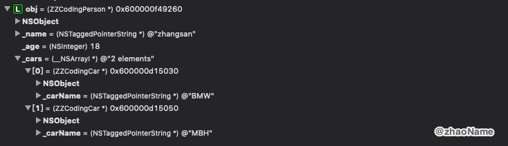

# NSSecureCoding

<br>

## 一、NSCoding

iOS12 之前若你需要对自定义的对象进行解 / 归档，那自定义类需要遵守 `NSCoding` 协议。以 `ZZCodingPerson` 和 `ZZCodingCar` 为例。

`ZZCodingPerson` 定义如下：

```Objective-C
@interface ZZCodingPerson : NSObject<NSCoding>

@property (nonatomic, copy) NSString *name;
@property (nonatomic, assign) NSInteger age;
@property (nonatomic, strong) NSArray *cars;

@end
```

```Objective-C
@implementation ZZCodingPerson

- (void)encodeWithCoder:(nonnull NSCoder *)coder
{
    [coder encodeObject:self.name forKey:@"name"];
    [coder encodeInt64:_age forKey:@"age"];
    [coder encodeObject:_cars forKey:@"cars"];
}

- (nullable instancetype)initWithCoder:(nonnull NSCoder *)decoder
{
    if ([super init]) {
        self.name = [decoder decodeObjectForKey:@"name"];
        self.age = [decoder decodeInt64ForKey:@"age"];
        self.cars = [decoder decodeObjectForKey:@"cars"];
    }
    return self;
}

@end
```

`ZZCodingCar` 定义如下：

```Objective-C
@interface ZZCodingCar : NSObject<NSCoding>

@property (nonatomic, copy) NSString *carName;

@end
```

```Objective-C
@implementation ZZCodingCar

- (void)encodeWithCoder:(nonnull NSCoder *)coder
{
    [coder encodeObject:self.carName forKey:@"carName"];
}

- (nullable instancetype)initWithCoder:(nonnull NSCoder *)decoder
{
    if ([super init]) {
        self.carName = [decoder decodeObjectForKey:@"carName"];
    }
    return self;
}

@end
```

归档

```Objective-C
ZZCodingPerson *per = [[ZZCodingPerson alloc] init];
per.name = @"zhangsan";
per.age = 18;

ZZCodingCar *car1 = [ZZCodingCar new];
car1.carName = @"BMW";

ZZCodingCar *car2 = [ZZCodingCar new];
car2.carName = @"MBH";

per.cars = @[car1, car2];

self.archiveData = [NSKeyedArchiver archivedDataWithRootObject:per];
```

解档

```Objective-C
id obj = [NSKeyedUnarchiver unarchiveObjectWithData:self.archiveData];
NSLog(@"%@", obj);
```


但是 `archivedDataWithRootObject:` 和 `unarchiveObjectWithData:` 方法从 iOS12 开始都被官方弃用。转而使用 `archivedDataWithRootObject:requiringSecureCoding:error:` 和 `unarchivedObjectOfClass:fromData:error:`。

```Objective-C
// 归档
self.archiveData = [NSKeyedArchiver archivedDataWithRootObject:per requiringSecureCoding:NO error:nil];

// 解档
id obj = [NSKeyedUnarchiver unarchivedObjectOfClass:[ZZCodingPerson class] fromData:self.archiveData error:&error];
```

这时会报错，如下：


意思就是 `ZZCodingPerson` 和 `ZZCodingCar` 需要遵守 `NSSecureCoding` 协议。

<br>

## 二、NSSecureCoding

`NSSecureCoding` 是官方从 iOS6 开始推出的新协议。它通过加入类方法 `supportsSecureCoding` 来扩展了 `NSCoding` 协议。

- 若对象没有重写 `initWithCoder:` 方法，则什么都不用做就可以适用 `NSSecureCoding `

- 若对象重写 `initWithCoder:` 方法，则必须使用 `decodeObjectOfClass:forKey:` 方法解码对象。

```Objective-C
id obj = [decoder decodeObjectOfClass:[MyClass class] forKey:@"myKey"];
```
- 该类必须覆盖其 `supportsSecureCoding` 属性的 getter 方法以返回 `YES`

想了解更多为什么使用 `NSSecureCoding ` 的理由，可参考 [Daemons and Services Programming Guide
](https://developer.apple.com/library/archive/documentation/MacOSX/Conceptual/BPSystemStartup/Chapters/CreatingXPCServices.html)


上面的代码报错没有遵守`NSSecureCoding `协议，所以我们对 `ZZCodingPerson` 做如下修改：

```Objective-C
@implementation ZZCodingPerson

+ (BOOL)supportsSecureCoding
{
    return YES;
}
...
- (nullable instancetype)initWithCoder:(nonnull NSCoder *)decoder
{
    if ([super init]) {
        self.age = [decoder decodeInt64ForKey:@"age"];
        self.name = [decoder decodeObjectOfClass:[NSString class] forKey:@"name"];
        self.cars = [decoder decodeArrayOfObjectsOfClass:[ZZCodingCar class] forKey:@"cars"];
    }
    return self;
}
@end
```

`ZZCodingPerson` 修改如下：

```Objective-C
@implementation ZZCodingCar

+ (BOOL)supportsSecureCoding
{
    return YES;
}
...
- (nullable instancetype)initWithCoder:(nonnull NSCoder *)decoder
{
    if ([super init]) {
        self.carName = [decoder decodeObjectOfClass:[NSString class] forKey:@"carName"];
    }
    return self;
}
@end
```
再调用解档、归档的方法：

```Objective-C
// 归档
self.archiveData = [NSKeyedArchiver archivedDataWithRootObject:per requiringSecureCoding:NO error:nil];

// 解档
id obj = [NSKeyedUnarchiver unarchivedObjectOfClass:[ZZCodingPerson class] fromData:self.archiveData error:&error];
```


<br>

**Reference**

- [Archives and Serializations Programming Guide](https://developer.apple.com/library/archive/documentation/Cocoa/Conceptual/Archiving/Archiving.html)

- [NSSecureCoding - Apple](https://developer.apple.com/documentation/foundation/nssecurecoding?language=objc)

- [NSSecureCoding - Mattt](https://nshipster.com/nssecurecoding/)

<br>