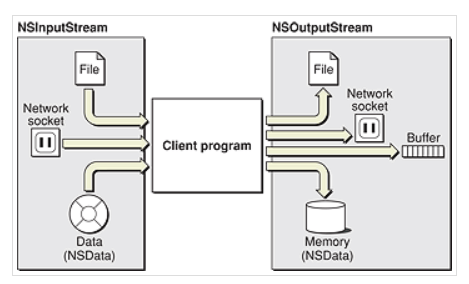

# NSStream


<br>

## 一、简介

流提供了一种简单的方式在不同和介质中交换数据，这种交换方式是与设备无关的。流是在通信路径中串行传输的连续的比特位序列。从编码的角度来看，流是单向的，因此流可以是输入流或输出流。除了基于文件的流外，其它形式的流都是不可查找的，这些流的数据一旦消耗完后，就无法从流对象中再次获取。

在 Cocoa 中包含三个与流相关的类：`NSStream`、`NSInputStream` 和 `NSOutputStream`。`NSStream` 是一个抽象基类，定义了所有流对象的基础接口和属性。`NSInputStream` 和 `NSOutputStream` 继承自 `NSStream`，实现了输入流和输出流的默认行为。

`NSInputStream` 继承自 `NSStream `，是一个只读的流

`NSOutputStream` 继承自 `NSStream `，是一个只写的流

下图描述了流的应用场景：



从图中看，`NSInputStream` 可以从文件、`socket` 和 `NSData` 对象中获取数据；`NSOutputStream` 可以将数据写入文件、`socket`、内存缓存和 `NSData` 对象中。这三处类主要处理一些比较底层的任务。

流对象有一些相关的属性。大部分属性是用于处理网络安全和配置的，这些属性统称为SSL和SOCKS代理信息。两个比较重要的属性是：

- `NSStreamDataWrittenToMemoryStreamKey`：允许输出流查询写入到内存的数据

- `NSStreamFileCurrentOffsetKey`：允许操作基于文件的流的读写位置

可以给流对象指定一个代理对象。如果没有指定，则流对象作为自己的代理。流对象调用唯一的代理方法 `stream:handleEvent:` 来处理流相关的事件：

- 对于 `NSInputStream ` 来说，是有可用的数据可读取事件。我们可以使用 `read:maxLength:` 方法从流中获取数据。

- 对于 `NSOutputStream ` 来说，是准备好写入的数据事件。我们可以使用 `write:maxLength:` 方法将数据写入流。

Cocoa 中的流对象与 Core Foundation 中的流对象是对应的。我们可以通过 `toll-free` 桥接方法来进行相互转换。`NSStream`、`NSInputStream` 和 `NSOutputStream` 分别对应`CFStream`、`CFReadStream` 和 `CFWriteStream`。

但这两者间的实现并不是完全一样的。Cocoa 流使用代理方式异步处理回调(`scheduleInRunLoop:forMode:`) 而 Core Foundation 一般使用回调函数来处理数据。另外我们可以子类化 `NSStream`、`NSInputStream` 和 `NSOutputStream`，来自定义一些属性和行为，而 Core Foundation 中的流对象则无法进行扩展。

```Objective-C

```

```Objective-C

```

<br>


## 二、从 NSInputStream 中读取数据


<br>

## 三、向 NSOutputStream 中写入数据

```Objective-C

```

```Objective-C

```

```Objective-C

```

```Objective-C

```


<br>


<br>


<br>

**Reference**

- [Introduction to Stream Programming Guide for Cocoa](https://developer.apple.com/library/archive/documentation/Cocoa/Conceptual/Streams/Streams.html)

- [iOS中流(Stream)的使用](http://southpeak.github.io/page/8/)

<br>

