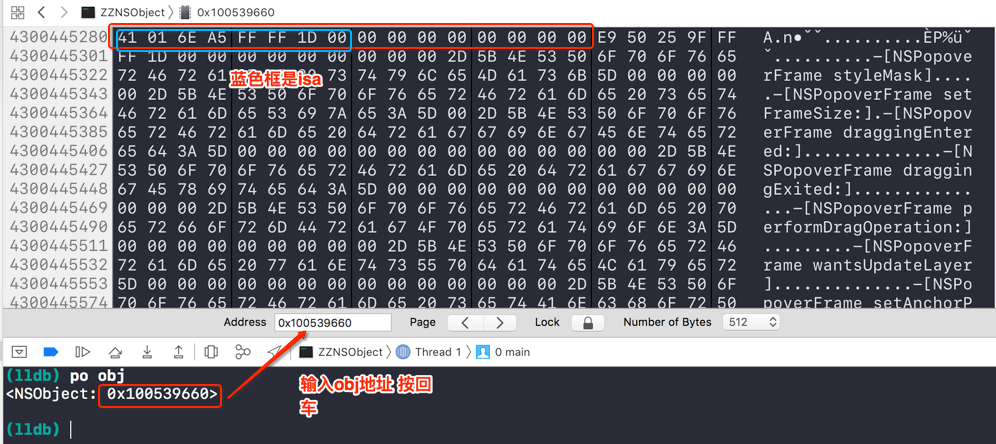
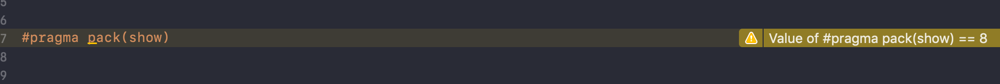

# OC对象本质(一)

<br>

本文运行环境`Xcode10.1` `runtime`源码：`objc4-750` `libmalloc-166.200.60`

## 一、OC的类在C/C++是什么数据类型？

我们知道平时编写的`OC`代码，其底层都是基于`C/C++`实现的。那`OC`的类在`C/C++`是什么数据类型？答案不言而喻是**结构体**。 因为在`C/C++`中结构体可以存放不同类型的数据。

有`C/C++`基础的同学知道在`C/C++`中**共用体**也可以存放不同类型的数据，哪为啥不会是共用体呢？因为共用体会使几种不同类型的变量存放到同一块内存中，这就意味着共用体在同一时间只能有一个值，这显然和`OC`中的类有不同属性值不符合。

- 将`OC`转化成`C/C++`代码

```
// 若需要连接其它框架，使用-framework参数，如 -framework UIKit
$ xcrun -sdk iphoneos clang -arch arm64 -rewrite-objc main.m -o main_arm64.cpp

warning: include path for stdlibc++ headers not found; pass '-std=libc++' on the command line to use the libc++ standard library
      instead [-Wstdlibcxx-not-found]
1 warning generated.
```

- 查看`main_arm64.cpp`文件, 并对比`OC`中`NSObject`的实现

```
// main_arm64.cpp中NSObject implementation
struct NSObject_IMPL {
	Class isa;
};

// OC中NSObject的实现
@interface NSObject <NSObject> {
#pragma clang diagnostic push
#pragma clang diagnostic ignored "-Wobjc-interface-ivars"
    Class isa  OBJC_ISA_AVAILABILITY;
#pragma clang diagnostic pop
}
...
@end
```

对比可知结构体`NSObject_IMPL`就是`NSObject`的底层实现，只有一个成员变量`isa`.


## 二、一个NSObject实例对象占用多少内存?

由上可知`NSObject`的底层实现是一个`NSObject_IMPL`类型的结构体，其只有一个指针类型的成员。那我们可猜测在`arm64`架构中一个`NSObject`实例对象占用的内存相当于一个指针变量的大小也就是8个字节。 对不对呢？

### 0x01 malloc_size

- `class_getInstanceSize()` 底层实现

```
// objc-class.mm 
size_t class_getInstanceSize(Class cls)
{
    if (!cls) return 0;
    return cls->alignedInstanceSize();
}

// Class's ivar size rounded up to a pointer-size boundary.
uint32_t alignedInstanceSize() {
	return word_align(unalignedInstanceSize());
}
```

由注释可知`class_getInstanceSize()`获取的是类的实例对象的所有成员变量所占内存大小

- 对比打印

```
#import <objc/runtime.h>
#import <malloc/malloc.h>

NSObject *obj = [[NSObject alloc] init];
// 获取NSObject实例对象的成员变量 所占内存大小
NSLog(@"getInstanceSize:%zd", class_getInstanceSize([NSObject class]));
// 获取指针obj所指向内存的大小
NSLog(@"malloc_size:%zd", malloc_size((__bridge const void *)(obj)));

2019-04-19 23:27:06.071363+0800 ZZNSObject[3349:3890717] getInstanceSize:8
2019-04-19 23:27:06.071621+0800 ZZNSObject[3349:3890717] malloc_size:16
```

### 0x02 lldb

在`lldb`中用`memory read`直接查看内存状态

`memory read`用法

- `memory read`可以简写为`x`, 格式 `memory read/数量格式字节数 内存地址`

- 格式 指内存以什么进制展示，`x`表示16进制、`f`表示浮点数、`d`表示10进制

- 字节数 指每次读取几个字节，`b`表示1个字节、`h`表示2个字节、`w`表示4个字节、`g`表示8个字节

```
(lldb) po obj
<NSObject: 0x100505a90>

// 以16进制查看内存 每次读取4个字节 读取10次
// 可以看到第16个字节之后的内存就不属于实例对象obj了
(lldb) memory read/10xw 0x100505a90
0x100505a90: 0xa56e0141 0x001dffff 0x00000000 0x00000000
0x100505aa0: 0x534e5b2d 0x63756f54 0x72614268 0x746e6f43
0x100505ab0: 0x536c6f72 0x70697274
(lldb) 
```

### 0x03 View Memory

先让程序进入断点调试状态，然后使用Xcode自带工具`View Memory`查看内存，`Debug -> Debug Workflow -> View Memory`



**总结：**从上可知`NSObject`类在`alloc`时，系统会给其分配16个字节大小的内存空间，但实际只用到8个字节，即实例对象中`isa`指针所占用的内存。

那为什么要这样做呢？这样做不是浪费内存空间吗？这是因为`OC`中有内存对齐的概念(注意这和结构体的内存对齐不是一回事)，可以使`CPU`读取内存的速度更快。

## 三、OC中的内存对齐

内存对齐能够用一句话来概括：**"数据项仅仅能存储在地址是数据项大小的整数倍的内存位置上"**

### 0x01 结构体中的内存对齐

在了解结构体中的内存对齐之前，先看一组数据

```
struct Person1 {
    char a;
    double b;
    int c;
    short d;
}p1;

struct Person2 {
    double a;
    char b;
    short c;
    int d;
}p2;

2019-04-21 23:31:02.219529+0800 ZZNSObject[19037:5585355] p1内存大小:24, p2内存大小:16
```

问题来了，对于一个同样的结构体来说为啥`sizeof()`算出来的结果不一样呢？这就是因为内存对齐的缘故。

- 内存对齐规则

	-  对于`struct`或`union`的各个成员。第一个成员位于偏移为0的位置，以后每一个数据成员的偏移量必须是`min(#pragma pack()指定的数，这个数据成员的自身长度)`的倍数。

	- 在`struct`或`union`数据成员完成各自对齐之后，其本身也要进行对齐。规则是取`min(#pragma pack指定的数值, struct(或union)中最大数据成员长度)`的整数倍

	
- `OC`中`#pragma pack`的值默认是8



下面解释为啥同样的结构体，成员变放置的位置不同会导致其占用内存不一样。

- p1

对于结构体`p1`来说，第一个成员`a`是`char`类型占用一个字节，偏移量是0；第二个成员是`double`类型占8个字节, `min(#pragma pack()指定的数, 8)`可知第二个成员偏移量是8，所以在`char`之后编译器会留出7个字节的空间，不会放数据；第三个成员是`int`类型占用4个字节，偏移量为4，起始偏移地址是16刚好是4的倍数，无需放入多余字节；第四个成员是`short`占用2个字节，起始偏移地址是20刚好是2的倍数。至此**规则一**对齐完成，`p1`的内存大概为这样的

```
// o表示真实数据 x表示编译器放入的多余字节
oxxxxxxx|oooooooo|oooo|oo 
```

在经过规则二的结构体本身对齐，内存结构大致如下

```
// 8的倍数 24
oxxxxxxx|oooooooo|oooo|ooxx
```

- p2

对于结构体`p2`来说，第一个成员`double`类型占用8个字节，偏移量是0；第二个成员是`char`类型占1个字节，min(#pragma pack()指定的数, 1)可知第二个成员偏移量是1，起始偏移地址是8，8是1的倍数，编译器不会放多余字节；第三个成员是`short`类型占用2个字节，偏移量为2，起始偏移地址是9，不是2的倍数，所以在`short `之后编译器会留出1个字节的空间，不会放数据；第四个成员是`int`占用4个字节，起始偏移地址是12是4的倍数。至此**规则一**对齐完成，`p2`的内存大概为这样的

```
// o表示真实数据 x表示编译器放入的多余字节
oooooooo|ox|oo|oooo
```

再经过规则二的结构体本身对齐，内存结构大致如下

```
// 8的倍数 16
oooooooo|ox|oo|oooo
```

- 实际打印(为查看成员`d`的内存大小，给结构体多添加一个成员`e`)

```
NSLog(@"%p %p %p %p %p", &p1.a, &p1.b, &p1.c, &p1.d, &p1.e);
NSLog(@"%p %p %p %p %p", &p2.a, &p2.b, &p2.c, &p2.d, &p2.e);

// 由打印结果可知与上述猜测一致
2019-04-22 00:22:15.212332+0800 ZZNSObject[19614:5611357] 0x100001098 0x1000010a0 0x1000010a8 0x1000010ac 0x1000010b0
2019-04-22 00:22:15.212358+0800 ZZNSObject[19614:5611357] 0x1000010b8 0x1000010c0 0x1000010c2 0x1000010c4 0x1000010c8
```

### 0x02 OC中的内存对齐

- runtime源码

```
// NSObject.mm

id _objc_rootAllocWithZone(Class cls, malloc_zone_t *zone)
{
    id obj;

#if __OBJC2__
    // allocWithZone under __OBJC2__ ignores the zone parameter
    (void)zone;
    obj = class_createInstance(cls, 0);
#else
    if (!zone) {
    	 // 现在是objc4 且zone为nil 走这里
        obj = class_createInstance(cls, 0);
    }
    else {
        obj = class_createInstanceFromZone(cls, 0, zone);
    }
#endif

    if (slowpath(!obj)) obj = callBadAllocHandler(cls);
    return obj;
}

// 创建实例
id class_createInstance(Class cls, size_t extraBytes)
{
    return _class_createInstanceFromZone(cls, extraBytes, nil);
}


static __attribute__((always_inline)) 
id _class_createInstanceFromZone(Class cls, size_t extraBytes, void *zone, bool cxxConstruct = true, size_t *outAllocatedSize = nil)
{
    ......
    size_t size = cls->instanceSize(extraBytes);
    if (outAllocatedSize) *outAllocatedSize = size;
    
    id obj;
    // 若zone为空 则肯定会调用calloc方法
    // 
    if (!zone  &&  fast) {
        obj = (id)calloc(1, size);
        if (!obj) return nil;
        obj->initInstanceIsa(cls, hasCxxDtor);
    } 
    else {
        if (zone) {
            obj = (id)malloc_zone_calloc ((malloc_zone_t *)zone, 1, size);
        } else {
        	  // 
            obj = (id)calloc(1, size);
        }
        ......
    }
    ......
}

// calloc函数中size参数来源
// 由此可知为什么NSObject实例实际会占用16个字节
size_t instanceSize(size_t extraBytes) {
    size_t size = alignedInstanceSize() + extraBytes;
    // CF requires all objects be at least 16 bytes.
    if (size < 16) size = 16;
    return size;
}

// calloc函数声明 没有实现
void *calloc(size_t __count, size_t __size) __result_use_check __alloc_size(1,2);
```

- 自定义类的实例对象的内存

```
@interface Person : NSObject
{
    int _age;
    double _height;
}
@end

@implementation Person
@end

// Person转成的结构体
struct Person_IMPL {
    Class isa;
    int _age;
    double _height;
};

NSLog(@"class_getInstanceSize:%zd", class_getInstanceSize([Person class]));
NSLog(@"malloc_size:%zu", malloc_size((__bridge const void *)(p)));

// 打印信息
2019-04-22 11:09:27.256391+0800 ZZNSObject[2711:57697] class_getInstanceSize:24
2019-04-22 11:09:27.256600+0800 ZZNSObject[2711:57697] malloc_size:32
```

通过结构体的内存对齐可知`Person_IMPL`占用24个字节的内存，也就是在`OC`分配内存时`instanceSize()`函数的返回值。但实际上`Person`占用32个字节的内存，那就`calloc()`函数在搞事情！

在`runtime`的源码中看不到`calloc()`函数的实现，它的具体实现可以在`libmalloc`源码中找到


- libmalloc源码

```
// malloc.c
void *calloc(size_t num_items, size_t size)
{
    void *retval;
    retval = malloc_zone_calloc(default_zone, num_items, size);
    if (retval == NULL) {
        errno = ENOMEM;
    }
    return retval;
}

void *malloc_zone_calloc(malloc_zone_t *zone, size_t num_items, size_t size)
{
    MALLOC_TRACE(TRACE_calloc | DBG_FUNC_START, (uintptr_t)zone, num_items, size, 0);
    
    void *ptr;
    if (malloc_check_start && (malloc_check_counter++ >= malloc_check_start)) {
        internal_check();
    }
    
    ptr = zone->calloc(zone, num_items, size);
    
    if (malloc_logger) {
        malloc_logger(MALLOC_LOG_TYPE_ALLOCATE | MALLOC_LOG_TYPE_HAS_ZONE | MALLOC_LOG_TYPE_CLEARED, (uintptr_t)zone,
                      (uintptr_t)(num_items * size), 0, (uintptr_t)ptr, 0);
    }
    
    MALLOC_TRACE(TRACE_calloc | DBG_FUNC_END, (uintptr_t)zone, num_items, size, (uintptr_t)ptr);
    return ptr;
}

// nano_zone_common.h
// 最大不是256 只是在nano_malloc中最大是256
#define NANO_MAX_SIZE	256 /* Buckets sized {16, 32, 48, ..., 256} */
```

**总结：**`OC`中内存对齐是以16的倍数分配内存，对于一个实例对象来说，先按结构体的内存对齐分配内存(必须有的内存大小)，然后再按`OC`中内存对齐(系统实际分配的)。


**相关内容**

- [OC对象本质(二)](https://github.com/zhaoName/Notes/blob/master/iOS/OC%E5%AF%B9%E8%B1%A1%E6%9C%AC%E8%B4%A8(%E4%BA%8C).md)

- [OC对象本质(三)](https://github.com/zhaoName/Notes/blob/master/iOS/OC%E5%AF%B9%E8%B1%A1%E6%9C%AC%E8%B4%A8(%E4%B8%89).md)


<br>

参考：

- [内存对齐](https://www.cnblogs.com/yxwkf/p/5080849.html)

<br>

写于2019-04-19

<br>