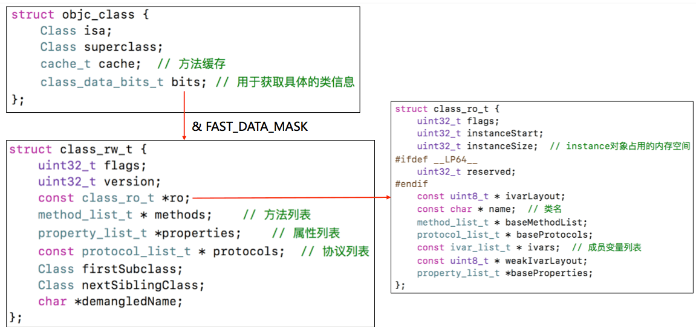
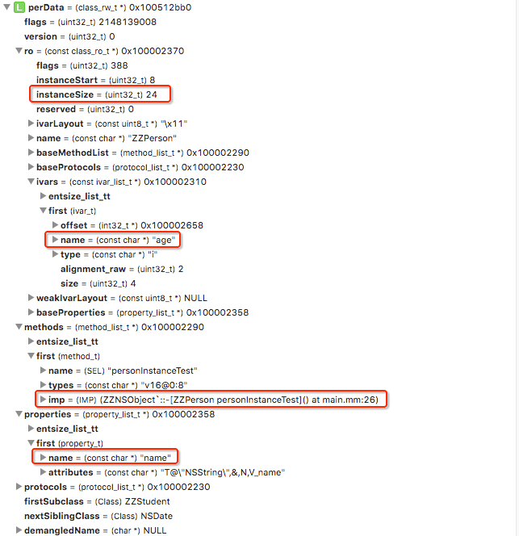
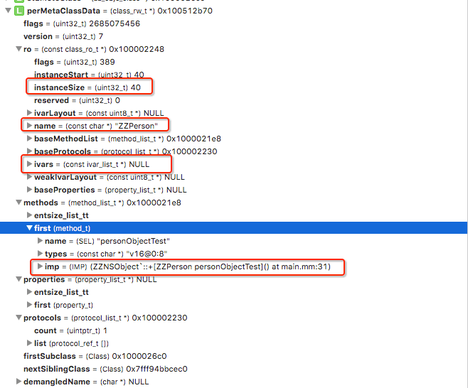

# OC对象本质(三)

<br>

本文主要介绍`Class`类型在底层的部分结构。


`OC`中的`Class`类型在底层定义为`typedef struct objc_class *Class`，而结构体`struct objc_class`可以在`runtime`源码中找到。

`objc4`源码中`struct objc_class`的定义太复杂，我们需要的信息大概是这些




定义一个类似`struct objc_class`的结构体

```
// ZZClassInfo.h

# if __arm64__
#   define ISA_MASK        0x0000000ffffffff8ULL
# elif __x86_64__
#   define ISA_MASK        0x00007ffffffffff8ULL
# endif

#pragma mark --  class_rw_t

struct method_t {
    SEL name;
    const char *types;
    IMP imp;
};
//struct method_array_t{
//    method_t first;
//};
struct property_t {
    const char *name;
    const char *attributes;
};
//struct property_array_t {
//    property_t first;
//};

typedef uintptr_t protocol_ref_t;
//struct protocol_array_t {
//    // count is 64-bit by accident.
//    uintptr_t count;
//    protocol_ref_t list[0]; // variable-size
//};


#pragma mark --  class_ro_t

struct entsize_list_tt {
    uint32_t entsizeAndFlags;
    uint32_t count;
};
// 方法列表定义
struct method_list_t : entsize_list_tt {
    method_t first;
};

struct protocol_list_t {
    // count is 64-bit by accident.
    uintptr_t count;
    protocol_ref_t list[0]; // variable-size
};

struct ivar_t {
    int32_t *offset;
    const char *name;
    const char *type;
    // alignment is sometimes -1; use alignment() instead
    uint32_t alignment_raw;
    uint32_t size;
};
struct ivar_list_t : entsize_list_tt {
    ivar_t first;
};

struct property_list_t : entsize_list_tt{
    property_t first;
};

#pragma mark --

struct class_ro_t {
    uint32_t flags;
    uint32_t instanceStart;
    uint32_t instanceSize;
#ifdef __LP64__
    uint32_t reserved;
#endif
    const uint8_t * ivarLayout;
    // 类名
    const char * name;
    method_list_t * baseMethodList;
    protocol_list_t * baseProtocols;
    // 成员变量列表
    const ivar_list_t * ivars;
    
    const uint8_t * weakIvarLayout;
    property_list_t *baseProperties;
};

struct class_rw_t {
    // Be warned that Symbolication knows the layout of this structure.
    uint32_t flags;
    uint32_t version;
    //
    const class_ro_t *ro;
    
    // 实例方式列表
    method_list_t * methods;
    // 属性列表
    property_list_t * properties;
    // 协议列表
    protocol_list_t * protocols;
    
    Class firstSubclass;
    Class nextSiblingClass;
    char *demangledName;
};

struct cache_t {
    struct bucket_t *_buckets;
    uint32_t _mask;
    uint32_t _occupied;
};


#define FAST_DATA_MASK 0x00007ffffffffff8UL
struct class_data_bits_t {
    unsigned long bits;
public:
    class_rw_t* data() {
        return (class_rw_t *)(bits & FAST_DATA_MASK);
    }
};


#pragma mark --

// 对象
struct zz_objc_object {
   Class isa;
};

// 类对象或元类对象
struct zz_objc_class : zz_objc_object {
    Class superclass;
    cache_t cache;             // formerly cache pointer and vtable
    class_data_bits_t bits;    // class_rw_t * plus custom rr/alloc flags
    
public:
    class_rw_t *data() {
        return bits.data();
    }
    zz_objc_class *metaClass() {
        return (zz_objc_class *)((long long)isa & ISA_MASK);
    }
};
```

在`main.mm`文件中

```
#import "ZZClassInfo.h"

@interface ZZPerson : NSObject<NSCopying>
{
    int age;
}
@property (nonatomic, strong) NSString *name;

- (void)personInstanceTest;
+ (void)personObjectTest;
@end

@implementation ZZPerson

- (void)personInstanceTest
{
    NSLog(@"-[ZZPerson personInstanceTest]===%p", self);
}

+ (void)personObjectTest
{
    NSLog(@"+[ZZPerson personObjectTest]===%p", self);
}

- (id)copyWithZone:(NSZone *)zone {
    return self;
}

@end


int main(int argc, const char * argv[]) {
    @autoreleasepool {
        
        struct zz_objc_class *perClass = (__bridge struct zz_objc_class *)[ZZPerson class];
        struct zz_objc_class *stuClass = (__bridge struct zz_objc_class *)[ZZStudent class];
       
        class_rw_t *perData = perClass->data();
        class_rw_t *stuData = stuClass->data();
        
        struct zz_objc_class *perMeteClass = perClass->metaClass();
        struct zz_objc_class *stuMeteClass = stuClass->metaClass();
        
        class_rw_t *perMetaClassData = perMeteClass->data();
        class_rw_t *sturMetaClassData = stuMeteClass->data();
    }
    return 0;
}
```

- `class`对象中的`class_rw_t`信息



- `meta-class`对象中的`class_rw_t`信息




**这样也就证明了`OC`中的属性信息、实例方法信息、协议信息、成员变量信息存储在`class`对象中；类方法存储在`meta-class`对象中。**


**相关内容**

- [OC对象本质(一)](https://gitee.com/zhaoName0x01/Notes/blob/master/iOS/OC对象本质(一).md)

- [OC对象本质(二)](https://gitee.com/zhaoName0x01/Notes/blob/master/iOS/OC对象本质(二).md)

<br>
写于2019-04-25
<br>