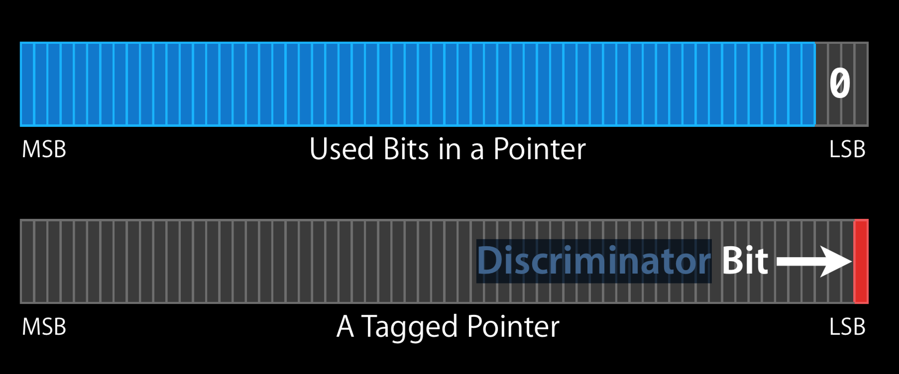
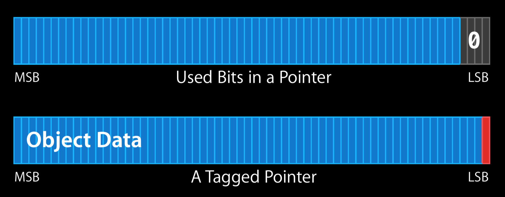

# Tagged Pointer

<br>

Tagged Pointer 是苹果从 64bit 开始应用的技术，用于优化`NSNumber`、`NSDate`、`NSString`等小对象存储。在 WWDC2013 的《Session 404 Advanced in Objective-C》可以看到苹果对 Tagged Pointer 特点的介绍

- Tagged Pointer 专门用来存储小的对象，例如`NSNumber`和`NSDate`

- Tagged Pointer 指针的值不再是地址了，而是 Data + Tag。所以，实际上它不再是一个对象了，它只是一个披着对象皮的普通变量而已。所以它的内存并不存储在堆中，也不需要 `malloc`和`free`

- 在内存读取上有着 3 倍的效率，创建和销毁时比以前快 106 倍


## 一、原因

我们来看下若不使用 Tagged Pointer 为什么会造成内存浪费。创建一个`NSNumber`对象

```Objective-C
NSNumber *number = [NSNumber numberWithInt:10];
```

它的内存结构大致如下： 


首先栈上有个局部变量`number `，它是指针类型占8个字节。`number `指向堆区的一块内存，是个 OC 对象，由以前知识可知一个 OC 对象最少占16个字节。也就是说将一个整形数字10，包装成`NSNumber`对象最少要用24个字节。再加上还要管理对象的声明周期，这样就很浪费内存和效率。

## 二、简介


使用 Tagged Pointer 后，会是将值和标志直接存储在指针中。若值过大，指针存不下则当成一个正常对象处理。

```Objective-C
NSNumber *a = @10;
NSNumber *b = @18;
NSNumber *c = @(0xfffffffffffffff);
    
NSString *str1 = [NSString stringWithFormat:@"142"];
NSString *str2 = [NSString stringWithFormat:@"abc2"];
NSString *str3 = [NSString stringWithFormat:@"abcdefghijklmn"];
    
NSLog(@"%p %p %p %p %p %p", a, b, c, str1, str2, str3);
NSLog(@"%@ %@", str1.class, str3.class);

// 打印结果
2019-07-24 17:50:48.701120 MemoryManagement[5611:554782] 0xb0000000000000a2 0xb000000000000122 0x17003d820 0xa000000003234313 0xa000000326362614 0x17003d9e0
2019-07-24 17:50:48.986492 MemoryManagement[671:271401] NSTaggedPointerString __NSCFString
```

可以看到无论是`NSNunber`还是`NSString`，当 Tagged Pointer 足够存储数据时，数据直接存在指针中(字符要转成 ASCII 值)。否则就是一个普通的指针，指向 OC 对象。

那我们要怎么才能辨别一个指针是否是 Tagged Pointer 呢 ？WWDC2013 的演讲稿给出解释






但这是2013年的演讲稿，所以只能参考，最新的判断标准在`runtime`源码中给出答案。

```Objective-C
// objc4-750  NSObject.mm

#if (TARGET_OS_OSX || TARGET_OS_IOSMAC) && __x86_64__
// 64-bit Mac - tag bit is LSB
#define OBJC_MSB_TAGGED_POINTERS 0
#else
// Everything else - tag bit is MSB
#define OBJC_MSB_TAGGED_POINTERS 1
#endif

#if OBJC_MSB_TAGGED_POINTERS
#define _OBJC_TAG_MASK (1UL<<63)
#else
#define _OBJC_TAG_MASK 1UL
#endif

static inline bool _objc_isTaggedPointer(const void * _Nullable ptr)
{
    return ((uintptr_t)ptr & _OBJC_TAG_MASK) == _OBJC_TAG_MASK;
}
```

- 在 64bit Mac 下，最低有效位(LSB)为1，则是 Tagged Pointer

- 在 64bit 非 Mac 下，最高有效位(MSB)为1，则是 Tagged Pointer


## 三、面试题

### 0x01 

下面代码运行有什么结果 ?

```Objective-C
@property (nonatomic, copy) NSString *name;

dispatch_queue_t queue = dispatch_get_global_queue(DISPATCH_QUEUE_PRIORITY_DEFAULT, 0);
for (int i=0; i<1000; i++) {
    dispatch_async(queue, ^{
        self.name = [NSString stringWithFormat:@"abcsafojoefflwmflkwf"];
    });
}
```

运行结果是程序闪退，报错坏指针访问！这是为什么呢？


首先可以确定一点的是`[NSString stringWithFormat:@"abcsafojoefflwmflkwf"]`是一个普通的 OC 对象，且`self.name = xxx`等同于`[self setName:xxx]`。属性的`setter`方法在 MRC 环境下会转成如下代码。

```Objective-C
- (void)setName:(NSString *)name
{
    if (_name != name) {
        [_name release];
        _name = [name copy];
    }
}
```

当多条线程同时访问`setName:`方法时，会出现`[_name release]`多次调用，也就是属性`name`的引用计数可能是0，已经被释放。所以出现截图上的错误：`objc_release`中坏内存访问。解决办法有两种：

- 使用`atomic`声明`name`属性

- 在调用属性`name`的`setter`方法时加锁


### 0x02

若改成下面代码，运行结果又是什么样的 ？

```Objective-C
dispatch_queue_t queue = dispatch_get_global_queue(DISPATCH_QUEUE_PRIORITY_DEFAULT, 0);
for (int i=0; i<1000; i++) {
    dispatch_async(queue, ^{
        self.name = [NSString stringWithFormat:@"abc"];
    });
}
NSLog(@"---------%@", self.name);
```

运行结果

```Objective-C
2019-07-24 23:38:01.002111+0800 MemoryManagement[81538:6125551] ---------abc
```

是不是很奇怪，字符串变短之后就能正常运行了！

这是应为`[NSString stringWithFormat:@"abc"]`是 Tagged Pointer，在给属性赋值时是直接赋值，而不走属性的`setter`方法。

<br>

**参考：**

- [Let's Build Tagged Pointers](https://www.mikeash.com/pyblog/friday-qa-2012-07-27-lets-build-tagged-pointers.html)

<br>

写于2019-07-24

<br>