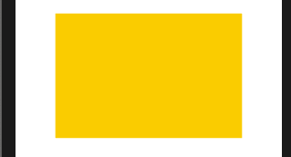
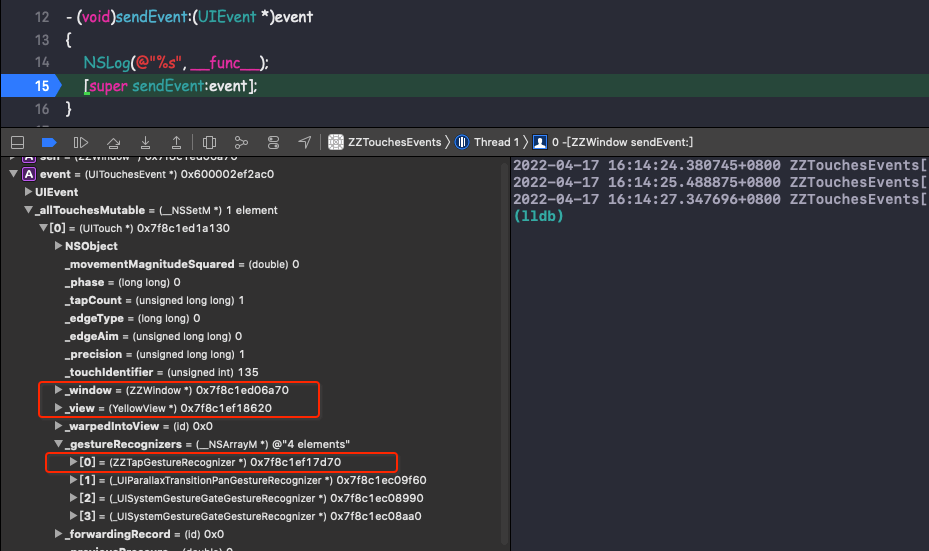
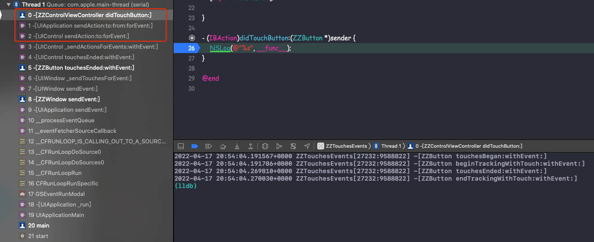
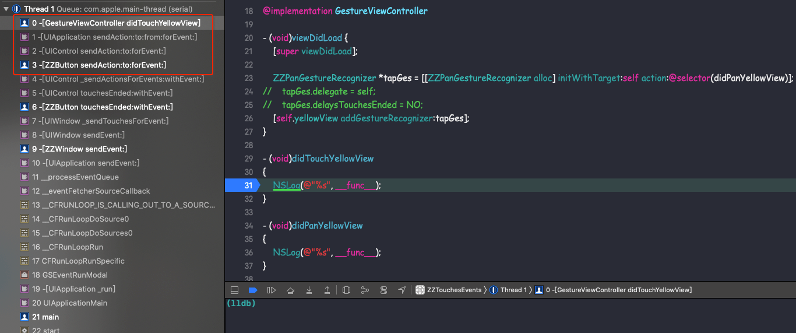

# UIResponder、UIGestureRecognizer、UIControl


本文主要介绍 UIResponder、UIGestureRecognizer、UIControl 对于触摸事件的响应优先级。


<br>

## 一、UIGestureRecognizer


手势分为离散型手势（discrete gestures）和持续型手势（continuous gesture）。系统提供的离散型手势包括点按手势（`UITapGestureRecognizer`）和轻扫手势（`UISwipeGestureRecognizer`），其余均为持续型手势。

两者主要区别在于状态变化过程：

离散型：

- 识别成功：Possible —> Recognized

- 识别失败：Possible —> Failed

持续型：

- 识别成功：Possible —> Began —> [Changed] —> Ended

- 识别失败：Possible —> Began —> [Changed] —> Cancel


### 0x01 离散型手势

定义一个 `YellowView` 视图，重写 `UIResponder` 的响应事件方法。

```
@implementation YellowView

- (void)touchesBegan:(NSSet<UITouch *> *)touches withEvent:(UIEvent *)event
{
    NSLog(@"%s", __func__);
}

- (void)touchesEnded:(NSSet<UITouch *> *)touches withEvent:(UIEvent *)event
{
    NSLog(@"%s", __func__);
}

- (void)touchesCancelled:(NSSet<UITouch *> *)touches withEvent:(UIEvent *)event
{
    NSLog(@"%s", __func__);
}

@end
```

然后将 `YellowView` 添加到控制器的视图上，并为它绑定一个 `UITapGestureRecognizer` 手势


```Objective-C
@implementation GestureViewController

- (void)viewDidLoad {
    [super viewDidLoad];
    
    UITapGestureRecognizer *tapGes = [[UITapGestureRecognizer alloc] initWithTarget:self action:@selector(didTouchYellowView)];
    [self.yellowView addGestureRecognizer:tapGes];
}

- (void)didTouchYellowView
{
    NSLog(@"%s", __func__);
}

@end
```



点击 `YellowView ` 得到如下打印结果：

```Objective-C
-[YellowView touchesBegan:withEvent:]
-[GestureViewController didTouchYellowView]
-[YellowView touchesCancelled:withEvent:]
```

从日志上看出 `YellowView` 最后 `Cancel` 了对触摸事件的响应，而正常应当是触摸结束后，`YellowView` 的 `touchesEnded:withEvent:` 的方法被调用才对。另外，期间还执行了手势识别器绑定的事件 。从官方文档找到了这样的解释：

> A window delivers touch events to a gesture recognizer before it delivers them to the hit-tested view attached to the gesture recognizer. Generally, if a gesture recognizer analyzes the stream of touches in a multi-touch sequence and doesn’t recognize its gesture, the view receives the full complement of touches. If a gesture recognizer recognizes its gesture, the remaining touches for the view are cancelled. The usual sequence of actions in gesture recognition follows a path determined by default values of the cancelsTouchesInView, delaysTouchesBegan, delaysTouchesEnded properties:

大致理解是，window 在将事件传递给 hit-tested view 之前，会先将事件传递给相关的手势识别器并由手势识别器优先识别。若手势识别器成功识别了事件，就会取消 hit-tested view 对事件的响应；若手势识别器没能识别事件，hit-tested view 才完全接手事件的响应权。

**一句话概括：`UIGestureRecognizer` 比 `UIResponder` 具有更高的事件响应优先级！！**

按照这个解释，window 在将事件传递给 hit-tested view 即 `YellowView` 之前，先传递给了控制器根视图上的手势识别器。手势识别器成功识别了该事件，通知 Application 取消`YellowView` 对事件的响应。

然而看日志，却是 `YellowView` 的 `touchesBegan:withEvent:` 先调用了，既然手势识别器先响应，不应该上面的 action 先执行吗，这又怎么解释？事实上这个认知是错误的。手势识别器的 action 的调用时机，并不是手势识别器接收到事件的时机，而是手势识别器成功识别事件后的时机，即手势识别器的状态变为 `UIGestureRecognizerStateRecognized`。

Possible --> Recognized --> action

因此从该日志中并不能看出事件是优先传递给手势识别器的，那该怎么证明 window 先将事件传递给了手势识别器？

要解决这个问题，只要知道手势识别器是如何接收事件的，然后在接收事件的方法中打印日志对比调用时间先后即可。手势识别器对于事件响应的定义在 `UIGestureRecognizerSubclass.h` 中。如下：

```Objective-C
// UIGestureRecognizerSubclass.h

// mirror of the touch-delivery methods on UIResponder
// UIGestureRecognizers aren't in the responder chain, but observe touches hit-tested to their view and their view's subviews
// UIGestureRecognizers receive touches before the view to which the touch was hit-tested
- (void)touchesBegan:(NSSet<UITouch *> *)touches withEvent:(UIEvent *)event;
- (void)touchesMoved:(NSSet<UITouch *> *)touches withEvent:(UIEvent *)event;
- (void)touchesEnded:(NSSet<UITouch *> *)touches withEvent:(UIEvent *)event;
- (void)touchesCancelled:(NSSet<UITouch *> *)touches withEvent:(UIEvent *)event;
- (void)touchesEstimatedPropertiesUpdated:(NSSet<UITouch *> *)touches API_AVAILABLE(ios(9.1));
```

自定义 `ZZTapGestureRecognizer` 继承自 `UITapGestureRecognizer`，如下

```Objective-C
#import <UIKit/UIGestureRecognizerSubclass.h>

@implementation ZZTapGestureRecognizer

- (void)touchesBegan:(NSSet<UITouch *> *)touches withEvent:(UIEvent *)event
{
    NSLog(@"%s", __func__);
    [super touchesBegan:touches withEvent:event];
}

- (void)touchesEnded:(NSSet<UITouch *> *)touches withEvent:(UIEvent *)event
{
    NSLog(@"%s", __func__);
    [super touchesEnded:touches withEvent:event];
}

- (void)touchesCancelled:(NSSet<UITouch *> *)touches withEvent:(UIEvent *)event
{
    NSLog(@"%s", __func__);
    [super touchesCancelled:touches withEvent:event];
}

@end
```

修改控制器中手势为 `ZZTapGestureRecognizer`，再点击 `YellowView`，打印如下：


```Objective-C
-[ZZTapGestureRecognizer touchesBegan:withEvent:]
-[YellowView touchesBegan:withEvent:]
-[ZZTapGestureRecognizer touchesEnded:withEvent:]
-[GestureViewController didTouchYellowView]
-[YellowView touchesCancelled:withEvent:]
```

很明显，确实是手势识别器先接收到了事件。之后手势识别器成功识别了手势，执行了 action，再由 Application 取消了 `YellowView` 对事件的响应。

window 会将事件优先传递给手势识别器，但若有多个手势，window 如何区分哪个手势才是自己想要传递的呢？

上篇文章探讨过 Application 怎么知道要把 event 传递给哪个 window，以及 window 怎么知道要把event 传递给哪个 hit-tested view 的问题，答案是这些信息都保存在 event 所绑定的 touch 对象上。手势识别器也是一样的，event 绑定的 touch 对象上维护了一个手势识别器数组，里面的手势识别器毫无疑问是在 hit-testing 的过程中收集的。

点击 `YellowView` 并在 `ZZWindow` 的 `sendEvent:` 方法中先断点



**结论：** window 先将事件传递给这些手势识别器，再传给 hit-tested view。一旦有手势识别器成功识别了手势，Application 就会取消 hit-tested view 对事件的响应。

<br>

### 0x02 持续型手势

自定义持续型手势 `ZZPanGestureRecognizer`，并添加到 `YellowView` 上

```Objective-C
@implementation GestureViewController

- (void)viewDidLoad {
    [super viewDidLoad];
    
    ZZPanGestureRecognizer *tapGes = [[ZZPanGestureRecognizer alloc] initWithTarget:self action:@selector(didPanYellowView)];
    [self.yellowView addGestureRecognizer:tapGes];
}

- (void)didPanYellowView
{
    NSLog(@"%s", __func__);
}

@end
```

然后手指在 `YellowView` 上滑动，打印如下

```Objective-C
-[ZZPanGestureRecognizer touchesBegan:withEvent:]
-[YellowView touchesBegan:withEvent:]

-[ZZPanGestureRecognizer touchesMoved:withEvent:]
-[YellowView touchesMoved:withEvent:]
-[ZZPanGestureRecognizer touchesMoved:withEvent:]
-[YellowView touchesMoved:withEvent:]

-[GestureViewController didTouchYellowView]
-[YellowView touchesCancelled:withEvent:]
-[ZZPanGestureRecognizer touchesMoved:withEvent:]
-[GestureViewController didTouchYellowView]
...
-[ZZPanGestureRecognizer touchesMoved:withEvent:]
-[GestureViewController didTouchYellowView]

-[ZZPanGestureRecognizer touchesEnded:withEvent:]
-[GestureViewController didTouchYellowView]
```
在一开始滑动的过程中，手势识别器处在识别手势阶段，滑动产生的连续事件既会传递给手势识别器又会传递给 `YellowView`，因此 `YellowView` 的 `touchesMoved:withEvent:` 在开始一段时间内会持续调用；当手势识别器成功识别了该滑动手势时，手势识别器的 action 开始调用，同时通知 `Application` 取消 `YellowView` 对事件的响应。之后仅由滑动手势识别器接收事件并响应，`YellowView` 不再接收事件。


至此先总结一下 `UIGestureRecognizer` 与 `UIResponder` 对于事件响应的联系：

- 当触摸发生或者触摸的状态发生变化时，window 都会传递事件寻求响应。

- window 先将绑定了触摸对象的事件传递给触摸对象上绑定的手势识别器，再发送给触摸对象对应的 hit-tested view。
- 手势识别器识别手势期间，若触摸对象的触摸状态发生变化，事件都是先发送给手势识别器再发送给 hit-test view。
- 手势识别器若成功识别了手势，则通知 Application 取消 hit-tested view 对于事件的响应，并停止向 hit-tested view 发送事件；
- 若手势识别器未能识别手势，而此时触摸并未结束，则停止向手势识别器发送事件，仅向 hit-test view 发送事件。
- 若手势识别器未能识别手势，且此时触摸已经结束，则向 hit-tested view 发送 end 状态的 touch 事件以停止对事件的响应。

<br>

### 0x03 手势识别器的3个属性

`cancelsTouchesInView`


> When this property is YES (the default) and the receiver recognizes its gesture, the touches of that gesture that are pending are not delivered to the view and previously delivered touches are cancelled through a `touchesCancelled:withEvent:` message sent to the view. If a gesture recognizer doesn’t recognize its gesture or if the value of this property is NO, the view receives all touches in the multi-touch sequence.

默认为 `YES`。表示当手势识别器成功识别了手势之后，会通知 Application 取消响应链对事件的响应，并不再传递事件给hit-test view。若设置成 `NO`，表示手势识别成功后不取消响应链对事件的响应，事件依旧会传递给 hit-test view。

如上对 `YellowView` 的单击手势，设置 `tapGes.cancelsTouchesInView = NO;`，打印结果如下：

```Objective-C
-[ZZTapGestureRecognizer touchesBegan:withEvent:]
-[YellowView touchesBegan:withEvent:]
-[ZZTapGestureRecognizer touchesEnded:withEvent:]
-[GestureViewController didPanYellowView]
-[YellowView touchesEnded:withEvent:]
```

单击手势时间和 `YellowView` 的 UIResponder 都被触发。
 
`delaysTouchesBegan `

> When the value of this property is NO (the default), views analyze touch events in `UITouchPhaseBegan` and `UITouchPhaseMoved` in parallel with the receiver. When the value of the property is YES, the window suspends delivery of touch objects in the UITouchPhaseBegan phase to the view. If the gesture recognizer subsequently recognizes its gesture, these touch objects are discarded. If the gesture recognizer, however, does not recognize its gesture, the window delivers these objects to the view in a `touchesBegan:withEvent:` message (and possibly a follow-up `touchesMoved:withEvent:` message to inform it of the touches’ current locations). Set this property to YES to prevent views from processing any touches in the UITouchPhaseBegan phase that may be recognized as part of this gesture.

默认为 `NO`。默认情况下手势识别器在识别手势期间，当触摸状态发生改变时，Application 都会将事件传递给手势识别器和 hit-tested view；若设置成`YES`，则表示手势识别器在识别手势期间，截断事件，即不会将事件发送给 hit-tested view。

设置自定义 `ZZPanGestureRecognizer` 的 `delaysTouchesBegan ` 为 `YES`，然后在 `YellowView`上滑动，打印结果如下： 

```Objective-C
-[ZZPanGestureRecognizer touchesBegan:withEvent:]
-[ZZPanGestureRecognizer touchesMoved:withEvent:]

-[ZZPanGestureRecognizer touchesMoved:withEvent:]
-[GestureViewController didPanYellowView]
-[ZZPanGestureRecognizer touchesMoved:withEvent:]
-[GestureViewController didPanYellowView]

-[ZZPanGestureRecognizer touchesEnded:withEvent:]
-[GestureViewController didPanYellowView]
```

因为滑动手势识别器在识别期间，事件不会传递给`YellowView`，因此期间 `YellowView` 的 `touchesBegan:withEvent:` 和 `touchesMoved:withEvent:` 都不会被调用；而后滑动手势识别器成功识别了手势，也就独吞了事件，不会再传递给 `YellowView`。因此只打印了手势识别器成功识别手势后的 action 调用

`delaysTouchesEnded `

> When the value of this property is YES (the default) and the receiver is analyzing touch events, the window suspends delivery of touch objects in the `UITouchPhaseEnded` phase to the attached view. If the gesture recognizer subsequently recognizes its gesture, these touch objects are cancelled (via a `touchesCancelled:withEvent:` message). If the gesture recognizer does not recognize its gesture, the window delivers these objects in an invocation of the view’s `touchesEnded:withEvent:` method. Set this property to NO to have touch objects in the `UITouchPhaseEnded` delivered to the view while the gesture recognizer is analyzing the same touches.

默认为 `YES`。当手势识别失败时，若此时触摸已经结束，会延迟一小段时间（0.15s）再调用响应者的 `touchesEnded:withEvent:`，若设置成 `NO`，则在手势识别失败时会立即通知Application 发送状态为 end 的 touch 事件给 hit-tested view 以调用 `touchesEnded:withEvent:` 结束事件响应。

<br>

## 二、UIControl

`UIControl` 是系统提供的能够以 target-action 模式处理触摸事件的控件，iOS 中 `UIButton`、`UISegmentedControl`、`UISwitch` 等控件都是 `UIControl` 的子类。当 `UIControl` 跟踪到触摸事件时，会向其上添加的 target 发送事件以执行 action。值得注意的是，`UIConotrol` 是 `UIView` 的子类，因此本身也具备 `UIResponder` 应有的身份。

### 0x01 target-action 执行时机及过程

`UIControl` 作为能够响应事件的控件，必然也需要待事件交互符合条件时才去响应，因此也会跟踪事件发生的过程。`UIControl` 有自己的跟踪方式：

```Objective-C
- (BOOL)beginTrackingWithTouch:(UITouch *)touch withEvent:(nullable UIEvent *)event;
- (BOOL)continueTrackingWithTouch:(UITouch *)touch withEvent:(nullable UIEvent *)event;
- (void)endTrackingWithTouch:(nullable UITouch *)touch withEvent:(nullable UIEvent *)event; // touch is sometimes nil if cancelTracking calls through to this.
- (void)cancelTrackingWithEvent:(nullable UIEvent *)event;   // event may be nil if cancelled for non-event reasons, e.g. removed from window
```

这 4 个方法和 `UIResponder` 的那 4 个方法几乎吻合，只不过 `UIControl` 只能接收单点触控，因此接收的参数是单个 `UITouch` 对象。这几个方法的职能也和 `UIResponder` 一致，用来跟踪触摸的开始、滑动、结束、取消。

`UIControl` 本身也是 `UIResponder`，因此同样有 `touches` 系列的4个方法。事实上，`UIControl` 的 `Tracking` 系列方法是在 `touches` 系列方法内部调用的。比如 `beginTrackingWithTouch` 是在 `touchesBegan:withEvent:` 方法内部调用的， 因此它虽然也是 `UIResponder`，但 `touches` 系列方法的默认实现和 `UIResponder` 本类还是有区别的。

自定义 `ZZButton` 继承自 `UIButton`，在其内部重写 `UIControl` 和 `UIResponder` 的方法，如下

```Objective-C
@implementation ZZButton

- (BOOL)beginTrackingWithTouch:(UITouch *)touch withEvent:(UIEvent *)event
{
    NSLog(@"%s", __func__);
    return [super beginTrackingWithTouch:touch withEvent:event];
}

- (BOOL)continueTrackingWithTouch:(UITouch *)touch withEvent:(UIEvent *)event
{
    NSLog(@"%s", __func__);
    return [super continueTrackingWithTouch:touch withEvent:event];
}

- (void)cancelTrackingWithEvent:(UIEvent *)event
{
    NSLog(@"%s", __func__);
}

- (void)endTrackingWithTouch:(UITouch *)touch withEvent:(UIEvent *)event
{
    NSLog(@"%s", __func__);
}

- (void)touchesBegan:(NSSet<UITouch *> *)touches withEvent:(UIEvent *)event
{
    NSLog(@"%s", __func__);
    [super touchesBegan:touches withEvent:event];
}

- (void)touchesMoved:(NSSet<UITouch *> *)touches withEvent:(UIEvent *)event
{
    NSLog(@"%s", __func__);
    [super touchesMoved:touches withEvent:event];
}

- (void)touchesEnded:(NSSet<UITouch *> *)touches withEvent:(UIEvent *)event
{
    NSLog(@"%s", __func__);
    [super touchesEnded:touches withEvent:event];
}

- (void)touchesCancelled:(NSSet<UITouch *> *)touches withEvent:(UIEvent *)event
{
    NSLog(@"%s", __func__);
    [super touchesCancelled:touches withEvent:event];
}

@end
```

这时 `UIResponder` 的 `touches` 系列方法必须调用 `super`，然后 `touches` 方法的内部调用 `UIControl` 的方法，最终调用 action 。

```Objective-C
-[ZZButton touchesBegan:withEvent:]
-[ZZButton beginTrackingWithTouch:withEvent:]
-[ZZButton touchesEnded:withEvent:]
-[ZZButton endTrackingWithTouch:withEvent:]
-[ZZControlViewController didTouchButton:]
```

若 `UIResponder` 的 `touches` 系列方法没有调用 `super`，点击 `ZZButton` 打印结果如下：

```Objective-C
-[ZZButton touchesBegan:withEvent:]
-[ZZButton touchesEnded:withEvent:]
```

当 `UIControl` 跟踪事件的过程中，识别出事件交互符合响应条件，就会触发 `target-action` 进行响应。`UIControl` 控件通过 `addTarget:action:forControlEvents:` 添加事件处理的 `target` 和 `action`，当事件发生时，`UIControl` 通知 `target` 执行对应的 `action`。说是“通知”其实很笼统，事实上这里有个 `action` 传递的过程。当 `UIControl` 监听到需要处理的交互事件时，会调用 `sendAction:to:forEvent:` 将 `target`、`action` 以及 `event` 对象发送给全局应用，`Application` 对象再通过 `sendAction:to:from:forEvent:` 向 `target` 发送 `action`。

点击 `ZZButton`，在响应事件中下断点，函数调用栈如下图：



因此，可以通过重写 `UIControl` 的 `sendAction:to:forEvent:` 或 `sendAction:to:from:forEvent:` 自定义事件执行的 `target` 及 `action`。

我们重写 `ZZButton` 的 `sendAction:to:forEvent:` 如下:

```Objective-C
- (void)sendAction:(SEL)action to:(id)target forEvent:(UIEvent *)event
{
    [super sendAction:NSSelectorFromString(@"didTouchYellowView") to:[GestureViewController new] forEvent:event];
}
```

点击 `ZZButton`，由于 `target` 和 `action` 都已被改变，所以函数调用栈如下图：



另外，若不指定 `target`，即 `addTarget:action:forControlEvents:` 时 target 传空，那么当事件发生时，`Application` 会在响应链上从上往下寻找能响应 `action` 的对象。官方说明如下：

> If you specify nil for the target object, the control searches the responder chain for an object that defines the specified action method.

我们在 `ZZWindow` 中添加 `responderZZButton` 方法，然后修改 `ZZButton` 的 `addTarget:` 实现

```Objective-C
[self.btn addTarget:nil action:NSSelectorFromString(@"responderZZButton") forControlEvents:UIControlEventTouchUpInside];
```

点击`ZZButton`，由于 `target` 为 `nil`，`Application` 会在响应链上从上往下寻找能响应 `action` 的对象，即 `ZZWindow `。所以函数调用栈如下图：


<br>

### 0x02 `UIControl` 触摸事件优先级

> In iOS 6.0 and later, default control actions prevent overlapping gesture recognizer behavior. For example, the default action for a button is a single tap. If you have a single tap gesture recognizer attached to a button’s parent view, and the user taps the button, then the button’s action method receives the touch event instead of the gesture recognizer.This applies only to gesture recognition that overlaps the default action for a control, which includes:

> - A single finger single tap on a `UIButton`, `UISwitch`, `UIStepper`, `UISegmentedControl`, and `UIPageControl`.
- A single finger swipe on the knob of a `UISlider`, in a direction parallel to the slider.
- A single finger pan gesture on the knob of a `UISwitch`, in a direction parallel to the switch.

简单理解：`UIControl` 会阻止父视图上的手势识别器行为，也就是 `UIControl` 处理事件的优先级比`UIGestureRecognizer` 高，但前提是相比于父视图上的手势识别器。

e.g.1 给 `ZZButton` 的父视图，也就是控制器 `view` 添加点击手势，代码如下；

```Objective-C
@implementation ZZControlViewController

- (void)viewDidLoad {
    [super viewDidLoad];
    
    [self.btn addTarget:self action:@selector(didTouchButton:) forControlEvents:UIControlEventTouchUpInside];
    
    ZZTapGestureRecognizer *tapGes = [[ZZTapGestureRecognizer alloc] initWithTarget:self action:@selector(didTouchSomeView)];
    [self.view addGestureRecognizer:tapGes];
}

- (void)didTouchSomeView
{
    NSLog(@"%s", __func__);
}

- (IBAction)didTouchButton:(ZZButton *)sender
{
    NSLog(@"%s", __func__);
}

@end
```

然后点击 `ZZButton`，打印结果如下:

```Objective-C
-[ZZTapGestureRecognizer touchesBegan:withEvent:]
-[ZZButton touchesBegan:withEvent:]
-[ZZButton beginTrackingWithTouch:withEvent:]
-[ZZTapGestureRecognizer touchesEnded:withEvent:]

-[ZZButton touchesEnded:withEvent:]
-[ZZButton endTrackingWithTouch:withEvent:]
-[ZZControlViewController didTouchButton:]
```

若在 `ZZButton` 的父视图添加点击手势，则 `ZZButton` 能正常响应事件，父类视图的手势事件被拦截。

e.g.2 给 `ZZButton` 添加点击手势

```Objective-C
@implementation ZZControlViewController

- (void)viewDidLoad {
    ...
    ZZTapGestureRecognizer *tapGes = [[ZZTapGestureRecognizer alloc] initWithTarget:self action:@selector(didTouchSomeView)];
    [self.btn addGestureRecognizer:tapGes];
}
... 
@end
```

然后点击 `ZZButton`，打印结果如下:

```Objective-C
-[ZZTapGestureRecognizer touchesBegan:withEvent:]
-[ZZButton touchesBegan:withEvent:]
-[ZZButton beginTrackingWithTouch:withEvent:]

-[ZZTapGestureRecognizer touchesEnded:withEvent:]
-[ZZControlViewController didTouchYellowView]

-[ZZButton touchesCancelled:withEvent:]
-[ZZButton cancelTrackingWithEvent:]
```
若在 `ZZButton` 上添加点击手势，则 `UIControl` 响应事件被手势事件拦截。

**对于系统提供的 `UIControl`，如 `UIbutton`、`UISwitch` 等，其事件响应优先级比其父类视图的手势事件响应优先级高。**

### 0x03 自定义 `UIControl` 事件响应优先级

自定义 `ZZControl` 继承自 `UIControl `，并重写 `UIControl` 和 `UIResponder` 的 4 个方法。

然后在 `ZZControlViewController` 添加 `ZZControl` 的 `addTarget:` 实现，如下

```Objective-C
@implementation ZZControlViewController

- (void)viewDidLoad {
    [super viewDidLoad];
    
    self.control = [[ZZControl alloc] initWithFrame:CGRectMake(100, 100, 100, 100)];
    self.control.backgroundColor = UIColor.redColor;
    [self.control addTarget:self action:@selector(didTouchCustomControl) forControlEvents:UIControlEventTouchUpInside];
    [self.view addSubview:self.control];
    
    ZZTapGestureRecognizer *tapGes = [[ZZTapGestureRecognizer alloc] initWithTarget:self action:@selector(didTouchSomeView)];
    [self.view addGestureRecognizer:tapGes];
}

- (void)didTouchSomeView
{
    NSLog(@"%s", __func__);
}

- (void)didTouchCustomControl
{
    NSLog(@"%s", __func__);
}
@end
```

点击红色 `ZZControl`，打印结果如下：

```Objective-C
-[ZZTapGestureRecognizer touchesBegan:withEvent:]
-[ZZControl touchesBegan:withEvent:]
-[ZZControl beginTrackingWithTouch:withEvent:]

-[ZZTapGestureRecognizer touchesEnded:withEvent:]
-[ZZControlViewController didTouchSomeView]

-[ZZControl touchesCancelled:withEvent:]
-[ZZControl cancelTrackingWithEvent:]
```

**所以对于自定义的 `UIControl`，响应优先级比 `UIGestureRecognizer` 低。**

<br>

## 三、

<br>


<br>

**Reference**

- [UIGestureRecognizer](https://developer.apple.com/documentation/uikit/uigesturerecognizer?language=objc)

- [UIControl](https://developer.apple.com/documentation/uikit/uicontrol?language=objc)

- [iOS触摸事件全家桶](https://www.jianshu.com/p/c294d1bd963d)

<br>