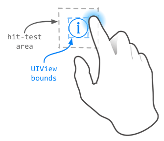
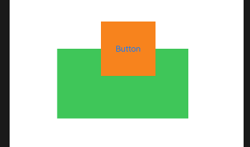
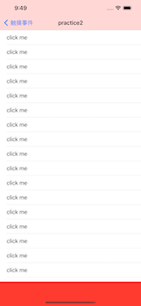
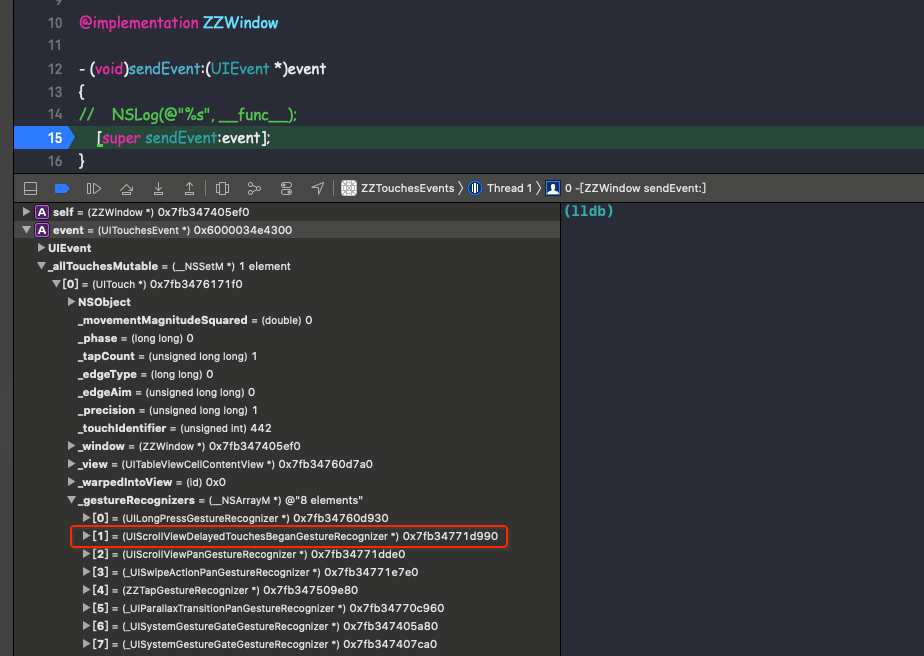
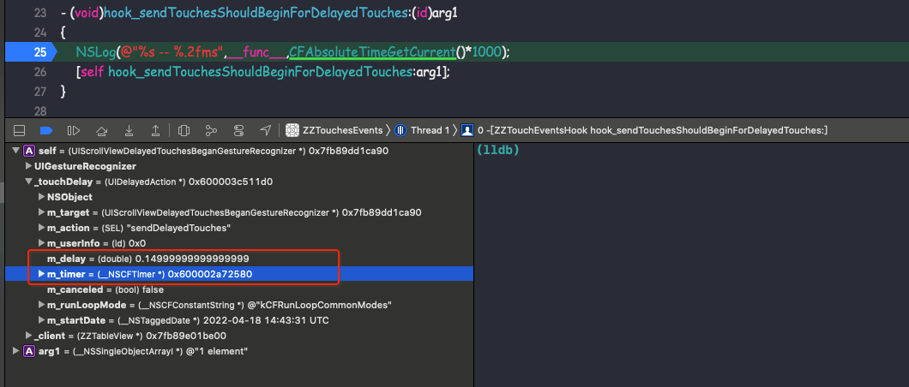

# 触摸事件的实践、应用

本文主要介绍触摸事件的实战、应用

<br>

### 0x01 改变可点击区域

e.g.1 有时给的图标较小，放在 `UIButton` 上导致其点击区域较小，不太方便用户点击。如下：



由前面所学可知，当超出`UIButton` 的区域时，`pointInside:withEvent:` 会返回 `NO`。导致点击事件不能被响应。 这时若要扩大 `UIButton` 点击范围，只需要在 `pointInside:withEvent:` 方法中操作既可以。

如下将 `ZZExpandButton ` 的点击区域上下左右都扩大 20。

```Objective-C
@implementation ZZExpandButton

- (BOOL)pointInside:(CGPoint)point withEvent:(UIEvent *)event
{
    CGRect touchRect =  CGRectInset(self.bounds, -20, -20);
    return CGRectContainsPoint(touchRect, point);
}

@end
```

<br>

e.g.2 还有种情况是点击范围超出父视图的范围，这样点击事件在父视图的 `pointInside:withEvent:` 就会被拦截。

如下图，当点击 `ZZExpandButton` 的上半截区域是不响应事件的。




这时需要在父视图的 `pointInside:withEvent:`  方法中判断，若点击在 `ZZExpandButton ` 也要返回 `YES`

```Objective-C
@implementation ZZExpandView

- (BOOL)pointInside:(CGPoint)point withEvent:(UIEvent *)event
{
    CGPoint btnPoint = [self convertPoint:point toView:subBtn];
    if ([subBtn pointInside:btnPoint withEvent:event]) {
        return  YES;
    }
    return [super pointInside:point withEvent:event];
}

@end
```

<br>

### 0x02 UITableView 和 UIGestureRecognizer

自定义 `ZZTableView` 继承自 `UITableView`, 并重写 `UIResponder` 的 4 个方法

```Objective-C
@implementation ZZTableView

- (void)touchesBegan:(NSSet<UITouch *> *)touches withEvent:(UIEvent *)event
{
    NSLog(@"%s", __func__);
    [super touchesBegan:touches withEvent:event];
}

- (void)touchesMoved:(NSSet<UITouch *> *)touches withEvent:(UIEvent *)event
{
    NSLog(@"%s", __func__);
    [super touchesMoved:touches withEvent:event];
}

- (void)touchesEnded:(NSSet<UITouch *> *)touches withEvent:(UIEvent *)event
{
    NSLog(@"%s", __func__);
    [super touchesEnded:touches withEvent:event];
}

- (void)touchesCancelled:(NSSet<UITouch *> *)touches withEvent:(UIEvent *)event
{
    NSLog(@"%s", __func__);
    [super touchesCancelled:touches withEvent:event];
}

@end
```

将 `ZZTableView` 添加到 `ZZPractive2ViewController` 上，并给 `ZZPractive2ViewController` 的视图添加手势，如下

```Objective-C
@implementation ZZPractive2ViewController

- (void)viewDidLoad {
    ...
    ZZTapGestureRecognizer *tap = [[ZZTapGestureRecognizer alloc] initWithTarget:self action:@selector(didTapPractive2View)];
    [self.view addGestureRecognizer:tap];
}

- (void)didTapPractive2View
{
    NSLog(@"%s", __func__);
}

- (void)tableView:(UITableView *)tableView didSelectRowAtIndexPath:(NSIndexPath *)indexPath
{
    NSLog(@"%s", __func__);
}
...
@end
```



##### e.g.1 短按 cell 打印结果如下

```Objective-C
-[ZZTapGestureRecognizer touchesBegan:withEvent:]
-[ZZTableView touchesBegan:withEvent:]

-[ZZTapGestureRecognizer touchesEnded:withEvent:]
-[ZZPractive2ViewController didTapPractive2View]
-[ZZTableView touchesCancelled:withEvent:]
```

此时 `cell` 没有响应事件，控制器视图响应事件。

短按后，控制器视图上的手势识别器先接收到事件，所以 `[ZZTapGestureRecognizer touchesBegan:withEvent:]` 先被调用，之后事件传递给 hit-tested view，作为响应者链中一员的 `ZZTableVie ` 的 `touchesBegan:withEvent:` 被调用。而后手势识别器成功识别了点击事件，`action`执行，同时通知 `Application` 取消响应链中的事件响应，`ZZTableView`的 `touchesCancelled:withEvent:` 被调用。

##### e.g.2 长按 cell 打印结果如下

```Objective-C
-[ZZTapGestureRecognizer touchesBegan:withEvent:]
-[ZZTableView touchesBegan:withEvent:]
-[ZZTableView touchesEnded:withEvent:]
-[ZZPractive2ViewController tableView:didSelectRowAtIndexPath:]
```

此时 `cell` 响应事件，控制器视图没有响应事件。

长按的过程中，一开始事件同样被传递给手势识别器和 hit-tested view，所以手势的`touchesBegan:withEvent:` 和 `ZZTableView` 的 `touchesBegan:withEvent:` 都会被调用。此后在长按的过程中，手势识别器一直在识别手势，直到一定时间后手势识别失败，才将事件的响应权完全交给响应链。当触摸结束的时候，`ZZTableView` 的 `touchesEnded:withEvent:` 被调用，同时 `Cell` 响应了点击事件。

##### e.g.3 单击 cell 打印结果如下

```Objective-C
-[ZZTapGestureRecognizer touchesBegan:withEvent:]
-[ZZTapGestureRecognizer touchesMoved:withEvent:]
-[ZZPractive2ViewController didTapPractive2View]
```

按理说单击 cell 打印结果应该和 短按 cell 打印结果是一样的。但日志只打印的手势响应过程和 action 被调用。

分析一下原因：`ZZTableView` 的 `touchesBegan:withEvent:` 没有调用，说明事件没有传递给 hit-tested view。那只有一种可能，就是事件被某个手势识别器拦截了。目前已知的手势识别器拦截事件的方法，就是设置 `delaysTouchesBegan` 为 `YES`，在手势识别器未识别完成的情况下不会将事件传递给 hit-tested view。然后事实上并没有进行这样的设置，那么问题可能出在别的手势识别器上。

在 `ZZWindow` 的 `sendEvent:` 打个断点查看 `event` 上的 `touch` 对象维护的手势识别器数组:



捕获可疑对象：`UIScrollViewDelayedTouchesBeganGestureRecognizer` ，光看名字就觉得这货脱不了干系。从类名上猜测，这个手势识别器大概会延迟事件向响应链的传递。从 github 上找到其[定义](https://github.com/MP0w/iOS-Headers/blob/master/Compare_Latest/Frameworks/UIKit/UIScrollViewDelayedTouchesBeganGestureRecognizer.h)如下：

```Objective-C
#import <UIKit/UIGestureRecognizer.h>

@class UIDelayedAction;

__attribute__((visibility("hidden")))
@interface UIScrollViewDelayedTouchesBeganGestureRecognizer : UIGestureRecognizer
{
    UIDelayedAction *_touchDelay;
    struct CGPoint _startSceneReferenceLocation;
}

- (void)touchesCancelled:(id)arg1 withEvent:(id)arg2;
- (void)touchesEnded:(id)arg1 withEvent:(id)arg2;
- (void)touchesMoved:(id)arg1 withEvent:(id)arg2;
- (void)touchesBegan:(id)arg1 withEvent:(id)arg2;
- (void)_resetGestureRecognizer;
- (void)dealloc;
- (void)sendDelayedTouches;
- (void)sendTouchesShouldBeginForDelayedTouches:(id)arg1;
- (void)sendTouchesShouldBeginForTouches:(id)arg1 withEvent:(id)arg2;
- (void)clearTimer;

@end
```

有一个 `_touchDelay` 变量，大概是用来控制延迟事件发送的。另外，方法列表里有个 `sendTouchesShouldBeginForDelayedTouches:` 方法，听名字似乎是在一段时间延迟后向响应链传递事件用的。为一探究竟，创建 `ZZTouchEventsHook` 来 hook 此方法：

```Objective-C
@implementation ZZTouchEventsHook

+ (void)load
{
    Class aClass = objc_getClass("UIScrollViewDelayedTouchesBeganGestureRecognizer");
    SEL sel = @selector(hook_sendTouchesShouldBeginForDelayedTouches:);
    Method method = class_getClassMethod([self class], sel);
    class_addMethod(aClass, sel, class_getMethodImplementation([self class], sel), method_getTypeEncoding(method));
    // 交换实现
    exchangeMethod(aClass, @selector(sendTouchesShouldBeginForDelayedTouches:), sel);
}

- (void)hook_sendTouchesShouldBeginForDelayedTouches:(id)arg1
{
    NSLog(@"%s -- %.2fms",__func__,CFAbsoluteTimeGetCurrent()*1000);
    [self hook_sendTouchesShouldBeginForDelayedTouches:arg1];
}

void exchangeMethod(Class aClass, SEL oldSEL, SEL newSEL) {
    Method oldMethod = class_getInstanceMethod(aClass, oldSEL);
    Method newMethod = class_getInstanceMethod(aClass, newSEL);
    method_exchangeImplementations(oldMethod, newMethod);
}

@end
```

断点看一下点击 `cell` 后 `hook_sendTouchesShouldBeginForDelayedTouches:` 调用时的信息，如下图：



可以看到这个手势识别器的 `_touchDelay` 变量中，保存了一个计时器，以及一个长得很像延迟时间间隔的变量 `m_delay`。现在，可以推测该手势识别器截断了事件并延迟 0.15s 才发送给 hit-tested view。为验证猜测，我分别在 `ZZWindow` 的 `sendEvent:`、`hook_sendTouchesShouldBeginForDelayedTouches:` 以及 `ZZTableView` 的 `touchesBegan: withEvent:` 中打印时间戳，若猜测成立，则应当前两者的调用时间相差0.15s左右，后两者的调用时间很接近。

短按 `cell` 后打印结果如下:

```Objective-C
-[ZZWindow sendEvent:] -- 671986558880.72 ms
-[ZZTapGestureRecognizer touchesBegan:withEvent:] -- 671986558881.40 ms

-[ZZTouchEventsHook hook_sendTouchesShouldBeginForDelayedTouches:] -- 671986559032.55ms
-[ZZTableView touchesBegan:withEvent:] -- 671986559033.15 ms

-[ZZWindow sendEvent:] -- 671986559387.70 ms
-[ZZTapGestureRecognizer touchesEnded:withEvent:]
-[ZZPractive2ViewController didTapPractive2View]
-[ZZTableView touchesCancelled:withEvent:]
```

从打印结果看，`[ZZWindow sendEvent:]` 和 `[ZZTapGestureRecognizer touchesBegan:withEvent:]` 间隔事件很短，经过大约 0.15s 后调用 `[ZZTableView touchesBegan:withEvent:]` 将事件传递给 hit-tested view。所以才想成立。

这样就都解释得通了。e.g.3 由于点击后，`UIScrollViewDelayedTouchesBeganGestureRecognizer` 拦截了事件并延迟了 0.15s 发送。又因为点击时间比 0.15s 短，在发送事件前触摸就结束了，因此事件没有传递到 hit-tested view，导致 `TableView` 的 `touchBegin: withEvent:` 没有调用。

而 e.g.1 由于短按的时间超过了 0.15s，手势识别器拦截了事件并经过 0.15s 后，触摸还未结束，于是将事件传递给了 hit-tested view，使得 `TableView` 接收到了事件。因此 e.g.1 的日志虽然和离散型手势中的日志一致，但实际上前者的 hit-tested view 是在触摸后延迟了约 0.15s 左右才接收到触摸事件的。

<br>

### 0x03 事件集中处理

假设视图控制器中有一个 tableView，cell 上有两个按钮 `firstButton`、`secondButton`，点击按钮、cell 本身都会触发事件。以前我们一般直接处理事件，或使用 delegate、closure 等回调给视图控制器处理，现在我们可以使用 `nextResponder` 将所有响应都传递到控制器处理，这样代码逻辑会更清晰，业务逻辑也变得更简单。


```Objective-C
@implementation UIResponder (ZZHandle)

- (void)routerEvent:(NSString *)event userInfo:(NSDictionary *)userInfo
{
    NSLog(@"%s -- %@", __func__, NSStringFromClass([self class]));
    [self.nextResponder routerEvent:event userInfo:userInfo];
}

@end
```

```Objective-C
@implementation ZZHandleTableViewCell

- (void)awakeFromNib {
    [super awakeFromNib];
    
    [self.firstBtn addTarget:self action:NSSelectorFromString(@"didTouchFirstBtn") forControlEvents:UIControlEventTouchUpInside];
    [self.secondBtn addTarget:self action:NSSelectorFromString(@"didTouchSecondBtn") forControlEvents:UIControlEventTouchUpInside];
}

- (void)didTouchSecondBtn
{
    NSLog(@"%s", __func__);
    [self routerEvent:@"secondBtn" userInfo:@{}];
}

- (void)didTouchFirstBtn
{
    NSLog(@"%s", __func__);
    [self routerEvent:@"firstBtn" userInfo:@{}];
}

@end
```


```Objective-C
@implementation ZZHandleViewController

- (void)routerEvent:(NSString *)event userInfo:(NSDictionary *)userInfo
{
    if ([event isEqualToString:@"firstBtn"]) {
        NSLog(@"%s -- %@", __func__, @"did touch First Btn");
    } else if ([event isEqualToString:@"secondBtn"]) {
        NSLog(@"%s -- %@", __func__, @"did touch second Btn");
    } else {
        NSLog(@"did touch other Btn");
    }
}
@end
```

点击`firstBtn` 打印结果如下

```Objective-C
-[ZZButton touchesBegan:withEvent:]
-[ZZButton beginTrackingWithTouch:withEvent:]
-[ZZButton touchesEnded:withEvent:]
-[ZZButton endTrackingWithTouch:withEvent:]

-[ZZHandleTableViewCell didTouchFirstBtn]
-[UIResponder(ZZHandle) routerEvent:userInfo:] -- ZZHandleTableViewCell
-[UIResponder(ZZHandle) routerEvent:userInfo:] -- UITableView
-[ZZHandleViewController routerEvent:userInfo:] -- did touch First Btn
```

这样就可以将点击 `firstBtn`、`secondBtn` 的响应方法集中在 `ZZHandleViewController` 中处理。点击 `firstBtn ` 时，触发 `routerEvent:userInfo:`方法，此时将事件转发给 `ZZHandleTableViewCell `；由于 `cell` 没有处理事件，`cell` 将事件转发给 `UITableView` 处理；`UITableView` 也没有处理事件，于是将事件转发给 `ZZHandleViewController` 的根视图`UIView`；由于`UIView`也没有处理事件，它将事件转发给 `ZZHandleViewController `，`ZZHandleViewController ` 已经处理了事件，不再进行转发。最后，也就由视图控制器统一处理。

其实上述代码还可以再简化。`UIControl` 有这样一个特性：若不指定 `target`，即 `addTarget:action:forControlEvents:` 时 `target` 传空，那么当事件发生时，`Application` 会在响应链上从上往下寻找能响应 `action` 的对象。

代码简化如下：

```Objective-C
@implementation ZZHandleTableViewCell

- (void)awakeFromNib {
    [super awakeFromNib];
    
    [self.firstBtn addTarget:nil action:NSSelectorFromString(@"didTouchFirstBtn") forControlEvents:UIControlEventTouchUpInside];
    [self.secondBtn addTarget:nil action:NSSelectorFromString(@"didTouchSecondBtn") forControlEvents:UIControlEventTouchUpInside];
}
@end
```

```Objective-C
@implementation ZZHandleViewController

- (void)didTouchSecondBtn
{
    NSLog(@"%s", __func__);
}

- (void)didTouchFirstBtn
{
    NSLog(@"%s", __func__);
}
@end
```

点击 `secondBtn`，打印结果如下：

```Objective-C
-[ZZButton touchesBegan:withEvent:]
-[ZZButton beginTrackingWithTouch:withEvent:]
-[ZZButton touchesEnded:withEvent:]
-[ZZButton endTrackingWithTouch:withEvent:]

-[ZZHandleViewController didTouchSecondBtn]
```


<br>


