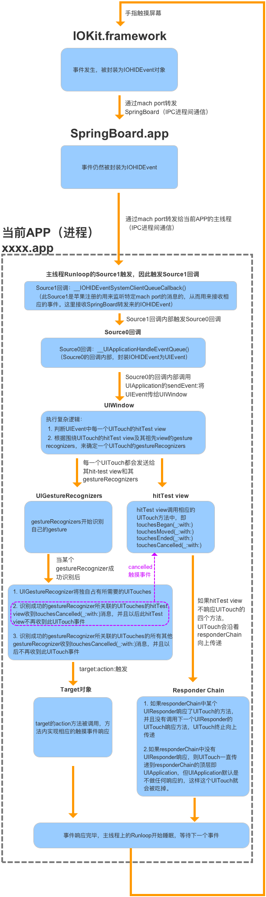
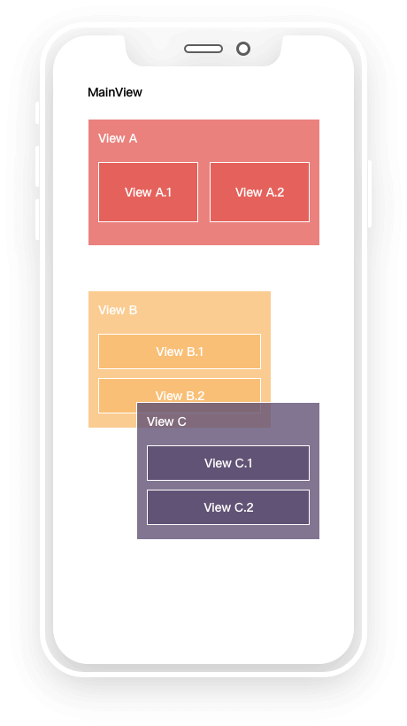
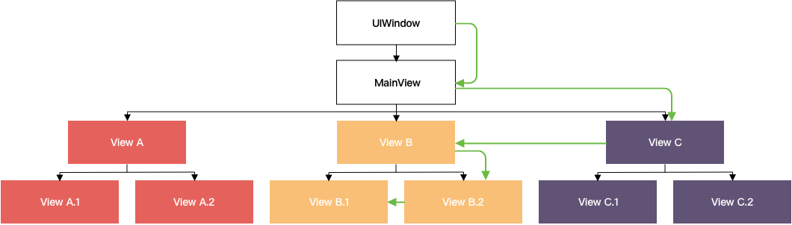

# 触摸事件

<br>

## 一、`UITouch`、`UIEvent`、`UIResponder`

### 0x01 `UITouch`


### 0x02 `UIEvent`


### 0x03 `UIResponder`


<br>

## 二、事件的生命周期

当指尖触碰屏幕的那一刻，一个触摸事件就在系统中生成了。经过 IPC 进程间通信，事件最终被传递到了合适的应用中。然后在应用中经过传递、响应到最终释放。大致过程如下：



**系统响应阶段**

- 手指触碰屏幕，屏幕感应到触碰后，将事件交由 `IOKit.framework` 处理

- 通过 `IOKit.framework` 将触摸事件包装成 `IOHIDEvent` 对象
- 然后系统通过 mach port (IPC 进程间通信) 将 `IOHIDEvent` 对象转发给 SpringBoard.app
- SpringBoard.app 是 iOS 系统桌面 App，它只接收按键、触摸、加速、接近传感器等几种 Event。SpringBoard.app 会找到可以响应这个事件的 App，并通过 mach port(IPC 进程间通信) 将 `IOHIDEvent` 对象转发给这个 App。

**APP响应阶段**

- APP 进程的 mach port 接受到 SpringBoard 进程传递来的触摸事件，主线程的 runloop 被唤醒，触发了 `source1` 回调。

- `source1` 回调内部触发了 `source0` 回调，`source0` 内部回调将接收到的 `IOHIDEvent` 对象封装成 `UIEvent` 对象。
- `Soucre0` 回调内部调用 `UIApplication` 的 `+[sendEvent:]` 方法，将 `UIEvent` 传给 `UIWindow`。至此 APP 将正式开始对于触摸事件的响应。
- source0回调内部将触摸事件添加到UIApplication对象的事件队列中。事件出队后，UIApplication开始一个寻找最佳响应者的过程，这个过程又称`hit-testing`，细节将后面详述。
- 寻找到最佳响应者后，接下来的事情便是事件在响应链中的被响应了，关于响应链相关的内容详见。
- 事实上，事件除了被响应者消耗，还能被手势识别器或是 `target-action` 模式捕捉并消耗掉。其中涉及对触摸事件的响应优先级，详见。
- 触摸事件历经坎坷后要么被某个响应对象捕获后释放，要么致死也没能找到能够响应的对象，最终释放。至此触摸事件的使命就算终结了。runloop 若没有其他事件需要处理，也将重归于眠，等待新的事件到来后唤醒。

<br>

## 三、事件传递

每个事件的理想宿命是被能够响应它的对象响应后释放，然而响应者诸多，事件一次只有一个，谁都想把事件抢到自己碗里来，为避免纷争，就得有一个先后顺序，也就是得有一个响应者的优先级。因此这就存在一个寻找事件最佳响应者（又称第一响应者 first responder）的过程，目的是找到一个具备最高优先级响应权的响应对象（the most appropriate responder object），这个过程叫做 Hit-Testing，那个命中的最佳响应者称为 hit-tested view。

### 0x01 谁能成为第一响应者

`UIKit` 根据事件的类型将对象指定为事件的第一响应者。事件类型包括：

| Event type | First responder |
| --- | --- |
| Touch events | The view in which the touch occurred. |
| Press events| The object that has focus. |
| Shake-motion events | The object that you (or UIKit) designate. |
| Remote-control events | The object that you (or UIKit) designate. |
| Editing menu messages | The object that you (or UIKit) designate. |

### 0x02 事件自下而上传递

应用接收到事件后先将其置入事件队列中以等待处理。出队后，application 首先将事件传递给当前应用最后显示的窗口（`UIWindow`）询问其能否响应事件。若窗口能响应事件，则传递给子视图询问是否能响应，子视图若能响应则重复询问子视图的子视图。子视图询问的顺序是优先询问后添加的子视图，因为后添加会默认显示在上层，成为第一响应者的几率更大。事件传递顺序如下：

```
UIApplication(下) -> UIWindow -> subview -> ... -> subview (上)
```

创建如下视图：



当我们点击 `View B.1` 的时候，查找第一响应者的过程大致如下(深度优先搜索)：



- `UIWindow` 将事件传递给 `MainVIew`

- `MainVIew` 判断自身能否响应事件，若能则倒序遍历 `MainVIew` 的子视图，判断触摸点的位置在 `View B` 范围内
- `View B` 判断自身能否响应事件，若能再倒序遍历 `View B` 的子视图，判断触摸点的位置在 `View B.1` 范围内
- 查找到 `View B.1` 是第一响应者。

查找第一响应者要判断视图是否能响应事件，还要判断点击位置是否落在自身的范围内，那该如何判断？ 这就是说到 `hitTest:withEvent:` 和 `pointInside:withEvent:`

### 0x03 `hitTest:withEvent:`

在说 `hitTest:withEvent:` 前，要先知道若视图满足下面的任一条件，视图都不能响应事件：

- `userInteractionEnabled = NO`

- `hidden = YES` 如果父视图隐藏，那么子视图也会隐藏，隐藏的视图无法接收事件
- alpha < 0.01 如果设置一个视图的透明度 < 0.01，会直接影响子视图的透明度。alpha：0.0 ~ 0.01为透明

每个 `UIView` 对象都有一个 `hitTest:withEvent:` 方法，这是查找第一响应者过程中最核心的存在。其作用是询问事件在当前视图中的响应者，同时又是作为事件传递的桥梁。

`hitTest:withEvent:` 方法返回一个 `UIView` 对象，作为当前视图层次中的响应者。默认实现是：

- 若当前视图无法响应事件，则返回 `nil`

- 若当前视图可以响应事件，但无子视图可以响应事件，则返回自身作为当前视图层次中的事件响应者
- 若当前视图可以响应事件，同时有子视图可以响应，则返回子视图层次中的事件响应者。

```Objective-C
- (UIView *)hitTest:(CGPoint)point withEvent:(UIEvent *)event{
    //3种状态无法响应事件
    if (self.userInteractionEnabled == NO || self.hidden == YES ||  self.alpha <= 0.01) return nil; 
    //触摸点若不在当前视图上则无法响应事件
    if ([self pointInside:point withEvent:event] == NO) return nil; 
    //从后往前遍历子视图数组 
    int count = (int)self.subviews.count; 
    for (int i = count - 1; i >= 0; i--) 
    { 
        // 获取子视图
        UIView *childView = self.subviews[i]; 
        // 坐标系的转换,把触摸点在当前视图上坐标转换为在子视图上的坐标
        CGPoint childP = [self convertPoint:point toView:childView]; 
        //询问子视图层级中的最佳响应视图
        UIView *fitView = [childView hitTest:childP withEvent:event]; 
        if (fitView) 
        {
            //如果子视图中有更合适的就返回
            return fitView; 
        }
    } 
    //没有在子视图中找到更合适的响应视图，那么自身就是最合适的
    return self;
}
```

现在我们在上述示例的视图层次中的每个视图类中添加如下 3 个方法来验证一下之前的分析, 以 `B1View` 为例

```Objective-C
@implementation B1View

- (UIView *)hitTest:(CGPoint)point withEvent:(UIEvent *)event
{
    NSLog(@"%s", __func__);
    return [super hitTest:point withEvent:event];
}

- (BOOL)pointInside:(CGPoint)point withEvent:(UIEvent *)event
{
    NSLog(@"%s", __func__);
    return [super pointInside:point withEvent:event];
}

- (void)touchesBegan:(NSSet<UITouch *> *)touches withEvent:(UIEvent *)event
{
    NSLog(@"%s---%@", __func__, touches);
}

@end
```

点击 `View B1` 函数调用栈如下：

```
-[CView hitTest:withEvent:]
-[CView pointInside:withEvent:]
-[BView hitTest:withEvent:]
-[BView pointInside:withEvent:]
-[B2View hitTest:withEvent:]
-[B2View pointInside:withEvent:]
-[B1View hitTest:withEvent:]
-[B1View pointInside:withEvent:]

-[CView hitTest:withEvent:]
-[CView pointInside:withEvent:]
-[BView hitTest:withEvent:]
-[BView pointInside:withEvent:]
-[B2View hitTest:withEvent:]
-[B2View pointInside:withEvent:]
-[B1View hitTest:withEvent:]
-[B1View pointInside:withEvent:]
-[B1View touchesBegan:withEvent:]
```

可以看到最终是视图 `View B1` 先对事件进行了响应，同时事件传递过程也和之前的分析一致。事实上单击后从 `[CView hitTest:withEvent:]` 到 [B1View pointInside:withEvent:] 的过程会执行两遍，两次传的是同一个 touch，区别在于 touch 的状态不同，第一次是 begin 阶段，第二次是 end 阶段。也就是说，应用对于事件的传递起源于触摸状态的变化。

<br>

## 四、事件响应

### 0x01 事件响应的前奏

因为最佳响应者具有最高的事件响应优先级，因此 UIApplication 会先将事件传递给它供其响应。首先，UIApplication 将事件通过 `sendEvent:` 传递给事件所属的 window，window 同样通过 `sendEvent:` 再将事件传递给最佳响应者视图。过程如下

```
UIApplication ——> UIWindow ——> hit-tested view
```

以点击 `View B1` 为例，在 `touchesBegan:withEvent:` 中下断点，得到函数调用栈如下：

```Objective-C

```

那么问题又来了。这个过程中，假如应用中存在多个 window 对象，UIApplication 是怎么知道要把事件传给哪个 window 的？window 又是怎么知道哪个视图才是最佳响应者的呢？

其实简单思考一下，这两个过程都是传递事件的过程，涉及的方法都是 `sendEvent:` ，而该方法的参数（`UIEvent` 对象）是唯一贯穿整个经过的线索，那么就可以大胆猜测必然是该触摸事件对象上绑定了这些信息。事实上之前在介绍 `UITouch` 的时候就说过 touch 对象保存了触摸所属的 window 及 view，而 event 对象又绑定了 touch 对象，如此一来，是不是就说得通了。要是不信的话，那就自定义一个 Window 类，重写 `sendEvent:`方法，捕捉该方法调用时参数 event 的状态，答案就显而易见了

```Objective-C
```

至于这两个属性是什么时候绑定到touch对象上的，必然是在hit-testing的过程中呗，仔细想想hit-testing干的不就是这个事儿吗~

### 0x02 事件响应链 

<br>


<br>

**Reference**

- [iOS触摸事件全家桶](https://www.jianshu.com/p/c294d1bd963d)

- [Touches, Presses, and Gestures](https://developer.apple.com/documentation/uikit/touches_presses_and_gestures)

<br>