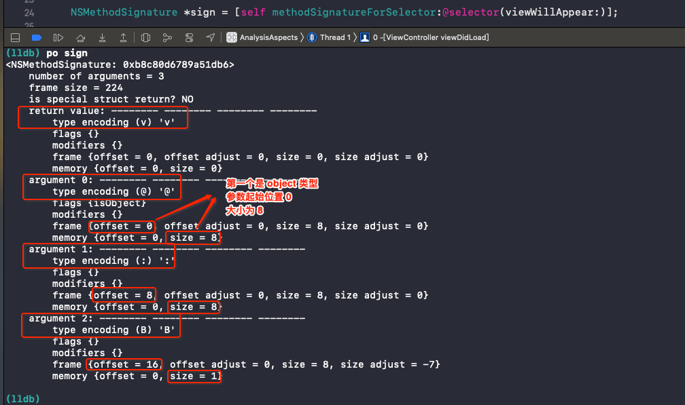

# Type Encoding


<br>

### 0x01 简介

Type Encodings 作为对 Runtime 的补充，编译器将每个方法的返回值和参数类型编码为一个字符串，并将其与方法的 `selector` 关联在一起。

```Objective-C
// objc4 objc-runtime-new.mm

struct method_t {
    // 方法名
    SEL name;
    // 编码(参数类型 返回值类型)也称方法签名
    const char *types;
    // 方法实现 也就是指向函数的指针
    IMP imp;
};
```

这种编码方案在其它情况下也是非常有用的，因此我们可以使用 `@encode` 编译器指令来获取它。当给定一个类型时，`@encode` 返回这个类型的字符串编码。这些类型可以是诸如 `int`、指针这样的基本类型，也可以是结构体、类等类型。事实上，任何可以作为 `sizeof()` 操作参数的类型都可以用于 `@encode()`。

在 Objective-C Runtime Programming Guide 中的 Type Encoding 一节中，列出了Objective-C 中所有的类型编码，如下：

| Code | Meaning |
|--- | --- |
| c | A char |
| i | An int |
| s | A short |
| l | A long <br> l is treated as a 32-bit quantity on 64-bit programs. |
| q | An long long |
| C | An unsigned char |
| I | An unsigned int |
| S | An unsigned short |
| L | An unsigned long |
| Q | An unsigned long long |
| f | A float |
| d | A double |
| B | A C++ bool or a C99 _Bool |
| v | A void |
| * | A character string (char *) |
| @ | An object (whether statically typed or typed id) |
| # | A class object (Class) |
| : | A method selector (SEL) |
| [array type] | An array |
| {name=type...} | A struct |
| (name=type...) | A union |
| bnum | A bit field of num bits |
| ^type | A pointer to type |
| ? | An unknown type (among other things, this code is used for function pointers) |

注意：Objective-C 不支持 `long double` 类型。`@encode(long double)`返回`d`，与 `double` 是一样的。


<br>


### 0x02 实践

这里给出两种方式来获取任意方法的 Type Encoding (或者叫方法签名)，以 `viewWillAppear:` 为例：

#### `NSObject` 中 `methodSignatureForSelector` 方法

```Objective-C
- (NSMethodSignature *)methodSignatureForSelector:(SEL)aSelector OBJC_SWIFT_UNAVAILABLE("");
```




#### `struct method_t` 

OC 中所有方法都会包装成 `struct method_t` 格式。为了不和系统方法冲突，我们自定义一个 `struct zz_objc_method` 

```Objective-C
// 为防止和系统 objc_method 重名，这里加个前缀
struct zz_objc_method {
    SEL _Nonnull zz_name;
    char * _Nullable zz_types;
    IMP _Nonnull zz_imp;
};
```

再用 runtime 方法获取 Method 

```Objective-C
Method me = class_getInstanceMethod([self class], @selector(viewWillAppear:));
struct zz_objc_method *meth = (struct zz_objc_method *)me;

NSLog(@"viewWillAppear的方法签名: %s", meth->zz_types);
// viewWillAppear的方法签名: v20@0:8B16
```

从上面两种方式，都能得到如下结论：

- 返回值类型是 `v` 也就是 `void`，不占大小。20 表示方法签名总共占用的大小

- 第一个参数类型是 `@` 对应的是 OC 中的 object，也就是 `self`。偏移量是 0 大小为 8
- 第二个参数类型是 `:` 对应的是 OC 中的 SEL，也就是 `selector`。偏移量是 8 大小为 8
-  第三个参数类型是 `B` 对应的类型是 `BOOL`，也就是 `viewWillAppear:` 的入参类型。偏移量是 16 大小为 1

<br>

参考：

- [Type Encodings
](https://developer.apple.com/library/archive/documentation/Cocoa/Conceptual/ObjCRuntimeGuide/Articles/ocrtTypeEncodings.html)


<br>