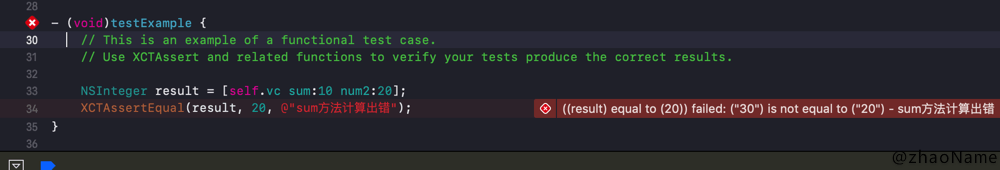
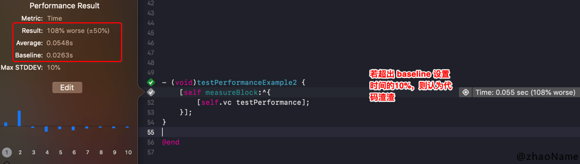
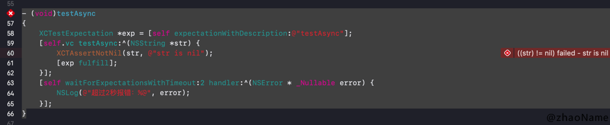

# iOS 单元测试 - 初探

<br>

单元测试是在软件开发过程中要进行的最低级别的测试活动，软件的独立单元将在与程序的其他部分相隔离的情况下进行测试。单元测试能提高代码质量和可维护性。

iOS 中的单元测试使用`XCTest/XCTest.h`框架，单元测试的类继承自`XCTestCase`。我们来看下`XCTestCase`常用方法：

```
// This method is called before the invocation of each test method in the class.
// 每次测试前调用，可以再次做一些初始化操作
- (void)setUp;

// This method is called after the invocation of each test method in the class.
// 每当测试结束时都会调用此方法
- (void)tearDown;

// This is an example of a functional test case.
// Use XCTAssert and related functions to verify your tests produce the correct results.
// 逻辑测试
- (void)testExample;

// This is an example of a performance test case.
// 性能测试
- (void)testPerformanceExample {
    [self measureBlock:^{
        // Put the code you want to measure the time of here.
    }];
}
```

上面逻辑测试的注释中有个`XCTAssert ` -- 断言。大部分的测试方法使用断言决定的测试结果。

```
XCTAssert(expression, format...)
XCTAssertTrue(expression, format...)
XCTAssertFalse(expression, format...)
XCTAssertEqual(expression1, expression2, format...)
XCTAssertNotEqual(expression1, expression2, format...)
XCTAssertEqualWithAccuracy(expression1, expression2, accuracy, format...)
XCTAssertNotEqualWithAccuracy(expression1, expression2, accuracy, format...)
XCTAssertNil(expression, format...)
XCTAssertNotNil(expression, format...)
XCTFail(format...) 
```


<br>

## 逻辑测试

```
// ViewController.m  .h就不给了
- (NSInteger)sum:(NSInteger)num1 num2:(NSInteger)num2
{
    return num1 + num2;
}


// UseUnitTestTests.m
- (void)setUp {
    self.vc = [[ViewController alloc] init];
}

- (void)tearDown {
    self.vc = nil;
}

- (void)testExample {
    NSInteger result = [self.vc sum:10 num2:20];
    XCTAssertEqual(result, 20, @"sum方法计算出错");
}
```



## 性能测试

```
// ViewController.m
- (void)testPerformance
{
    for (int i=0; i<100; i++) {
        NSLog(@"testPerformance %d", i);
    }
}


// UseUnitTestTests.m
- (void)setUp {
    self.vc = [[ViewController alloc] init];
}

- (void)tearDown {
    self.vc = nil;
}

- (void)testPerformanceExample {
    // This is an example of a performance test case.
    [self measureBlock:^{
        [self.vc testPerformance];
    }];
}
```




我们还可以用其他方法：

```
/**
 Call this method from within a test method to measure the performance of a block of code. 
 This method provides more granular control over performance measurement than the measureBlock: method, 
 and should be used when you need to customize the points at which measurement starts and ends within the block, 
 or wish to measure multiple metrics for the block.
 
 Performance measurement must be started and stopped exactly once within the block. As a result:
 - If automaticallyStartMeasuring is YES and startMeasuring is called inside the block, the test will fail.
 - If automaticallyStartMeasuring is NO, startMeasuring must be called once and only once before the end of the block, or the test will fail.
 - If stopMeasuring is called multiple times during the block the test will fail.
 */
 
 - (void)testPerformanceExample2 
{
    [self measureMetrics:@[XCTPerformanceMetric_WallClockTime] automaticallyStartMeasuring:NO forBlock:^{
        [self startMeasuring];
        [self.vc testPerformance];
        [self stopMeasuring];
    }];
}
```

示范多次调用`stopMeasuring `会出错：


## 异步测试


```
// ViewController.m
- (void)testAsync:(void(^)(NSString *str))block
{
    dispatch_async(dispatch_get_global_queue(DISPATCH_QUEUE_PRIORITY_DEFAULT, 0), ^{
        sleep(1);
        dispatch_async(dispatch_get_main_queue(), ^{
            block(@"back data");
        });
    });
}


// UseUnitTestTests.m
- (void)setUp {
    self.vc = [[ViewController alloc] init];
}

- (void)tearDown {
    self.vc = nil;
}

- (void)testAsync
{
    XCTestExpectation *exp = [self expectationWithDescription:@"testAsync"];
    [self.vc testAsync:^(NSString *str) {
        XCTAssertNotNil(str, @"str is nil");
        [exp fulfill];
    }];
    [self waitForExpectationsWithTimeout:2 handler:^(NSError * _Nullable error) {
        NSLog(@"超过2秒报错：%@", error);
    }];
}
```

执行结束`str`不为空且在2秒钟之内完成，说明正常完成。

若`str`为空



若时间超过2秒


## UI 测试


<br>

参考：

- [UI Testing in Xcode](https://developer.apple.com/videos/play/wwdc2015/406/)

- [WWDC15 Session笔记 - Xcode 7 UI 测试初窥](https://onevcat.com/2015/09/ui-testing/)

写于 2020-02-15

<br>


