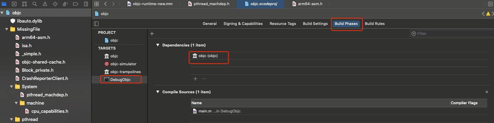

# 编译 & 运行 objc4-750


可以在这找到 [objc4](http://opensource.apple.com/tarballs/objc4/) 的源码下载。

<br>

## 一、编译

### 0x01 准备工作

进入[苹果开源网站](https://opensource.apple.com/tarballs/)，下载依赖的开源项目：

- xnu-4903.270.47

- dyld-551.4
- libdispatch-1008.270.1
- libpthread-416.60.2
- Libc-825.40.1
- libplatform-177.270.1
- libclosure-78

### 0x02 架构问题

提示 `The i386 architecture is deprecated. You should update your ARCHS build setting to remove the i386 architecture. ` 错误。需要到 `Targets -> Build Settings  -> Architecture` 设置为 `Standard arcgutectures`


### 0x03 设置缺失文件检索路径

在当前项目下创建一个文件夹 MissingFile，里面用于存放所有缺失的头问题件。
然后在 `Targets -> Build Settings -> Header Serach Paths` 中添加搜索路径 `$(SRCROOT)/MissingFile`


### 0x04 头文件找不到

0x01. 编译提示：`'sys/reason.h' file not found `

打开文件夹，搜索 `sys/reason.h`，然后将 `./xnu-4903.270.47/bsd/sys/reason.h`  路径下的 `reason.h` 文件复制到 objc4-750 工程下的 `/MissingFile/sys/` 文件夹中


接下来重复上述步骤

0x02. 编译提示：`'mach-o/dyld_priv.h' file not found`

选择 `./dyld-551.3/include/mach-o/dyld_priv.h` 

0x03. 编译提示：`'os/lock_private.h' file not found`

选择 `./libdispatch-1008.270.1/private/os/lock_private.h` 

0x04. 编译提示：`'os/base_private.h' file not found`

选择 `./libdispatch-1008.270.1/private/os/base_private.h` 

0x05. 编译提示：`'pthread/tsd_private.h' file not found`

选择 `./libpthread-416.60.2/private/tsd_private.h` 

0x06. 编译提示：`'System/machine/cpu_capabilities.h' file not found`

选择 `./xnu-4903.270.47/osfmk/machine/cpu_capabilities.h` 

0x07. 编译提示：`'os/tsd.h' file not found`

选择 `./xnu-4903.270.47/libsyscall/os/tsd.h` 

0x08. 编译提示：`'pthread/spinlock_private.h' file not found`

选择 `./libdispatch-1008.270.1/private/spinlock_private.h` 

0x09. 编译提示：`'System/pthread_machdep.h' file not found`

选择 `./Libc-825.40.1/pthreads/pthread_machdep.h` 

0x0a. 编译提示：`'CrashReporterClient.h' file not found`

选择 `./Libc-825.40.1/include/CrashReporterClient.h` 

0x0b. 编译提示：`'Block_private.h' file not found`

选择 `./libdispatch-1008.270.1/src/BlocksRuntime/Block_private.h`

0x0c. 编译提示：`Typedef redefinition with different types ('int' vs 'volatile OSSpinLock' (aka 'volatile int'))`

重复定义 `pthread_lock_t`，在 pthread_machdep.h 中删除 `pthread_lock_t` 的定义就可以。

0x0d. 编译提示：`Static declaration of '_pthread_has_direct_tsd' follows non-static declaration`

这里有三个函数重复定义了

- `_pthread_has_direct_tsd`

- `_pthread_getspecific_direct`
- `_pthread_setspecific_direct`

在 pthread_machdep.h 中删除对应的函数就好。


0x0e. 编译提示：`'objc-shared-cache.h' file not found`

选择 `./dyld-551.4/include/objc-shared-cache.h`


0x0f. 提示 `Use of undeclared identifier 'DYLD_MACOSX_VERSION_10_13'`

在 dyld_priv.h 文件顶部加入一下宏：

```Objective-C
#define DYLD_MACOSX_VERSION_10_11 0x000A0B00
#define DYLD_MACOSX_VERSION_10_12 0x000A0C00
#define DYLD_MACOSX_VERSION_10_13 0x000A0D00
#define DYLD_MACOSX_VERSION_10_14 0x000A0E00
```

0x10. 编译提示 `'isa.h' file not found`

`isa.h` 文件在 objc4-750 工程的 runtime 文件夹下


然后右键将它导入到 `./MissingFile/` 文件夹下


0x11. 编译提示 `'_simple.h' file not found`

选择 `./libplatform-177.270.1/private/_simple.h`


0x12. 编译提示 `Use of undeclared identifier 'CRGetCrashLogMessage'`

`Targets -> Build Settings -> Preprocessor Macros Not Used in Precompiled Headers` 中添加`LIBC_NO_LIBCRASHREPORTERCLIENT`


0x13. 编译提示 `can't open order file: /Applications/Xcode.app/Contents/Developer/Platforms/MacOSX.platform/Developer/SDKs/MacOSX11.1.sdk/AppleInternal/OrderFiles/libobjc.order `

修改工程配置，将 `Targets -> Build Settings -> Linking -> Order File` 改为工程根目录下的`libobjc.order`，即：`$(SRCROOT)/libobjc.order`


0x14. 编译提示 `library not found for -lCrashReporterClient`

此时在 `Targets ->  Build Settings -> Linking -> Other Linker Flags` 里删掉 `-lCrashReporterClient` (Debug 和 Release都删)

0x15. 编译提示 `Undefined symbol: _objc_opt_class`

需要适配Mac系统，`Targets ->  Build Settings -> macOS Deployment Target` 选择10.14


0x16. 编译提示 `'_static_assert' declared as an array with a negative size`

直接注释掉 `_static_assert` 


0x17. 编译提示 `'arm64-asm.h' file not found`

右键在 /MissingFile/ 路径下新建 `arm64-asm.h` 文件，并到 [这里](https://opensource.apple.com/source/objc4/objc4-750/runtime/arm64-asm.h.auto.html) 将代码拷贝到自己新建的 `arm64-asm.h` 文件中。


0x18. 编译提示 `SDK "macosx.internal" cannot be located.` 和 `unable to find utility "clang++", not a developer tool or in PATH`

将 `Targets -> Build Phases->Run Script(markgc)` 里的内容 `macosx.internal` 改为 `macosx`


0x19. 编译提示 `no such public header file: '/tmp/objc.dst/usr/include/objc/ObjectiveC.apinotes'`

需要将 `Targets -> Build Settings -> Other Text-Based InstallAPI Flags` 里的内容清空，并把 `Text-Based InstallAPI Verification Model` 里的值改为 Errors Only


至此编译成功。

<br>

### 0x05 编译警告

0x01. 警告 `Traditional headermap style is no longer supported; please migrate to using separate headermaps and set 'ALWAYS_SEARCH_USER_PATHS' to NO. (in target 'objc-trampolines')` 和 `Traditional headermap style is no longer supported; please migrate to using separate headermaps and set 'ALWAYS_SEARCH_USER_PATHS' to NO. (in target 'objc’)`

在项目 `objc-trampolines -> Build Settings` 和 `objc -> Build Settings` 中的下设置 ALWAYS_SEARCH_USER_PATHS 为 NO。


0x02. 警告 `'_PTHREAD_TSD_SLOT_PTHREAD_SELF' macro redefined`

在 pthread_machdep.h 头文件中共有四个宏定义重复：

- `_PTHREAD_TSD_SLOT_PTHREAD_SELF`

- `__PTK_LIBC_TTYNAME_KEY`
- `LOCK_INIT`
- `LOCK_INITIALIZER`

这里选择把 pthread_machdep.h 文件中的宏定义注释掉

<br>

## 二、运行


新建一个 Target 取名为 DebugObjc


为新建的 DebugObjc 添加工程依赖



然后就能运行起来。

**注意环境问题**

- objc4-750 对应的是 mac10.14，Xcode11.3

- objc4-779 对应的是 mac10.15，Xcode11.4
- objc4-781 对应的是 mac 10.15，Xcode12.0.1
- objc4-818.2 对应的是 mac 11.1 Xcode 12.4

如果 750 源码运行在 mac10.15，Xcode11.4 上会出现问题，需根据环境选择不同版本的源码。


<br>


参考：

- [objc4-750编译](https://www.jianshu.com/p/28150fa0c085)

- [《OC底层系列》- 配置可编译运行的objc4源码](https://www.jianshu.com/p/4a2c8e5518c7)

- [iOS底层原理01：objc4-818 源码编译 & 调试](https://www.jianshu.com/p/341be74714e4)

<br>