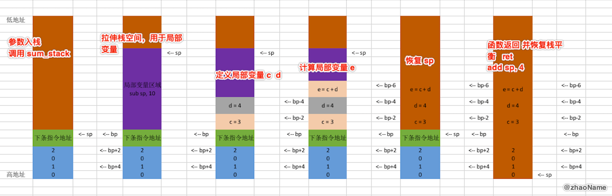

# iOS获取任意线程调用栈(一) - 8086 CPU下栈帧简介

<br>

## 一、8086架构寄存器简介

- 数据寄存器 AX、BX、CX、DX，都可以分成高8位(AH、BH、CH、DH)和低8位(AL、BL、CL、DL)

- 堆栈指针 SP: 指向栈顶

- 基数指针 BP: 用于获取函数参数、内部变量、保存 caller 函数的 BP

- 变址寄存器 源地址: SI  目的地址: DI

- 指令指针 IP: 配合CS 保存下一条汇编指令的地址

- 代码段: CS, 数据段:DS, 堆栈段:SS, 附加段:ES


还要注意一点，8086 CPU地址总线是20位，寻址能力为1M, 但其又是16位的CPU, 也就是说最多只能传输16位的数据，寻址能力为64位。所以8086 采用两个16位的地址来合成20位的物理地址。

**8086的寻址方式：**8086在访问内存时要由相关部件提供内存单元的段地址和偏移地址，送入地址加法器合成物理地址。物理地址 = 段地址(CS、DS、SS、ES) * 16 + 偏移地址(IP)

<br>

## 二、8086汇编下参数传递方式

### 0x01 参数存放到数据段中

```
assume cs:code, ds:data, ss:stack

; 栈段
stack segment
    db 100 dup(0)
stack ends  

; 数据段
data segment  
    db 100 dup(0) 
data ends

; 代码段
code segment
start:
    ; 手动设置 ds ss 的值
    mov ax, data
    mov ds, ax
    mov ax, stack
    mov ss, ax  
    
    ; 往数据段写入数据 当做参数
    mov word ptr [0], 1111h
    mov word ptr [2], 2222h
    call sum_global
    
; 两数之和
sum_global:
	mov ax [0]
	add ax [2]
	ret

    ; 退出
    mov ax, 4c00h
    int 21h
code ends
end start
```

这种方式基本很少用到，因为常用函数的参数随着函数执行结束，生命周期也就到头了。这种情况下若是释放数据段的参数，会增加不必要的汇编代码。若是不释放数据段的参数，会大大浪费内存空间。

### 0x02 参数存放到寄存器中

```
...

; 代码段
code segment
start:
    ; 手动设置 ds ss 的值
    mov ax, data
    mov ds, ax
    mov ax, stack
    mov ss, ax  
    
    ; 往寄存器写入数据 当做参数
    mov cx, 1111h
    mov dx, 2222h
    call sum_register
    
; 两数之和
sum_register:
	mov ax, cx
	add ax, dx
	ret

    ; 退出
    mov ax, 4c00h
    int 21h
code ends
end start
```

寄存器传参的速度快，但 8086 下将参数放到寄存器中，只能将其放在四个数据寄存器中(AX、BX、CX、DX),其它的寄存器都有特殊意义。这样你最多只能有四个参数，而且这还没有算局部变量。

### 0x03 参数存放到栈中

```
...

; 代码段
code segment
start:
    ; 手动设置 ds ss 的值
    mov ax, data
    mov ds, ax
    mov ax, stack
    mov ss, ax  
    
    ; 往栈段写入数据 当做参数
    push, 1122h
    push, 3344h
    call sum_stack
    
    mov bx, 0000h
; 两数之和
sum_stack:
	; 不能直接操作 sp
	mov bp, sp
	mov ax, ss:[bp+2]
	add ax, ss:[bp+4]
	ret

    ; 退出
    mov ax, 4c00h
    int 21h
code ends
end start
```


<br>

## 三、8086 堆栈平衡

上面汇编将参数放在栈段，和放在数据段效果差不多，都没有在函数执行结束释放参数，导致内存空间的浪费。这样多次调用函数后会造成栈溢出。

```
...

; 代码段
code segment
start:
    ; 手动设置 ds ss 的值
    mov ax, data
    mov ds, ax
    mov ax, stack
    mov ss, ax  
    
    push, 1122h
    push, 3344h
    call sum1
    
    push, 5566h
    push, 7788h
    call sum2
    
    push, 99aah
    push, 0aabbh
    call sum3
    
    mov bx, 0000h

sum1:
	mov bp, sp
	mov ax, ss:[bp+2]
	add ax, ss:[bp+4]
	ret

sum2:
	mov bp, sp
	mov ax, ss:[bp+2]
	add ax, ss:[bp+4]
	ret
	
sum3:
	mov bp, sp
	mov ax, ss:[bp+2]
	add ax, ss:[bp+4]
	ret
	
    ; 退出
    mov ax, 4c00h
    int 21h
code ends
end start
```


这样栈空间迟早会被用完，造成栈溢出。

**栈平衡：函数调用前后栈顶指针保持一致**

### 0x01 外平栈

```
...

; 代码段
code segment
start:
	...
    push, 1122h
    push, 3344h
    call sum1
    add sp, 4
    
    push, 5566h
    push, 7788h
    call sum2
    add sp, 4
    
    mov bx, 0000h

sum1:
	mov bp, sp
	mov ax, ss:[bp+2]
	add ax, ss:[bp+4]
	ret

sum2:
	mov bp, sp
	mov ax, ss:[bp+2]
	add ax, ss:[bp+4]
	ret

    ; 退出
    mov ax, 4c00h
    int 21h
code ends
end start
```


### 0x02 内平栈

```
...

; 代码段
code segment
start:
    ... 
    push, 1122h
    push, 3344h
    call sum1

    push, 5566h
    push, 7788h
    call sum2
    
    mov bx, 0000h
sum1:
	mov bp, sp
	mov ax, ss:[bp+2]
	add ax, ss:[bp+4]
	ret 4

sum2:
	mov bp, sp
	mov ax, ss:[bp+2]
	add ax, ss:[bp+4]
	ret 4

    ; 退出
    mov ax, 4c00h
    int 21h
code ends
end start
```


函数执行结束后，虽然最后一个函数的参数还在栈中，但栈顶指针 sp 已经回到起始位置。也就是说这些参数已变成垃圾数据，等待后面的值入栈将它们覆盖。

<br>

## 四、局部变量

### 0x01 局部变量布局

对于一个函数，其内部可能还会存在局部变量。那局部变量在栈中是如何分配的呢?

```
...

; 代码段
code segment
start:
    ... 
    push, 1
    push, 2
    call sum_stack
    add sp, 4
    
    mov bx, 0000h
    
sum_stack:
	mov bp, sp
	; 预留10个字节的空间给局部变量
	sub sp, 10
	
	; 定义两个局部变量
	; int c = 3
	mov word ptr ss:[bp-2], 3
	; int d = 4
	mov word ptr ss:[bp-4], 4
	; int e = c + d
	mov cx, ss:[bp-2]
	add cx, ss:[bp-4]
	mov ss:[bp-6], cx
	
	; 取出两个参数
	mov ax, ss:[bp+2]
	; a + b
	add ax, ss:[bp+4]
	; a + b + e
	add ax, ss:[bp-6]
	
	; 恢复 sp(也可以认为是释放局部变量内存空间)
	mov sp, bp
	ret 

    ; 退出
    mov ax, 4c00h
    int 21h
code ends
end start
```

上面汇编对应代码

```
void start()
{
    sum_stack(1, 2);
}

int sum_stack(int a, int b)
{
    int c = 3
    int d = 4
    int e = a + b;
    return a + b + c;
}
```

栈中布局



到这步可能你也会有种预感，为啥 bp 的值一直没有变，这样做对吗？我们来看下边的代码

### 0x02 函数调用函数

```
...

; 代码段
code segment
start:
    ... 
    push, 1
    push, 2
    call sum_stack
    add sp, 4
    
    mov bx, 0000h
    
sum_stack:
	mov bp, sp
	; 预留10个字节的空间给局部变量
	sub sp, 10
	
	; 定义两个局部变量
	; int c = 3
	mov word ptr ss:[bp-2], 3
	; int d = 4
	mov word ptr ss:[bp-4], 4
	; int e = c + d
	mov cx, ss:[bp-2]
	add cx, ss:[bp-4]
	mov ss:[bp-6], cx
	
	push 5
	push 6
	call sum_bp
	
	; 取出两个参数
	mov ax, ss:[bp+2]
	; a + b
	add ax, ss:[bp+4]
	; a + b + e
	add ax, ss:[bp-6]
	
sum_bp:
	mov bp, sp
	sub sp, 10
	
	...
	mov sp, bp
	ret 

    ; 退出
    mov ax, 4c00h
    int 21h
code ends
end start
```

这样调用会出问题，我们来看下栈空间布局就知道是什么问题了


<br>

<br>