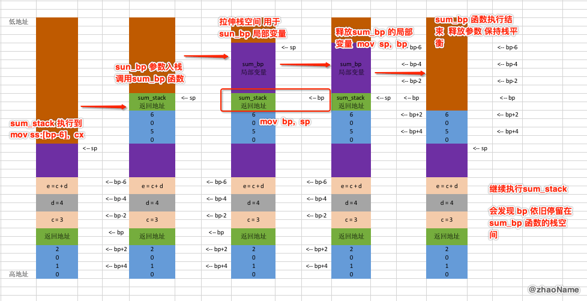
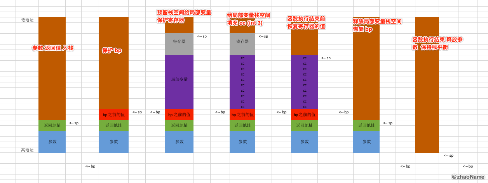
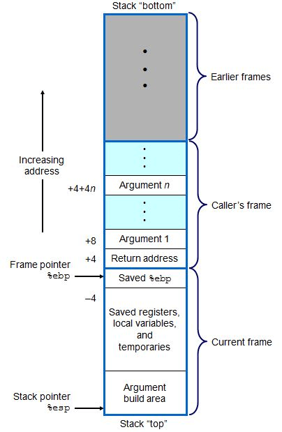

# iOS获取任意线程调用栈(一) - 8086 CPU下栈帧简介

<br>

## 一、8086架构寄存器简介

- 数据寄存器 AX、BX、CX、DX，都可以分成高8位(AH、BH、CH、DH)和低8位(AL、BL、CL、DL)

- 堆栈指针 SP: 指向栈顶

- 基数指针 BP: 用于获取函数参数、内部变量、保存 caller 函数的 BP

- 变址寄存器 源地址: SI  目的地址: DI

- 指令指针 IP: 配合CS 保存下一条汇编指令的地址

- 代码段: CS, 数据段:DS, 堆栈段:SS, 附加段:ES


还要注意一点，8086 CPU地址总线是20位，寻址能力为1M, 但其又是16位的CPU, 也就是说最多只能传输16位的数据，寻址能力为64位。所以8086 采用两个16位的地址来合成20位的物理地址。

**8086的寻址方式：**8086在访问内存时要由相关部件提供内存单元的段地址和偏移地址，送入地址加法器合成物理地址。物理地址 = 段地址(CS、DS、SS、ES) * 16 + 偏移地址(IP)

<br>

## 二、8086汇编下参数传递方式

### 0x01 参数存放到数据段中

```
assume cs:code, ds:data, ss:stack

; 栈段
stack segment
    db 100 dup(0)
stack ends  

; 数据段
data segment  
    db 100 dup(0) 
data ends

; 代码段
code segment
start:
    ; 手动设置 ds ss 的值
    mov ax, data
    mov ds, ax
    mov ax, stack
    mov ss, ax  
    
    ; 往数据段写入数据 当做参数
    mov word ptr [0], 1111h
    mov word ptr [2], 2222h
    call sum_global
    
; 两数之和
sum_global:
	mov ax [0]
	add ax [2]
	ret

    ; 退出
    mov ax, 4c00h
    int 21h
code ends
end start
```

这种方式基本很少用到，因为常用函数的参数随着函数执行结束，生命周期也就到头了。这种情况下若是释放数据段的参数，会增加不必要的汇编代码。若是不释放数据段的参数，会大大浪费内存空间。

### 0x02 参数存放到寄存器中

```
...

; 代码段
code segment
start:
    ; 手动设置 ds ss 的值
    mov ax, data
    mov ds, ax
    mov ax, stack
    mov ss, ax  
    
    ; 往寄存器写入数据 当做参数
    mov cx, 1111h
    mov dx, 2222h
    call sum_register
    
; 两数之和
sum_register:
	mov ax, cx
	add ax, dx
	ret

    ; 退出
    mov ax, 4c00h
    int 21h
code ends
end start
```

寄存器传参的速度快，但 8086 下将参数放到寄存器中，只能将其放在四个数据寄存器中(AX、BX、CX、DX),其它的寄存器都有特殊意义。这样你最多只能有四个参数，而且这还没有算局部变量。

### 0x03 参数存放到栈中

```
...

; 代码段
code segment
start:
    ; 手动设置 ds ss 的值
    mov ax, data
    mov ds, ax
    mov ax, stack
    mov ss, ax  
    
    ; 往栈段写入数据 当做参数
    push, 1122h
    push, 3344h
    call sum_stack
    
    mov bx, 0000h
; 两数之和
sum_stack:
	; 不能直接操作 sp
	mov bp, sp
	mov ax, ss:[bp+2]
	add ax, ss:[bp+4]
	ret

    ; 退出
    mov ax, 4c00h
    int 21h
code ends
end start
```


<br>

## 三、8086 堆栈平衡

上面汇编将参数放在栈段，和放在数据段效果差不多，都没有在函数执行结束释放参数，导致内存空间的浪费。这样多次调用函数后会造成栈溢出。

```
...

; 代码段
code segment
start:
    ; 手动设置 ds ss 的值
    mov ax, data
    mov ds, ax
    mov ax, stack
    mov ss, ax  
    
    push, 1122h
    push, 3344h
    call sum1
    
    push, 5566h
    push, 7788h
    call sum2
    
    push, 99aah
    push, 0aabbh
    call sum3
    
    mov bx, 0000h

sum1:
	mov bp, sp
	mov ax, ss:[bp+2]
	add ax, ss:[bp+4]
	ret

sum2:
	mov bp, sp
	mov ax, ss:[bp+2]
	add ax, ss:[bp+4]
	ret
	
sum3:
	mov bp, sp
	mov ax, ss:[bp+2]
	add ax, ss:[bp+4]
	ret
	
    ; 退出
    mov ax, 4c00h
    int 21h
code ends
end start
```


这样栈空间迟早会被用完，造成栈溢出。

**栈平衡：函数调用前后栈顶指针保持一致**

### 0x01 外平栈

```
...

; 代码段
code segment
start:
	...
    push, 1122h
    push, 3344h
    call sum1
    add sp, 4
    
    push, 5566h
    push, 7788h
    call sum2
    ; 恢复栈平衡
    add sp, 4
    
    mov bx, 0000h

sum1:
	mov bp, sp
	mov ax, ss:[bp+2]
	add ax, ss:[bp+4]
	ret

sum2:
	mov bp, sp
	mov ax, ss:[bp+2]
	add ax, ss:[bp+4]
	ret

    ; 退出
    mov ax, 4c00h
    int 21h
code ends
end start
```


### 0x02 内平栈

```
...

; 代码段
code segment
start:
    ... 
    push, 1122h
    push, 3344h
    call sum1

    push, 5566h
    push, 7788h
    call sum2
    
    mov bx, 0000h
sum1:
	mov bp, sp
	mov ax, ss:[bp+2]
	add ax, ss:[bp+4]
	; 返回并恢复栈平衡
	ret 4

sum2:
	mov bp, sp
	mov ax, ss:[bp+2]
	add ax, ss:[bp+4]
	; 返回并恢复栈平衡
	ret 4

    ; 退出
    mov ax, 4c00h
    int 21h
code ends
end start
```


函数执行结束后，虽然最后一个函数的参数还在栈中，但栈顶指针 sp 已经回到起始位置。也就是说这些参数已变成垃圾数据，等待后面的值入栈将它们覆盖。

<br>

## 四、局部变量

### 0x01 局部变量布局

对于一个函数，其内部可能还会存在局部变量。那局部变量在栈中是如何分配的呢?

```
...

; 代码段
code segment
start:
    ... 
    push, 1
    push, 2
    call sum_stack
    add sp, 4
    
    mov bx, 0000h
    
sum_stack:
	mov bp, sp
	; 预留10个字节的空间给局部变量
	sub sp, 10
		
	; 定义两个局部变量
	; int c = 3
	mov word ptr ss:[bp-2], 3
	; int d = 4
	mov word ptr ss:[bp-4], 4
	; int e = c + d
	mov cx, ss:[bp-2]
	add cx, ss:[bp-4]
	mov ss:[bp-6], cx
		
	; 取出两个参数
	mov ax, ss:[bp+2]
	; a + b
	add ax, ss:[bp+4]
	; a + b + e
	add ax, ss:[bp-6]
		
	; 恢复 sp(也可以认为是释放局部变量内存空间)
	mov sp, bp
	ret 
	
	; 退出
	mov ax, 4c00h
	int 21h
code ends
end start
```

上面汇编对应代码

```
void start()
{
    sum_stack(1, 2);
}

int sum_stack(int a, int b)
{
    int c = 3
    int d = 4
    int e = a + b;
    return a + b + c;
}
```

栈中布局


到这步可能你也会有种预感，为啥 bp 的值一直没有变，这样做对吗？我们来看下边的代码

### 0x02 函数调用函数

```
...
; 代码段
code segment
start:
    ... 
    push, 1
    push, 2
    call sum_stack
    add sp, 4
    
    mov bx, 0000h
    
sum_stack:
	mov bp, sp
	; 预留10个字节的空间给局部变量
	sub sp, 10
		
	; 定义两个局部变量
	; int c = 3
	mov word ptr ss:[bp-2], 3
	; int d = 4
	mov word ptr ss:[bp-4], 4
	; int e = c + d
	mov cx, ss:[bp-2]
	add cx, ss:[bp-4]
	mov ss:[bp-6], cx
		
	; sum_bp 参数
	push 5
	push 6
	; sum_stack 内部调用 sum_bp
	call sum_bp
	add, sp, 4
		
	; 取出两个参数
	mov ax, ss:[bp+2]
	; a + b
	add ax, ss:[bp+4]
	; a + b + e
	add ax, ss:[bp-6]
	
sum_bp:
	mov bp, sp
	; 预留栈空间给局部变量
	sub sp, 5
		
	...
	; 释放局部变量空间
	mov sp, bp
	ret 
	
	; 退出
	mov ax, 4c00h
	int 21h
code ends
end start
```

这样调用会出问题，我们来看下栈空间布局就知道是什么问题了



从上图可以看到当我们执行完 `sum_bp` 函数时，bp 寄存器依旧停留在 `sum_bp` 函数的栈空间，那我们继续执行 `sum_stack` 函数，做`a + b + e`的计算结果就会出错。

所以在函数调用函数时要保存 bp 的值，以便被调用函数执行结束后恢复 bp, 仍然能正确访问调用函数的栈空间。

我们对上面的 `sum_bp` 函数做出改动就可以

```
...

; 代码段
code segment
start:
    ... 
	
sum_bp:
	; 保护 bp
	push bp
	mov bp, sp
	sub sp, 5
	
	...
	; 释放局部变量空间
	mov sp, bp
	; 恢复 bp
	pop bp
	ret 
	
	; 退出
	mov ax, 4c00h
	int 21h
code ends
end start
```


这样 `sum_bp` 执行结束，bp 还能指向 `sum_stack` 函数的栈空间。也就能正确访问 `sum_stack` 函数的参数和局部变量。也同时保证了栈平衡。


## 五、完整函数调用

### 0x01 保护可能要用到寄存器

在函数调用过程中会对寄存器操作，若 caller 函数中的部分值存储在寄存器中，而 callee 函数没有保存寄存器以前的值，那就寄存器以前的值有可能会被覆盖。当执行完 callee 函数，继续执行 caller 函数就可能会反生不可预知的错误。所以我们要保存可能用到的寄存器

```
...

; 代码段
code segment
start:
    ... 
	
sum_bp:
	; 保护 bp
	push bp
	mov bp, sp
	; 预留空间给局部变量
	sub sp, 5
	; 保护要用到的寄存器
	push ax
	push bx
	
	; 业务逻辑
	...
	
	; 恢复寄存器的值 注意栈先进后出
	pop bx 
	pop ax
	; 释放局部变量空间
	mov sp, bp
	; 恢复 bp
	pop bp
	ret 
	
	; 退出
	mov ax, 4c00h
	int 21h
code ends
end start
```


### 0x02 保护局部变量空间

我们在预留空间给局部变量时，预留空间可能存在垃圾数据。这样我们在读取局部变量时，不小心读取到垃圾数据可能会导致未知错误。所以我们需要保护局部变量空间。

8086 保护局部变量空间的常用的方法时给局部变量空间填充`CC`也就是中断(`int 3`)。

```
...

; 代码段
code segment
start:
    ... 
	
sum_bp:
	; 保护 bp
	push bp
	mov bp, sp
	; 预留空间给局部变量
	sub sp, 10
	
	; 保护要用到的寄存器
	push ax
	push bx
	
	; 给局部变量空间填充 CC 也就是中断(int 3)
	mov ax, 0cccch
	mov bx, ss
	mov es, bx
	; 让 di 指向局部变量地址的最小区域
	mov di, bp
	sub di, 10
	; cx 决定 stosw 的执行次数
	mov cx, 5
	; rep作用: 重复执行某个指令 执行次数有 cx 决定
	; storw作用: 将 ax 的值拷贝到 es:di 中，同时 di 的值 +2
	rep storw
	
	; 业务逻辑
	...
	
	; 恢复寄存器的值 注意栈先进后出
	pop bx 
	pop ax
	
	; 释放局部变量空间
	mov sp, bp
	; 恢复 bp
	pop bp
	ret 
	
	; 退出
	mov ax, 4c00h
	int 21h
code ends
end start
```




至此再加上你自己的业务逻辑汇编代码，就能构成一个完整的函数。

### 0x03 完整的函数流程

- push 参数

- push 函数的返回值(上一个函数下条指令的地址) (call fun_name)

- 保护 bp  函数执行结束后，方便恢复 (push bp)

- 拉伸栈空间  用于存储局部变量 (sub sp, 10)

- 保护可能要用到的寄存器的值 (push bx)

- 给局部变量空间填充 `cc`(相当于中断指令 `int 3`)

- ============ 自己的业务逻辑代码 ============

- 恢复寄存器之前的值 (pop bx)

- 释放局部变量空间 (mov sp, bp)

- 恢复 bp (pop bp)

- 返回调用函数 (ret)

- 参数出站 恢复栈平衡 (add sp, 4)

<br>

## 六、栈帧

从逻辑上讲，栈帧就是一个函数执行的环境：包括函数参数、函数的局部变量、函数执行完后返回到哪里等等。



从上图可知 callee 函数的参数(`ebp + 4、ebp + 8`)在 caller 函数的栈帧中，执行完 callee 函数要返回的地址也在 caller 函数的栈帧中。

那也就是说一个非叶子函数的栈帧包括：bp之前的值、本函数局部变量、寄存器、下个函数的参数、返回地址(本函数的下条执行的地址)

由上面写的汇编代码可知参数入栈和返回地址都是在 caller 函数中做的事。之后的流程才是在 callee 函数中实现的。callee 函数结束后，若是外平栈，参数的栈平衡也是在 caller 中实现的。把 callee 函数的参数、返回地址算在 caller 的栈帧中也能解释的通。


<br>

**最后总结 来一张函数调用函数前后栈平衡**


<br>

写于 2020-03-13

<br>