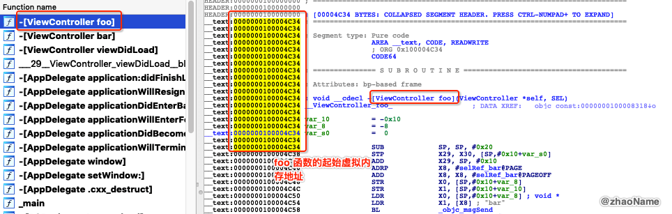

# iOS获取任意线程调用栈(三) - 在Mach-O中查找对应的符号(方法名) 


上篇文章介绍了 ARM64 环境下如何根据栈帧获取任意线程调用栈的原理。其中很重要的一点就是根据 lr 的值在 Mach-O 文件中位置，查找对应的方法名。那本篇文章就介绍下如何查找。

## 一、 ASLR

ASLR(Address Space Layout Randomization): 地址空间布局随机化。是一种针对缓冲区溢出的安全保护技术，通过对堆、栈、共享库映射等线性区布局的随机化，通过增加攻击者预测目的地址的难度，防止攻击者直接定位攻击代码位置，达到阻止溢出攻击的目的的一种技术。

比较有名的 [JailbreakMe method of jailbreaking iOS 4](https://www.howtogeek.com/howto/24344/jailbreak-your-iphone-or-ipod-touch-with-ios-4-the-easy-way/) 就是利用缓冲区溢出攻击达到越狱的目的。这也促使苹果在 iOS4.3 使用了 ASLR 技术。

> ASLR is an important exploit mitigation technique introduced in iOS 4.3. ASLR makes the remote exploitation of memory corruption vulnerabilities significantly more difficult by randomizing the application objects’ location in the memory. By default, iOS applications use limited ASLR and only randomize part of the objects in the memory


Mach-O 文件中函数的地址都是虚拟内存地址，而我们得到的 lr 的地址是真实物理地址。那怎么由物理内存地址转化为虚拟内存地址呢？ 这就要用到上述的 ASLR.

**物理地址 = ASLR + 虚拟内存地址**

- 我们将 Mach-O 文件放到 ida 或 Hopper Disassembler v4 查看 foo 函数的虚拟内存地址



然后运行 Xcode 在 foo 函数中下断点, 在执行 lldb 指令获取 ASLR


0x100e80c34(物理地址) = 0xe7c000(ASLR) + 0x100004c34(虚拟内存地址)


- 将 Mach-O 文件用 MachOView 打开，查看`Section(__TEXT, __text)`, 并找到 foo 函数


实际上 `Section(__TEXT, __text)` 你可以认为是代码段，存储着汇编代码。里面是没有类似`0x100004c34  -[ViewController foo]` 这种高级语言的代码。也就是说我们不能根据虚拟内存地址在`Section(__TEXT, __text)` 中找到对应的函数名。


<br>

## 二、符号表

我们要想找到对应的方法名，首先要先知道方法名存储在 Mach-O 文件的什么位置。函数名在 Mach-O 文件中有个别名 -- 符号(Symbol)，所有的符号放在符号表里。


符号表储存在 Mach-O 文件的 `__LINKEDIT` 段中，涉及其中的符号表(Symbol Table)和字符串表(String Table)。 `LC_SYMTAB` 描述了 `__LINKEDIT` 段内查找字符串和符号表的位置。

`LC_SYMTAB `实质是`struct symtab_command`

```
/*
 * The symtab_command contains the offsets and sizes of the link-edit 4.3BSD
 * "stab" style symbol table information as described in the header files
 * <nlist.h> and <stab.h>.
 */
struct symtab_command {
	uint32_t	cmd;		/* LC_SYMTAB */
	uint32_t	cmdsize;	/* sizeof(struct symtab_command) */
	uint32_t	symoff;		/* symbol table offset */
	uint32_t	nsyms;		/* number of symbol table entries */
	uint32_t	stroff;		/* string table offset */
	uint32_t	strsize;	/* string table size in bytes */
};
```


我们可以用 [jtool](http://www.newosxbook.com/tools/jtool.html) 查看各个段中的信息

```
$ jtool2 --pages ~/Desktop/BSBacktraceLogger                                                                      
0x0-0x8000 __TEXT	(32768 bytes)
	0x4c34-0x6610 __TEXT.__text	(6620 bytes)
	0x6610-0x6784 __TEXT.__stubs	(372 bytes)
	0x6784-0x6910 __TEXT.__stub_helper	(396 bytes)
	0x6910-0x74a7 __TEXT.__objc_methname	(2967 bytes)
	0x74a7-0x762b __TEXT.__cstring	(388 bytes)
	0x762b-0x7679 __TEXT.__objc_classname	(78 bytes)
	0x7679-0x7f75 __TEXT.__objc_methtype	(2300 bytes)
	0x7f78-0x8000 __TEXT.__unwind_info	(136 bytes)
0x8000-0xc000 __DATA	(16384 bytes)
	0x8000-0x8018 __DATA.__got	(24 bytes)
	0x8018-0x8110 __DATA.__la_symbol_ptr	(248 bytes)
	0x8110-0x8150 __DATA.__const	(64 bytes)
	0x8150-0x8290 __DATA.__cfstring	(320 bytes)
	0x8290-0x82a8 __DATA.__objc_classlist	(24 bytes)
	0x82a8-0x82b0 __DATA.__objc_nlclslist	(8 bytes)
	0x82b0-0x82c0 __DATA.__objc_protolist	(16 bytes)
	0x82c0-0x82c8 __DATA.__objc_imageinfo	(8 bytes)
	0x82c8-0x9030 __DATA.__objc_const	(3432 bytes)
	0x9030-0x90c8 __DATA.__objc_selrefs	(152 bytes)
	0x90c8-0x90f8 __DATA.__objc_classrefs	(48 bytes)
	0x90f8-0x9100 __DATA.__objc_superrefs	(8 bytes)
	0x9100-0x9104 __DATA.__objc_ivar	(4 bytes)
	0x9108-0x91f8 __DATA.__objc_data	(240 bytes)
	0x91f8-0x92c0 __DATA.__data	(200 bytes)
0xc000-0x13c70 __LINKEDIT	(31856 bytes)
	0xc000-0xc0e8 Rebase info       (opcodes)	(232 bytes)
	0xc0e8-0xc310 Binding info      (opcodes)	(552 bytes)
	0xc310-0xc630 Lazy Binding info (opcodes)	(800 bytes)
	0xc630-0xc8b0 Exports	(640 bytes)
	0xc8b0-0xc8e8 Function Starts	(56 bytes)
	0xc8e8-0xd958 Symbol Table	(4208 bytes)
	0xda5c-0xedfc String Table	(5024 bytes)
	0xee00-0x13c70 Code Signature	(20080 bytes)
```


符号表的结构是一个`struct nlist`类型的数组

```
// 位于系统库 <macho-o/nlist.h> 头文件中
struct nlist {
	union {
		// 符号名在字符串表中的偏移量
		uint32_t n_strx;	
	} n_un;
	uint8_t n_type;
	uint8_t n_sect;
	int16_t n_desc;
	// 符号 虚拟内存地址，类似于函数指针
	uint32_t n_value;
};
```

其中`n_value `是函数的起始地址(虚拟内存地址)，`n_strx `是符号在字符串表（String Table）中的偏移量，用于表示函数名。

当我们拿到 lr 的值时，应该怎么在 Mach-O 中查找对应的函数名？

- 首先根据 lr 的值确定此地址在那个 image(模块) 中。程序本身是个 Mach-O 文件，程序中用到的动态共享缓存库也是 Mach-O 文件，我们要确定 lr 的值在哪个 Mach-O(image/模块) 中

- 找到对应的 image 后，需要找到 __LINKEDIT 段的起始地址

- __LINKEDIT 段的起始地址 + `symtab_command.symoff` 就是符号表的地址

- 然后遍历符号表,查找距离 lr - ASLR 最近的`n_value `。这里注意因为 lr 是函数某条指令的地址，而`n_value `是函数的起始地址。所以 lr - ASLR 一定要大于等 `n_value `。

- 找到对应的`n_value `，那`n_strx `就是我们要找的符号(函数名)

<br>


<br>


<br>

**参考:**

- [Penetration Testing for iPhone Applications](https://resources.infosecinstitute.com/penetration-testing-for-iphone-applications-part-5/#gref)

- [DYLD Detailed](http://www.newosxbook.com/articles/DYLD.html)

- [nlist-Mach-O文件重定向信息数据结构分析](http://turingh.github.io/2016/05/24/nlist-Mach-O%E6%96%87%E4%BB%B6%E9%87%8D%E5%AE%9A%E5%90%91%E4%BF%A1%E6%81%AF%E6%95%B0%E6%8D%AE%E7%BB%93%E6%9E%84%E5%88%86%E6%9E%90/)

<br>
