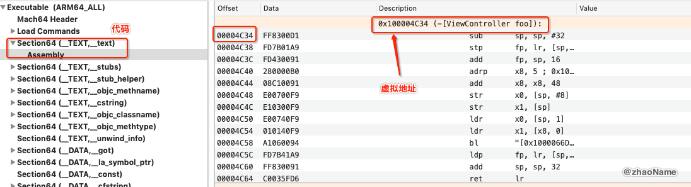

# iOS获取任意线程调用栈(三) - 根据地址在Mach-O中查找对应的方法名 

上篇文章介绍了 ARM64 环境下如何根据栈帧获取任意线程调用栈的原理。其中很重要的一点就是根据 lr 的值在 Mach-O 文件中位置，查找对应的方法。那本篇文章就介绍下如何查找。

## 一、 ASLR

ASLR(Address Space Layout Randomization): 地址空间布局随机化。是一种针对缓冲区溢出的安全保护技术，通过对堆、栈、共享库映射等线性区布局的随机化，通过增加攻击者预测目的地址的难度，防止攻击者直接定位攻击代码位置，达到阻止溢出攻击的目的的一种技术。

比较有名的 [JailbreakMe method of jailbreaking iOS 4](https://www.howtogeek.com/howto/24344/jailbreak-your-iphone-or-ipod-touch-with-ios-4-the-easy-way/) 就是利用缓冲区溢出攻击达到越狱的目的。这也促使苹果在 iOS4.3 使用了 ASLR 技术。

> ASLR is an important exploit mitigation technique introduced in iOS 4.3. ASLR makes the remote exploitation of memory corruption vulnerabilities significantly more difficult by randomizing the application objects’ location in the memory. By default, iOS applications use limited ASLR and only randomize part of the objects in the memory


Mach-O 文件中函数的地址都是虚拟内存地址，而我们得到的 lr 的地址是真实物理地址。那怎么由物理内存地址转化为虚拟内存地址呢？ 这就要用到上述的 ASLR.

**物理地址 = ASLR + 虚拟内存地址**

- 我们将 Mach-O 文件放到 ida 或 Hopper Disassembler v4 查看 foo 函数的虚拟内存地址

然后运行 Xcode 在 foo 函数中下断点, 在执行 lldb 指令获取 ASLR

0x100e80c34(物理地址) = 0xe7c000(ASLR) + 0x100004c34(虚拟内存地址)

- 将 Mach-O 文件用 MachOView 打开，查看 Section(__TEXT, __text), 并找到 foo 函数

 

## 二、

 

 

 

**参考:**

- [Penetration Testing for iPhone Applications](https://resources.infosecinstitute.com/penetration-testing-for-iphone-applications-part-5/#gref)

- [DYLD Detailed](http://www.newosxbook.com/articles/DYLD.html)

- [nlist-Mach-O文件重定向信息数据结构分析](http://turingh.github.io/2016/05/24/nlist-Mach-O%E6%96%87%E4%BB%B6%E9%87%8D%E5%AE%9A%E5%90%91%E4%BF%A1%E6%81%AF%E6%95%B0%E6%8D%AE%E7%BB%93%E6%9E%84%E5%88%86%E6%9E%90/)

 
