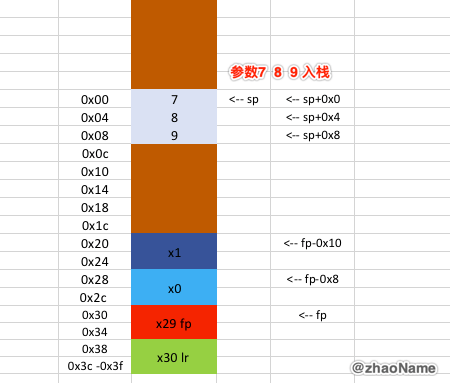
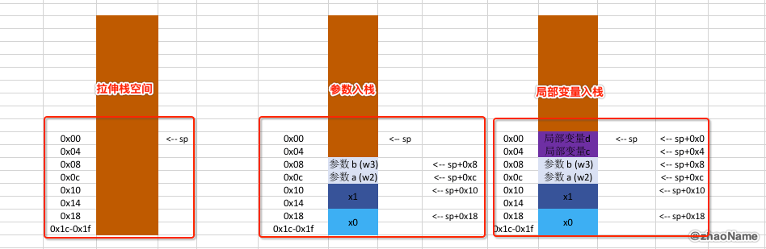
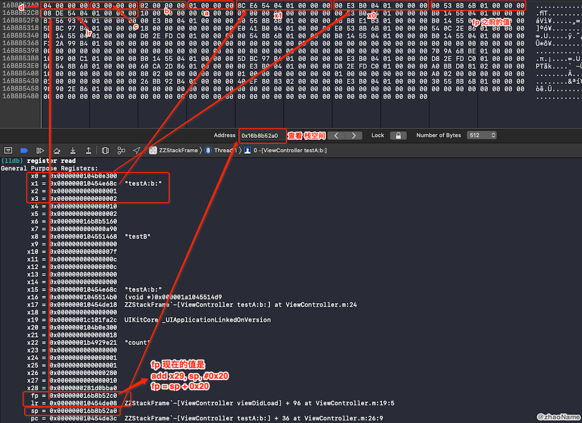

# iOS获取任意线程调用栈(二) - ARM64下栈帧简介

<br>

由 [iOS获取任意线程调用栈(一) - 8086 CPU下栈帧简介](https://github.com/zhaoName/Notes/blob/master/iOS/iOS%E8%8E%B7%E5%8F%96%E4%BB%BB%E6%84%8F%E7%BA%BF%E7%A8%8B%E8%B0%83%E7%94%A8%E6%A0%88(%E4%B8%80)%20-%208086CPU%E4%B8%8B%E6%A0%88%E5%B8%A7%E7%AE%80%E4%BB%8B.md) 知道了 8086CPU 环境函数调用过程栈的变化和栈帧的概念。本篇文章介绍 ARM64 环境下函数调用过程栈的变化和栈帧的概念，从而得出为什么可以根据当前栈帧找到函数调用栈。

## 一、ARM64 寄存器简介

### 0x01 通用寄存器

- 64bit 的寄存器 x0 ~ x28 (w0 ~ w28 是 x0 ~ x28 的低32位)

- x0 ~ x7 一般用于存放参数，参数超过7个就存放在栈中

- x0 一般用做函数返回值(8086 用 ax 存储函数返回值)

### 0x02 程序计数器

- pc􏰍 (Program Counter􏰑): 程序计数器

- 存储着当前 CPU 正在执行指令的地址 类似于 8086 的 ip 

### 0x03 堆栈指针

- sp (Stack Pointer): 指向栈顶

- fp (Frame Pointer): 也就是 x29, 类似 8086 的 bp


### 0x04 链接寄存器

- lr (Link Register): 也就是x30 存储着函数的返回地址

- 类似 8086 `call func_name`将函数返回地址入栈，ARM64 直接将返回地址存储在专门的寄存器中


### 0x05 程序状态器

- cpsr􏰍(Current Program Status Register􏰑): 包含条件码标志，中断禁止位，当前处理器模式以及其他状态和控制信息。

- spsr􏰍(Saved Program Status Register􏰑): 异常状态下使用


<br>

## 二、ARM64 常见汇编指令简介

- add 

```
; 将 x0+0x14 的结果赋值给 x1
add  x29, sp, #0x20  

; 将 x0+0x14的结果赋值给x1，并且影响CPSR的标记寄存器
adds  x1, x0, #0x14
```

- sub

```
; sp = sp - 0x30
sub  sp, sp, #0x30
```

- mov 

```
将 x9 赋值给x0
mov x0, x9

mov w6, #0x5
```

- str (store register): 将数据从寄存器中读出来，存到内存中

```
; 将 x1 存储到从 sp+0x20 开始的8个字节
str  x1, [sp, #0x20]

; stp: str的变种 可以同时操作两个寄存器
stp  x29, x30, [sp, #0x20]

; stur: 读取的操作的是负数
; 将x0的值 存放到从 x29-0x8 开始的8个字节中
stur x0, [x29, #-0x8]
```

- ldr (load register): 将数据从内存中读出来，存到寄存器中

```
; 从 sp + 0x4 开始往高地址读取4个字节的值存放到 w3
ldr w3, [sp, #0x4]

; ldp: ldr的变种 可以同时操作两个寄存器
ldp  x29, x30, [sp, #0x20]

; ldur: 读取的操作的是负数
; 从 x29-0x8 开始往高地址读取8个字节的值 存放到 x0
ldur x0, [x29, #-0x8]
```

<br>

## 三、参数

上面介绍 ARM64 寄存器的时候提到，ARM64 环境下函数的参数优先存放到寄存器 x0 ~ x7 中，若参数多余8个 多出的参数会放到栈空间。

OC 的方法调用在底层都会转成`objc_megSend(id receiver, SEL _cmd, ...)`。也就是说 OC 方法固定带两个参数: 方法调用者、方法名。并且这两个参数固定分别放在 x0 x1 寄存器中。

### 0x01 参数不超过 8 个

```
- (void)viewDidLoad {
    [super viewDidLoad];
    [self testA:1 b:2];
}

- (int)testA:(int)a b:(int)b
{
    return a + b;
}
```

在`viewDidLoad `方法中下断点，进入汇编模式(Xcode -> Debug -> Debug Workflow -> Always Show Disassembly)，汇编代码如下

```
ZZStackFrame`-[ViewController viewDidLoad]:
    0x102bc9de0 <+0>:   sub    sp, sp, #0x40             ; =0x40 
    0x102bc9de4 <+4>:   stp    x29, x30, [sp, #0x30]
    0x102bc9de8 <+8>:   add    x29, sp, #0x30            ; =0x30 
    ...
    ; 为调用 testA:b: 准备参数 
    ; x0 存放 receiver, x1 存放 cmd
->  0x102bc9e28 <+72>:  ldur   x9, [x29, #-0x8]
    0x102bc9e2c <+76>:  ldr    x1, [x8]
    0x102bc9e30 <+80>:  mov    x0, x9
    ; 参数 1 2分别放到 w2 w3 寄存器中
    0x102bc9e34 <+84>:  orr    w2, wzr, #0x1
    0x102bc9e38 <+88>:  orr    w3, wzr, #0x2
    ; 调用 testA:b:
    0x102bc9e3c <+92>:  bl     0x102bca5a0               ; symbol stub for: objc_msgSend
    0x102bc9e40 <+96>:  str    w0, [sp, #0xc]
    0x102bc9e44 <+100>: ldp    x29, x30, [sp, #0x30]
    ; 恢复栈平衡
    0x102bc9e48 <+104>: add    sp, sp, #0x40             ; =0x40 
    0x102bc9e4c <+108>: ret  
```

可以看到在`viewDidLoad `方法中就会将`testA:b:`方法所用到的参数放到对应的寄存器中。`viewDidLoad `方法栈空间结构大致如下


**注意上图中的`x0 x1`是属于`viewDidLoad `的。而上述汇编代码中的`x0 x1`是属于`testA:b: `。他们不是一回事！**

然后一直执行 lldb 指令`ni`进入到`testA:b: `方法中，汇编代码如下

```
ZZStackFrame`-[ViewController testA:b:]:
	; 拉伸栈空间
    0x102bc9e50 <+0>:  sub    sp, sp, #0x20             ; =0x20 
    ; 将参数 receiver cmd 入栈
    0x102bc9e54 <+4>:  str    x0, [sp, #0x18]
    0x102bc9e58 <+8>:  str    x1, [sp, #0x10]
    ; 将参数 1 2 入栈
    0x102bc9e5c <+12>: str    w2, [sp, #0xc]
    0x102bc9e60 <+16>: str    w3, [sp, #0x8]
->  0x102bc9e64 <+20>: ldr    w2, [sp, #0xc]
    0x102bc9e68 <+24>: ldr    w3, [sp, #0x8]
    ; 返回值 存放到 x0
    0x102bc9e6c <+28>: add    w0, w2, w3
    ; 恢复栈平衡
    0x102bc9e70 <+32>: add    sp, sp, #0x20             ; =0x20 
    0x102bc9e74 <+36>: ret 
```

执行`register read `查看所有寄存器的值，可以看到 x0~x4 确实存放的是`testA:b: `所用到的参数


也可以打印寄存器 x0~x4 


`testA:b:`方法栈空间大致如下


### 0x02 参数超过 8 个

```
- (void)viewDidLoad {
    [super viewDidLoad];
    [self add:1 b:2 c:3 d:4 e:5 f:6 g:7 h:8 i:9];
}

- (int)add:(int)a b:(int)b c:(int)c d:(int)d e:(int)e f:(int)f g:(int)g h:(int)h i:(int)i
{
    return a + b + c + d + e + f + g + h + i;
}
```

在`viewDidLoad `方法中下断点，进入汇编模式(Xcode -> Debug -> Debug Workflow -> Always Show Disassembly)，汇编代码如下

```
ZZStackFrame`-[ViewController viewDidLoad]:
	; 拉伸栈空间
    0x100bb5d80 <+0>:   sub    sp, sp, #0x40             ; =0x40 
    ; x29(fp) x30(lr) 入栈
    0x100bb5d84 <+4>:   stp    x29, x30, [sp, #0x30]
    0x100bb5d88 <+8>:   add    x29, sp, #0x30            ; =0x30 
    ...
    ; 调用 add:b:c:d:e:f:g:h:i: 方法前的准备
    ; x1 = add:b:c:d:e:f:g:h:i:
    0x100bb5dcc <+76>:  ldr    x1, [x8]
    ; x0 = self 也就是 <ViewController: 0x101111450>
    0x100bb5dd0 <+80>:  mov    x0, x9
    ; 参数 1 ~ 6 放到寄存器 w2 ~ w7
    0x100bb5dd4 <+84>:  orr    w2, wzr, #0x1
    0x100bb5dd8 <+88>:  orr    w3, wzr, #0x2
    0x100bb5ddc <+92>:  orr    w4, wzr, #0x3
    0x100bb5de0 <+96>:  orr    w5, wzr, #0x4
    0x100bb5de4 <+100>: mov    w6, #0x5
    0x100bb5de8 <+104>: orr    w7, wzr, #0x6
    ; 参数 7、8、9 入栈
    0x100bb5dec <+108>: orr    w10, wzr, #0x7
    0x100bb5df0 <+112>: str    w10, [sp]
    0x100bb5df4 <+116>: orr    w10, wzr, #0x8
    0x100bb5df8 <+120>: str    w10, [sp, #0x4]
    0x100bb5dfc <+124>: mov    w10, #0x9
    0x100bb5e00 <+128>: str    w10, [sp, #0x8]
    ; 调用 add:b:c:d:e:f:g:h:i: 方法
    0x100bb5e04 <+132>: bl     0x100bb65a8               ; symbol stub for: objc_msgSend
->  0x100bb5e08 <+136>: str    w0, [sp, #0xc]
	; x29(fp) x30(lr) 出栈
    0x100bb5e0c <+140>: ldp    x29, x30, [sp, #0x30]
    ; 恢复栈平衡
    0x100bb5e10 <+144>: add    sp, sp, #0x40             ; =0x40 
    0x100bb5e14 <+148>: ret 
```

可以看到在调用`add:b:c:d:e:f:g:h:i:`方法前会将其所用到的参数放到对应的寄存器中，寄存器不够会将参数入栈。`viewDidLoad `方法栈空间结构大致如下




然后我们执行 lldb 指令 `ni` 跳转到`add:b:c:d:e:f:g:h:i:`方法，查看汇编代码

```
ZZStackFrame`-[ViewController add:b:c:d:e:f:g:h:i:]:
    0x100bb5f0c <+0>:   sub    sp, sp, #0x40             ; =0x40 
    ; 将参数 7 8 9 从栈中读取出来 放到 w10 w9 w8中
    0x100bb5f10 <+4>:   ldr    w8, [sp, #0x48]
    0x100bb5f14 <+8>:   ldr    w9, [sp, #0x44]
    0x100bb5f18 <+12>:  ldr    w10, [sp, #0x40]
    ; 将寄存器x0 x1中参数 receiver、cmd 放到栈中
    0x100bb5f1c <+16>:  str    x0, [sp, #0x38]
    0x100bb5f20 <+20>:  str    x1, [sp, #0x30]
    ; 将寄存器中参数 1 2 3 4 5 6 入栈
    0x100bb5f24 <+24>:  str    w2, [sp, #0x2c]
    0x100bb5f28 <+28>:  str    w3, [sp, #0x28]
    0x100bb5f2c <+32>:  str    w4, [sp, #0x24]
    0x100bb5f30 <+36>:  str    w5, [sp, #0x20]
    0x100bb5f34 <+40>:  str    w6, [sp, #0x1c]
    0x100bb5f38 <+44>:  str    w7, [sp, #0x18]
    ; 从栈中读取参数 做计算
->  0x100bb5f3c <+48>:  ldr    w2, [sp, #0x2c]
	...
	; 返回值存储的 w0 也就是 x0 中
	0x100bb5f7c <+112>: add    w0, w2, w3
    0x100bb5f8c <+128>: add    sp, sp, #0x40             ; =0x40 
    0x100bb5f90 <+132>: ret  
```

`add:b:c:d:e:f:g:h:i:`方法栈空间大致如下


### 0x03 总结

- ARM64 环境下函数的参数最少有 2 个(receiver、cmd)，而且固定存放 x0 x1 寄存器中。

- ARM64 环境下函数的参数不超过 8 个，将优先存储在寄存器中(x0 ~ x7)

- ARM64 环境下函数的参数超过 8 个，将会多出的参数入栈。而且是存放在 caller 函数的栈空间中(如上面的参数 7 8 9 )。


<br>

## 四、函数栈结构

### 0x01 叶子函数栈结构

```
- (void)viewDidLoad {
    [super viewDidLoad];
    [self testA:1 b:2];
}

- (int)testA:(int)a b:(int)b
{
    int c = 3;
    int d = 4;
    return a + b + c +d;
}
```

`testA:b:`对应的汇编代码

```
ZZStackFrame`-[ViewController testA:b:]:
	; 拉伸栈空间
    0x102075e30 <+0>:  sub    sp, sp, #0x20             ; =0x20 
    ; 参数 receiver cmd a b 入栈
    0x102075e34 <+4>:  str    x0, [sp, #0x18]
    0x102075e38 <+8>:  str    x1, [sp, #0x10]
    0x102075e3c <+12>: str    w2, [sp, #0xc]
    0x102075e40 <+16>: str    w3, [sp, #0x8]
    ; 局部变量 c d 入栈
->  0x102075e44 <+20>: orr    w2, wzr, #0x3
    0x102075e48 <+24>: str    w2, [sp, #0x4]
    0x102075e4c <+28>: orr    w2, wzr, #0x4
    0x102075e50 <+32>: str    w2, [sp]
    ; a + b + c + d 
    0x102075e54 <+36>: ldr    w2, [sp, #0xc]
    0x102075e58 <+40>: ldr    w3, [sp, #0x8]
    0x102075e5c <+44>: add    w2, w2, w3
    0x102075e60 <+48>: ldr    w3, [sp, #0x4]
    0x102075e64 <+52>: add    w2, w2, w3
    0x102075e68 <+56>: ldr    w3, [sp]
    ; 结算结果 也就是返回值存放在 x0
    0x102075e6c <+60>: add    w0, w2, w3
    ; 恢复栈平衡
    0x102075e70 <+64>: add    sp, sp, #0x20             ; =0x20 
    0x102075e74 <+68>: ret  
```

`testA:b:`对应的栈空间结构



可以看到相比较 8086 来说，ARM64 环境下叶子函数并没有保存 fp 和 返回地址.这是因为 ARM64 中有专用的寄存器来保存返回地址 lr，当当前函数是叶子函数时，不会修改 lr 中的值，所以返回地址也就不用保护(入栈)。


### 0x02 非叶子函数栈结构

```
- (void)viewDidLoad {
    [super viewDidLoad];
    [self testA:1 b:2];
}

- (int)testA:(int)a b:(int)b {
    int c = 3;
    int d = 4;
    [self testB];
    return a + b + c +d;
}

- (void)testB {}
```

`testA:b:`对应的汇编代码

```
ZZStackFrame`-[ViewController testA:b:]:
	; 拉伸栈空间
    0x102c5de18 <+0>:   sub    sp, sp, #0x30             ; =0x30 
    ; 将 fp lr入栈
    0x102c5de1c <+4>:   stp    x29, x30, [sp, #0x20]
    ; 修改 fp
    0x102c5de20 <+8>:   add    x29, sp, #0x20            ; =0x20 
    0x102c5de24 <+12>:  adrp   x8, 4
    0x102c5de28 <+16>:  add    x8, x8, #0x468            ; =0x468 
    ; 参数 receiver cmd a b 入栈
    0x102c5de2c <+20>:  stur   x0, [x29, #-0x8]
    0x102c5de30 <+24>:  str    x1, [sp, #0x10]
    0x102c5de34 <+28>:  str    w2, [sp, #0xc]
    0x102c5de38 <+32>:  str    w3, [sp, #0x8]
    ; 局部变量 c d 入栈
->  0x102c5de3c <+36>:  orr    w2, wzr, #0x3
    0x102c5de40 <+40>:  str    w2, [sp, #0x4]
    0x102c5de44 <+44>:  orr    w2, wzr, #0x4
    0x102c5de48 <+48>:  str    w2, [sp]
    ; 为调用 testB 调整 x0 x1 参数
    0x102c5de4c <+52>:  ldur   x0, [x29, #-0x8]
    0x102c5de50 <+56>:  ldr    x1, [x8]
    0x102c5de54 <+60>:  bl     0x102c5e5a8               ; symbol stub for: objc_msgSend
    ; a + b + c + d 
    0x102c5de58 <+64>:  ldr    w2, [sp, #0xc]
    0x102c5de5c <+68>:  ldr    w3, [sp, #0x8]
    0x102c5de60 <+72>:  add    w2, w2, w3
    0x102c5de64 <+76>:  ldr    w3, [sp, #0x4]
    0x102c5de68 <+80>:  add    w2, w2, w3
    0x102c5de6c <+84>:  ldr    w3, [sp]
    ; 结算结果 也就是返回值存放在 x0
    0x102c5de70 <+88>:  add    w0, w2, w3
    ; 恢复 fp lr
    0x102c5de74 <+92>:  ldp    x29, x30, [sp, #0x20]
    ; 恢复栈平衡
    0x102c5de78 <+96>:  add    sp, sp, #0x30             ; =0x30 
    0x102c5de7c <+100>: ret 
```

`testA:b:`对应的栈空间


局部变量在参数之后入栈。非叶子函数中还会调用其他函数，所以要保存 lr 和 fp,防止其被其他函数的 lr 和 fp 覆盖。

Xcode -> Debug -> Debug Workflow -> View Memory 查看栈空间内存



<br>

## 五、调用栈


<br>

<br>

<br>


<br>


<br>

