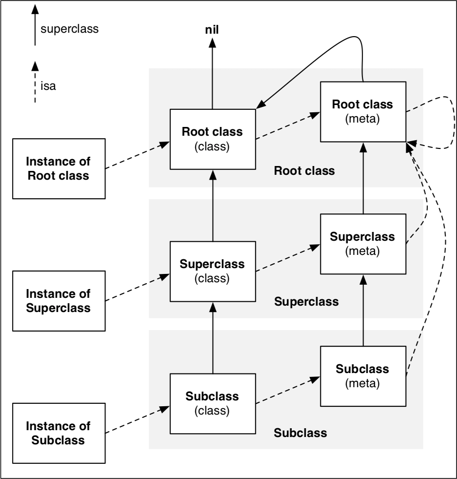
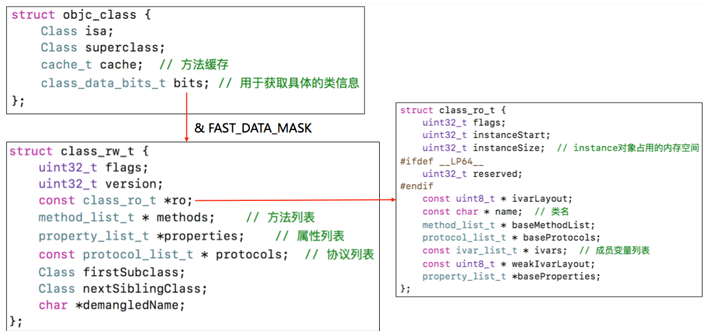
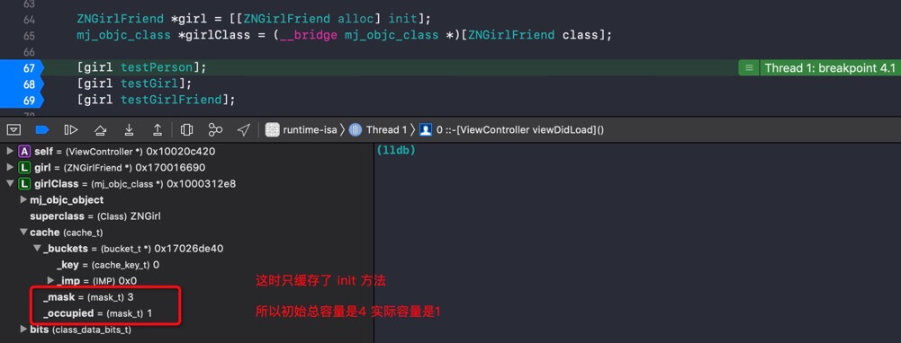
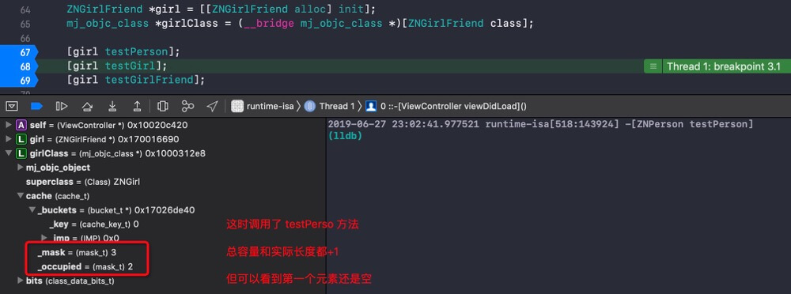
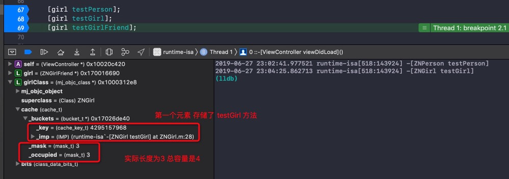
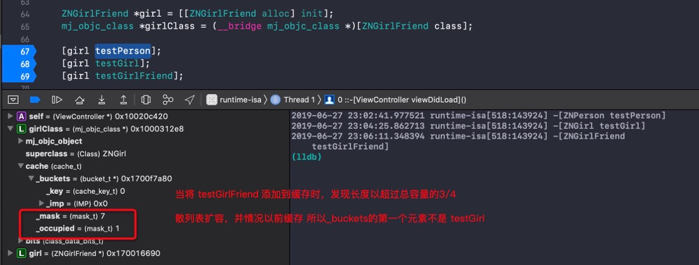

# runtime - 方法缓存

<br>

在[OC对象本质(二)](https://github.com/zhaoName/Notes/blob/master/iOS/OC%E5%AF%B9%E8%B1%A1%E6%9C%AC%E8%B4%A8(%E4%BA%8C).md)我们知道实例方法存储在`class`对象中，类方法存储在`meta-class`对象中。当调用实例方法时，先通过实例对象的`isa`找到`class`对象，再找到存储在`class`对象中的对象方法进行调用。若当前`class`对象中没找到对应的实例方法，会一层层遍历他的父类`class`对象(类方法也一样)。如下图



其实这样说有点问题，苹果为了提高方法调用速度在`struct objc_class`结构体中添加一个方法缓存成员`cache_t cache`。调用过的方法都会缓存在这个结构体中(结构体数组未扩容，扩容会清空缓存)，下次调用会优先查找缓存，若找到就直接调用，不会再去`class`对象中或父类的`class`对象中遍历查找方法调用。

本篇文章主要介绍`cache_t `的缓存策略和调用。


## 一、`Class `结构


直接用[OC对象本质(二)](https://github.com/zhaoName/Notes/blob/master/iOS/OC%E5%AF%B9%E8%B1%A1%E6%9C%AC%E8%B4%A8(%E4%BA%8C).md)中的图片展示`Class`的结构



`class_to_t`中的`baseMethodList`、`baseProtocols`、`ivars`、`baseProperties`是一维数组，是只读的，包含了类的初始内容。


`class_rw_t`中的`methods`、`properties`、`protocols`是二维数组，是可读可写的，包含了类的初始内容、分类的内容。


我们来从源码来看两者之间的关系

```Objective-C
// objc-runtime-new.mm

/***********************************************************************
* realizeClass
* Performs first-time initialization on class cls, 
* including allocating its read-write data.
* Returns the real class structure for the class. 
* Locking: runtimeLock must be write-locked by the caller
**********************************************************************/
static Class realizeClass(Class cls)
{
    runtimeLock.assertLocked();
    
    const class_ro_t *ro;
    class_rw_t *rw;
    Class supercls;
    Class metacls;
    bool isMeta;
    
    if (!cls) return nil;
    if (cls->isRealized()) return cls;
    assert(cls == remapClass(cls));
    
    // fixme verify class is not in an un-dlopened part of the shared cache?
    // 在 objc_class 中定义的 cls->data() 返回的是 class_rw_t
    // 但在 realizeClass() 时可以看到，刚加载某个类时 是没有 class_rw_t 的
    // cls->data() 中存放的是 class_ro_t
    ro = (const class_ro_t *)cls->data();
    if (ro->flags & RO_FUTURE) {
        // This was a future class. rw data is already allocated.
        rw = cls->data();
        ro = cls->data()->ro;
        cls->changeInfo(RW_REALIZED|RW_REALIZING, RW_FUTURE);
    } else {
        // Normal class. Allocate writeable class data.
        rw = (class_rw_t *)calloc(sizeof(class_rw_t), 1);
        rw->ro = ro;
        rw->flags = RW_REALIZED|RW_REALIZING;
        cls->setData(rw);
    }
    ...
}
```

由原有代码注释可知，在第一次初始化`class`时会为`class_rw_t `分配内存，并将`class_ro_t `的内容赋值给`class_rw_t `。


## 二、`method_t`


无论是`class_ro_t`中的一维数组`baseMethodList `还是`class_rw_t`中的二维数组`methods `，他们里面最终存储的都是`struct method_t`类型。也就是说所有的方法在底层都会包装成`struct method_t`。

```Objective-C
// objc-runtime-new.mm

struct method_t {
    // 方法名
    SEL name;
    // 编码(参数类型 返回值类型)也称方法签名
    const char *types;
    // 方法实现 也就是指向函数的指针
    IMP imp;
};
```

### 0x01 `name `

`SEL`代表方法\函数名，一般叫做选择器，底层结构跟`char *`类似

- 用`@selector()`或`sel_registerName()`获取方法名

```Objective-C
NSLog(@"获取方法名:%s %s", @selector(testGirl), sel_registerName("testGirl"));
```

- 用`sel_getName()`或`NSStringFromSelector()`将`SEL`转成字符串

```Objective-C
NSLog(@"方法名转字符串:%@ %s", NSStringFromSelector(@selector(testGirl)), sel_getName(@selector(testGirl)));
```

- 不同类中相同名字的方法，所对应的方法选择器是相同的

```Objective-C
// 为防止和系统 objc_method 重名，这里加个前缀
struct zn_objc_method {
    SEL _Nonnull method_name;
    char * _Nullable method_types;
    IMP _Nonnull method_imp;
};

Method me = class_getInstanceMethod([ZNGirl class], @selector(testGirl));
struct zn_objc_method *meth = (struct zn_objc_method *)me;

NSLog(@"不同类同方法名:%p %p", sel_registerName("testGirl"), meth->method_name);
```

打印结果

```Objective-C
2019-06-27 17:39:51.786009 runtime-isa[6397:816234] 获取方法名:testGirl testGirl
2019-06-27 17:39:51.786208 runtime-isa[6397:816234] 方法名转字符串:testGirl testGirl
2019-06-27 17:39:51.786287 runtime-isa[6397:816234] 不同类同方法名:0x1000329b0 0x1000329b0
```


### 0x02 `types `

`types `包含了函数返回值、参数类型编码的字符串，也称方法签名。

```Objective-C
NSLog(@"testGirl types：%s", meth->method_types);

// 打印结果
2019-06-27 19:03:22.535731 runtime-isa[6575:826017] testGirl types：v16@0:8
```

那`v16@0:8`这一串是什么意思呢？苹果官方文档[Type Encodings
](https://developer.apple.com/library/archive/documentation/Cocoa/Conceptual/ObjCRuntimeGuide/Articles/ocrtTypeEncodings.html#//apple_ref/doc/uid/TP40008048-CH100)给出解释。

- 第一个`v`是返回值类型 表示`void`

- 第二个`@`是第一个参数的类型 表示`object `或`id`

- 第三个`:`是第二个参数的类型 表示`method selector (SEL)`

那数字表示什么意思呢？

- 16 表示总共16个字节( 8(id) + 8(SEL) = 16)

- 0 表示第一个参数从第0个字节开始

- 8 表示第二个参数从第8个字节开始


### 0x03 `imp `

`imp`是指向函数的指针，也称方法实现。

```Objective-C
Method me = class_getInstanceMethod([ViewController class], @selector(testGirl));
struct zn_objc_method *meth = (struct zn_objc_method *)me;
    
NSLog(@"testGirl方法地址：%p", meth->method_imp);
[self testGirl];
```

在`ViewController `中的`testGirl`方法中下断点，在`Xcode`的`Debug -> Debug Workflow -> Always Show Disassembly`模式下查看方法的起始地址。


## 三、`cache_t`


`Class`内部结构中有个方法缓存`(cache_t)`，用散列表（哈希表）来缓存曾经调用过的方法，可以提高方法的查找速度。

### 0x01 `cache_t` 结构

```Objective-C
// objc-runtime-new.mm

// arm64 简化版
struct bucket_t {
    // 指向函数的指针
    MethodCacheIMP _imp;
    // SEL 作为key
    cache_key_t _key;
    ...
};

struct cache_t {
    // 散列表
    struct bucket_t *_buckets;
    // 散列表长度-1
    mask_t _mask;
    // 散列表中已缓存的方法数量
    mask_t _occupied;
    ...
};
```

`struct cache_t`的成员数组`_buckets `中存放的是方法的具体实现(方法名和指向方法的指针)。


### 0x02 散列表设计方案

```Objective-C
// objc-cache.mm

mask_t cache_t::mask() 
{
    return _mask; 
}

// 由此可知 散列表容量为 _mask + 1
mask_t cache_t::capacity() 
{
    return mask() ? mask()+1 : 0; 
}

static inline mask_t cache_hash(cache_key_t key, mask_t mask) 
{
    return (mask_t)(key & mask);
}

static inline mask_t cache_next(mask_t i, mask_t mask)
{
    return i ? i-1 : mask;
}

// 散列表 struct bucket_t *_buckets 的核心算法
// 每次存放方法缓存的位置 也可以说是数组的下标： key & mask
// k 是 SEL 转成的 unsigned long 类型后的值
// mask 初始值是 _mask，然后是 cache_next(i, m)
bucket_t * cache_t::find(cache_key_t k, id receiver)
{
    assert(k != 0);

    bucket_t *b = buckets();
    mask_t m = mask();
    // 将要缓存的位置，但不一定缓存在此
    mask_t begin = cache_hash(k, m);
    mask_t i = begin;
    do {
    	// b[i].key() == 0 说明将要存放的位置是 nil 相当于存值
    	// b[i].key() == k 说明你要缓存的方法已经在散列表中 相当于取值
        if (b[i].key() == 0  ||  b[i].key() == k) {
            return &b[i];
        }
    } while ((i = cache_next(i, m)) != begin);

    // hack
    Class cls = (Class)((uintptr_t)this - offsetof(objc_class, cache));
    cache_t::bad_cache(receiver, (SEL)k, cls);
}

// 散列表扩容
// 扩容后的散列表 mask 已变，所以每次扩容都会清空散列表
void cache_t::expand()
{
    cacheUpdateLock.assertLocked();
    
    uint32_t oldCapacity = capacity();
    // 散列表初始长度是4，每次扩容是当前容量的两倍
    uint32_t newCapacity = oldCapacity ? oldCapacity*2 : INIT_CACHE_SIZE;

    if ((uint32_t)(mask_t)newCapacity != newCapacity) {
        // mask overflow - can't grow further
        // fixme this wastes one bit of mask
        newCapacity = oldCapacity;
    }
    reallocate(oldCapacity, newCapacity);
}

// 判断扩容时机，添加新的方法缓存或重置已有的方法缓存
static void cache_fill_nolock(Class cls, SEL sel, IMP imp, id receiver)
{
    cacheUpdateLock.assertLocked();

    // Never cache before +initialize is done
    if (!cls->isInitialized()) return;

    // Make sure the entry wasn't added to the cache by some other thread 
    // before we grabbed the cacheUpdateLock.
    if (cache_getImp(cls, sel)) return;

    cache_t *cache = getCache(cls);
    cache_key_t key = getKey(sel);

    // Use the cache as-is if it is less than 3/4 full
    mask_t newOccupied = cache->occupied() + 1;
    mask_t capacity = cache->capacity();
    if (cache->isConstantEmptyCache()) {
        // Cache is read-only. Replace it.
        // 是只读属性 就会重新创建一个方法缓存替代它
        cache->reallocate(capacity, capacity ?: INIT_CACHE_SIZE);
    }
    else if (newOccupied <= capacity / 4 * 3) {
        // Cache is less than 3/4 full. Use it as-is.
    }
    else {
        // Cache is too full. Expand it.
        // 实际长度(_occupied)超过总容量(capacity)的3/4 就会扩容
        cache->expand();
    }

    // Scan for the first unused slot and insert there.
    // There is guaranteed to be an empty slot because the 
    // minimum size is 4 and we resized at 3/4 full.
    bucket_t *bucket = cache->find(key, receiver);
    // 如果将要缓存的位置 bucket 为空，则散列表真实长度加+1(_occupied++)
    if (bucket->key() == 0) cache->incrementOccupied();
    bucket->set(key, imp);
}
```

- 散列表初始长度是4，每次扩容是当前容量的两倍

- 当散列表实际容量(`_occupied`)超过总容量(`capacity `)的3/4时，扩容

- 方法最开始缓存的位置是`(unsigned long)sel & _mask`，当条件不成立(存放的位置被其他方法占用)，会重新计算位置`cache_next(i, m) `

- 查找某个方法，也是直接计算该方法的可能存在的位置，在通过对比`_key`也就是`SEL`来判断是否是想要查找的方法


### 0x03 证明

```Objective-C
// ZNPerson.m
- (void)testPerson
{
    NSLog(@"%s", __func__);
}

// ZNGirl.m
- (void)testGirl
{
    NSLog(@"%s", __func__);
}

// ZNGirlFriend.m
- (void)testGirlFriend
{
    NSLog(@"%s", __func__);
}

// ViewController.mm

#import "MJClassInfo.h"
ZNGirlFriend *girl = [[ZNGirlFriend alloc] init];
mj_objc_class *girlClass = (__bridge mj_objc_class *)[ZNGirlFriend class];
    
[girl testPerson];
[girl testGirl];
[girl testGirlFriend];
```










遍历`_buckets`，并用上面讲解的散列表算法取出特定的方法缓存

```Objective-C
ZNGirlFriend *girl = [[ZNGirlFriend alloc] init];
mj_objc_class *girlClass = (__bridge mj_objc_class *)[ZNGirlFriend class];
    
[girl testPerson];
[girl testGirl];
[girl testGirlFriend];
[girl testPerson];
[girl testGirl];
    
bucket_t *buckets = girlClass->cache._buckets;
for (int i=0; i<=girlClass->cache._mask; i++) {
    
    NSLog(@"遍历方法缓存：%s %p", buckets[i]._key, buckets[i]._imp);
}
    
// 取出特定的bucket
bucket_t bucket = buckets[(unsigned long)@selector(testPerson) & girlClass->cache._mask];
NSLog(@"取出特定的bucket======%s===%p", bucket._key,  bucket._imp);

// 打印结果
2019-06-27 23:29:44.072934 runtime-isa[551:149389] 遍历方法缓存： 0x0
2019-06-27 23:29:44.072979 runtime-isa[551:149389] 遍历方法缓存：testPerson 0x10000a660
2019-06-27 23:29:44.073166 runtime-isa[551:149389] 遍历方法缓存： 0x0
2019-06-27 23:29:44.073247 runtime-isa[551:149389] 遍历方法缓存： 0x0
2019-06-27 23:29:44.073466 runtime-isa[551:149389] 遍历方法缓存：testGirl 0x10000a120
2019-06-27 23:29:44.073526 runtime-isa[551:149389] 遍历方法缓存：testGirlFriend 0x10000a0e4
2019-06-27 23:29:44.073769 runtime-isa[551:149389] 遍历方法缓存： 0x0
2019-06-27 23:29:44.073820 runtime-isa[551:149389] 遍历方法缓存： 0x0
2019-06-27 23:29:44.073871 runtime-isa[551:149389] 取出特定的bucket======testPerson===0x10000a660
```


<br>

写于2019-06-27

<br>