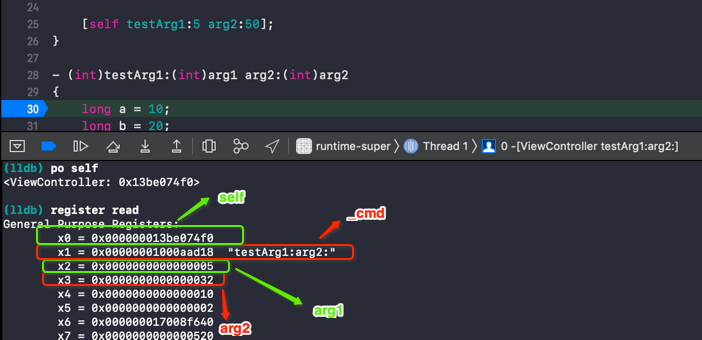
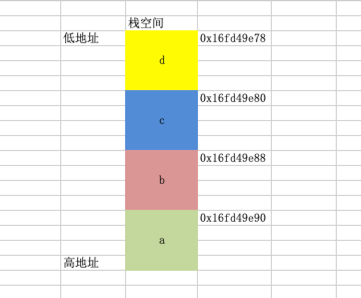
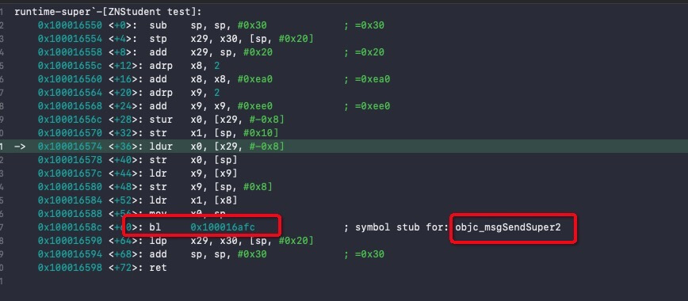
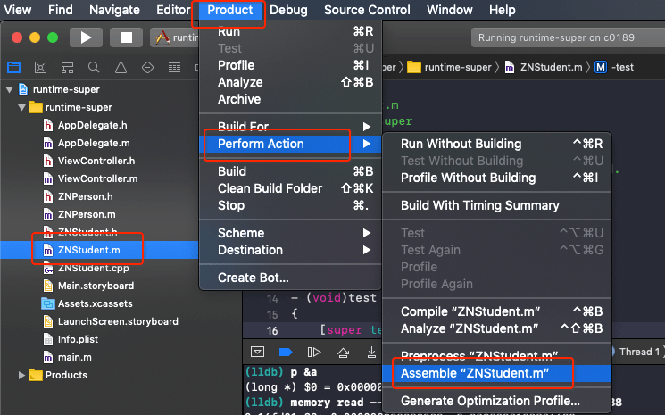
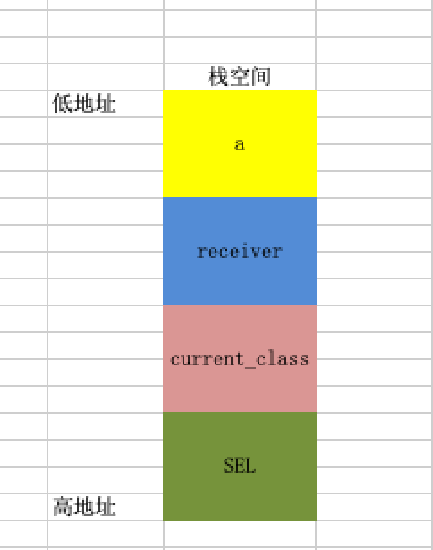
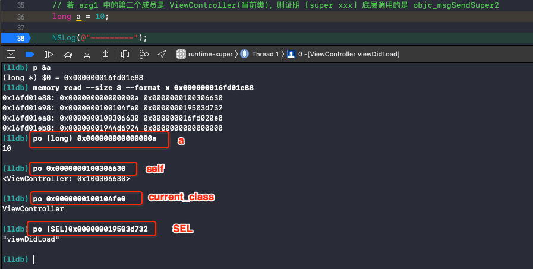
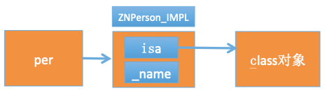
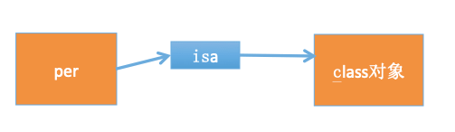
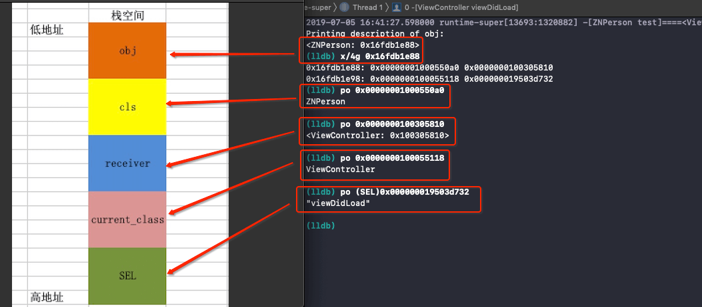

# runtime(四) - super

<br>

`super`在`OC`中也很常用，最常见的应该是`viewDidLoad`方法中的`[super viewDidLoad]`。那`super`调方法和实例(类)对象调方法是否一样都在底层转成`objc_msgSend`呢？


## 一、学前准备

在`arm64`架构中，方法调用的参数一般存储在`x0 ~ x7`寄存器中(参数多余8个，存在栈上)，`x0`还用于返回值传递。方法中的局部变量存在连续的栈空间上。

```Objective-C
- (void)viewDidLoad {
    [super viewDidLoad];
    
    [self testArg1:5 arg2:50];
}

- (int)testArg1:(int)arg1 arg2:(int)arg2
{
    long a = 10;
    long b = 20;
    long c = 30;
    
    long d = a + b + c + arg1 + arg2;
    NSLog(@"%p %p %p %p", &a, &b, &c, &d);
    return d;
}
```

- 参数

`OC`中方法调用默认有两个参数：方法调用者和方法名(`_cmd`)



- 局部变量

```Objective-C
// 打印结果
2019-07-04 23:42:22.072280 runtime-super[1574:615708] 0x16fd49e90 0x16fd49e88 0x16fd49e80 0x16fd49e78
```

`a b c d`四个局部变量依次存储在连续的栈空间上，先声明的局部变量存储在高地址。




## 二、`super`调方法本质

### 0x01 `objc_msgSendSuper `


在说明`super`调方法本质我们先来看到面试题

```Objective-C
// ZNStudent : ZNPerson : NSObject

// ZNStudent.m
- (instancetype)init
{
    if ([super init]) {
        
        NSLog(@"[self class]===%@", [self class]);
        NSLog(@"[self superclass]===%@", [self superclass]);
        
        NSLog(@"[super class]===%@", [super class]);
        NSLog(@"[super superclass]===%@", [super superclass]);
    }
    return self;
}

// ViewController.m
- (void)viewDidLoad {
    [super viewDidLoad];
    
    [[ZNStudent alloc] init];
}
```

先不运行程序，我们可以确定的是`[self class]===ZNStudent` `[self superclass]===ZNPerson`。对于`[super class]`的结果应该是`ZNPerson`，`[super superclass]`的结果应该是`NSObject`。

我们来运行程序看看最终打印结果

```Objective-C
2019-07-04 10:44:42.543912 runtime-super[11689:1192675] [self class]===ZNStudent
2019-07-04 10:44:42.544082 runtime-super[11689:1192675] [self superclass]===ZNPerson

2019-07-04 10:44:42.544219 runtime-super[11689:1192675] [super class]===ZNStudent
2019-07-04 10:44:42.544300 runtime-super[11689:1192675] [super superclass]===ZNPerson
```

看到上述打印结果是不是感觉有点难以接受？想看清本质问题还是要看底层代码，用下面命令将代码转成`C/C++`代码

```Objective-C
$ xcrun -sdk iphoneos clang -arch arm64 -rewrite-objc  ZNStudent.m
```

可以看到`[super class]`和`[super superclass]`最终转成如下代码

```Objective-C
objc_msgSendSuper((__rw_objc_super){(id)self, (id)class_getSuperclass(objc_getClass("ZNStudent"))}, sel_registerName("class"))

objc_msgSendSuper((__rw_objc_super){(id)self, (id)class_getSuperclass(objc_getClass("ZNStudent"))}, sel_registerName("superclass"))
```

结构有点复杂，简化下

```Objective-C
struct __rw_objc_super sp1 = {self, class_getSuperclass(objc_getClass("ZNStudent"))};
objc_msgSendSuper(sp1, sel_registerName("class"));
    
struct __rw_objc_super sp2 = {(id)self, (id)class_getSuperclass(objc_getClass("ZNStudent"))};
objc_msgSendSuper(sp2, sel_registerName("superclass"))
```

我们可以看到`super`调方法和平常实例(类)对象调方法不一样，其底层是转成`objc_msgSendSuper `函数，第一个参数是一个`objc_super `类型的结构体，第二个参数是方法名。

在`objc4-750`中可以找到`objc_msgSendSuper `和`objc_super `的定义

```Objctive-C
// message.h

struct objc_super {
    /// Specifies an instance of a class.
    __unsafe_unretained _Nonnull id receiver;

    /// Specifies the particular superclass of the instance to message. 
    __unsafe_unretained _Nonnull Class super_class;
};

/** 
 * Sends a message with a simple return value to the superclass of an instance of a class.
 * 
 * @param super A pointer to an \c objc_super data structure. Pass values identifying the
 *  context the message was sent to, including the instance of the class that is to receive the
 *  message and the superclass at which to start searching for the method implementation.
 * @param op A pointer of type SEL. Pass the selector of the method that will handle the message.
 * @param ...
 *   A variable argument list containing the arguments to the method.
 * 
 * @return The return value of the method identified by \e op.
 * 
 * @see objc_msgSend
 */
objc_msgSendSuper(struct objc_super * _Nonnull super, SEL _Nonnull op, ...)
```

英语好点的根据注释就可知道`objc_super `中两个成员的作用：

- `receiver` 消息接收者，要接收消息的类的实例

- `super_class ` 父类对象，标记要从哪里开始搜索方法实现

意思就是说`[super class]`的消息接收者仍然是当前实例`self`，`super`的作用是不要从当前类中查找实例方法，而从父类中开始查找实例方法。

实例方法`class`在`NSObject`中声明，在`objc4-750`中`NSObject.mm`查看其实现

```Objective-C
// NSObject.mm

- (Class)class {
    return object_getClass(self);
}

- (Class)superclass {
    return [self class]->superclass;
}
```

知道上面的知识我们再来解释下`[super class]`和`[super superclass]`的打印结果。

- `[super class]`相当于 调用`[self class]`从父类`ZNPerson`的`class`对象中开始查找实例方法`class`。最终在`NSObject`的`class`对象中找到并调用。再由`NSObject.mm`可知`object_getClass(self)`的结果是`ZNStudent`。

- `[super superclass]`相当于 调用`[self superclass]`从父类`ZNPerson`的`class`对象中开始查找实例方法`superclass`。最终在`NSObject`的`class`对象中找到并调用。再由`NSObject.mm`可知`[self class]->superclas`的结果是`ZNPerson`。


### 0x02 `objc_msgSendSuper2`

再来看个有意思的事，在`ZNPerson`中声明并实现`test`实例方法，在子类`ZNStudent`中重写`test`方法并调用`[super test]`，并下断点，`Xcode -> Debug -> Debug Workflow -> Always show Disassmebly`进入汇编模式。

```Objective-C
// ZNStudent.m
- (void)test
{
    [super test]; // 断点
}
```



在`test`方法中只有`[super test]`方法调用，也就是截图上的`bl 0x100016afc`，但其后标记的是跳转到`objc_msgSendSuper2`，而不是`objc_msgSendSuper`。这是为啥呢？

这是因为我们平时用命令转成的`C/C++`代码并不能100%保证转换都是正确的，要以实际汇编为准。

我们还可用另外一种方法验证`[super xxx]`底层实现调用的`objc_msgSendSuper2`函数，而不是`objc_msgSendSuper`函数。`Xcode`中选中要调成汇编模式的文件， `Product -> Perform Action -> Assemble "xxxx"`，将代码转成汇编



```Objective-C
...
Ltmp0:
    .loc    3 16 5 prologue_end     ; ~/Desktop/runtime-super/runtime-super/ZNStudent.m:16:5
    ldur    x0, [x29, #-8]
    str    x0, [sp]
    ldr    x9, [x9]
    str    x9, [sp, #8]
    ldr    x1, [x8]
    mov    x0, sp
    // 也是 _objc_msgSendSuper2
    bl    _objc_msgSendSuper2
    .loc    3 17 1                  ; ~/Desktop/runtime-super/runtime-super/ZNStudent.m:17:1
    ldp    x29, x30, [sp, #32]     ; 8-byte Folded Reload
    add    sp, sp, #48             ; =48
    ret
...
```

- 定义

```Objective-C
struct objc_super2 {
    id receiver;
    Class current_class;
};

// objc_msgSendSuper2() takes the current search class, not its superclass.
// 从注释上来看结构体第二个成员是应该是 current_class， 但参数类型为啥是 struct objc_super *
// 而且下面的汇编也说明结构体第二个成员是 current_class
objc_msgSendSuper2(struct objc_super * _Nonnull super, SEL _Nonnull op, ...)


// objc-msg-arm64.s
ENTRY _objc_msgSendSuper2
UNWIND _objc_msgSendSuper2, NoFrame

ldp	p0, p16, [x0]		// p0 = real receiver, p16 = class
ldr	p16, [x16, #SUPERCLASS]	// p16 = class->superclass
CacheLookup NORMAL

END_ENTRY _objc_msgSendSuper2
```

`objc_msgSendSuper2 `第一个参数的也是个结构体，但是其第二个成员是`current_class `当前类对象，不再是`super_class `。但从汇编实现可以看到在查找方法时，还是将`class->superclass`放到寄存器中，意思是还会从父类中开始查找方法实现。

- 证明`[super xxx]`底层调用的是`objc_msgSendSuper2`函数

```Objective-C
- (void)viewDidLoad {
    [super viewDidLoad];
    
    /*
     [super viewDidLoad] 可以转成如下代码 也就是说 [super viewDidLoad] 会有两个参数，
     放在 viewDidLoad 方法中，这两个参数就变成了局部变量，但我们不知道该如何获取
     
     struct objc_super2 arg1 = {self, objc_getClass("ViewController")};
     SEL arg2 = sel_registerName("viewDidLoad");
     
     objc_msgSendSuper2(arg1, arg2);
     */
    
    // 通过前面的学习我们知道，方法的局部变量会存储在连续的栈空间上，先声明的局部变量存储在高地址
    // 那我们声明一个 long 类型的局部变量，地址是连续的，通过 a 的地址我们就能找到 arg1 和 arg2
    // 若 arg1 中的第二个成员是 UIViewController(父类)，则证明 [super xxx] 底层调用的是 objc_msgSendSuper
    // 若 arg1 中的第二个成员是 ViewController(当前类)，则证明 [super xxx] 底层调用的是 objc_msgSendSuper2
    long a = 10;
    
    NSLog(@"---------");
}
```

局部变量`arg1`、`arg2`、`a`在栈上的内存分配大致如下




在`NSLog`出下断点，用`lldb`查看三个局部变量的值



这也就证明了`[super xxx]`在底层调用的是`objc_msgSendSuper2`。


## 三、`isKindOfClass:`和`isMemberOfClass:`

先看面试题

```Objective-C
- (void)viewDidLoad {
    [super viewDidLoad];
    
    ZNPerson *per = [[ZNPerson alloc] init];
    
    NSLog(@"%d", [per isMemberOfClass:[NSObject class]]);
    NSLog(@"%d", [per isKindOfClass:[NSObject class]]);
    
    NSLog(@"%d", [ZNPerson isMemberOfClass:[ZNPerson class]]);
    NSLog(@"%d", [ZNPerson isMemberOfClass:[NSObject class]]);
    NSLog(@"%d", [ZNPerson isKindOfClass:[NSObject class]]);
}
```


`isKindOfClass:`和`isMemberOfClass:`都是`NSObject`下的方法，在`runtime`源码中都能找到其具体实现。

- 实例方法

```Objective-C
// NSObject.mm

- (BOOL)isMemberOfClass:(Class)cls {
    // object_getClass(self) == cls
    // 只比较当前 class 对象
    return [self class] == cls;
}

- (BOOL)isKindOfClass:(Class)cls {
    // 遍历比较实例对象 对应的类对象和父类对象
    for (Class tcls = [self class]; tcls; tcls = tcls->superclass) {
        if (tcls == cls) return YES;
    }
    return NO;
}
```

这就很明显了实例对象`per`对应的类对象是`ZNPerson`，所以`[per isMemberOfClass:[NSObject class]]`的结果是`NO`，`[per isKindOfClass:[NSObject class]]`的结果是`YES`。


- 类方法

```Objective-C
// NSObject.mm

+ (BOOL)isMemberOfClass:(Class)cls {
    // 只比较当前 meta-class 对象
    return object_getClass((id)self) == cls;
}

+ (BOOL)isKindOfClass:(Class)cls {
    // 遍历比较 class 对象 对应的 meta-class 和父类的meta-class对象
    for (Class tcls = object_getClass((id)self); tcls; tcls = tcls->superclass) {
        if (tcls == cls) return YES;
    }
    return NO;
}
```

类方法比较的是`meta-class`对象，所以`[ZNPerson isMemberOfClass:[ZNPerson class]]` 和 `[ZNPerson isMemberOfClass:[NSObject class]]`的结果都为`NO`。

有点坑的是`[ZNPerson isKindOfClass:[NSObject class]]`，他的结果是`YES`。这是因为子类的`meta-class`对象的`superclass`指针指向父类的`meta-class`对象，父类的`meta-class`对象的`superclass`指针指向基类(`NSObject`)的`meta-class`对象，**基类(`NSObject`)的`meta-class`对象的`superclass`指针指向基类的`class`对象。**

所以`object_getClass(ZNPerson)`遍历的结果是`NSObject`和传进来的`cls`一样，返回的是`YES`。

## 四、面试题

```Objective-C
// ZNPerson.h
@property (nonatomic, copy) NSString *name;
- (void)test;

// ZNPerson.m
- (void)test
{
    NSLog(@"%s====%@", __func__, self.name);
}

// ViewController.m
- (void)viewDidLoad {
    [super viewDidLoad];
    
    id cls = [ZNPerson class];
    void *obj = &cls;
    [(__bridge id)obj test];
}

// 打印结果
2019-07-05 11:48:26.368464 runtime-super[12946:1278740] -[ZNPerson test]====<ViewController: 0x0100305810>
```

看到打印你应该会有两个疑问：

- 为什么`[(__bridge id)obj test]`方法能调用成功 ？

- 为什么`self.name`的值是`<ViewController: 0x153e08b00>` ？

要弄懂这两个问题，我们先看[OC对象本质(一)](https://github.com/zhaoName/Notes/blob/master/iOS/OC%E5%AF%B9%E8%B1%A1%E6%9C%AC%E8%B4%A8(%E4%B8%80).md)和正常方法调用。

### 0x01 正常方法调用

```Objective-C
- (void)viewDidLoad {
    [super viewDidLoad];
    
    ZNPerson *per = [[ZNPerson alloc] init];
    [per test];
}

// 打印结果
2019-07-05 14:56:25.190112 runtime-super[13498:1306236] -[ZNPerson test]====(null)
```

通过以前的学习我们知道实例对象在底层是一个`ZNPerson_IMPL`类型的结构体，它有两个成员。

```Objective-C
struct ZNPerson_IMPL {
    Class isa;
    id _name;
};
```

方法调用是由`per`对象的`isa`指针找到对应的`class`对象，再找到存储在`class`对象中的实例方法`test`进行调用。而取成员变量的值，就是找`ZNPerson_IMPL`结构体的成员。如我们取`_name`的值，其实就是找紧跟着`isa`后的8个字节中存储的内容。



方法调用我们也可以认为只要找到`isa`指针就可以找到`class`对象，进行方法调用。方法调用和`_name`是没关系的。而`per`中存储的是结构体指针也就是`isa`的地址值，那上图我们可以简化下




### 0x02 为什么`[(__bridge id)obj test]`方法能调用成功 ？

将下面两句代码也用画图表示

```Objective-C
id cls = [ZNPerson class];
void *obj = &cls;
```


通过`obj`(相当于`per`)找到了`cls`(相当于`isa`)进而找到了类对象，然后找到存储在类对象中的`test`方法。


### 0x03 为什么`self.name`的值是`<ViewController: 0x0100305810>` ？

前面说过方法中的局部变量存储在连续的栈空间上，先声明的局部变量在高地址。





`obj`相当于`per`，`cls`相当于`isa`。而`_name`和`isa`组成一个结构体，所以紧跟着`isa`后的8个字节就是`_name`。在这里我们可以认为紧跟着`cls`后的8个字节是`_name`。所以我们取`self.name`的值就是取紧跟着`cls`后的8个字节存储的值，也就是`reveiver`。这也就解释了为什么`self.name`的值是`<ViewController: 0x0100305810>`。


<br>

写于2019-07-04 完成于2019-07-05

<br>