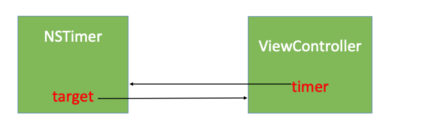
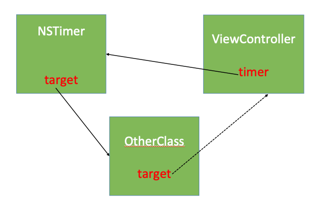

# 内存管理 - Timer

<br>


## 一、问题

在我们使用`NSTimer`或`CADisplayLink`时可能会遇到这样的情况，`ViewController`消失后，定时器并是没销毁仍在工作，且`ViewController`也没有调用`dealloc`方法。如下：


```
- (void)viewDidLoad {
    [super viewDidLoad];
    self.timer = [NSTimer scheduledTimerWithTimeInterval:1 target:self selector:@selector(testTimer) userInfo:nil repeats:YES];
}

- (void)viewWillDisappear:(BOOL)animated
{
    [super viewWillDisappear:animated];
    NSLog(@"%s", __func__);
    // 加上这句话 结果也一样
    // self.timer = nil;
}

- (void)testTimer
{
    NSLog(@"%s", __func__);
}

- (void)dealloc
{
    [self.timer invalidate];
    NSLog(@"%s", __func__);
}

// 打印结果
2019-07-23 14:32:06.656455+0800 MemoryManagement[57066:5121034] -[ViewController testTimer]
2019-07-23 14:32:07.656495+0800 MemoryManagement[57066:5121034] -[ViewController testTimer]
2019-07-23 14:32:08.110068+0800 MemoryManagement[57066:5121034] -[ViewController viewWillDisappear:]
2019-07-23 14:32:08.656410+0800 MemoryManagement[57066:5121034] -[ViewController testTimer]
...
```

## 二、原因

我们来看段代码就知道啥原因了

```
#define RETAIN(object)  [(object) retain]
#define RELEASE(object)	  [(object) release]

- (id)initWithFireDate:(NSDate*)fd interval:(NSTimeInterval)ti target:(id)object selector:(SEL)selector userInfo:(id)info repeats:(BOOL)f
{
    if (ti <= 0.0) {
        ti = 0.0001;
    }
    if (fd == nil) {
        _date = [[NSDate_class allocWithZone:NSDefaultMallocZone()] initWithTimeIntervalSinceNow:ti];
    }
    else {
        _date = [fd copyWithZone:NSDefaultMallocZone()];
    }
    // NSTimer 内部的 target 属性强引用传进来的 target
    _target = RETAIN(object);
    _selector = selector;
    // NSTimer 内部的 info 属性强引用传进来的 info
    _info = RETAIN(info);
    
    if (f == YES) {
        _repeats = YES;
        _interval = ti;
    }
    else {
        _repeats = NO;
        _interval = 0.0;
    }
    return self;
}

+ (NSTimer*)scheduledTimerWithTimeInterval:(NSTimeInterval)ti target:(id)object selector:(SEL)selector userInfo:(id)info repeats:(BOOL)f
{
  id t = [[self alloc] initWithFireDate:nil
                               interval:ti
                                 target:object
                               selector:selector
                               userInfo:info
                                repeats:f];
  [[NSRunLoop currentRunLoop] addTimer:t forMode:NSDefaultRunLoopMode];
  RELEASE(t);
  return t;
}

/**
 * Marks the timer as invalid, causing its target/invocation and user info
 * objects to be released.<br />
 * Invalidated timers are automatically removed from the run loop when it
 * detects them.
 */
- (void)invalidate
{
    /* OPENSTEP allows this method to be called multiple times. */
    _invalidated = YES;
    if (_target != nil) {
        // 释放 target
        DESTROY(_target);
    }
    if (_info != nil) {
        DESTROY(_info);
    }
}
```

这样就可以理解了。`ViewController`内部强引用着`NStimer`，而`NStimer`内部也强引用着`target`，也就是`ViewController `。这就导致循环引用，也是`ViewController `消失后为什么`ViewController `和`NStimer `都没销毁的原因。


## 三、解决方案

以下以`NSTimer `为例，`NSTimer`和`CADisplayLink`解决方案基本一致(不一样的地方会特殊说明)。

### 0x01 `Block`

```
- (void)viewDidLoad {
    [super viewDidLoad];
    __weak typeof(self) weakSelf = self;
    self.timer = [NSTimer scheduledTimerWithTimeInterval:1 repeats:YES block:^(NSTimer * _Nonnull timer) {
        // 若要在 block 使用self，需使用 weakSelf，否则还会产生循环引用
        NSLog(@"timer------%@", weakSelf);
    }];
}

- (void)viewWillDisappear:(BOOL)animated
{
    [super viewWillDisappear:animated];
    NSLog(@"%s", __func__);
}

- (void)dealloc
{
    [self.timer invalidate];
    NSLog(@"%s", __func__);
}

// 打印结果
2019-07-23 15:05:32.516258+0800 MemoryManagement[57686:5139023] timer------<ViewController: 0x7ff881c1ac10>
2019-07-23 15:05:33.515998+0800 MemoryManagement[57686:5139023] timer------<ViewController: 0x7ff881c1ac10>
2019-07-23 15:05:34.034908+0800 MemoryManagement[57686:5139023] -[ViewController viewWillDisappear:]
2019-07-23 15:05:34.516613+0800 MemoryManagement[57686:5139023] timer------<ViewController: 0x7ff881c1ac10>
2019-07-23 15:05:34.543813+0800 MemoryManagement[57686:5139023] -[ViewController dealloc]
```

上面这种方法只能解决`NSTimer`的问题，因为`CADisplayLink `中并没有`Block`。下面介绍种通用的方法。


### 0x02 `NSProxy`


有上面可知，`ViewController`内部强引用着`NStimer`，而`NStimer`内部也强引用着`ViewController `，从而导致循环引用。



那我们可以将`NSTimer`中的`target`转发给另外一个类，另外一个类的`target`弱引用着`ViewController `。




这时我们可以使用系统提供的类`NSProxy`。`NSProxy`有点特殊，它是基类，和`NSObject`一个级别。

```
@interface ZNProxy : NSProxy

@property (nonatomic, weak) id target;
+ (instancetype)proxyTarget:(id)target;
@end


@implementation ZNProxy
+ (instancetype)proxyTarget:(id)target
{
    ZNProxy *proxy = [ZNProxy alloc];
    proxy.target = target;
    return proxy;
}

- (void)forwardInvocation:(NSInvocation *)invocation
{
    [invocation invokeWithTarget:self.target];
}

- (NSMethodSignature *)methodSignatureForSelector:(SEL)sel
{
    return [self.target methodSignatureForSelector:sel];
}
@end


- (void)viewDidLoad {
    [super viewDidLoad];
    self.timer = [NSTimer scheduledTimerWithTimeInterval:1 target:[ZNProxy proxyTarget:self] selector:@selector(testTimer) userInfo:nil repeats:YES];
}

- (void)testTimer
{
    NSLog(@"%s", __func__);
}

- (void)dealloc
{
    [self.timer invalidate];
    NSLog(@"%s", __func__);
}

// 打印结果
2019-07-23 17:46:42.802380+0800 MemoryManagement[60725:5237067] -[ViewController testTimer]
2019-07-23 17:46:43.802917+0800 MemoryManagement[60725:5237067] -[ViewController testTimer]
2019-07-23 17:46:45.079433+0800 MemoryManagement[60725:5237067] -[ViewController viewWillDisappear:]
2019-07-23 17:46:45.584695+0800 MemoryManagement[60725:5237067] -[ViewController dealloc]
```

之所以用`NSProxy`而不用`NSObject`的子类做消息转发，是因为`NSProxy`的效率更高，它不会像`NSObject`去遍历查找方法，没找到在进行动态方法解析，再没成功才会进入消息转发阶段，`NSProxy`是先查找本身类中有无方法实现，若没有则直接进入消息转发阶段。


## 四、`dispatch_time_t`


`NSTimer`和`CADisplayLink`都是基于`RunLoop`实现的，这就导致`NSTimer`和`CADisplayLink`可能会出现时间上不准。这是因为`RunLoop`每次循环所用的时间可能不一样，在重复触发定时器时会导致时间略有延迟。

苹果提供了基于内核的定时器`dispatch_time_t `，它就很准时了。


```
- (void)viewDidLoad {
    [super viewDidLoad];
    
    // 除非是主队列 否则都是异步 开始新线程
    self.dis_timer = dispatch_source_create(DISPATCH_SOURCE_TYPE_TIMER, 0, 0, dispatch_get_global_queue(0, 0));
    // 注意单位换算 这里时间间隔单位是纳秒
    // 第二个参数：什么时候开始执行 handle
    // 第三个参数：每隔多少秒执行 handle
    dispatch_time_t start = dispatch_time(DISPATCH_TIME_NOW, 2 * NSEC_PER_SEC);
    dispatch_source_set_timer(self.dis_timer, start, 1 * NSEC_PER_SEC, 0);
    // 时间处理
    dispatch_source_set_event_handler(self.dis_timer, ^{
        NSLog(@"dispatch_source_t-----%@", [NSThread currentThread]);
    });
    // 启动定时器
    dispatch_resume(self.dis_timer);
}

- (void)viewWillDisappear:(BOOL)animated
{
    [super viewWillDisappear:animated];
    NSLog(@"%s", __func__);
    // 销毁定时器
    dispatch_cancel(self.dis_timer);
}

- (void)dealloc
{
    [self.timer invalidate];
    NSLog(@"%s", __func__);
}

// 打印结果
2019-07-23 22:48:24.282021+0800 MemoryManagement[62146:5291759] dispatch_time_t-----<NSThread: 0x600001e07f00>{number = 3, name = (null)}
2019-07-23 22:48:25.281987+0800 MemoryManagement[62146:5291758] dispatch_time_t-----<NSThread: 0x600001e08cc0>{number = 4, name = (null)}
2019-07-23 22:48:26.040763+0800 MemoryManagement[62146:5291453] -[ViewController viewWillDisappear:]
2019-07-23 22:48:26.547188+0800 MemoryManagement[62146:5291453] -[ViewController dealloc]
```


<br>

写于2019-07-23

<br>